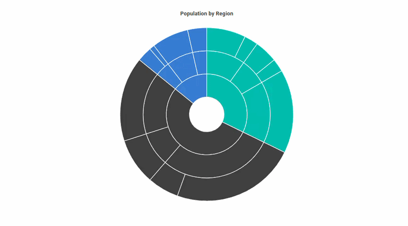

# Blazor Sunburst Chart Animation

The animation feature adds an entrance effect to the `Blazor Sunburst Chart`, so the rings and segments are revealed smoothly when the chart first renders or when its data is updated. It is most useful when you want the chart to feel responsive and visually engaging on the page rather than appearing suddenly.

The animation of the Blazor Sunburst Chart can be enabled and customized using the `EnableAnimation` and `AnimationType` properties on `SfSunburstChart`.

N> **Default behavior:** `EnableAnimation` is `false`, so the Sunburst Chart renders without an entrance animation. When enabled, the animation runs during the initial rendering and can run again when the chart data or interactive view changes.

## Enable animation

Animation is hidden by default. Set `EnableAnimation` of `SfSunburstChart` to `true` to apply the entrance animation during the initial rendering of the chart and on subsequent data updates.

```cshtml

@using Syncfusion.Blazor.Charts

<SfSunburstChart TItem="RegionData"
                 Title="Population by Region"
                 EnableAnimation="true"
                 DataSource="@Regions"
                 IdMemberPath="@nameof(RegionData.Id)"
                 ParentIdMemberPath="@nameof(RegionData.ParentId)"
                 LabelMemberPath="@nameof(RegionData.Label)"
                 ValueMemberPath="@nameof(RegionData.Population)"
                 Width="100%" Height="600px">
</SfSunburstChart>

@code {
    public class RegionData
    {
        public string Id { get; set; } = string.Empty;
        public string? ParentId { get; set; }
        public string Label { get; set; } = string.Empty;
        public double Population { get; set; }
    }

    public List<RegionData> Regions = new List<RegionData>
    {
        new RegionData { Id = "USA", ParentId = null, Label = "USA" },
        new RegionData { Id = "India", ParentId = null, Label = "India" },
        new RegionData { Id = "Germany", ParentId = null, Label = "Germany" },

        new RegionData { Id = "USA-California", ParentId = "USA", Label = "California" },
        new RegionData { Id = "USA-Texas", ParentId = "USA", Label = "Texas" },
        new RegionData { Id = "USA-NewYork", ParentId = "USA", Label = "New York" },

        new RegionData { Id = "India-Maharashtra", ParentId = "India", Label = "Maharashtra" },
        new RegionData { Id = "India-TamilNadu", ParentId = "India", Label = "Tamil Nadu" },
        new RegionData { Id = "India-Karnataka", ParentId = "India", Label = "Karnataka" },

        new RegionData { Id = "Germany-Bavaria", ParentId = "Germany", Label = "Bavaria" },
        new RegionData { Id = "Germany-Berlin", ParentId = "Germany", Label = "Berlin" },
        new RegionData { Id = "Germany-Hamburg", ParentId = "Germany", Label = "Hamburg" },

        new RegionData { Id = "USA-California-LosAngeles", ParentId = "USA-California", Label = "Los Angeles", Population = 3898000 },
        new RegionData { Id = "USA-California-SanDiego", ParentId = "USA-California", Label = "San Diego", Population = 1381000 },
        new RegionData { Id = "USA-Texas-Houston", ParentId = "USA-Texas", Label = "Houston", Population = 2304000 },
        new RegionData { Id = "USA-Texas-Dallas", ParentId = "USA-Texas", Label = "Dallas", Population = 1304000 },
        new RegionData { Id = "USA-NewYork-NewYorkCity", ParentId = "USA-NewYork", Label = "New York City", Population = 8336000 },

        new RegionData { Id = "India-Maharashtra-Mumbai", ParentId = "India-Maharashtra", Label = "Mumbai", Population = 12440000 },
        new RegionData { Id = "India-Maharashtra-Pune", ParentId = "India-Maharashtra", Label = "Pune", Population = 3120000 },
        new RegionData { Id = "India-TamilNadu-Chennai", ParentId = "India-TamilNadu", Label = "Chennai", Population = 4646000 },
        new RegionData { Id = "India-Karnataka-Bengaluru", ParentId = "India-Karnataka", Label = "Bengaluru", Population = 8443000 },

        new RegionData { Id = "Germany-Bavaria-Munich", ParentId = "Germany-Bavaria", Label = "Munich", Population = 1488000 },
        new RegionData { Id = "Germany-Bavaria-Nuremberg", ParentId = "Germany-Bavaria", Label = "Nuremberg", Population = 515000 },
        new RegionData { Id = "Germany-Berlin-BerlinCity", ParentId = "Germany-Berlin", Label = "Berlin", Population = 3664000 },
        new RegionData { Id = "Germany-Hamburg-HamburgCity", ParentId = "Germany-Hamburg", Label = "Hamburg", Population = 1899000 }
    };
}

```

<!-- TODO: Add Blazor Playground sample after release -->


N> Disabling animation can improve rendering performance when working with large data sets or when immediate chart updates are preferred.

## Animation type

Use the `AnimationType` property to choose how the entrance animation reveals the Sunburst Chart. The animation style is a `SunburstAnimationType` enum value. `AnimationType` is applied only when `EnableAnimation` is `true`.

* `Rotation` – Displays the chart segments using a rotational animation effect. This is the default value.
* `FadeIn` – Gradually displays the chart segments using a fade-in effect.

The following example uses the `FadeIn` animation.

```cshtml

@using Syncfusion.Blazor.Charts

<SfSunburstChart TItem="RegionData"
                 Title="Population by Region"
                 EnableAnimation="true"
                 AnimationType="SunburstAnimationType.FadeIn"
                 DataSource="@Regions"
                 IdMemberPath="@nameof(RegionData.Id)"
                 ParentIdMemberPath="@nameof(RegionData.ParentId)"
                 LabelMemberPath="@nameof(RegionData.Label)"
                 ValueMemberPath="@nameof(RegionData.Population)"
                 Width="100%" Height="600px">
</SfSunburstChart>

@code {
    public class RegionData
    {
        public string Id { get; set; } = string.Empty;
        public string? ParentId { get; set; }
        public string Label { get; set; } = string.Empty;
        public double Population { get; set; }
    }

    public List<RegionData> Regions = new List<RegionData>
    {
        new RegionData { Id = "USA", ParentId = null, Label = "USA" },
        new RegionData { Id = "India", ParentId = null, Label = "India" },
        new RegionData { Id = "Germany", ParentId = null, Label = "Germany" },

        new RegionData { Id = "USA-California", ParentId = "USA", Label = "California" },
        new RegionData { Id = "USA-Texas", ParentId = "USA", Label = "Texas" },
        new RegionData { Id = "USA-NewYork", ParentId = "USA", Label = "New York" },

        new RegionData { Id = "India-Maharashtra", ParentId = "India", Label = "Maharashtra" },
        new RegionData { Id = "India-TamilNadu", ParentId = "India", Label = "Tamil Nadu" },
        new RegionData { Id = "India-Karnataka", ParentId = "India", Label = "Karnataka" },

        new RegionData { Id = "Germany-Bavaria", ParentId = "Germany", Label = "Bavaria" },
        new RegionData { Id = "Germany-Berlin", ParentId = "Germany", Label = "Berlin" },
        new RegionData { Id = "Germany-Hamburg", ParentId = "Germany", Label = "Hamburg" },

        new RegionData { Id = "USA-California-LosAngeles", ParentId = "USA-California", Label = "Los Angeles", Population = 3898000 },
        new RegionData { Id = "USA-California-SanDiego", ParentId = "USA-California", Label = "San Diego", Population = 1381000 },
        new RegionData { Id = "USA-Texas-Houston", ParentId = "USA-Texas", Label = "Houston", Population = 2304000 },
        new RegionData { Id = "USA-Texas-Dallas", ParentId = "USA-Texas", Label = "Dallas", Population = 1304000 },
        new RegionData { Id = "USA-NewYork-NewYorkCity", ParentId = "USA-NewYork", Label = "New York City", Population = 8336000 },

        new RegionData { Id = "India-Maharashtra-Mumbai", ParentId = "India-Maharashtra", Label = "Mumbai", Population = 12440000 },
        new RegionData { Id = "India-Maharashtra-Pune", ParentId = "India-Maharashtra", Label = "Pune", Population = 3120000 },
        new RegionData { Id = "India-TamilNadu-Chennai", ParentId = "India-TamilNadu", Label = "Chennai", Population = 4646000 },
        new RegionData { Id = "India-Karnataka-Bengaluru", ParentId = "India-Karnataka", Label = "Bengaluru", Population = 8443000 },

        new RegionData { Id = "Germany-Bavaria-Munich", ParentId = "Germany-Bavaria", Label = "Munich", Population = 1488000 },
        new RegionData { Id = "Germany-Bavaria-Nuremberg", ParentId = "Germany-Bavaria", Label = "Nuremberg", Population = 515000 },
        new RegionData { Id = "Germany-Berlin-BerlinCity", ParentId = "Germany-Berlin", Label = "Berlin", Population = 3664000 },
        new RegionData { Id = "Germany-Hamburg-HamburgCity", ParentId = "Germany-Hamburg", Label = "Hamburg", Population = 1899000 }
    };
}

```

<!-- TODO: Add Blazor Playground sample after release -->


## See also

* [Selection](./selection)
* [Highlight](./highlight)
* [Tooltip](./tooltip)
* [Data Label](./data-label)
* [Legend](./legend)
