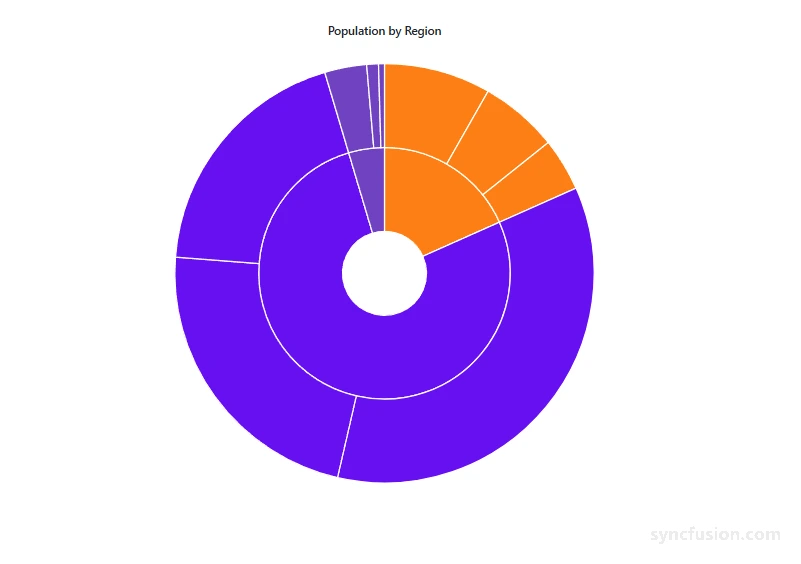
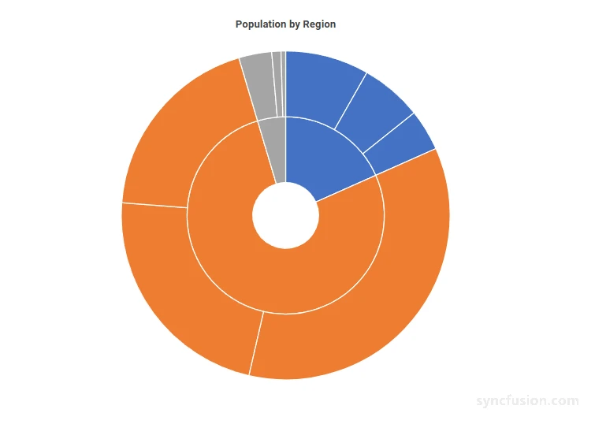
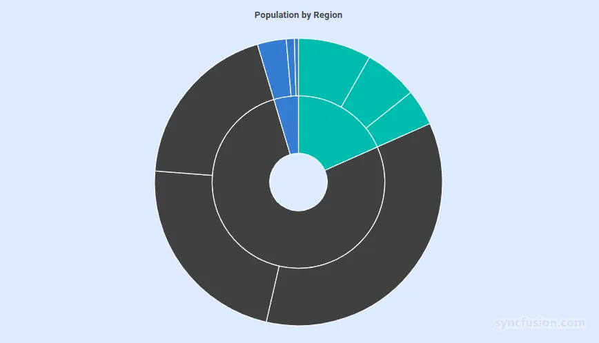
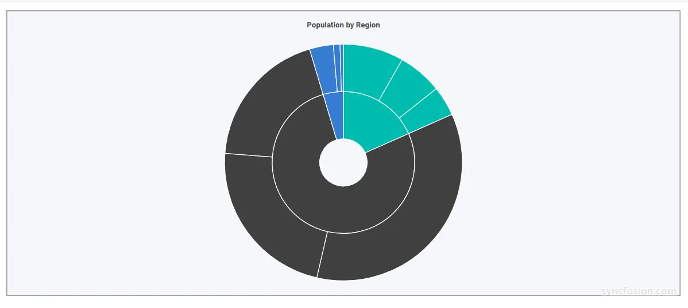
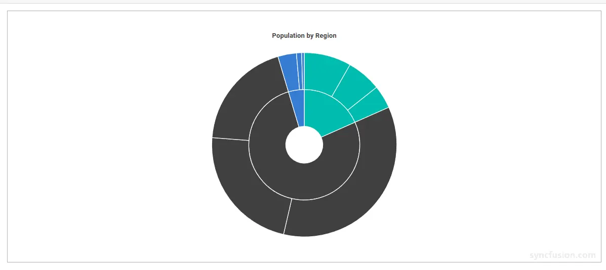
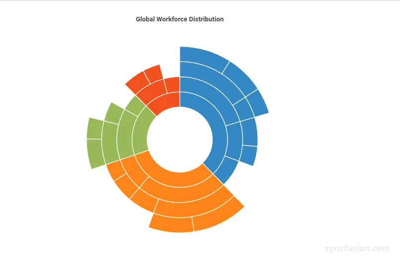
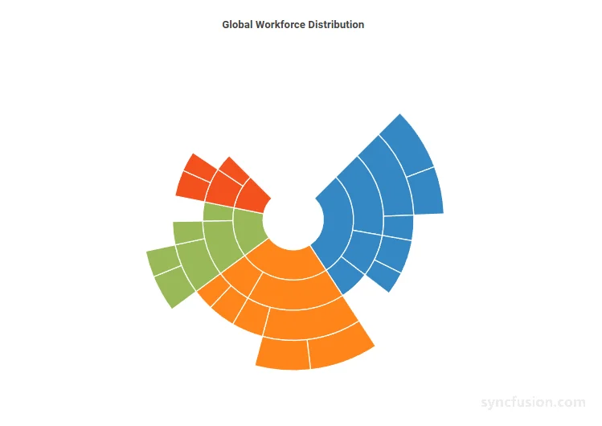
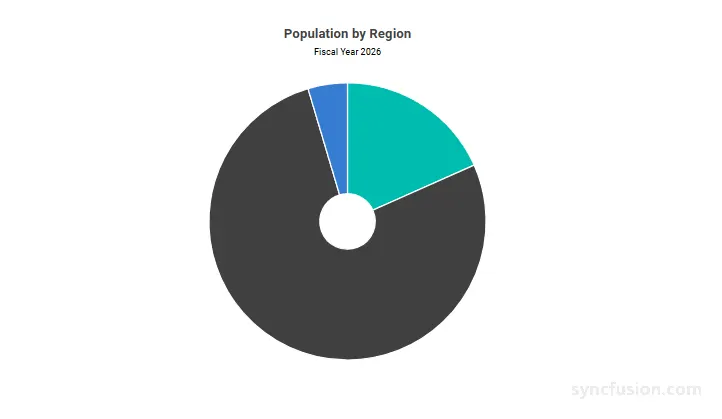
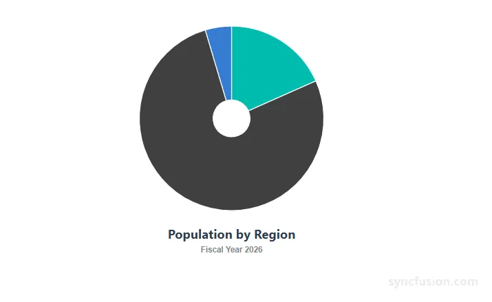
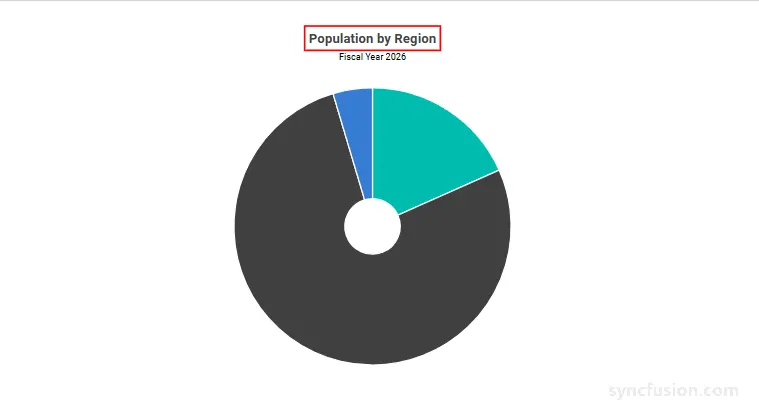

# Blazor Sunburst Chart Appearance

The appearance of the `Blazor Sunburst Chart` determines how segments, rings, and the surrounding chart area are rendered on the page. You can adjust the visual style using built-in themes, a custom color palette, a background color, an outer border, layout margins, and the angular geometry of the Sunburst rings. Together these properties let the chart blend in with any application theme and adapt to small or large data sets.

The appearance of the Blazor Sunburst Chart is configured through properties on `SfSunburstChart` and through the `SunburstChartBorder` and `SunburstChartMargin` child components.

N> **Default values:** `Theme` is `Material`, `Background` is `transparent`, `Width` is `0` for `SunburstChartBorder`, the default margins are `10` on each side of `SunburstChartMargin`, `Radius` is `1`, `InnerRadius` is `0.2`, `StartAngle` is `0`, and `EndAngle` is `360`.

## Built-in themes

The Sunburst Chart ships with built-in themes that control the overall look and feel of the chart, including segment colors, fonts, backgrounds, and supporting elements such as tooltips and legends. Set `Theme` on `SfSunburstChart` to one of the available Syncfusion themes to match the visual style of your application.

```cshtml

@using Syncfusion.Blazor
@using Syncfusion.Blazor.Charts

<SfSunburstChart TItem="RegionData"
                 Title="Population by Region"
                 Theme="Theme.Bootstrap5"
                 DataSource="@Regions"
                 IdMemberPath="@nameof(RegionData.Id)"
                 ParentIdMemberPath="@nameof(RegionData.ParentId)"
                 LabelMemberPath="@nameof(RegionData.Label)"
                 ValueMemberPath="@nameof(RegionData.Population)"
                 Width="100%" Height="600px">
</SfSunburstChart>

@code {
    public class RegionData
    {
        public string Id { get; set; } = string.Empty;
        public string? ParentId { get; set; }
        public string Label { get; set; } = string.Empty;
        public double Population { get; set; }
    }

    public List<RegionData> Regions = new List<RegionData>
    {
        new RegionData { Id = "USA", ParentId = null, Label = "USA", Population = 331000000 },
        new RegionData { Id = "India", ParentId = null, Label = "India", Population = 1391000000 },
        new RegionData { Id = "Germany", ParentId = null, Label = "Germany", Population = 83000000 },

        new RegionData { Id = "USA-California", ParentId = "USA", Label = "California", Population = 39540000 },
        new RegionData { Id = "USA-Texas", ParentId = "USA", Label = "Texas", Population = 29000000 },
        new RegionData { Id = "USA-NewYork", ParentId = "USA", Label = "New York", Population = 19540000 },

        new RegionData { Id = "India-Maharashtra", ParentId = "India", Label = "Maharashtra", Population = 112400000 },
        new RegionData { Id = "India-TamilNadu", ParentId = "India", Label = "Tamil Nadu", Population = 72140000 },
        new RegionData { Id = "India-Karnataka", ParentId = "India", Label = "Karnataka", Population = 61100000 },

        new RegionData { Id = "Germany-Bavaria", ParentId = "Germany", Label = "Bavaria", Population = 13080000 },
        new RegionData { Id = "Germany-Berlin", ParentId = "Germany", Label = "Berlin", Population = 3645000 },
        new RegionData { Id = "Germany-Hamburg", ParentId = "Germany", Label = "Hamburg", Population = 1841000 }
    };
}

```

<!-- TODO: Add Blazor Playground sample after release -->


## Custom color palette

The Sunburst Chart applies colors from the active theme by default. Pass an array of color values to the `Palette` property of `SfSunburstChart` to define a custom palette. Colors are applied sequentially to the rendered segments, and the palette is reused from the beginning when the number of segments exceeds the number of provided colors.

```cshtml

@using Syncfusion.Blazor.Charts

<SfSunburstChart TItem="RegionData"
                 Title="Population by Region"
                 Palette="@CustomPalette"
                 DataSource="@Regions"
                 IdMemberPath="@nameof(RegionData.Id)"
                 ParentIdMemberPath="@nameof(RegionData.ParentId)"
                 LabelMemberPath="@nameof(RegionData.Label)"
                 ValueMemberPath="@nameof(RegionData.Population)"
                 Width="100%" Height="600px">
</SfSunburstChart>

@code {
    public string[] CustomPalette = new string[]
    {
        "#4472C4",
        "#ED7D31",
        "#A5A5A5",
        "#FFC000",
        "#5B9BD5",
        "#70AD47"
    };

    public class RegionData
    {
        public string Id { get; set; } = string.Empty;
        public string? ParentId { get; set; }
        public string Label { get; set; } = string.Empty;
        public double Population { get; set; }
    }

    public List<RegionData> Regions = new List<RegionData>
    {
        new RegionData { Id = "USA", ParentId = null, Label = "USA", Population = 331000000 },
        new RegionData { Id = "India", ParentId = null, Label = "India", Population = 1391000000 },
        new RegionData { Id = "Germany", ParentId = null, Label = "Germany", Population = 83000000 },

        new RegionData { Id = "USA-California", ParentId = "USA", Label = "California", Population = 39540000 },
        new RegionData { Id = "USA-Texas", ParentId = "USA", Label = "Texas", Population = 29000000 },
        new RegionData { Id = "USA-NewYork", ParentId = "USA", Label = "New York", Population = 19540000 },

        new RegionData { Id = "India-Maharashtra", ParentId = "India", Label = "Maharashtra", Population = 112400000 },
        new RegionData { Id = "India-TamilNadu", ParentId = "India", Label = "Tamil Nadu", Population = 72140000 },
        new RegionData { Id = "India-Karnataka", ParentId = "India", Label = "Karnataka", Population = 61100000 },

        new RegionData { Id = "Germany-Bavaria", ParentId = "Germany", Label = "Bavaria", Population = 13080000 },
        new RegionData { Id = "Germany-Berlin", ParentId = "Germany", Label = "Berlin", Population = 3645000 },
        new RegionData { Id = "Germany-Hamburg", ParentId = "Germany", Label = "Hamburg", Population = 1841000 }
    };
}

```

<!-- TODO: Add Blazor Playground sample after release -->


## Background color

Use the `Background` property of `SfSunburstChart` to set the background color of the chart area. Any valid CSS color value is accepted, including named colors, hex values, RGB, and RGBA values. The default value is `transparent`, which lets the chart inherit the appearance of its parent container.

```cshtml

@using Syncfusion.Blazor.Charts

<SfSunburstChart TItem="RegionData"
                 Title="Population by Region"
                 Background="#DDEBFF"
                 DataSource="@Regions"
                 IdMemberPath="@nameof(RegionData.Id)"
                 ParentIdMemberPath="@nameof(RegionData.ParentId)"
                 LabelMemberPath="@nameof(RegionData.Label)"
                 ValueMemberPath="@nameof(RegionData.Population)"
                 Width="100%" Height="600px">
</SfSunburstChart>

@code {
    public class RegionData
    {
        public string Id { get; set; } = string.Empty;
        public string? ParentId { get; set; }
        public string Label { get; set; } = string.Empty;
        public double Population { get; set; }
    }

    public List<RegionData> Regions = new List<RegionData>
    {
        new RegionData { Id = "USA", ParentId = null, Label = "USA", Population = 331000000 },
        new RegionData { Id = "India", ParentId = null, Label = "India", Population = 1391000000 },
        new RegionData { Id = "Germany", ParentId = null, Label = "Germany", Population = 83000000 },

        new RegionData { Id = "USA-California", ParentId = "USA", Label = "California", Population = 39540000 },
        new RegionData { Id = "USA-Texas", ParentId = "USA", Label = "Texas", Population = 29000000 },
        new RegionData { Id = "USA-NewYork", ParentId = "USA", Label = "New York", Population = 19540000 },

        new RegionData { Id = "India-Maharashtra", ParentId = "India", Label = "Maharashtra", Population = 112400000 },
        new RegionData { Id = "India-TamilNadu", ParentId = "India", Label = "Tamil Nadu", Population = 72140000 },
        new RegionData { Id = "India-Karnataka", ParentId = "India", Label = "Karnataka", Population = 61100000 },

        new RegionData { Id = "Germany-Bavaria", ParentId = "Germany", Label = "Bavaria", Population = 13080000 },
        new RegionData { Id = "Germany-Berlin", ParentId = "Germany", Label = "Berlin", Population = 3645000 },
        new RegionData { Id = "Germany-Hamburg", ParentId = "Germany", Label = "Hamburg", Population = 1841000 }
    };
}

```

<!-- TODO: Add Blazor Playground sample after release -->


## Chart border

Add a visible border around the chart area using the `SunburstChartBorder` child component. Set the `Color` and `Width` of the border; the border is rendered only when `Width` is greater than `0`.

```cshtml

@using Syncfusion.Blazor.Charts

<SfSunburstChart TItem="RegionData"
                 Title="Population by Region"
                 Background="#F5F7FB"
                 DataSource="@Regions"
                 IdMemberPath="@nameof(RegionData.Id)"
                 ParentIdMemberPath="@nameof(RegionData.ParentId)"
                 LabelMemberPath="@nameof(RegionData.Label)"
                 ValueMemberPath="@nameof(RegionData.Population)"
                 Width="100%" Height="600px">
    <SunburstChartBorder Color="#9E9E9E" Width="2" />
</SfSunburstChart>

@code {
    public class RegionData
    {
        public string Id { get; set; } = string.Empty;
        public string? ParentId { get; set; }
        public string Label { get; set; } = string.Empty;
        public double Population { get; set; }
    }

    public List<RegionData> Regions = new List<RegionData>
    {
        new RegionData { Id = "USA", ParentId = null, Label = "USA", Population = 331000000 },
        new RegionData { Id = "India", ParentId = null, Label = "India", Population = 1391000000 },
        new RegionData { Id = "Germany", ParentId = null, Label = "Germany", Population = 83000000 },

        new RegionData { Id = "USA-California", ParentId = "USA", Label = "California", Population = 39540000 },
        new RegionData { Id = "USA-Texas", ParentId = "USA", Label = "Texas", Population = 29000000 },
        new RegionData { Id = "USA-NewYork", ParentId = "USA", Label = "New York", Population = 19540000 },

        new RegionData { Id = "India-Maharashtra", ParentId = "India", Label = "Maharashtra", Population = 112400000 },
        new RegionData { Id = "India-TamilNadu", ParentId = "India", Label = "Tamil Nadu", Population = 72140000 },
        new RegionData { Id = "India-Karnataka", ParentId = "India", Label = "Karnataka", Population = 61100000 },

        new RegionData { Id = "Germany-Bavaria", ParentId = "Germany", Label = "Bavaria", Population = 13080000 },
        new RegionData { Id = "Germany-Berlin", ParentId = "Germany", Label = "Berlin", Population = 3645000 },
        new RegionData { Id = "Germany-Hamburg", ParentId = "Germany", Label = "Hamburg", Population = 1841000 }
    };
}

```

<!-- TODO: Add Blazor Playground sample after release -->


## Chart margin

Use the `SunburstChartMargin` child component to control the spacing between the Sunburst Chart and the edges of its container. Margins are specified independently for the left, right, top, and bottom sides, in pixels. The default value is `10` on each side.

```cshtml

@using Syncfusion.Blazor.Charts

<SfSunburstChart TItem="RegionData"
                 Title="Population by Region"
                 DataSource="@Regions"
                 IdMemberPath="@nameof(RegionData.Id)"
                 ParentIdMemberPath="@nameof(RegionData.ParentId)"
                 LabelMemberPath="@nameof(RegionData.Label)"
                 ValueMemberPath="@nameof(RegionData.Population)"
                 Width="100%" Height="600px">
    <SunburstChartBorder Color="#9E9E9E" Width="1" />
    <SunburstChartMargin Left="40" Right="40" Top="40" Bottom="40" />
</SfSunburstChart>

@code {
    public class RegionData
    {
        public string Id { get; set; } = string.Empty;
        public string? ParentId { get; set; }
        public string Label { get; set; } = string.Empty;
        public double Population { get; set; }
    }

    public List<RegionData> Regions = new List<RegionData>
    {
        new RegionData { Id = "USA", ParentId = null, Label = "USA", Population = 331000000 },
        new RegionData { Id = "India", ParentId = null, Label = "India", Population = 1391000000 },
        new RegionData { Id = "Germany", ParentId = null, Label = "Germany", Population = 83000000 },

        new RegionData { Id = "USA-California", ParentId = "USA", Label = "California", Population = 39540000 },
        new RegionData { Id = "USA-Texas", ParentId = "USA", Label = "Texas", Population = 29000000 },
        new RegionData { Id = "USA-NewYork", ParentId = "USA", Label = "New York", Population = 19540000 },

        new RegionData { Id = "India-Maharashtra", ParentId = "India", Label = "Maharashtra", Population = 112400000 },
        new RegionData { Id = "India-TamilNadu", ParentId = "India", Label = "Tamil Nadu", Population = 72140000 },
        new RegionData { Id = "India-Karnataka", ParentId = "India", Label = "Karnataka", Population = 61100000 },

        new RegionData { Id = "Germany-Bavaria", ParentId = "Germany", Label = "Bavaria", Population = 13080000 },
        new RegionData { Id = "Germany-Berlin", ParentId = "Germany", Label = "Berlin", Population = 3645000 },
        new RegionData { Id = "Germany-Hamburg", ParentId = "Germany", Label = "Hamburg", Population = 1841000 }
    };
}

```

<!-- TODO: Add Blazor Playground sample after release -->


## Radius and inner radius

The `Radius` and `InnerRadius` properties control the geometry of the Sunburst rings:

* `Radius` defines the ratio of the outer ring to the available rendering area. Acceptable values are between `0` and `1`. The default value is `1`. Smaller values leave more empty space around the chart; larger values fill more of the available area.
* `InnerRadius` defines the ratio of the inner ring to the overall `Radius`. The default value is `0.2`. A value of `0` renders the chart without a center hole; values greater than `0` create a donut-like appearance.

Together, `Radius` and `InnerRadius` control the size of the rings and the size of the hollow center of the chart.

```cshtml

@using Syncfusion.Blazor.Charts

<SfSunburstChart TItem="NodeDetails"
                 Title="Global Workforce Distribution"
                 DataSource="@Data"
                 Palette="@Palette"
                 IdMemberPath="@nameof(NodeDetails.Id)"
                 ParentIdMemberPath="@nameof(NodeDetails.ParentId)"
                 LabelMemberPath="@nameof(NodeDetails.Name)"
                 ValueMemberPath="@nameof(NodeDetails.Value)"
                 Radius="0.9"
                 InnerRadius="0.35"
                 Width="90%"
                 Height="600px">
</SfSunburstChart>

@code {
    private string[] Palette =
    {
        "#3588C4",
        "#FF851B",
        "#98B956",
        "#F4511E"
    };

    public class NodeDetails
    {
        public string Id { get; set; } = string.Empty;
        public string ParentId { get; set; } = string.Empty;
        public string Name { get; set; } = string.Empty;
        public double Value { get; set; }
    }

    private List<NodeDetails> Data = new()
    {
        // USA
        new() { Id = "usa", ParentId = "", Name = "USA" },
        new() { Id = "usa-tech", ParentId = "usa", Name = "Technology" },
        new() { Id = "usa-developers", ParentId = "usa-tech", Name = "Developers" },
        new() { Id = "usa-windows", ParentId = "usa-developers", Name = "Windows Dev", Value = 48 },
        new() { Id = "usa-web", ParentId = "usa-developers", Name = "Web FullStack", Value = 36 },
        new() { Id = "usa-testers", ParentId = "usa-tech", Name = "Testers" },
        new() { Id = "usa-automation", ParentId = "usa-testers", Name = "Automation QA", Value = 24 },
        new() { Id = "usa-sales", ParentId = "usa", Name = "Sales" },
        new() { Id = "usa-executive", ParentId = "usa-sales", Name = "Account Executive", Value = 32 },
        new() { Id = "usa-analyst", ParentId = "usa-sales", Name = "Sales Analyst", Value = 22 },
        new() { Id = "usa-management", ParentId = "usa", Name = "Management", Value = 38 },

        // India
        new() { Id = "india", ParentId = "", Name = "India" },
        new() { Id = "india-tech", ParentId = "india", Name = "Technical" },
        new() { Id = "india-developers", ParentId = "india-tech", Name = "Developers" },
        new() { Id = "india-cloud", ParentId = "india-developers", Name = "Cloud Services", Value = 52 },
        new() { Id = "india-ui", ParentId = "india-developers", Name = "UI Specialists", Value = 42 },
        new() { Id = "india-testers", ParentId = "india-tech", Name = "Testers", Value = 30 },
        new() { Id = "india-hr", ParentId = "india", Name = "HR" },
        new() { Id = "india-recruiters", ParentId = "india-hr", Name = "Recruiters", Value = 26 },
        new() { Id = "india-people-ops", ParentId = "india-hr", Name = "People Ops", Value = 20 },

        // Germany
        new() { Id = "germany", ParentId = "", Name = "Germany" },
        new() { Id = "germany-engineering", ParentId = "germany", Name = "Engineering" },
        new() { Id = "germany-core", ParentId = "germany-engineering", Name = "Core Systems" },
        new() { Id = "germany-architects", ParentId = "germany-core", Name = "Architects", Value = 28 },
        new() { Id = "germany-security", ParentId = "germany-core", Name = "Security Dev", Value = 20 },
        new() { Id = "germany-qa", ParentId = "germany-engineering", Name = "Quality QA", Value = 22 },
        new() { Id = "germany-support", ParentId = "germany", Name = "Customer Support", Value = 24 },

        // UK
        new() { Id = "uk", ParentId = "", Name = "UK" },
        new() { Id = "uk-finance", ParentId = "uk", Name = "Finance" },
        new() { Id = "uk-audit", ParentId = "uk-finance", Name = "Audit and Tax", Value = 25 },
        new() { Id = "uk-payroll", ParentId = "uk-finance", Name = "Payroll and AP", Value = 19 },
        new() { Id = "uk-legal", ParentId = "uk", Name = "Legal and Compliance", Value = 22 }
    };
}

```

<!-- TODO: Add Blazor Playground sample after release -->


## Start angle and end angle

The `StartAngle` and `EndAngle` properties control the angular span of the Sunburst Chart. Use them together to render either a full chart or a partial chart that occupies only a portion of the available circular area.

* `StartAngle` specifies the angle, in degrees, at which the first segment begins. The default value is `0`, which corresponds to the 12 o'clock position.
* `EndAngle` specifies the angle, in degrees, at which the rendering ends. The default value is `360`, which renders a full circle.

Setting `EndAngle` to less than `360` rotates the segments so the chart occupies a partial circle.

```cshtml

@using Syncfusion.Blazor.Charts

<SfSunburstChart TItem="NodeDetails"
                 Title="Global Workforce Distribution"
                 DataSource="@Data"
                 Palette="@Palette"
                 IdMemberPath="@nameof(NodeDetails.Id)"
                 ParentIdMemberPath="@nameof(NodeDetails.ParentId)"
                 LabelMemberPath="@nameof(NodeDetails.Name)"
                 ValueMemberPath="@nameof(NodeDetails.Value)"
                 StartAngle="45"
                 EndAngle="315"
                 Radius="0.9"
                 InnerRadius="0.2"
                 Width="90%"
                 Height="600px"></SfSunburstChart>

@code {
    private string[] Palette =
    {
        "#3588C4",
        "#FF851B",
        "#98B956",
        "#F4511E"
    };

    public class NodeDetails
    {
        public string Id { get; set; } = string.Empty;
        public string ParentId { get; set; } = string.Empty;
        public string Name { get; set; } = string.Empty;
        public double Value { get; set; }
    }

    private List<NodeDetails> Data = new()
    {
        // USA
        new() { Id = "usa", ParentId = "", Name = "USA" },
        new() { Id = "usa-tech", ParentId = "usa", Name = "Technology" },
        new() { Id = "usa-developers", ParentId = "usa-tech", Name = "Developers" },
        new() { Id = "usa-windows", ParentId = "usa-developers", Name = "Windows Dev", Value = 48 },
        new() { Id = "usa-web", ParentId = "usa-developers", Name = "Web FullStack", Value = 36 },
        new() { Id = "usa-testers", ParentId = "usa-tech", Name = "Testers", Value = 24 },
        new() { Id = "usa-sales", ParentId = "usa", Name = "Sales" },
        new() { Id = "usa-executive", ParentId = "usa-sales", Name = "Account Executive", Value = 32 },
        new() { Id = "usa-analyst", ParentId = "usa-sales", Name = "Sales Analyst", Value = 22 },
        new() { Id = "usa-management", ParentId = "usa", Name = "Management", Value = 38 },

        // India
        new() { Id = "india", ParentId = "", Name = "India" },
        new() { Id = "india-tech", ParentId = "india", Name = "Technical" },
        new() { Id = "india-developers", ParentId = "india-tech", Name = "Developers" },
        new() { Id = "india-cloud", ParentId = "india-developers", Name = "Cloud Services", Value = 52 },
        new() { Id = "india-ui", ParentId = "india-developers", Name = "UI Specialists", Value = 42 },
        new() { Id = "india-testers", ParentId = "india-tech", Name = "Testers", Value = 30 },
        new() { Id = "india-hr", ParentId = "india", Name = "HR" },
        new() { Id = "india-recruiters", ParentId = "india-hr", Name = "Recruiters", Value = 26 },
        new() { Id = "india-people-ops", ParentId = "india-hr", Name = "People Ops", Value = 20 },

        // Germany
        new() { Id = "germany", ParentId = "", Name = "Germany" },
        new() { Id = "germany-engineering", ParentId = "germany", Name = "Engineering" },
        new() { Id = "germany-core", ParentId = "germany-engineering", Name = "Core Systems" },
        new() { Id = "germany-architects", ParentId = "germany-core", Name = "Architects", Value = 28 },
        new() { Id = "germany-security", ParentId = "germany-core", Name = "Security Dev", Value = 20 },
        new() { Id = "germany-qa", ParentId = "germany-engineering", Name = "Quality QA", Value = 22 },
        new() { Id = "germany-support", ParentId = "germany", Name = "Customer Support", Value = 24 },

        // UK
        new() { Id = "uk", ParentId = "", Name = "UK" },
        new() { Id = "uk-finance", ParentId = "uk", Name = "Finance" },
        new() { Id = "uk-audit", ParentId = "uk-finance", Name = "Audit and Tax", Value = 25 },
        new() { Id = "uk-payroll", ParentId = "uk-finance", Name = "Payroll and AP", Value = 19 },
        new() { Id = "uk-legal", ParentId = "uk", Name = "Legal and Compliance", Value = 22 }
    };
}

```

<!-- TODO: Add Blazor Playground sample after release -->


## Title and subtitle

The Blazor Sunburst Chart exposes a chart heading through the `Title` property and an optional secondary line through the `Subtitle` property on `SfSunburstChart`. These strings default to empty, so the chart renders without a heading unless one is supplied. Use title text to identify the data being shown and subtitle text to add a reporting period, source, or other context.

```cshtml

@using Syncfusion.Blazor.Charts

<SfSunburstChart TItem="RegionData"
                 Title="Population by Region"
                 Subtitle="Fiscal Year 2026"
                 DataSource="@Regions"
                 IdMemberPath="@nameof(RegionData.Id)"
                 ParentIdMemberPath="@nameof(RegionData.ParentId)"
                 LabelMemberPath="@nameof(RegionData.Label)"
                 ValueMemberPath="@nameof(RegionData.Population)">
</SfSunburstChart>

@code {
    public class RegionData
    {
        public string Id { get; set; } = string.Empty;
        public string? ParentId { get; set; }
        public string Label { get; set; } = string.Empty;
        public double Population { get; set; }
    }

    public List<RegionData> Regions = new List<RegionData>
    {
        new RegionData { Id = "USA", ParentId = null, Label = "USA", Population = 331000000 },
        new RegionData { Id = "India", ParentId = null, Label = "India", Population = 1391000000 },
        new RegionData { Id = "Germany", ParentId = null, Label = "Germany", Population = 83000000 }
    };
}

```

<!-- TODO: Add Blazor Playground sample after release -->


## Customize the title and subtitle

Use `SunburstTitleSettings` and `SunburstSubtitleSettings` to customize how the heading and subheading appear. `SunburstTitleSettings` exposes font-level styling along with a `Position` value that chooses which side of the chart the heading renders on. `SunburstSubtitleSettings` exposes the same font-level styling and does not have its own `Position`; the subtitle is repositioned along with the title.

### SunburstTitleSettings properties

Configure the main title appearance:

In the `SunburstTitleSettings`:
* `Size`: Specifies the font size of the title text (for example `"22px"`). When unset, the value falls back to the active Syncfusion theme.
* `Color`: Specifies the font color of the title text. Any valid CSS color value is accepted. When unset, the value falls back to the active theme.
* `FontFamily`: Specifies the font family of the title text. Multiple families can be supplied as a comma-separated list. When unset, the value falls back to the active theme.
* `FontWeight`: Specifies the font weight of the title text. Valid values include `Normal`, `Bold`, `Bolder`, `Lighter`, and numeric values such as `400`, `500`, and `700`. When unset, the value falls back to the active theme.
* `FontStyle`: Specifies the font style of the title text. Valid values include `Normal`, `Italic`, and `Oblique`. When unset, the value falls back to the active theme.
* `Position`: Specifies the position of the title in the Sunburst chart. Use the `SunburstTitlePosition` enum (`Top`, `Bottom`, `Left`, or `Right`). The default value is `Top`. When the position is changed, the subtitle is repositioned along with the title so they continue to render together.

### SunburstSubtitleSettings properties

Configure the subtitle appearance:

In the `SunburstSubtitleSettings`:
* `Size`: Specifies the font size of the subtitle text (for example `"14px"`). When unset, the value falls back to the active Syncfusion theme.
* `Color`: Specifies the font color of the subtitle text. Any valid CSS color value is accepted. When unset, the value falls back to the active theme.
* `FontFamily`: Specifies the font family of the subtitle text. Multiple families can be supplied as a comma-separated list. When unset, the value falls back to the active theme.
* `FontWeight`: Specifies the font weight of the subtitle text. Valid values include `Normal`, `Bold`, `Bolder`, `Lighter`, and numeric values such as `400`, `500`, and `700`. When unset, the value falls back to the active theme.
* `FontStyle`: Specifies the font style of the subtitle text. Valid values include `Normal`, `Italic`, and `Oblique`. When unset, the value falls back to the active theme.

```cshtml

@using Syncfusion.Blazor.Charts

<SfSunburstChart TItem="RegionData"
                 Title="Population by Region"
                 Subtitle="Fiscal Year 2026"
                 DataSource="@Regions"
                 IdMemberPath="@nameof(RegionData.Id)"
                 ParentIdMemberPath="@nameof(RegionData.ParentId)"
                 LabelMemberPath="@nameof(RegionData.Label)"
                 ValueMemberPath="@nameof(RegionData.Population)">
    <SunburstTitleSettings Size="22px"
                           Color="#2c3e50"
                           FontFamily="Segoe UI"
                           FontWeight="Bold"
                           FontStyle="Normal"
                           Position="SunburstTitlePosition.Bottom" />
    <SunburstSubtitleSettings Size="14px"
                              Color="#7f8c8d"
                              FontFamily="Arial, sans-serif"
                              FontWeight="600"
                              FontStyle="Normal" />
</SfSunburstChart>

@code {
    public class RegionData
    {
        public string Id { get; set; } = string.Empty;
        public string? ParentId { get; set; }
        public string Label { get; set; } = string.Empty;
        public double Population { get; set; }
    }

    public List<RegionData> Regions = new List<RegionData>
    {
        new RegionData { Id = "USA", ParentId = null, Label = "USA", Population = 331000000 },
        new RegionData { Id = "India", ParentId = null, Label = "India", Population = 1391000000 },
        new RegionData { Id = "Germany", ParentId = null, Label = "Germany", Population = 83000000 }
    };
}

```

<!-- TODO: Add Blazor Playground sample after release -->


## Accessibility of the title and subtitle

Both `SunburstTitleSettings` and `SunburstSubtitleSettings` accept accessibility-oriented properties so the heading can be properly exposed to assistive technologies.

### Accessibility properties

In the `SunburstTitleSettings`:
* `AccessibilityDescription`: Adds a text description that screen readers announce along with the title.
* `AccessibilityRole`: Sets the ARIA role for the title element (for example, `heading`).
* `Focusable`: When `true`, the title can receive keyboard focus.

In the `SunburstSubtitleSettings`:
* `AccessibilityDescription`: Adds a text description that screen readers announce along with the subtitle.
* `AccessibilityRole`: Sets the ARIA role for the subtitle element (for example, `heading`).

```cshtml

@using Syncfusion.Blazor.Charts

<SfSunburstChart TItem="RegionData"
                 Title="Population by Region"
                 Subtitle="Fiscal Year 2026"
                 DataSource="@Regions"
                 IdMemberPath="@nameof(RegionData.Id)"
                 ParentIdMemberPath="@nameof(RegionData.ParentId)"
                 LabelMemberPath="@nameof(RegionData.Label)"
                 ValueMemberPath="@nameof(RegionData.Population)">
    <SunburstTitleSettings AccessibilityDescription="Main title for the Population by Region chart."
                           AccessibilityRole="heading"
                           Focusable="true" />
    <SunburstSubtitleSettings AccessibilityDescription="Subtitle providing the reporting period."
                              AccessibilityRole="heading" />
</SfSunburstChart>

@code {
    public class RegionData
    {
        public string Id { get; set; } = string.Empty;
        public string? ParentId { get; set; }
        public string Label { get; set; } = string.Empty;
        public double Population { get; set; }
    }

    public List<RegionData> Regions = new List<RegionData>
    {
        new RegionData { Id = "USA", ParentId = null, Label = "USA", Population = 331000000 },
        new RegionData { Id = "India", ParentId = null, Label = "India", Population = 1391000000 },
        new RegionData { Id = "Germany", ParentId = null, Label = "Germany", Population = 83000000 }
    };
}

```

<!-- TODO: Add Blazor Playground sample after release -->


## See also

* [Tooltip](./tooltip)
* [Legend](./legend)
* [Selection](./selection)
