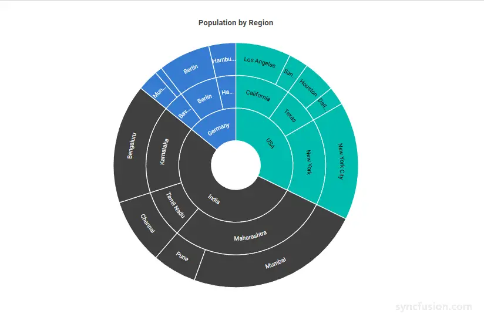
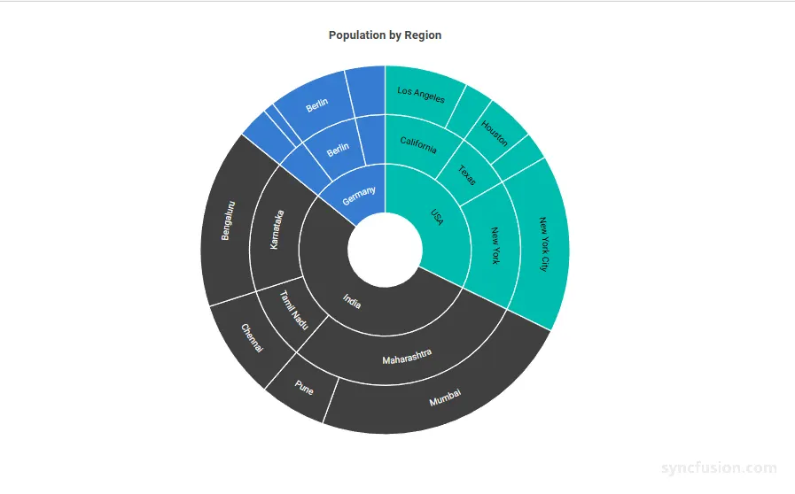
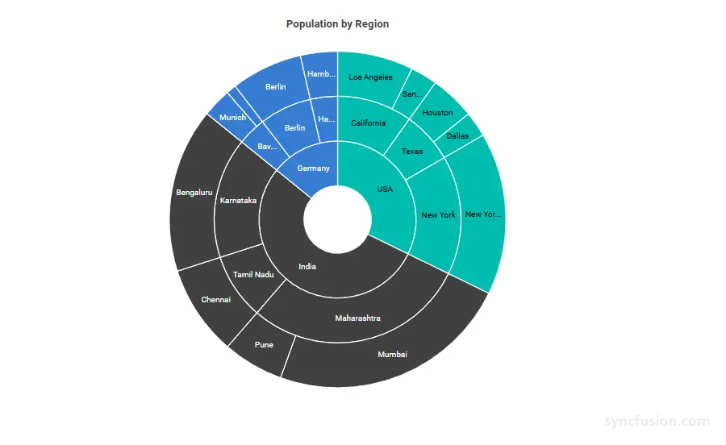
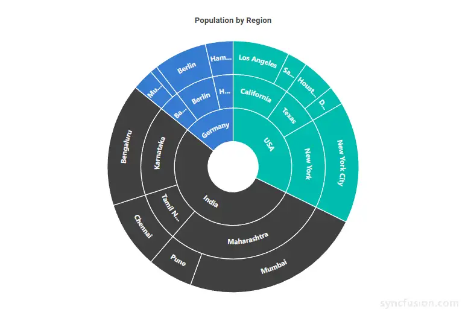

# Blazor Sunburst Chart Data Label

Data labels on the `Blazor Sunburst Chart` display textual information about each segment directly on the chart, helping users identify categories and values at a glance without relying solely on tooltips or legends. They are most useful on charts with medium-to-large segments where the label can be clearly read, and can be configured to overflow gracefully on smaller arcs.

The data labels of the Blazor Sunburst Chart can be enabled and customized using the `SunburstDataLabelSettings` child component.

N> **Default behavior:** by default, `Visible` is `false`, so no data labels are rendered until explicitly enabled.

## Enable the data label

Data labels are hidden by default. Set `Visible` of `SunburstDataLabelSettings` to `true` to display each segment's label directly on the Sunburst Chart — for example, the city name beside each population segment — so users can read values without hovering over the chart.

```cshtml

@using Syncfusion.Blazor.Charts

<SfSunburstChart TItem="RegionData"
                 Title="Population by Region"
                 DataSource="@Regions"
                 IdMemberPath="@nameof(RegionData.Id)"
                 ParentIdMemberPath="@nameof(RegionData.ParentId)"
                 LabelMemberPath="@nameof(RegionData.Label)"
                 ValueMemberPath="@nameof(RegionData.Population)"
                 Width="100%" Height="600px">
    <SunburstDataLabelSettings Visible="true" />
</SfSunburstChart>

@code {
    public class RegionData
    {
        public string Id { get; set; } = string.Empty;
        public string? ParentId { get; set; }
        public string Label { get; set; } = string.Empty;
        public double Population { get; set; }
    }

    public List<RegionData> Regions = new List<RegionData>
    {
        new RegionData { Id = "USA", ParentId = null, Label = "USA" },
        new RegionData { Id = "India", ParentId = null, Label = "India" },
        new RegionData { Id = "Germany", ParentId = null, Label = "Germany" },

        new RegionData { Id = "USA-California", ParentId = "USA", Label = "California" },
        new RegionData { Id = "USA-Texas", ParentId = "USA", Label = "Texas" },
        new RegionData { Id = "USA-NewYork", ParentId = "USA", Label = "New York" },

        new RegionData { Id = "India-Maharashtra", ParentId = "India", Label = "Maharashtra" },
        new RegionData { Id = "India-TamilNadu", ParentId = "India", Label = "Tamil Nadu" },
        new RegionData { Id = "India-Karnataka", ParentId = "India", Label = "Karnataka" },

        new RegionData { Id = "Germany-Bavaria", ParentId = "Germany", Label = "Bavaria" },
        new RegionData { Id = "Germany-Berlin", ParentId = "Germany", Label = "Berlin" },
        new RegionData { Id = "Germany-Hamburg", ParentId = "Germany", Label = "Hamburg" },

        new RegionData { Id = "USA-California-LosAngeles", ParentId = "USA-California", Label = "Los Angeles", Population = 3898000 },
        new RegionData { Id = "USA-California-SanDiego", ParentId = "USA-California", Label = "San Diego", Population = 1381000 },
        new RegionData { Id = "USA-Texas-Houston", ParentId = "USA-Texas", Label = "Houston", Population = 2304000 },
        new RegionData { Id = "USA-Texas-Dallas", ParentId = "USA-Texas", Label = "Dallas", Population = 1304000 },
        new RegionData { Id = "USA-NewYork-NewYorkCity", ParentId = "USA-NewYork", Label = "New York City", Population = 8336000 },

        new RegionData { Id = "India-Maharashtra-Mumbai", ParentId = "India-Maharashtra", Label = "Mumbai", Population = 12440000 },
        new RegionData { Id = "India-Maharashtra-Pune", ParentId = "India-Maharashtra", Label = "Pune", Population = 3120000 },
        new RegionData { Id = "India-TamilNadu-Chennai", ParentId = "India-TamilNadu", Label = "Chennai", Population = 4646000 },
        new RegionData { Id = "India-Karnataka-Bengaluru", ParentId = "India-Karnataka", Label = "Bengaluru", Population = 8443000 },

        new RegionData { Id = "Germany-Bavaria-Munich", ParentId = "Germany-Bavaria", Label = "Munich", Population = 1488000 },
        new RegionData { Id = "Germany-Bavaria-Nuremberg", ParentId = "Germany-Bavaria", Label = "Nuremberg", Population = 515000 },
        new RegionData { Id = "Germany-Berlin-BerlinCity", ParentId = "Germany-Berlin", Label = "Berlin", Population = 3664000 },
        new RegionData { Id = "Germany-Hamburg-HamburgCity", ParentId = "Germany-Hamburg", Label = "Hamburg", Population = 1899000 }
    };
}

```

<!-- TODO: Add Blazor Playground sample after release -->


## Label overflow mode

When a segment is too small, its label may not fit within the available arc space, which can make the chart look crowded or hard to read. Use `LabelOverflowMode` to decide how the chart handles that label:

* `Trim` – shorten the label with an ellipsis so it fits in the arc (**default**). For example, `Los Angeles ...` instead of the full name on a small segment.
* `Hide` – hide the label entirely when it does not fit. Use this when a clean look matters more than showing every label.
* `None` – render the label as-is, even if it overlaps the segment edge. Use this when full text matters more than a tidy appearance.

N> `Trim` and `Hide` only keep labels visible when their text fits in the arc. `None` always shows the full label, which can overflow on small segments.

```cshtml

@using Syncfusion.Blazor.Charts

<SfSunburstChart TItem="RegionData"
                 Title="Population by Region"
                 DataSource="@Regions"
                 IdMemberPath="@nameof(RegionData.Id)"
                 ParentIdMemberPath="@nameof(RegionData.ParentId)"
                 LabelMemberPath="@nameof(RegionData.Label)"
                 ValueMemberPath="@nameof(RegionData.Population)"
                 Width="100%" Height="600px">
    <SunburstDataLabelSettings Visible="true" LabelOverflowMode="LabelOverflowMode.Hide" />
</SfSunburstChart>

@code {
    public class RegionData
    {
        public string Id { get; set; } = string.Empty;
        public string? ParentId { get; set; }
        public string Label { get; set; } = string.Empty;
        public double Population { get; set; }
    }

    public List<RegionData> Regions = new List<RegionData>
    {
        new RegionData { Id = "USA", ParentId = null, Label = "USA" },
        new RegionData { Id = "India", ParentId = null, Label = "India" },
        new RegionData { Id = "Germany", ParentId = null, Label = "Germany" },

        new RegionData { Id = "USA-California", ParentId = "USA", Label = "California" },
        new RegionData { Id = "USA-Texas", ParentId = "USA", Label = "Texas" },
        new RegionData { Id = "USA-NewYork", ParentId = "USA", Label = "New York" },

        new RegionData { Id = "India-Maharashtra", ParentId = "India", Label = "Maharashtra" },
        new RegionData { Id = "India-TamilNadu", ParentId = "India", Label = "Tamil Nadu" },
        new RegionData { Id = "India-Karnataka", ParentId = "India", Label = "Karnataka" },

        new RegionData { Id = "Germany-Bavaria", ParentId = "Germany", Label = "Bavaria" },
        new RegionData { Id = "Germany-Berlin", ParentId = "Germany", Label = "Berlin" },
        new RegionData { Id = "Germany-Hamburg", ParentId = "Germany", Label = "Hamburg" },

        new RegionData { Id = "USA-California-LosAngeles", ParentId = "USA-California", Label = "Los Angeles", Population = 3898000 },
        new RegionData { Id = "USA-California-SanDiego", ParentId = "USA-California", Label = "San Diego", Population = 1381000 },
        new RegionData { Id = "USA-Texas-Houston", ParentId = "USA-Texas", Label = "Houston", Population = 2304000 },
        new RegionData { Id = "USA-Texas-Dallas", ParentId = "USA-Texas", Label = "Dallas", Population = 1304000 },
        new RegionData { Id = "USA-NewYork-NewYorkCity", ParentId = "USA-NewYork", Label = "New York City", Population = 8336000 },

        new RegionData { Id = "India-Maharashtra-Mumbai", ParentId = "India-Maharashtra", Label = "Mumbai", Population = 12440000 },
        new RegionData { Id = "India-Maharashtra-Pune", ParentId = "India-Maharashtra", Label = "Pune", Population = 3120000 },
        new RegionData { Id = "India-TamilNadu-Chennai", ParentId = "India-TamilNadu", Label = "Chennai", Population = 4646000 },
        new RegionData { Id = "India-Karnataka-Bengaluru", ParentId = "India-Karnataka", Label = "Bengaluru", Population = 8443000 },

        new RegionData { Id = "Germany-Bavaria-Munich", ParentId = "Germany-Bavaria", Label = "Munich", Population = 1488000 },
        new RegionData { Id = "Germany-Bavaria-Nuremberg", ParentId = "Germany-Bavaria", Label = "Nuremberg", Population = 515000 },
        new RegionData { Id = "Germany-Berlin-BerlinCity", ParentId = "Germany-Berlin", Label = "Berlin", Population = 3664000 },
        new RegionData { Id = "Germany-Hamburg-HamburgCity", ParentId = "Germany-Hamburg", Label = "Hamburg", Population = 1899000 }
    };
}

```

<!-- TODO: Add Blazor Playground sample after release -->


## Label rotation mode

Use `LabelRotationMode` to choose how each label aligns with the chart:

* `Angle` – rotate the label to follow the angle of its arc (**default**). Use this when the chart is the focus and you want labels to feel symmetric with the radial layout.
* `Normal` – keep the label upright and horizontal, ignoring the arc angle. Use this when users need to read labels quickly, such as on dashboards or reports.

For example, a wide chart with many segments may look more balanced with `Angle`, while a compact dashboard tile may read better with `Normal`.

```cshtml

@using Syncfusion.Blazor.Charts

<SfSunburstChart TItem="RegionData"
                 Title="Population by Region"
                 DataSource="@Regions"
                 IdMemberPath="@nameof(RegionData.Id)"
                 ParentIdMemberPath="@nameof(RegionData.ParentId)"
                 LabelMemberPath="@nameof(RegionData.Label)"
                 ValueMemberPath="@nameof(RegionData.Population)"
                 Width="100%" Height="600px">
    <SunburstDataLabelSettings Visible="true" LabelRotationMode="LabelRotationMode.Normal" />
</SfSunburstChart>

@code {
    public class RegionData
    {
        public string Id { get; set; } = string.Empty;
        public string? ParentId { get; set; }
        public string Label { get; set; } = string.Empty;
        public double Population { get; set; }
    }

    public List<RegionData> Regions = new List<RegionData>
    {
        new RegionData { Id = "USA", ParentId = null, Label = "USA" },
        new RegionData { Id = "India", ParentId = null, Label = "India" },
        new RegionData { Id = "Germany", ParentId = null, Label = "Germany" },

        new RegionData { Id = "USA-California", ParentId = "USA", Label = "California" },
        new RegionData { Id = "USA-Texas", ParentId = "USA", Label = "Texas" },
        new RegionData { Id = "USA-NewYork", ParentId = "USA", Label = "New York" },

        new RegionData { Id = "India-Maharashtra", ParentId = "India", Label = "Maharashtra" },
        new RegionData { Id = "India-TamilNadu", ParentId = "India", Label = "Tamil Nadu" },
        new RegionData { Id = "India-Karnataka", ParentId = "India", Label = "Karnataka" },

        new RegionData { Id = "Germany-Bavaria", ParentId = "Germany", Label = "Bavaria" },
        new RegionData { Id = "Germany-Berlin", ParentId = "Germany", Label = "Berlin" },
        new RegionData { Id = "Germany-Hamburg", ParentId = "Germany", Label = "Hamburg" },

        new RegionData { Id = "USA-California-LosAngeles", ParentId = "USA-California", Label = "Los Angeles", Population = 3898000 },
        new RegionData { Id = "USA-California-SanDiego", ParentId = "USA-California", Label = "San Diego", Population = 1381000 },
        new RegionData { Id = "USA-Texas-Houston", ParentId = "USA-Texas", Label = "Houston", Population = 2304000 },
        new RegionData { Id = "USA-Texas-Dallas", ParentId = "USA-Texas", Label = "Dallas", Population = 1304000 },
        new RegionData { Id = "USA-NewYork-NewYorkCity", ParentId = "USA-NewYork", Label = "New York City", Population = 8336000 },

        new RegionData { Id = "India-Maharashtra-Mumbai", ParentId = "India-Maharashtra", Label = "Mumbai", Population = 12440000 },
        new RegionData { Id = "India-Maharashtra-Pune", ParentId = "India-Maharashtra", Label = "Pune", Population = 3120000 },
        new RegionData { Id = "India-TamilNadu-Chennai", ParentId = "India-TamilNadu", Label = "Chennai", Population = 4646000 },
        new RegionData { Id = "India-Karnataka-Bengaluru", ParentId = "India-Karnataka", Label = "Bengaluru", Population = 8443000 },

        new RegionData { Id = "Germany-Bavaria-Munich", ParentId = "Germany-Bavaria", Label = "Munich", Population = 1488000 },
        new RegionData { Id = "Germany-Bavaria-Nuremberg", ParentId = "Germany-Bavaria", Label = "Nuremberg", Population = 515000 },
        new RegionData { Id = "Germany-Berlin-BerlinCity", ParentId = "Germany-Berlin", Label = "Berlin", Population = 3664000 },
        new RegionData { Id = "Germany-Hamburg-HamburgCity", ParentId = "Germany-Hamburg", Label = "Hamburg", Population = 1899000 }
    };
}

```

<!-- TODO: Add Blazor Playground sample after release -->


## Customization

You can customize how the data label text looks by using the `SunburstDataLabelTextStyle` child component inside `SunburstDataLabelSettings`. This is useful when you want labels to match your application's typography or stand out against dark segment colors.

In the `SunburstDataLabelTextStyle`:

* `FontSize`: Sets the label text size in pixels (for example `"14px"`). Falls back to the active theme if unset.
* `FontFamily`: Sets the label text font family. Multiple families can be specified as a comma-separated list.
* `FontWeight`: Sets the label text thickness. Use values like `Normal`, `Bold`, `Bolder`, `Lighter`, or numeric values such as `400`, `500`, `700`. Falls back to the active theme if unset.
* `FontStyle`: Sets the label text style. Use `Normal`, `Italic`, or `Oblique`. Falls back to the active theme if unset.
* `Color`: Sets the label text color using any valid CSS color value. Falls back to the active theme if unset.
* `Opacity`: Sets the label text transparency, from `0` (fully transparent) to `1` (fully opaque).

```cshtml

@using Syncfusion.Blazor.Charts

<SfSunburstChart TItem="RegionData"
                 Title="Population by Region"
                 DataSource="@Regions"
                 IdMemberPath="@nameof(RegionData.Id)"
                 ParentIdMemberPath="@nameof(RegionData.ParentId)"
                 LabelMemberPath="@nameof(RegionData.Label)"
                 ValueMemberPath="@nameof(RegionData.Population)"
                 Width="100%" Height="600px">
    <SunburstDataLabelSettings Visible="true">
        <SunburstDataLabelTextStyle FontSize="14px"
                                    FontFamily="Segoe UI"
                                    FontWeight="Bold"
                                    FontStyle="Normal"
                                    Color="#424242"
                                    Opacity="1" />
    </SunburstDataLabelSettings>
</SfSunburstChart>

@code {
    public class RegionData
    {
        public string Id { get; set; } = string.Empty;
        public string? ParentId { get; set; }
        public string Label { get; set; } = string.Empty;
        public double Population { get; set; }
    }

    public List<RegionData> Regions = new List<RegionData>
    {
        new RegionData { Id = "USA", ParentId = null, Label = "USA" },
        new RegionData { Id = "India", ParentId = null, Label = "India" },
        new RegionData { Id = "Germany", ParentId = null, Label = "Germany" },

        new RegionData { Id = "USA-California", ParentId = "USA", Label = "California" },
        new RegionData { Id = "USA-Texas", ParentId = "USA", Label = "Texas" },
        new RegionData { Id = "USA-NewYork", ParentId = "USA", Label = "New York" },

        new RegionData { Id = "India-Maharashtra", ParentId = "India", Label = "Maharashtra" },
        new RegionData { Id = "India-TamilNadu", ParentId = "India", Label = "Tamil Nadu" },
        new RegionData { Id = "India-Karnataka", ParentId = "India", Label = "Karnataka" },

        new RegionData { Id = "Germany-Bavaria", ParentId = "Germany", Label = "Bavaria" },
        new RegionData { Id = "Germany-Berlin", ParentId = "Germany", Label = "Berlin" },
        new RegionData { Id = "Germany-Hamburg", ParentId = "Germany", Label = "Hamburg" },

        new RegionData { Id = "USA-California-LosAngeles", ParentId = "USA-California", Label = "Los Angeles", Population = 3898000 },
        new RegionData { Id = "USA-California-SanDiego", ParentId = "USA-California", Label = "San Diego", Population = 1381000 },
        new RegionData { Id = "USA-Texas-Houston", ParentId = "USA-Texas", Label = "Houston", Population = 2304000 },
        new RegionData { Id = "USA-Texas-Dallas", ParentId = "USA-Texas", Label = "Dallas", Population = 1304000 },
        new RegionData { Id = "USA-NewYork-NewYorkCity", ParentId = "USA-NewYork", Label = "New York City", Population = 8336000 },

        new RegionData { Id = "India-Maharashtra-Mumbai", ParentId = "India-Maharashtra", Label = "Mumbai", Population = 12440000 },
        new RegionData { Id = "India-Maharashtra-Pune", ParentId = "India-Maharashtra", Label = "Pune", Population = 3120000 },
        new RegionData { Id = "India-TamilNadu-Chennai", ParentId = "India-TamilNadu", Label = "Chennai", Population = 4646000 },
        new RegionData { Id = "India-Karnataka-Bengaluru", ParentId = "India-Karnataka", Label = "Bengaluru", Population = 8443000 },

        new RegionData { Id = "Germany-Bavaria-Munich", ParentId = "Germany-Bavaria", Label = "Munich", Population = 1488000 },
        new RegionData { Id = "Germany-Bavaria-Nuremberg", ParentId = "Germany-Bavaria", Label = "Nuremberg", Population = 515000 },
        new RegionData { Id = "Germany-Berlin-BerlinCity", ParentId = "Germany-Berlin", Label = "Berlin", Population = 3664000 },
        new RegionData { Id = "Germany-Hamburg-HamburgCity", ParentId = "Germany-Hamburg", Label = "Hamburg", Population = 1899000 }
    };
}

```

<!-- TODO: Add Blazor Playground sample after release -->


## See also

* [Tooltip](./tooltip)
* [Legend](./legend)
* [Selection](./selection)
