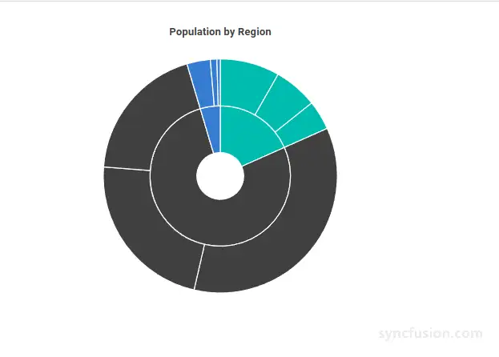

# Blazor Sunburst Chart Dimensions

The size of the `Blazor Sunburst Chart` determines how much space the chart occupies on the page and how the rings of the Sunburst fit within the available area. You can size the chart to fit its container, specify a fixed size in pixels, or use percentage values relative to its parent. Ring geometry inside that area is controlled separately by the `Radius` and `InnerRadius` properties, which are documented in the [Appearance](./appearance#radius-and-inner-radius) page.

The dimensions of the Blazor Sunburst Chart are configured using the `Width` and `Height` properties of `SfSunburstChart`.

N>
* **Default values:** When `Width` and `Height` are not specified, the chart sizes to its parent container (`100%` width and `100%` height).

## Size for container

The Sunburst Chart can be scaled to fit its container. As shown in the example below, the size can be set using CSS on a parent element, and the chart fills the available space using percentage dimensions.

```cshtml

@using Syncfusion.Blazor.Charts

<div style="width:600px; height:450px; background-color:#F5F7FB;">
    <SfSunburstChart TItem="RegionData"
                     Title="Population by Region"
                     DataSource="@Regions"
                     IdMemberPath="@nameof(RegionData.Id)"
                     ParentIdMemberPath="@nameof(RegionData.ParentId)"
                     LabelMemberPath="@nameof(RegionData.Label)"
                     ValueMemberPath="@nameof(RegionData.Population)"
                     Width="100%"
                     Height="100%">
    </SfSunburstChart>
</div>

@code {
    public class RegionData
    {
        public string Id { get; set; } = string.Empty;
        public string? ParentId { get; set; }
        public string Label { get; set; } = string.Empty;
        public double Population { get; set; }
    }

    public List<RegionData> Regions = new List<RegionData>
    {
        new RegionData { Id = "USA", ParentId = null, Label = "USA", Population = 331000000 },
        new RegionData { Id = "India", ParentId = null, Label = "India", Population = 1391000000 },
        new RegionData { Id = "Germany", ParentId = null, Label = "Germany", Population = 83000000 },

        new RegionData { Id = "USA-California", ParentId = "USA", Label = "California", Population = 39540000 },
        new RegionData { Id = "USA-Texas", ParentId = "USA", Label = "Texas", Population = 29000000 },
        new RegionData { Id = "USA-NewYork", ParentId = "USA", Label = "New York", Population = 19540000 },

        new RegionData { Id = "India-Maharashtra", ParentId = "India", Label = "Maharashtra", Population = 112400000 },
        new RegionData { Id = "India-TamilNadu", ParentId = "India", Label = "Tamil Nadu", Population = 72140000 },
        new RegionData { Id = "India-Karnataka", ParentId = "India", Label = "Karnataka", Population = 61100000 },

        new RegionData { Id = "Germany-Bavaria", ParentId = "Germany", Label = "Bavaria", Population = 13080000 },
        new RegionData { Id = "Germany-Berlin", ParentId = "Germany", Label = "Berlin", Population = 3645000 },
        new RegionData { Id = "Germany-Hamburg", ParentId = "Germany", Label = "Hamburg", Population = 1841000 }
    };
}

```

<!-- TODO: Add Blazor Playground sample after release -->


## Size for chart

The `Width` and `Height` properties of `SfSunburstChart` specify the size of the chart in pixels or as a percentage of the parent container, and are applied directly to the chart element.

### In pixels

Set the `Width` and `Height` properties in pixels to define a fixed size for the Sunburst Chart, as shown in the example below.

```cshtml

@using Syncfusion.Blazor.Charts

<SfSunburstChart TItem="RegionData"
                 Title="Population by Region"
                 DataSource="@Regions"
                 IdMemberPath="@nameof(RegionData.Id)"
                 ParentIdMemberPath="@nameof(RegionData.ParentId)"
                 LabelMemberPath="@nameof(RegionData.Label)"
                 ValueMemberPath="@nameof(RegionData.Population)"
                 Width="650px"
                 Height="450px">
</SfSunburstChart>

@code {
    public class RegionData
    {
        public string Id { get; set; } = string.Empty;
        public string? ParentId { get; set; }
        public string Label { get; set; } = string.Empty;
        public double Population { get; set; }
    }

    public List<RegionData> Regions = new List<RegionData>
    {
        new RegionData { Id = "USA", ParentId = null, Label = "USA", Population = 331000000 },
        new RegionData { Id = "India", ParentId = null, Label = "India", Population = 1391000000 },
        new RegionData { Id = "Germany", ParentId = null, Label = "Germany", Population = 83000000 },

        new RegionData { Id = "USA-California", ParentId = "USA", Label = "California", Population = 39540000 },
        new RegionData { Id = "USA-Texas", ParentId = "USA", Label = "Texas", Population = 29000000 },
        new RegionData { Id = "USA-NewYork", ParentId = "USA", Label = "New York", Population = 19540000 },

        new RegionData { Id = "India-Maharashtra", ParentId = "India", Label = "Maharashtra", Population = 112400000 },
        new RegionData { Id = "India-TamilNadu", ParentId = "India", Label = "Tamil Nadu", Population = 72140000 },
        new RegionData { Id = "India-Karnataka", ParentId = "India", Label = "Karnataka", Population = 61100000 },

        new RegionData { Id = "Germany-Bavaria", ParentId = "Germany", Label = "Bavaria", Population = 13080000 },
        new RegionData { Id = "Germany-Berlin", ParentId = "Germany", Label = "Berlin", Population = 3645000 },
        new RegionData { Id = "Germany-Hamburg", ParentId = "Germany", Label = "Hamburg", Population = 1841000 }
    };
}

```

<!-- TODO: Add Blazor Playground sample after release -->


### In percentage values

By setting the values of `Width` and `Height` in percentage, the chart gets its dimension with respect to its container. For example, when `Height` is set to **50%**, the chart is half the height of its container.

```cshtml

@using Syncfusion.Blazor.Charts

<SfSunburstChart TItem="RegionData"
                 Title="Population by Region"
                 DataSource="@Regions"
                 IdMemberPath="@nameof(RegionData.Id)"
                 ParentIdMemberPath="@nameof(RegionData.ParentId)"
                 LabelMemberPath="@nameof(RegionData.Label)"
                 ValueMemberPath="@nameof(RegionData.Population)"
                 Width="100%"
                 Height="100%">
</SfSunburstChart>

@code {
    public class RegionData
    {
        public string Id { get; set; } = string.Empty;
        public string? ParentId { get; set; }
        public string Label { get; set; } = string.Empty;
        public double Population { get; set; }
    }

    public List<RegionData> Regions = new List<RegionData>
    {
        new RegionData { Id = "USA", ParentId = null, Label = "USA", Population = 331000000 },
        new RegionData { Id = "India", ParentId = null, Label = "India", Population = 1391000000 },
        new RegionData { Id = "Germany", ParentId = null, Label = "Germany", Population = 83000000 },

        new RegionData { Id = "USA-California", ParentId = "USA", Label = "California", Population = 39540000 },
        new RegionData { Id = "USA-Texas", ParentId = "USA", Label = "Texas", Population = 29000000 },
        new RegionData { Id = "USA-NewYork", ParentId = "USA", Label = "New York", Population = 19540000 },

        new RegionData { Id = "India-Maharashtra", ParentId = "India", Label = "Maharashtra", Population = 112400000 },
        new RegionData { Id = "India-TamilNadu", ParentId = "India", Label = "Tamil Nadu", Population = 72140000 },
        new RegionData { Id = "India-Karnataka", ParentId = "India", Label = "Karnataka", Population = 61100000 },

        new RegionData { Id = "Germany-Bavaria", ParentId = "Germany", Label = "Bavaria", Population = 13080000 },
        new RegionData { Id = "Germany-Berlin", ParentId = "Germany", Label = "Berlin", Population = 3645000 },
        new RegionData { Id = "Germany-Hamburg", ParentId = "Germany", Label = "Hamburg", Population = 1841000 }
    };
}

```

<!-- TODO: Add Blazor Playground sample after release -->


## See also

* [Appearance](./appearance)
* [Data Label](./data-label)
* [Tooltip](./tooltip)
* [Legend](./legend)