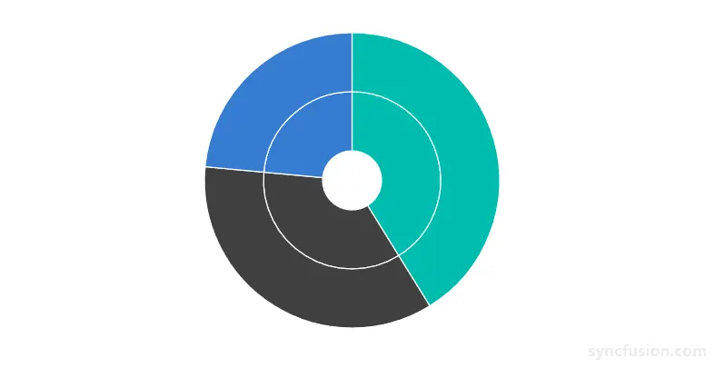

<!-- markdownlint-disable MD040 -->

# Getting Started with Blazor Sunburst Chart in Web App

This section briefly explains how to include the `Blazor Sunburst Chart` component in your Blazor Web App using [Visual Studio](https://visualstudio.microsoft.com/vs/), [Visual Studio Code](https://code.visualstudio.com/), and the [.NET CLI](https://learn.microsoft.com/en-us/dotnet/core/tools/).

> **Ready to streamline your Blazor development?**  Discover the full potential of Blazor components with AI Coding Assistants. Effortlessly integrate, configure, and enhance your projects with intelligent, context-aware code suggestions, streamlined setups, and real-time insights—all seamlessly integrated into your preferred AI-powered IDEs like VS Code, Cursor, Code Studio and more. [Explore AI Coding Assistants](https://blazor.syncfusion.com/documentation/ai-coding-assistant/overview)

## Using .NET CLI Templates

Quickly set up a Blazor application using the preconfigured [Syncfusion Web App Template](https://help.syncfusion.com/extension/syncfusion-blazor-webapp-template-via-nuget/installation).

First, install the template using the .NET CLI.




dotnet new install Syncfusion.Blazor.WebApp.Templates




Next, create a new project with following command.




dotnet new syncfusionblazorwebapp --name MyApp --interactivity Server --all-interactive Global




dotnet new syncfusionblazorwebapp --name MyApp --interactivity WebAssembly --all-interactive Global




dotnet new syncfusionblazorwebapp --name MyApp --interactivity Auto --all-interactive Global




> If you prefer per-page/component interactivity instead of global interactivity, replace `--all-interactive Global` with `--all-interactive PerPage/component` (or omit the `--all-interactive` flag).

After creating the project, navigate to the main project folder (for example, `MyApp`) and run the following command.




cd MyApp
dotnet run




cd MyApp
dotnet run




cd MyApp
dotnet run




## Manually creating a new Blazor Web App





Create a **Blazor Web App** using Visual Studio via [Microsoft Templates](https://learn.microsoft.com/en-us/aspnet/core/blazor/tooling?view=aspnetcore-10.0&pivots=vs) or the [Syncfusion® Blazor Extension](https://blazor.syncfusion.com/documentation/visual-studio-integration/template-studio).





Run the following command to create a new Blazor Web App.




dotnet new blazor -o BlazorWebApp --interactivity Auto
cd BlazorWebApp
cd BlazorWebApp.Client




Alternatively, create a **Blazor Web App** using Visual Studio Code via [Microsoft Templates](https://learn.microsoft.com/en-us/aspnet/core/blazor/tooling?view=aspnetcore-10.0&pivots=vsc), the [Syncfusion® Blazor Extension](https://blazor.syncfusion.com/documentation/visual-studio-code-integration/create-project), or the [C# Dev Kit](https://marketplace.visualstudio.com/items?itemName=ms-dotnettools.csdevkit) extension.





N> Configure the appropriate [Interactive render mode](https://learn.microsoft.com/en-us/aspnet/core/blazor/components/render-modes?view=aspnetcore-10.0#render-modes) and [Interactivity location](https://learn.microsoft.com/en-us/aspnet/core/blazor/tooling?view=aspnetcore-10.0&pivots=vs) while creating a Blazor Web App. For detailed information, refer to the [interactive render mode documentation](https://blazor.syncfusion.com/documentation/common/interactive-render-mode).

### Install the required Blazor package

Install the [Syncfusion.Blazor.Charts](https://www.nuget.org/packages/Syncfusion.Blazor.Charts/) NuGet package. This package delivers every Syncfusion Blazor chart component, including the `Blazor Sunburst Chart`. All Syncfusion Blazor packages are available on [nuget.org](https://www.nuget.org/packages?q=syncfusion.blazor). See the [NuGet packages](https://blazor.syncfusion.com/documentation/nuget-packages) topic for details. If using the `WebAssembly` or `Auto` render modes in the Blazor Web App, install this package in the `.Client` project.





1. Go to *Tools → NuGet Package Manager → Manage NuGet Packages for Solution*.
2. Search the required NuGet package (`Syncfusion.Blazor.Charts`) and install it.

Alternatively, you can install the same package using the Package Manager Console with the following command.




Install-Package Syncfusion.Blazor.Charts -Version {{ site.releaseversion }}








Open the terminal and run the following command.




dotnet add package Syncfusion.Blazor.Charts -v {{ site.releaseversion }}








### Add import namespaces

After the package is installed, open the **~/_Imports.razor** file from the `.Client` project and import the `Syncfusion.Blazor` and `Syncfusion.Blazor.Charts` namespaces.




@using Syncfusion.Blazor
@using Syncfusion.Blazor.Charts




### Register the Blazor service

Open the **Program.cs** file in Blazor Web App and register the Blazor service and include the required namespace reference `using Syncfusion.Blazor;` at the top. If the **Interactive Render Mode** is set to `WebAssembly` or `Auto`, register the Blazor service in **Program.cs** files of both the server and client projects in your Blazor Web App.




builder.Services.AddSyncfusionBlazor();




### Add script resource

Include the required [script references](https://blazor.syncfusion.com/documentation/common/adding-script-references) at the end of the `<body>` section in the **App.razor** file to enable Sunburst Chart functionality.







### Add Blazor Sunburst Chart component

Open a Razor file located in the **~/Pages/*.razor** (for example, **Home.razor**) and add the `Blazor Sunburst Chart` component inside the `.Client` project razor file.

N> If the interactivity location is set to `Per page/component` in the Web App, define a render mode at the top of the razor file. (For example, `InteractiveServer`, `InteractiveWebAssembly` or `InteractiveAuto`). If the **Interactivity** is set to `Global` with `Auto` or `WebAssembly`, the render mode is automatically configured in the `App.razor` file by default.




@rendermode InteractiveAuto

<SfSunburstChart TItem="NodeDetails"
                 DataSource="@DataSource"
                 IdMemberPath="@nameof(NodeDetails.Id)"
                 ParentIdMemberPath="@nameof(NodeDetails.ParentId)"
                 ValueMemberPath="@nameof(NodeDetails.Value)"
                 LabelMemberPath="@nameof(NodeDetails.Name)"
                 Width="100%"
                 Height="450px">
</SfSunburstChart>

@code {
    public class NodeDetails
    {
        public string Id { get; set; } = string.Empty;
        public string? ParentId { get; set; }
        public string Name { get; set; } = string.Empty;
        public double Value { get; set; }
    }

    public List<NodeDetails> DataSource = new()
    {
        new NodeDetails { Id = "USA", ParentId = null, Name = "USA" },
        new NodeDetails { Id = "USA-Electronics", ParentId = "USA", Name = "Electronics", Value = 35 },
        new NodeDetails { Id = "India", ParentId = null, Name = "India" },
        new NodeDetails { Id = "India-Electronics", ParentId = "India", Name = "Electronics", Value = 30 },
        new NodeDetails { Id = "Germany", ParentId = null, Name = "Germany" },
        new NodeDetails { Id = "Germany-Electronics", ParentId = "Germany", Name = "Electronics", Value = 20 }
    };
}




### Run the application





Press <kbd>Ctrl</kbd>+<kbd>F5</kbd> (Windows) or <kbd>⌘</kbd>+<kbd>F5</kbd> (macOS) to launch the application. The `Blazor Sunburst Chart` component will render in your default web browser.





Open the terminal and navigate to the main project folder (for example, `BlazorWebApp`) and run the following command.




cd ..
cd BlazorWebApp
dotnet run








<!-- TODO: Add Blazor Playground sample after release -->

## Populate Sunburst Chart with data

The `Blazor Sunburst Chart` renders hierarchical data as concentric rings. As shown in the previous example, the hierarchy is described through a single flat `IEnumerable<TItem>` collection, and the chart derives the levels from how each row's `ParentId` maps to another row's `Id`. Each root row (`ParentId` is `null`) becomes the innermost ring, and each level of children becomes the next outer ring.

Key mappings to configure:

* `DataSource` — the `IEnumerable<NodeDetails>` collection that supplies the nodes.
* `IdMemberPath` — the unique identifier of each row (`NodeDetails.Id`).
* `ParentIdMemberPath` — the parent reference for each row (`NodeDetails.ParentId`); set to `null` for top-level rows.
* `LabelMemberPath` — the field that provides the segment text (`NodeDetails.Name`).
* `ValueMemberPath` — the numeric field that determines the segment sweep (`NodeDetails.Value`).

Leaf rows carry the numeric `Value` that drives rendering. Ancestor rows without a `Value` display the aggregated value of their descendants.

## See also

1. [Getting Started with Blazor Web Assembly App in Visual Studio or .NET CLI](https://blazor.syncfusion.com/documentation/getting-started/blazor-webassembly-app)
2. [Getting Started with Blazor Web App in Visual Studio or .NET CLI](https://blazor.syncfusion.com/documentation/getting-started/blazor-web-app)