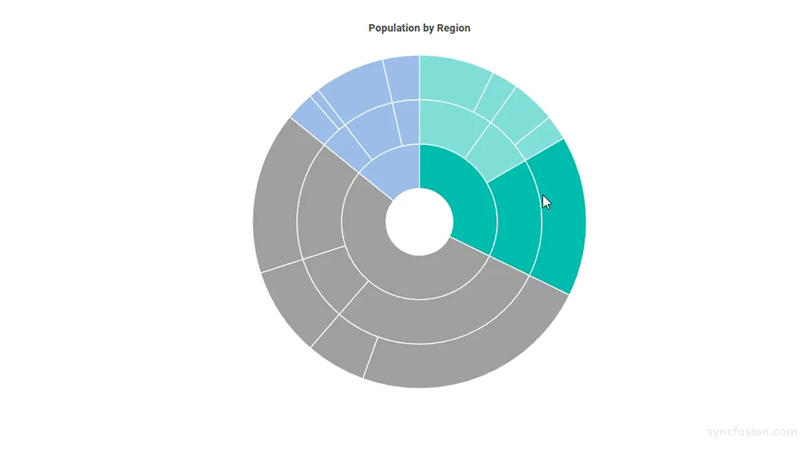
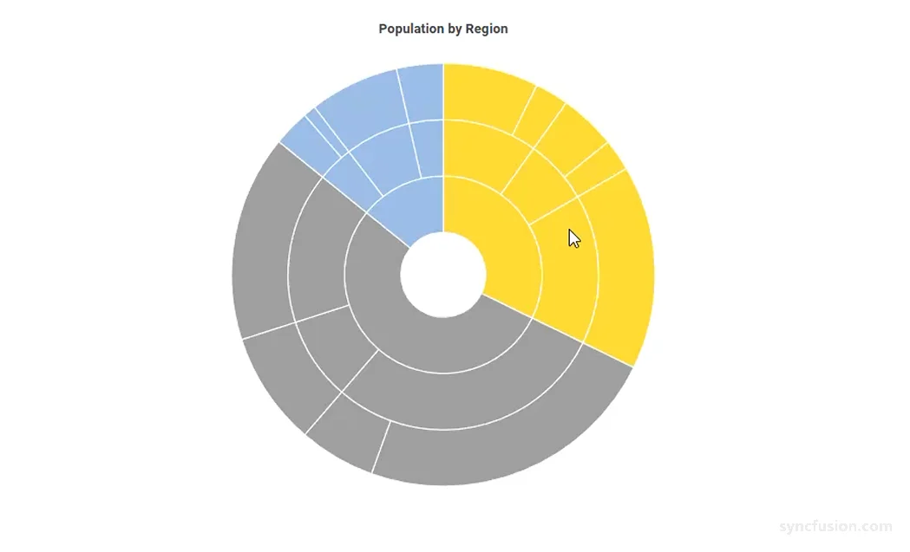
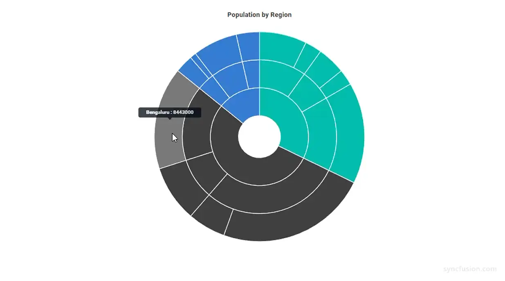

# Blazor Sunburst Chart Highlight

Highlighting on the `Blazor Sunburst Chart` visually emphasizes the segment under the pointer so that users can immediately tell which part of the hierarchy they are inspecting. It is most useful when the chart contains many small segments or several nested levels, where the active segment can otherwise blend into its siblings and ancestors.

Highlighting is driven by the `SunburstHighlightSettings` child component.

N> **Default behavior:** `Enable` is `false`, so highlighting is disabled until it is explicitly turned on. When `Enable` is `true`, other segments are dimmed while the active segment stays full-color, so users can clearly see which segment is focused.

## Enable highlighting

Set `Enable` of `SunburstHighlightSettings` to `true` to highlight the segment under the pointer. While highlighting is active, the non-highlighted segments are dimmed so the active one stands out.

```cshtml

@using Syncfusion.Blazor.Charts

<SfSunburstChart TItem="RegionData"
                 Title="Population by Region"
                 DataSource="@Regions"
                 IdMemberPath="@nameof(RegionData.Id)"
                 ParentIdMemberPath="@nameof(RegionData.ParentId)"
                 LabelMemberPath="@nameof(RegionData.Label)"
                 ValueMemberPath="@nameof(RegionData.Population)"
                 Width="100%" Height="600px">
    <SunburstHighlightSettings Enable="true" />
</SfSunburstChart>

@code {
    public class RegionData
    {
        public string Id { get; set; } = string.Empty;
        public string? ParentId { get; set; }
        public string Label { get; set; } = string.Empty;
        public double Population { get; set; }
    }

    public List<RegionData> Regions = new List<RegionData>
    {
        new RegionData { Id = "USA", ParentId = null, Label = "USA" },
        new RegionData { Id = "India", ParentId = null, Label = "India" },
        new RegionData { Id = "Germany", ParentId = null, Label = "Germany" },

        new RegionData { Id = "USA-California", ParentId = "USA", Label = "California" },
        new RegionData { Id = "USA-Texas", ParentId = "USA", Label = "Texas" },
        new RegionData { Id = "USA-NewYork", ParentId = "USA", Label = "New York" },

        new RegionData { Id = "India-Maharashtra", ParentId = "India", Label = "Maharashtra" },
        new RegionData { Id = "India-TamilNadu", ParentId = "India", Label = "Tamil Nadu" },
        new RegionData { Id = "India-Karnataka", ParentId = "India", Label = "Karnataka" },

        new RegionData { Id = "Germany-Bavaria", ParentId = "Germany", Label = "Bavaria" },
        new RegionData { Id = "Germany-Berlin", ParentId = "Germany", Label = "Berlin" },
        new RegionData { Id = "Germany-Hamburg", ParentId = "Germany", Label = "Hamburg" },

        new RegionData { Id = "USA-California-LosAngeles", ParentId = "USA-California", Label = "Los Angeles", Population = 3898000 },
        new RegionData { Id = "USA-California-SanDiego", ParentId = "USA-California", Label = "San Diego", Population = 1381000 },
        new RegionData { Id = "USA-Texas-Houston", ParentId = "USA-Texas", Label = "Houston", Population = 2304000 },
        new RegionData { Id = "USA-Texas-Dallas", ParentId = "USA-Texas", Label = "Dallas", Population = 1304000 },
        new RegionData { Id = "USA-NewYork-NewYorkCity", ParentId = "USA-NewYork", Label = "New York City", Population = 8336000 },

        new RegionData { Id = "India-Maharashtra-Mumbai", ParentId = "India-Maharashtra", Label = "Mumbai", Population = 12440000 },
        new RegionData { Id = "India-Maharashtra-Pune", ParentId = "India-Maharashtra", Label = "Pune", Population = 3120000 },
        new RegionData { Id = "India-TamilNadu-Chennai", ParentId = "India-TamilNadu", Label = "Chennai", Population = 4646000 },
        new RegionData { Id = "India-Karnataka-Bengaluru", ParentId = "India-Karnataka", Label = "Bengaluru", Population = 8443000 },

        new RegionData { Id = "Germany-Bavaria-Munich", ParentId = "Germany-Bavaria", Label = "Munich", Population = 1488000 },
        new RegionData { Id = "Germany-Bavaria-Nuremberg", ParentId = "Germany-Bavaria", Label = "Nuremberg", Population = 515000 },
        new RegionData { Id = "Germany-Berlin-BerlinCity", ParentId = "Germany-Berlin", Label = "Berlin", Population = 3664000 },
        new RegionData { Id = "Germany-Hamburg-HamburgCity", ParentId = "Germany-Hamburg", Label = "Hamburg", Population = 1899000 }
    };
}

```

<!-- TODO: Add Blazor Playground sample after release -->


## Supported highlight modes

Use `Mode` to decide which related segments are highlighted together with the segment under the pointer. The mode is a `SunburstHighlightMode` enum value.

* `Single` – Highlights only the segment under the pointer. Use this when you want a strict one-segment focus.
* `Parent` – Highlights the segment under the pointer and its parent segment. Use this when you want the immediate parent to remain visible while inspecting a segment.
* `Child` – Highlights the segment under the pointer together with its child segment. Use this when you want to focus on a node and its immediate descendant.
* `All` – Highlights the segment under the pointer together with its parent and child segments. Use this when you want the full branch centered while inspecting a single segment.

The following example configures the `Parent` mode so that hovering over a deep segment also keeps its ancestors visible.

```cshtml

@using Syncfusion.Blazor.Charts

<SfSunburstChart TItem="RegionData"
                 Title="Population by Region"
                 DataSource="@Regions"
                 IdMemberPath="@nameof(RegionData.Id)"
                 ParentIdMemberPath="@nameof(RegionData.ParentId)"
                 LabelMemberPath="@nameof(RegionData.Label)"
                 ValueMemberPath="@nameof(RegionData.Population)"
                 Width="100%" Height="600px">
    <SunburstHighlightSettings Enable="true" Mode="SunburstHighlightMode.Parent" />
</SfSunburstChart>

@code {
    public class RegionData
    {
        public string Id { get; set; } = string.Empty;
        public string? ParentId { get; set; }
        public string Label { get; set; } = string.Empty;
        public double Population { get; set; }
    }

    public List<RegionData> Regions = new List<RegionData>
    {
        new RegionData { Id = "USA", ParentId = null, Label = "USA" },
        new RegionData { Id = "India", ParentId = null, Label = "India" },
        new RegionData { Id = "Germany", ParentId = null, Label = "Germany" },

        new RegionData { Id = "USA-California", ParentId = "USA", Label = "California" },
        new RegionData { Id = "USA-Texas", ParentId = "USA", Label = "Texas" },
        new RegionData { Id = "USA-NewYork", ParentId = "USA", Label = "New York" },

        new RegionData { Id = "India-Maharashtra", ParentId = "India", Label = "Maharashtra" },
        new RegionData { Id = "India-TamilNadu", ParentId = "India", Label = "Tamil Nadu" },
        new RegionData { Id = "India-Karnataka", ParentId = "India", Label = "Karnataka" },

        new RegionData { Id = "Germany-Bavaria", ParentId = "Germany", Label = "Bavaria" },
        new RegionData { Id = "Germany-Berlin", ParentId = "Germany", Label = "Berlin" },
        new RegionData { Id = "Germany-Hamburg", ParentId = "Germany", Label = "Hamburg" },

        new RegionData { Id = "USA-California-LosAngeles", ParentId = "USA-California", Label = "Los Angeles", Population = 3898000 },
        new RegionData { Id = "USA-California-SanDiego", ParentId = "USA-California", Label = "San Diego", Population = 1381000 },
        new RegionData { Id = "USA-Texas-Houston", ParentId = "USA-Texas", Label = "Houston", Population = 2304000 },
        new RegionData { Id = "USA-Texas-Dallas", ParentId = "USA-Texas", Label = "Dallas", Population = 1304000 },
        new RegionData { Id = "USA-NewYork-NewYorkCity", ParentId = "USA-NewYork", Label = "New York City", Population = 8336000 },

        new RegionData { Id = "India-Maharashtra-Mumbai", ParentId = "India-Maharashtra", Label = "Mumbai", Population = 12440000 },
        new RegionData { Id = "India-Maharashtra-Pune", ParentId = "India-Maharashtra", Label = "Pune", Population = 3120000 },
        new RegionData { Id = "India-TamilNadu-Chennai", ParentId = "India-TamilNadu", Label = "Chennai", Population = 4646000 },
        new RegionData { Id = "India-Karnataka-Bengaluru", ParentId = "India-Karnataka", Label = "Bengaluru", Population = 8443000 },

        new RegionData { Id = "Germany-Bavaria-Munich", ParentId = "Germany-Bavaria", Label = "Munich", Population = 1488000 },
        new RegionData { Id = "Germany-Bavaria-Nuremberg", ParentId = "Germany-Bavaria", Label = "Nuremberg", Population = 515000 },
        new RegionData { Id = "Germany-Berlin-BerlinCity", ParentId = "Germany-Berlin", Label = "Berlin", Population = 3664000 },
        new RegionData { Id = "Germany-Hamburg-HamburgCity", ParentId = "Germany-Hamburg", Label = "Hamburg", Population = 1899000 }
    };
}

```

<!-- TODO: Add Blazor Playground sample after release -->


## Customize highlight color and opacity

Use `Color` to recolor the highlighted segments and `Opacity` to make them more transparent. The two properties are independent and can be used together: setting only `Color` recolors the highlighted segments, setting only `Opacity` adjusts their transparency, and setting both applies both effects at the same time.

When `Color` is left empty, the highlighted segment falls back to its parent segment color (or its own color for the root segment), preserving each segment's visual identity.

```cshtml

@using Syncfusion.Blazor.Charts

<SfSunburstChart TItem="RegionData"
                 Title="Population by Region"
                 DataSource="@Regions"
                 IdMemberPath="@nameof(RegionData.Id)"
                 ParentIdMemberPath="@nameof(RegionData.ParentId)"
                 LabelMemberPath="@nameof(RegionData.Label)"
                 ValueMemberPath="@nameof(RegionData.Population)"
                 Width="100%" Height="600px">
    <SunburstHighlightSettings Enable="true"
                               Mode="SunburstHighlightMode.All"
                               Color="#FFD200"
                               Opacity="0.8" />
</SfSunburstChart>

@code {
    public class RegionData
    {
        public string Id { get; set; } = string.Empty;
        public string? ParentId { get; set; }
        public string Label { get; set; } = string.Empty;
        public double Population { get; set; }
    }

    public List<RegionData> Regions = new List<RegionData>
    {
        new RegionData { Id = "USA", ParentId = null, Label = "USA" },
        new RegionData { Id = "India", ParentId = null, Label = "India" },
        new RegionData { Id = "Germany", ParentId = null, Label = "Germany" },

        new RegionData { Id = "USA-California", ParentId = "USA", Label = "California" },
        new RegionData { Id = "USA-Texas", ParentId = "USA", Label = "Texas" },
        new RegionData { Id = "USA-NewYork", ParentId = "USA", Label = "New York" },

        new RegionData { Id = "India-Maharashtra", ParentId = "India", Label = "Maharashtra" },
        new RegionData { Id = "India-TamilNadu", ParentId = "India", Label = "Tamil Nadu" },
        new RegionData { Id = "India-Karnataka", ParentId = "India", Label = "Karnataka" },

        new RegionData { Id = "Germany-Bavaria", ParentId = "Germany", Label = "Bavaria" },
        new RegionData { Id = "Germany-Berlin", ParentId = "Germany", Label = "Berlin" },
        new RegionData { Id = "Germany-Hamburg", ParentId = "Germany", Label = "Hamburg" },

        new RegionData { Id = "USA-California-LosAngeles", ParentId = "USA-California", Label = "Los Angeles", Population = 3898000 },
        new RegionData { Id = "USA-California-SanDiego", ParentId = "USA-California", Label = "San Diego", Population = 1381000 },
        new RegionData { Id = "USA-Texas-Houston", ParentId = "USA-Texas", Label = "Houston", Population = 2304000 },
        new RegionData { Id = "USA-Texas-Dallas", ParentId = "USA-Texas", Label = "Dallas", Population = 1304000 },
        new RegionData { Id = "USA-NewYork-NewYorkCity", ParentId = "USA-NewYork", Label = "New York City", Population = 8336000 },

        new RegionData { Id = "India-Maharashtra-Mumbai", ParentId = "India-Maharashtra", Label = "Mumbai", Population = 12440000 },
        new RegionData { Id = "India-Maharashtra-Pune", ParentId = "India-Maharashtra", Label = "Pune", Population = 3120000 },
        new RegionData { Id = "India-TamilNadu-Chennai", ParentId = "India-TamilNadu", Label = "Chennai", Population = 4646000 },
        new RegionData { Id = "India-Karnataka-Bengaluru", ParentId = "India-Karnataka", Label = "Bengaluru", Population = 8443000 },

        new RegionData { Id = "Germany-Bavaria-Munich", ParentId = "Germany-Bavaria", Label = "Munich", Population = 1488000 },
        new RegionData { Id = "Germany-Bavaria-Nuremberg", ParentId = "Germany-Bavaria", Label = "Nuremberg", Population = 515000 },
        new RegionData { Id = "Germany-Berlin-BerlinCity", ParentId = "Germany-Berlin", Label = "Berlin", Population = 3664000 },
        new RegionData { Id = "Germany-Hamburg-HamburgCity", ParentId = "Germany-Hamburg", Label = "Hamburg", Population = 1899000 }
    };
}

```

<!-- TODO: Add Blazor Playground sample after release -->


## Customization

You can customize the appearance of the highlight using the following properties.

### SunburstHighlightSettings Properties

Configure the main highlight appearance:

In the `SunburstHighlightSettings`:
* `Enable`: Enables or disables highlighting on pointer hover. The default value is `false`.
* `Mode`: Specifies which segments are highlighted together with the segment under the pointer. Use the `SunburstHighlightMode` enum (`Single`, `Parent`, `Child`, or `All`). The default value is `All`.
* `Color`: Sets the color applied to highlighted segments. Any valid CSS color value (named, hex, RGB, or RGBA) is accepted. The default value is empty; when empty, the highlighted segment uses its parent segment color (or its own color for the root segment).
* `Opacity`: Sets the transparency of highlighted segments, from `0` (fully transparent) to `1` (fully opaque). The default value is `1`.

N> When `Enable` is `true`, the non-highlighted segments are always dimmed. That dim is a fixed visual effect and is not controlled by `Color` or `Opacity`; it just gives the active segment extra emphasis while the user moves the pointer over the chart.

## Tooltip highlighting

The Sunburst Chart highlights the segment that is tied to the active tooltip when `EnableHighlight` of `SunburstTooltipSettings` is `true` (the default). When the tooltip is shown for a segment, that segment is visually emphasized using the same highlight behavior.

`EnableHighlight` is independent from `SunburstHighlightSettings.Enable` — both can be active at the same time. Setting `EnableHighlight="false"` disables tooltip-driven highlight while leaving pointer-hover highlight (if `SunburstHighlightSettings.Enable` is `true`) unaffected. If both are disabled, no highlight is rendered.

```cshtml

@using Syncfusion.Blazor.Charts

<SfSunburstChart TItem="RegionData"
                 Title="Population by Region"
                 DataSource="@Regions"
                 IdMemberPath="@nameof(RegionData.Id)"
                 ParentIdMemberPath="@nameof(RegionData.ParentId)"
                 LabelMemberPath="@nameof(RegionData.Label)"
                 ValueMemberPath="@nameof(RegionData.Population)"
                 Width="100%" Height="600px">
    <SunburstTooltipSettings Enable="true" EnableHighlight="true" />
</SfSunburstChart>

@code {
    public class RegionData
    {
        public string Id { get; set; } = string.Empty;
        public string? ParentId { get; set; }
        public string Label { get; set; } = string.Empty;
        public double Population { get; set; }
    }

    public List<RegionData> Regions = new List<RegionData>
    {
        new RegionData { Id = "USA", ParentId = null, Label = "USA" },
        new RegionData { Id = "India", ParentId = null, Label = "India" },
        new RegionData { Id = "Germany", ParentId = null, Label = "Germany" },

        new RegionData { Id = "USA-California", ParentId = "USA", Label = "California" },
        new RegionData { Id = "USA-Texas", ParentId = "USA", Label = "Texas" },
        new RegionData { Id = "USA-NewYork", ParentId = "USA", Label = "New York" },

        new RegionData { Id = "India-Maharashtra", ParentId = "India", Label = "Maharashtra" },
        new RegionData { Id = "India-TamilNadu", ParentId = "India", Label = "Tamil Nadu" },
        new RegionData { Id = "India-Karnataka", ParentId = "India", Label = "Karnataka" },

        new RegionData { Id = "Germany-Bavaria", ParentId = "Germany", Label = "Bavaria" },
        new RegionData { Id = "Germany-Berlin", ParentId = "Germany", Label = "Berlin" },
        new RegionData { Id = "Germany-Hamburg", ParentId = "Germany", Label = "Hamburg" },

        new RegionData { Id = "USA-California-LosAngeles", ParentId = "USA-California", Label = "Los Angeles", Population = 3898000 },
        new RegionData { Id = "USA-California-SanDiego", ParentId = "USA-California", Label = "San Diego", Population = 1381000 },
        new RegionData { Id = "USA-Texas-Houston", ParentId = "USA-Texas", Label = "Houston", Population = 2304000 },
        new RegionData { Id = "USA-Texas-Dallas", ParentId = "USA-Texas", Label = "Dallas", Population = 1304000 },
        new RegionData { Id = "USA-NewYork-NewYorkCity", ParentId = "USA-NewYork", Label = "New York City", Population = 8336000 },

        new RegionData { Id = "India-Maharashtra-Mumbai", ParentId = "India-Maharashtra", Label = "Mumbai", Population = 12440000 },
        new RegionData { Id = "India-Maharashtra-Pune", ParentId = "India-Maharashtra", Label = "Pune", Population = 3120000 },
        new RegionData { Id = "India-TamilNadu-Chennai", ParentId = "India-TamilNadu", Label = "Chennai", Population = 4646000 },
        new RegionData { Id = "India-Karnataka-Bengaluru", ParentId = "India-Karnataka", Label = "Bengaluru", Population = 8443000 },

        new RegionData { Id = "Germany-Bavaria-Munich", ParentId = "Germany-Bavaria", Label = "Munich", Population = 1488000 },
        new RegionData { Id = "Germany-Bavaria-Nuremberg", ParentId = "Germany-Bavaria", Label = "Nuremberg", Population = 515000 },
        new RegionData { Id = "Germany-Berlin-BerlinCity", ParentId = "Germany-Berlin", Label = "Berlin", Population = 3664000 },
        new RegionData { Id = "Germany-Hamburg-HamburgCity", ParentId = "Germany-Hamburg", Label = "Hamburg", Population = 1899000 }
    };
}

```

<!-- TODO: Add Blazor Playground sample after release -->


## See also

* [Tooltip](./tooltip)
* [Selection](./selection)
* [Data Label](./data-label)
* [Legend](./legend)
