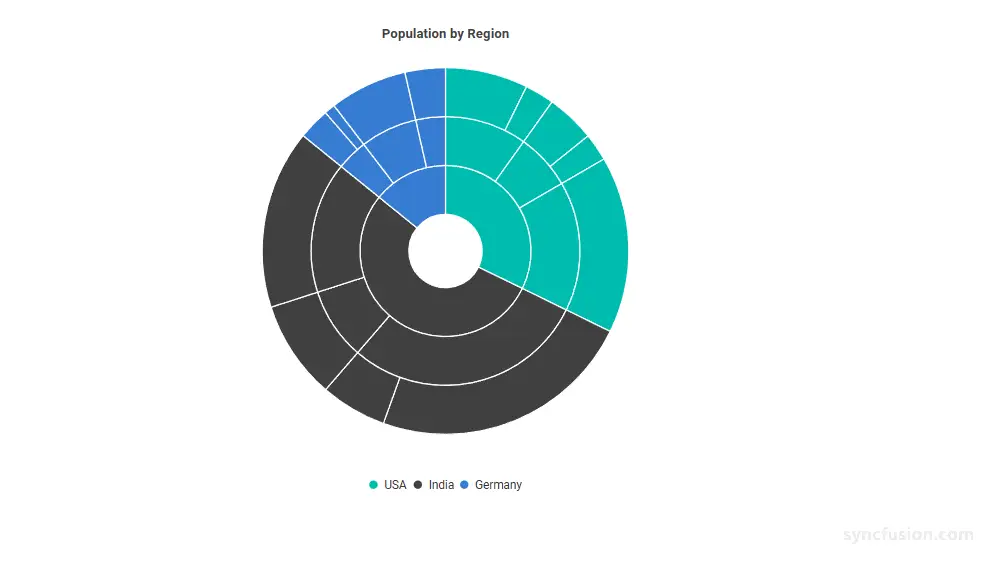
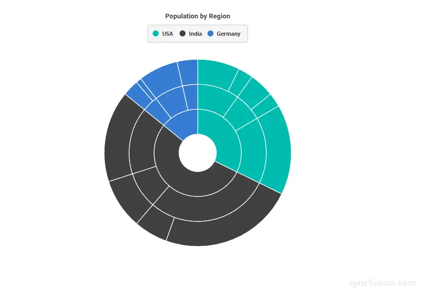

# Blazor Sunburst Chart Legend

The legend provides a visual key for the top-level (root) categories of a `Blazor Sunburst Chart`. It helps users identify what each color in the chart represents, and clicking a legend item can interactively show or hide the related segment group. Legends are recommended whenever the chart contains more than one root category and is being read in a context where quick lookup is important.

The legend of the Blazor Sunburst Chart can be enabled and customized using the `SunburstLegendSettings` child component.

N> **Supported positions:** `SunburstLegendSettings.Position` supports `SunburstLegendPosition.Top`, `Bottom`, `Left`, and `Right`. The default position is `Bottom`.

## Enable the legend

The legend is hidden by default. Set the `Visible` property of `SunburstLegendSettings` to `true` to render it.

```cshtml

@using Syncfusion.Blazor.Charts

<SfSunburstChart TItem="RegionData"
                 Title="Population by Region"
                 DataSource="@Regions"
                 IdMemberPath="@nameof(RegionData.Id)"
                 ParentIdMemberPath="@nameof(RegionData.ParentId)"
                 LabelMemberPath="@nameof(RegionData.Label)"
                 ValueMemberPath="@nameof(RegionData.Population)"
                 Width="100%" Height="600px">
    <SunburstLegendSettings Visible="true" Position="SunburstLegendPosition.Bottom" ToggleVisibility="true" />
</SfSunburstChart>

@code {
    public class RegionData
    {
        public string Id { get; set; } = string.Empty;
        public string? ParentId { get; set; }
        public string Label { get; set; } = string.Empty;
        public double Population { get; set; }
    }

    public List<RegionData> Regions = new List<RegionData>
    {
        new RegionData { Id = "USA", ParentId = null, Label = "USA" },
        new RegionData { Id = "India", ParentId = null, Label = "India" },
        new RegionData { Id = "Germany", ParentId = null, Label = "Germany" },

        new RegionData { Id = "USA-California", ParentId = "USA", Label = "California" },
        new RegionData { Id = "USA-Texas", ParentId = "USA", Label = "Texas" },
        new RegionData { Id = "USA-NewYork", ParentId = "USA", Label = "New York" },

        new RegionData { Id = "India-Maharashtra", ParentId = "India", Label = "Maharashtra" },
        new RegionData { Id = "India-TamilNadu", ParentId = "India", Label = "Tamil Nadu" },
        new RegionData { Id = "India-Karnataka", ParentId = "India", Label = "Karnataka" },

        new RegionData { Id = "Germany-Bavaria", ParentId = "Germany", Label = "Bavaria" },
        new RegionData { Id = "Germany-Berlin", ParentId = "Germany", Label = "Berlin" },
        new RegionData { Id = "Germany-Hamburg", ParentId = "Germany", Label = "Hamburg" },

        new RegionData { Id = "USA-California-LosAngeles", ParentId = "USA-California", Label = "Los Angeles", Population = 3898000 },
        new RegionData { Id = "USA-California-SanDiego", ParentId = "USA-California", Label = "San Diego", Population = 1381000 },
        new RegionData { Id = "USA-Texas-Houston", ParentId = "USA-Texas", Label = "Houston", Population = 2304000 },
        new RegionData { Id = "USA-Texas-Dallas", ParentId = "USA-Texas", Label = "Dallas", Population = 1304000 },
        new RegionData { Id = "USA-NewYork-NewYorkCity", ParentId = "USA-NewYork", Label = "New York City", Population = 8336000},

        new RegionData { Id = "India-Maharashtra-Mumbai", ParentId = "India-Maharashtra", Label = "Mumbai", Population = 12440000 },
        new RegionData { Id = "India-Maharashtra-Pune", ParentId = "India-Maharashtra", Label = "Pune", Population = 3120000 },
        new RegionData { Id = "India-TamilNadu-Chennai", ParentId = "India-TamilNadu", Label = "Chennai", Population = 4646000 },
        new RegionData { Id = "India-Karnataka-Bengaluru", ParentId = "India-Karnataka", Label = "Bengaluru", Population = 8443000 },

        new RegionData { Id = "Germany-Bavaria-Munich", ParentId = "Germany-Bavaria", Label = "Munich", Population = 1488000 },
        new RegionData { Id = "Germany-Bavaria-Nuremberg", ParentId = "Germany-Bavaria", Label = "Nuremberg", Population = 515000 },
        new RegionData { Id = "Germany-Berlin-BerlinCity", ParentId = "Germany-Berlin", Label = "Berlin", Population = 3664000 },
        new RegionData { Id = "Germany-Hamburg-HamburgCity", ParentId = "Germany-Hamburg", Label = "Hamburg", Population = 1899000 }
    };
}

```

<!-- TODO: Add Blazor Playground sample after release -->


## Customization

You can customize the appearance of the legend using the following properties.

### SunburstLegendSettings Properties

Configure the main legend appearance:

In the `SunburstLegendSettings`:
* `Visible`: Enables or disables the display of the legend. Set to `true` to render the legend for the Blazor Sunburst Chart.
* `Position`: Specifies the position of the legend in the Sunburst chart. Use the `SunburstLegendPosition` enum (`Top`, `Bottom`, `Left`, or `Right`). The default value is `Bottom`.
* `Background`: Specifies the background color of the legend container. Any valid CSS color value (for example a hex value like `#F5F5F5` or the named value `lightblue`) is accepted.
* `Opacity`: Specifies the transparency of the legend container. The accepted range is `0` to `1`, where `0` is fully transparent and `1` is fully opaque. For example, set `Opacity="0.8"` for 80% opacity.
* `ShapeWidth`: Specifies the width of the marker drawn beside each legend item, in pixels.
* `ShapeHeight`: Specifies the height of the marker drawn beside each legend item, in pixels.
* `ItemPadding`: Specifies the spacing between adjacent legend items, in pixels.
* `ToggleVisibility`: When `true`, clicking a legend item toggles the visibility of its corresponding root-level segment group in the chart. Set to `false` to render an entirely non-interactive legend. The default value is `true`.
* `Focusable`: Specifies whether legend items can receive keyboard focus. The default value is `true`.

In the `SunburstLegendTextStyle`:
* `FontSize`: Specifies the font size of the legend text, in pixels (for example `"14px"`). When unset, the value falls back to the active Syncfusion theme.
* `FontFamily`: Specifies the font family of the legend text. Multiple families can be specified as a comma-separated list.
* `FontWeight`: Specifies the font weight of the legend text. Valid values include `Normal`, `Bold`, `Bolder`, `Lighter`, and numeric values such as `400`, `500`, and `700`. When unset, the value falls back to the active theme.
* `FontStyle`: Specifies the font style of the legend text. Valid values include `Normal`, `Italic`, and `Oblique`. When unset, the value falls back to the active theme.
* `Color`: Specifies the color of the legend text. Any valid CSS color value is accepted. When unset, the value falls back to the active theme.
* `Opacity`: Specifies the transparency of the legend text. The accepted range is `0` to `1`.

In the `SunburstLegendBorder`:
* `Color`: Specifies the color of the border drawn around the legend container. Any valid CSS color value is accepted.
* `Width`: Specifies the width of the border around the legend container, in pixels. The border is only rendered when `Width` is greater than `0`.

```cshtml

@using Syncfusion.Blazor.Charts

<SfSunburstChart TItem="RegionData"
                 Title="Population by Region"
                 DataSource="@Regions"
                 IdMemberPath="@nameof(RegionData.Id)"
                 ParentIdMemberPath="@nameof(RegionData.ParentId)"
                 LabelMemberPath="@nameof(RegionData.Label)"
                 ValueMemberPath="@nameof(RegionData.Population)"
                 Width="100%" Height="600px">
    <SunburstLegendSettings Visible="true"
                            Position="SunburstLegendPosition.Top"
                            Background="#F5F5F5"
                            Opacity="0.95"
                            ShapeWidth="14"
                            ShapeHeight="14"
                            ItemPadding="12"
                            ToggleVisibility="true">
        <SunburstLegendBorder Color="#BDBDBD" Width="1" />
        <SunburstLegendTextStyle FontSize="13px"
                                 FontFamily="Segoe UI"
                                 FontWeight="Bold"
                                 FontStyle="Normal"
                                 Color="#424242"
                                 Opacity="1" />
    </SunburstLegendSettings>
</SfSunburstChart>

@code {
    public class RegionData
    {
        public string Id { get; set; } = string.Empty;
        public string? ParentId { get; set; }
        public string Label { get; set; } = string.Empty;
        public double Population { get; set; }
    }

    public List<RegionData> Regions = new List<RegionData>
    {
        new RegionData { Id = "USA", ParentId = null, Label = "USA" },
        new RegionData { Id = "India", ParentId = null, Label = "India" },
        new RegionData { Id = "Germany", ParentId = null, Label = "Germany" },

        new RegionData { Id = "USA-California", ParentId = "USA", Label = "California" },
        new RegionData { Id = "USA-Texas", ParentId = "USA", Label = "Texas" },
        new RegionData { Id = "USA-NewYork", ParentId = "USA", Label = "New York" },

        new RegionData { Id = "India-Maharashtra", ParentId = "India", Label = "Maharashtra" },
        new RegionData { Id = "India-TamilNadu", ParentId = "India", Label = "Tamil Nadu" },
        new RegionData { Id = "India-Karnataka", ParentId = "India", Label = "Karnataka" },

        new RegionData { Id = "Germany-Bavaria", ParentId = "Germany", Label = "Bavaria" },
        new RegionData { Id = "Germany-Berlin", ParentId = "Germany", Label = "Berlin" },
        new RegionData { Id = "Germany-Hamburg", ParentId = "Germany", Label = "Hamburg" },

        new RegionData { Id = "USA-California-LosAngeles", ParentId = "USA-California", Label = "Los Angeles", Population = 3898000 },
        new RegionData { Id = "USA-California-SanDiego", ParentId = "USA-California", Label = "San Diego", Population = 1381000 },
        new RegionData { Id = "USA-Texas-Houston", ParentId = "USA-Texas", Label = "Houston", Population = 2304000 },
        new RegionData { Id = "USA-Texas-Dallas", ParentId = "USA-Texas", Label = "Dallas", Population = 1304000 },
        new RegionData { Id = "USA-NewYork-NewYorkCity", ParentId = "USA-NewYork", Label = "New York City", Population = 8336000},

        new RegionData { Id = "India-Maharashtra-Mumbai", ParentId = "India-Maharashtra", Label = "Mumbai", Population = 12440000 },
        new RegionData { Id = "India-Maharashtra-Pune", ParentId = "India-Maharashtra", Label = "Pune", Population = 3120000 },
        new RegionData { Id = "India-TamilNadu-Chennai", ParentId = "India-TamilNadu", Label = "Chennai", Population = 4646000 },
        new RegionData { Id = "India-Karnataka-Bengaluru", ParentId = "India-Karnataka", Label = "Bengaluru", Population = 8443000 },

        new RegionData { Id = "Germany-Bavaria-Munich", ParentId = "Germany-Bavaria", Label = "Munich", Population = 1488000 },
        new RegionData { Id = "Germany-Bavaria-Nuremberg", ParentId = "Germany-Bavaria", Label = "Nuremberg", Population = 515000 },
        new RegionData { Id = "Germany-Berlin-BerlinCity", ParentId = "Germany-Berlin", Label = "Berlin", Population = 3664000 },
        new RegionData { Id = "Germany-Hamburg-HamburgCity", ParentId = "Germany-Hamburg", Label = "Hamburg", Population = 1899000 }
    };
}

```

<!-- TODO: Add Blazor Playground sample after release -->


## Toggle segment visibility from the legend

When `ToggleVisibility` is `true`, selecting a legend item hides or restores its corresponding hierarchy branch and descendants. The chart recalculates the visible layout based on the remaining visible branches.

Specifies whether selecting a legend item hides or restores its corresponding hierarchy branch.

```cshtml

<SfSunburstChart TItem="RegionData"
                 Title="Population by Region"
                 DataSource="@Regions"
                 IdMemberPath="@nameof(RegionData.Id)"
                 ParentIdMemberPath="@nameof(RegionData.ParentId)"
                 LabelMemberPath="@nameof(RegionData.Label)"
                 ValueMemberPath="@nameof(RegionData.Population)"
                 Width="100%" Height="600px">
    <SunburstLegendSettings Visible="true"
                            Position="SunburstLegendPosition.Right"
                            ToggleVisibility="true" />
</SfSunburstChart>

```

## See also

* [Data Label](./data-label)
* [Tooltip](./tooltip)
* [Selection](./selection)
