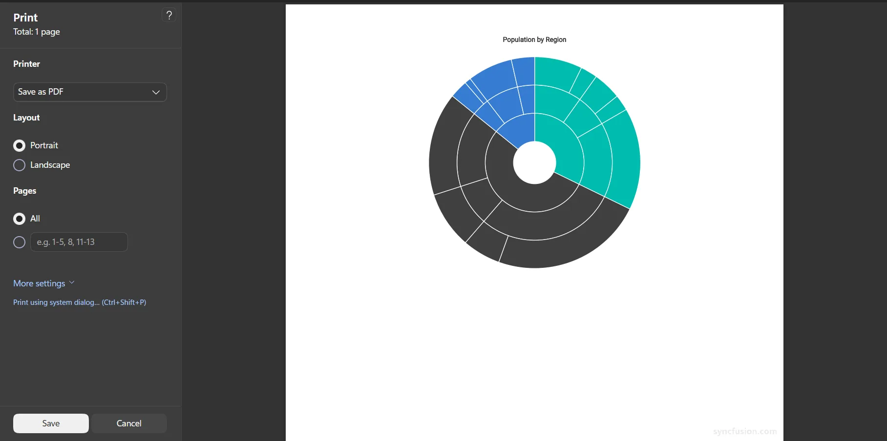

# Blazor Sunburst Chart Print and Export

The print and export features capture the rendered `Blazor Sunburst Chart` so it can be shared, archived, or embedded in reports and presentations. Printing sends the current chart to the browser print dialog, while exporting generates a file in a chosen format without altering the live chart state.

The Blazor Sunburst Chart can be printed and exported using the `PrintAsync` and `ExportAsync` methods of `SfSunburstChart`.

N> **Supported export formats:** `ExportAsync` renders the visual chart to `PNG`, `JPEG`, `SVG`, and `PDF`, and writes the generated hierarchy data to `XLSX` and `CSV`.

## Print

The `PrintAsync` method opens the browser print dialog and lets users print the Sunburst Chart with the current drill state, title, data labels, legend, breadcrumbs, and theme applied. The appearance and availability of the print options are determined by the user's browser and operating system.

```cshtml

@using Syncfusion.Blazor.Charts

<SfSunburstChart TItem="RegionData"
                 Title="Population by Region"
                 DataSource="@Regions"
                 IdMemberPath="@nameof(RegionData.Id)"
                 ParentIdMemberPath="@nameof(RegionData.ParentId)"
                 LabelMemberPath="@nameof(RegionData.Label)"
                 ValueMemberPath="@nameof(RegionData.Population)"
                 @ref="Sunburst"
                 Width="100%" Height="600px">
</SfSunburstChart>

<button class="btn btn-secondary" @onclick="PrintSunburst">Print Sunburst Chart</button>

@code {
    private SfSunburstChart<RegionData>? Sunburst;

    public class RegionData
    {
        public string Id { get; set; } = string.Empty;
        public string? ParentId { get; set; }
        public string Label { get; set; } = string.Empty;
        public double Population { get; set; }
    }

    public List<RegionData> Regions = new List<RegionData>
    {
        new RegionData { Id = "USA", ParentId = null, Label = "USA" },
        new RegionData { Id = "India", ParentId = null, Label = "India" },
        new RegionData { Id = "Germany", ParentId = null, Label = "Germany" },

        new RegionData { Id = "USA-California", ParentId = "USA", Label = "California" },
        new RegionData { Id = "USA-Texas", ParentId = "USA", Label = "Texas" },
        new RegionData { Id = "USA-NewYork", ParentId = "USA", Label = "New York" },

        new RegionData { Id = "India-Maharashtra", ParentId = "India", Label = "Maharashtra" },
        new RegionData { Id = "India-TamilNadu", ParentId = "India", Label = "Tamil Nadu" },
        new RegionData { Id = "India-Karnataka", ParentId = "India", Label = "Karnataka" },

        new RegionData { Id = "Germany-Bavaria", ParentId = "Germany", Label = "Bavaria" },
        new RegionData { Id = "Germany-Berlin", ParentId = "Germany", Label = "Berlin" },
        new RegionData { Id = "Germany-Hamburg", ParentId = "Germany", Label = "Hamburg" },

        new RegionData { Id = "USA-California-LosAngeles", ParentId = "USA-California", Label = "Los Angeles", Population = 3898000 },
        new RegionData { Id = "USA-California-SanDiego", ParentId = "USA-California", Label = "San Diego", Population = 1381000 },
        new RegionData { Id = "USA-Texas-Houston", ParentId = "USA-Texas", Label = "Houston", Population = 2304000 },
        new RegionData { Id = "USA-Texas-Dallas", ParentId = "USA-Texas", Label = "Dallas", Population = 1304000 },
        new RegionData { Id = "USA-NewYork-NewYorkCity", ParentId = "USA-NewYork", Label = "New York City", Population = 8336000 },

        new RegionData { Id = "India-Maharashtra-Mumbai", ParentId = "India-Maharashtra", Label = "Mumbai", Population = 12440000 },
        new RegionData { Id = "India-Maharashtra-Pune", ParentId = "India-Maharashtra", Label = "Pune", Population = 3120000 },
        new RegionData { Id = "India-TamilNadu-Chennai", ParentId = "India-TamilNadu", Label = "Chennai", Population = 4646000 },
        new RegionData { Id = "India-Karnataka-Bengaluru", ParentId = "India-Karnataka", Label = "Bengaluru", Population = 8443000 },

        new RegionData { Id = "Germany-Bavaria-Munich", ParentId = "Germany-Bavaria", Label = "Munich", Population = 1488000 },
        new RegionData { Id = "Germany-Bavaria-Nuremberg", ParentId = "Germany-Bavaria", Label = "Nuremberg", Population = 515000 },
        new RegionData { Id = "Germany-Berlin-BerlinCity", ParentId = "Germany-Berlin", Label = "Berlin", Population = 3664000 },
        new RegionData { Id = "Germany-Hamburg-HamburgCity", ParentId = "Germany-Hamburg", Label = "Hamburg", Population = 1899000 }
    };

    private async Task PrintSunburst()
    {
        await Sunburst!.PrintAsync();
    }
}

```

<!-- TODO: Add Blazor Playground sample after release -->


## Export

The `ExportAsync` method exports the currently rendered Sunburst Chart to the specified file format. It accepts the following parameters:

* `Type` – The export format as an `ExportType` enum value: `PNG`, `JPEG`, `SVG`, `PDF`, `XLSX`, or `CSV`.
* `FileName` – The name of the exported file. The file extension is appended automatically based on the selected format.
* `Orientation` – The page orientation for `PDF` export: `PdfPageOrientation.Portrait` or `PdfPageOrientation.Landscape`. This parameter is ignored for other formats.
* `AllowDownload` – When `true`, the browser downloads the exported file. When `false`, the generated content is returned as a Data URL string instead. The default value is `true`.
* `IsBase64` – When `true` and `AllowDownload` is `false`, the generated content is returned as a Base64 string instead of a Data URL. The default value is `false`.

The following example exports the chart as a `PNG` image.

```cshtml

@using Syncfusion.Blazor.Charts

<SfSunburstChart TItem="RegionData"
                 Title="Population by Region"
                 DataSource="@Regions"
                 IdMemberPath="@nameof(RegionData.Id)"
                 ParentIdMemberPath="@nameof(RegionData.ParentId)"
                 LabelMemberPath="@nameof(RegionData.Label)"
                 ValueMemberPath="@nameof(RegionData.Population)"
                 @ref="Sunburst"
                 Width="100%" Height="600px">
</SfSunburstChart>

<button class="btn btn-secondary" @onclick="ExportSunburst">Export as PNG</button>

@code {
    private SfSunburstChart<RegionData>? Sunburst;

    public class RegionData
    {
        public string Id { get; set; } = string.Empty;
        public string? ParentId { get; set; }
        public string Label { get; set; } = string.Empty;
        public double Population { get; set; }
    }

    public List<RegionData> Regions = new List<RegionData>
    {
        new RegionData { Id = "USA", ParentId = null, Label = "USA" },
        new RegionData { Id = "India", ParentId = null, Label = "India" },
        new RegionData { Id = "Germany", ParentId = null, Label = "Germany" },

        new RegionData { Id = "USA-California", ParentId = "USA", Label = "California" },
        new RegionData { Id = "USA-Texas", ParentId = "USA", Label = "Texas" },
        new RegionData { Id = "USA-NewYork", ParentId = "USA", Label = "New York" },

        new RegionData { Id = "India-Maharashtra", ParentId = "India", Label = "Maharashtra" },
        new RegionData { Id = "India-TamilNadu", ParentId = "India", Label = "Tamil Nadu" },
        new RegionData { Id = "India-Karnataka", ParentId = "India", Label = "Karnataka" },

        new RegionData { Id = "Germany-Bavaria", ParentId = "Germany", Label = "Bavaria" },
        new RegionData { Id = "Germany-Berlin", ParentId = "Germany", Label = "Berlin" },
        new RegionData { Id = "Germany-Hamburg", ParentId = "Germany", Label = "Hamburg" },

        new RegionData { Id = "USA-California-LosAngeles", ParentId = "USA-California", Label = "Los Angeles", Population = 3898000 },
        new RegionData { Id = "USA-California-SanDiego", ParentId = "USA-California", Label = "San Diego", Population = 1381000 },
        new RegionData { Id = "USA-Texas-Houston", ParentId = "USA-Texas", Label = "Houston", Population = 2304000 },
        new RegionData { Id = "USA-Texas-Dallas", ParentId = "USA-Texas", Label = "Dallas", Population = 1304000 },
        new RegionData { Id = "USA-NewYork-NewYorkCity", ParentId = "USA-NewYork", Label = "New York City", Population = 8336000 },

        new RegionData { Id = "India-Maharashtra-Mumbai", ParentId = "India-Maharashtra", Label = "Mumbai", Population = 12440000 },
        new RegionData { Id = "India-Maharashtra-Pune", ParentId = "India-Maharashtra", Label = "Pune", Population = 3120000 },
        new RegionData { Id = "India-TamilNadu-Chennai", ParentId = "India-TamilNadu", Label = "Chennai", Population = 4646000 },
        new RegionData { Id = "India-Karnataka-Bengaluru", ParentId = "India-Karnataka", Label = "Bengaluru", Population = 8443000 },

        new RegionData { Id = "Germany-Bavaria-Munich", ParentId = "Germany-Bavaria", Label = "Munich", Population = 1488000 },
        new RegionData { Id = "Germany-Bavaria-Nuremberg", ParentId = "Germany-Bavaria", Label = "Nuremberg", Population = 515000 },
        new RegionData { Id = "Germany-Berlin-BerlinCity", ParentId = "Germany-Berlin", Label = "Berlin", Population = 3664000 },
        new RegionData { Id = "Germany-Hamburg-HamburgCity", ParentId = "Germany-Hamburg", Label = "Hamburg", Population = 1899000 }
    };

    private async Task ExportSunburst()
    {
        await Sunburst!.ExportAsync(ExportType.PNG, "SunburstChart");
    }
}

```

<!-- TODO: Add Blazor Playground sample after release -->

### Export to PDF with page orientation

The `PDF` export supports page orientation through the `Orientation` parameter. Set `PdfPageOrientation.Landscape` or `PdfPageOrientation.Portrait` to control the layout of the exported page. The `Orientation` parameter requires the `Syncfusion.PdfExport` namespace.

```cshtml

@using Syncfusion.Blazor.Charts
@using Syncfusion.PdfExport

<SfSunburstChart TItem="RegionData"
                 Title="Population by Region"
                 DataSource="@Regions"
                 IdMemberPath="@nameof(RegionData.Id)"
                 ParentIdMemberPath="@nameof(RegionData.ParentId)"
                 LabelMemberPath="@nameof(RegionData.Label)"
                 ValueMemberPath="@nameof(RegionData.Population)"
                 @ref="Sunburst"
                 Width="100%" Height="600px">
</SfSunburstChart>

<button class="btn btn-secondary" @onclick="ExportPdf">Export as PDF</button>

@code {
    private SfSunburstChart<RegionData>? Sunburst;

    public class RegionData
    {
        public string Id { get; set; } = string.Empty;
        public string? ParentId { get; set; }
        public string Label { get; set; } = string.Empty;
        public double Population { get; set; }
    }

    public List<RegionData> Regions = new List<RegionData>
    {
        new RegionData { Id = "USA", ParentId = null, Label = "USA" },
        new RegionData { Id = "India", ParentId = null, Label = "India" },
        new RegionData { Id = "Germany", ParentId = null, Label = "Germany" },

        new RegionData { Id = "USA-California", ParentId = "USA", Label = "California" },
        new RegionData { Id = "USA-Texas", ParentId = "USA", Label = "Texas" },
        new RegionData { Id = "USA-NewYork", ParentId = "USA", Label = "New York" },

        new RegionData { Id = "India-Maharashtra", ParentId = "India", Label = "Maharashtra" },
        new RegionData { Id = "India-TamilNadu", ParentId = "India", Label = "Tamil Nadu" },
        new RegionData { Id = "India-Karnataka", ParentId = "India", Label = "Karnataka" },

        new RegionData { Id = "Germany-Bavaria", ParentId = "Germany", Label = "Bavaria" },
        new RegionData { Id = "Germany-Berlin", ParentId = "Germany", Label = "Berlin" },
        new RegionData { Id = "Germany-Hamburg", ParentId = "Germany", Label = "Hamburg" },

        new RegionData { Id = "USA-California-LosAngeles", ParentId = "USA-California", Label = "Los Angeles", Population = 3898000 },
        new RegionData { Id = "USA-California-SanDiego", ParentId = "USA-California", Label = "San Diego", Population = 1381000 },
        new RegionData { Id = "USA-Texas-Houston", ParentId = "USA-Texas", Label = "Houston", Population = 2304000 },
        new RegionData { Id = "USA-Texas-Dallas", ParentId = "USA-Texas", Label = "Dallas", Population = 1304000 },
        new RegionData { Id = "USA-NewYork-NewYorkCity", ParentId = "USA-NewYork", Label = "New York City", Population = 8336000 },

        new RegionData { Id = "India-Maharashtra-Mumbai", ParentId = "India-Maharashtra", Label = "Mumbai", Population = 12440000 },
        new RegionData { Id = "India-Maharashtra-Pune", ParentId = "India-Maharashtra", Label = "Pune", Population = 3120000 },
        new RegionData { Id = "India-TamilNadu-Chennai", ParentId = "India-TamilNadu", Label = "Chennai", Population = 4646000 },
        new RegionData { Id = "India-Karnataka-Bengaluru", ParentId = "India-Karnataka", Label = "Bengaluru", Population = 8443000 },

        new RegionData { Id = "Germany-Bavaria-Munich", ParentId = "Germany-Bavaria", Label = "Munich", Population = 1488000 },
        new RegionData { Id = "Germany-Bavaria-Nuremberg", ParentId = "Germany-Bavaria", Label = "Nuremberg", Population = 515000 },
        new RegionData { Id = "Germany-Berlin-BerlinCity", ParentId = "Germany-Berlin", Label = "Berlin", Population = 3664000 },
        new RegionData { Id = "Germany-Hamburg-HamburgCity", ParentId = "Germany-Hamburg", Label = "Hamburg", Population = 1899000 }
    };

    private async Task ExportPdf()
    {
        await Sunburst!.ExportAsync(ExportType.PDF, "SunburstChart", PdfPageOrientation.Landscape);
    }
}

```

<!-- TODO: Add Blazor Playground sample after release -->

## Export the hierarchy data as XLSX or CSV

The Blazor Sunburst Chart supports exporting not only the rendered chart, but also the generated hierarchical data. Passing `ExportType.XLSX` or `ExportType.CSV` to the `ExportAsync` method writes a parent-first flattened representation of the hierarchy with `Id`, `ParentId`, `Label`, and `Value` columns. This is useful when the underlying data needs to be shared for further analysis in a spreadsheet.

```cshtml

@using Syncfusion.Blazor.Charts

<SfSunburstChart TItem="RegionData"
                 Title="Population by Region"
                 DataSource="@Regions"
                 IdMemberPath="@nameof(RegionData.Id)"
                 ParentIdMemberPath="@nameof(RegionData.ParentId)"
                 LabelMemberPath="@nameof(RegionData.Label)"
                 ValueMemberPath="@nameof(RegionData.Population)"
                 @ref="Sunburst"
                 Width="100%" Height="600px">
</SfSunburstChart>

<button class="btn btn-secondary" @onclick="ExportHierarchy">Export hierarchy as XLSX</button>

@code {
    private SfSunburstChart<RegionData>? Sunburst;

    public class RegionData
    {
        public string Id { get; set; } = string.Empty;
        public string? ParentId { get; set; }
        public string Label { get; set; } = string.Empty;
        public double Population { get; set; }
    }

    public List<RegionData> Regions = new List<RegionData>
    {
        new RegionData { Id = "USA", ParentId = null, Label = "USA" },
        new RegionData { Id = "India", ParentId = null, Label = "India" },
        new RegionData { Id = "Germany", ParentId = null, Label = "Germany" },

        new RegionData { Id = "USA-California", ParentId = "USA", Label = "California" },
        new RegionData { Id = "USA-Texas", ParentId = "USA", Label = "Texas" },
        new RegionData { Id = "USA-NewYork", ParentId = "USA", Label = "New York" },

        new RegionData { Id = "India-Maharashtra", ParentId = "India", Label = "Maharashtra" },
        new RegionData { Id = "India-TamilNadu", ParentId = "India", Label = "Tamil Nadu" },
        new RegionData { Id = "India-Karnataka", ParentId = "India", Label = "Karnataka" },

        new RegionData { Id = "Germany-Bavaria", ParentId = "Germany", Label = "Bavaria" },
        new RegionData { Id = "Germany-Berlin", ParentId = "Germany", Label = "Berlin" },
        new RegionData { Id = "Germany-Hamburg", ParentId = "Germany", Label = "Hamburg" },

        new RegionData { Id = "USA-California-LosAngeles", ParentId = "USA-California", Label = "Los Angeles", Population = 3898000 },
        new RegionData { Id = "USA-California-SanDiego", ParentId = "USA-California", Label = "San Diego", Population = 1381000 },
        new RegionData { Id = "USA-Texas-Houston", ParentId = "USA-Texas", Label = "Houston", Population = 2304000 },
        new RegionData { Id = "USA-Texas-Dallas", ParentId = "USA-Texas", Label = "Dallas", Population = 1304000 },
        new RegionData { Id = "USA-NewYork-NewYorkCity", ParentId = "USA-NewYork", Label = "New York City", Population = 8336000 },

        new RegionData { Id = "India-Maharashtra-Mumbai", ParentId = "India-Maharashtra", Label = "Mumbai", Population = 12440000 },
        new RegionData { Id = "India-Maharashtra-Pune", ParentId = "India-Maharashtra", Label = "Pune", Population = 3120000 },
        new RegionData { Id = "India-TamilNadu-Chennai", ParentId = "India-TamilNadu", Label = "Chennai", Population = 4646000 },
        new RegionData { Id = "India-Karnataka-Bengaluru", ParentId = "India-Karnataka", Label = "Bengaluru", Population = 8443000 },

        new RegionData { Id = "Germany-Bavaria-Munich", ParentId = "Germany-Bavaria", Label = "Munich", Population = 1488000 },
        new RegionData { Id = "Germany-Bavaria-Nuremberg", ParentId = "Germany-Bavaria", Label = "Nuremberg", Population = 515000 },
        new RegionData { Id = "Germany-Berlin-BerlinCity", ParentId = "Germany-Berlin", Label = "Berlin", Population = 3664000 },
        new RegionData { Id = "Germany-Hamburg-HamburgCity", ParentId = "Germany-Hamburg", Label = "Hamburg", Population = 1899000 }
    };

    private async Task ExportHierarchy()
    {
        await Sunburst!.ExportAsync(ExportType.XLSX, "SunburstHierarchy");
    }
}

```

<!-- TODO: Add Blazor Playground sample after release -->

N> You can customize or cancel an export through the `Exporting` event and get notified when the print or export workflow finishes through the `PrintCompleted` and `ExportCompleted` events. For details and code examples, see the [PrintCompleted and exporting hooks](./events#printcompleted-and-exporting-hooks) section of the Events page.

## See also

* [Events](./events)
* [Legend](./legend)
* [Data Label](./data-label)
* [Selection](./selection)
* [Tooltip](./tooltip)
