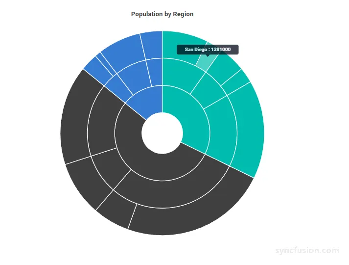
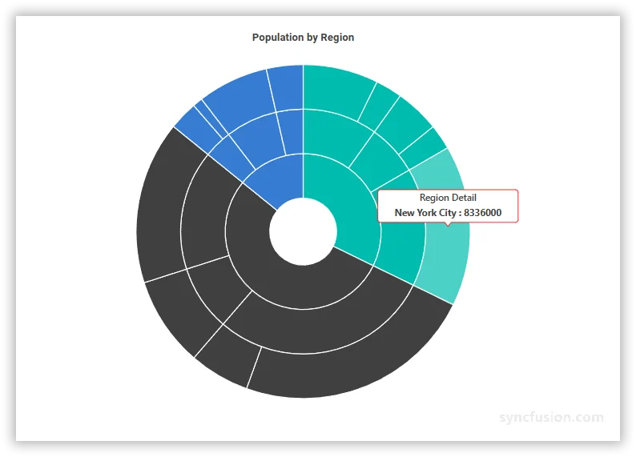

# Blazor Sunburst Chart Tooltip

The tooltip on the `Blazor Sunburst Chart` displays additional information about a segment when users hover over or tap on it. It is most useful when the chart contains many small segments where data labels cannot fit, or when users need to inspect specific values such as the category name and the segment value.

The tooltip of the `Blazor Sunburst Chart` can be enabled and customized using the `SunburstTooltipSettings` child component.

N> By default, the tooltip shows the segment label and its value in the format `${point.label} : ${point.value}`.

## Enable the tooltip

Set the `Enable` property of `SunburstTooltipSettings` to `true` to display a tooltip when users interact with a Sunburst segment.

```cshtml

@using Syncfusion.Blazor.Charts

<SfSunburstChart TItem="RegionData"
                 Title="Population by Region"
                 DataSource="@Regions"
                 IdMemberPath="@nameof(RegionData.Id)"
                 ParentIdMemberPath="@nameof(RegionData.ParentId)"
                 LabelMemberPath="@nameof(RegionData.Label)"
                 ValueMemberPath="@nameof(RegionData.Population)"
                 Width="100%" Height="600px">
    <SunburstTooltipSettings Enable="true" />
</SfSunburstChart>

@code {
    public class RegionData
    {
        public string Id { get; set; } = string.Empty;
        public string? ParentId { get; set; }
        public string Label { get; set; } = string.Empty;
        public double Population { get; set; }
    }

    public List<RegionData> Regions = new List<RegionData>
    {
        new RegionData { Id = "USA", ParentId = null, Label = "USA" },
        new RegionData { Id = "India", ParentId = null, Label = "India" },
        new RegionData { Id = "Germany", ParentId = null, Label = "Germany" },

        new RegionData { Id = "USA-California", ParentId = "USA", Label = "California" },
        new RegionData { Id = "USA-Texas", ParentId = "USA", Label = "Texas" },
        new RegionData { Id = "USA-NewYork", ParentId = "USA", Label = "New York" },

        new RegionData { Id = "India-Maharashtra", ParentId = "India", Label = "Maharashtra" },
        new RegionData { Id = "India-TamilNadu", ParentId = "India", Label = "Tamil Nadu" },
        new RegionData { Id = "India-Karnataka", ParentId = "India", Label = "Karnataka" },

        new RegionData { Id = "Germany-Bavaria", ParentId = "Germany", Label = "Bavaria" },
        new RegionData { Id = "Germany-Berlin", ParentId = "Germany", Label = "Berlin" },
        new RegionData { Id = "Germany-Hamburg", ParentId = "Germany", Label = "Hamburg" },

        new RegionData { Id = "USA-California-LosAngeles", ParentId = "USA-California", Label = "Los Angeles", Population = 3898000 },
        new RegionData { Id = "USA-California-SanDiego", ParentId = "USA-California", Label = "San Diego", Population = 1381000 },
        new RegionData { Id = "USA-Texas-Houston", ParentId = "USA-Texas", Label = "Houston", Population = 2304000 },
        new RegionData { Id = "USA-Texas-Dallas", ParentId = "USA-Texas", Label = "Dallas", Population = 1304000 },
        new RegionData { Id = "USA-NewYork-NewYorkCity", ParentId = "USA-NewYork", Label = "New York City", Population = 8336000 },

        new RegionData { Id = "India-Maharashtra-Mumbai", ParentId = "India-Maharashtra", Label = "Mumbai", Population = 12440000 },
        new RegionData { Id = "India-Maharashtra-Pune", ParentId = "India-Maharashtra", Label = "Pune", Population = 3120000 },
        new RegionData { Id = "India-TamilNadu-Chennai", ParentId = "India-TamilNadu", Label = "Chennai", Population = 4646000 },
        new RegionData { Id = "India-Karnataka-Bengaluru", ParentId = "India-Karnataka", Label = "Bengaluru", Population = 8443000 },

        new RegionData { Id = "Germany-Bavaria-Munich", ParentId = "Germany-Bavaria", Label = "Munich", Population = 1488000 },
        new RegionData { Id = "Germany-Bavaria-Nuremberg", ParentId = "Germany-Bavaria", Label = "Nuremberg", Population = 515000 },
        new RegionData { Id = "Germany-Berlin-BerlinCity", ParentId = "Germany-Berlin", Label = "Berlin", Population = 3664000 },
        new RegionData { Id = "Germany-Hamburg-HamburgCity", ParentId = "Germany-Hamburg", Label = "Hamburg", Population = 1899000 }
    };
}

```

<!-- TODO: Add Blazor Playground sample after release -->


## Customization

You can customize the tooltip appearance using the following properties.

### SunburstTooltipSettings properties

In the `SunburstTooltipSettings`:
* `Enable`: Enables or disables the tooltip. Set to `true` to display a tooltip on hover or tap. The default value is `false`.
* `Format`: Defines the tooltip text using placeholders such as `${point.label}` and `${point.value}`. The default value is `${point.label} : ${point.value}`.
* `HeaderText`: Sets a custom header that appears above the tooltip content. When set, the header is shown for every tooltip. Default value is empty.
* `EnableHighlight`: When `true`, the segment associated with the active tooltip is visually emphasized. The default value is `true`. Set to `false` if you only want the tooltip without highlighting the segment.
* `ShowHeaderLine`: When `true`, a separator line is rendered between the tooltip header and content. The default value is `true`.
* `Opacity`: Sets the tooltip transparency, from `0` (fully transparent) to `1` (fully opaque). The default value is `0.75`.
* `Fill`: Sets the tooltip background color using any valid CSS color value. Falls back to the active theme if unset.

In the `SunburstTooltipTextStyle`:
* `FontSize`: Sets the tooltip text size in pixels (for example `"14px"`). Falls back to the active theme if unset.
* `FontFamily`: Sets the tooltip text font family. Multiple families can be specified as a comma-separated list.
* `FontWeight`: Sets the tooltip text thickness. Use values like `Normal`, `Bold`, `Bolder`, `Lighter`, or numeric values such as `400`, `500`, `700`. Falls back to the active theme if unset.
* `FontStyle`: Sets the tooltip text style. Use `Normal`, `Italic`, or `Oblique`. Falls back to the active theme if unset.
* `Color`: Sets the tooltip text color using any valid CSS color value. Falls back to the active theme if unset.

In the `SunburstTooltipBorder`:
* `Color`: Sets the color of the border drawn around the tooltip. Any valid CSS color value is accepted. The border is only rendered when `Width` is greater than `0`. The default value is `transparent`.
* `Width`: Sets the border width in pixels. Set to `0` to hide the tooltip border. The default value is `0`.

```cshtml

@using Syncfusion.Blazor.Charts

<SfSunburstChart TItem="RegionData"
                 Title="Population by Region"
                 DataSource="@Regions"
                 IdMemberPath="@nameof(RegionData.Id)"
                 ParentIdMemberPath="@nameof(RegionData.ParentId)"
                 LabelMemberPath="@nameof(RegionData.Label)"
                 ValueMemberPath="@nameof(RegionData.Population)"
                 Width="100%" Height="600px">
    <SunburstTooltipSettings Enable="true"
                             Format="${point.label} : ${point.value}"
                             HeaderText="Region Detail"
                             EnableHighlight="true"
                             ShowHeaderLine="true"
                             Opacity="1"
                             Fill="#FFFFFF">
        <SunburstTooltipTextStyle FontSize="14px"
                                  FontFamily="Segoe UI"
                                  FontWeight="Bold"
                                  FontStyle="Normal"
                                  Color="#424242" />
        <SunburstTooltipBorder Color="#BDBDBD" Width="1" />
    </SunburstTooltipSettings>
</SfSunburstChart>

@code {
    public class RegionData
    {
        public string Id { get; set; } = string.Empty;
        public string? ParentId { get; set; }
        public string Label { get; set; } = string.Empty;
        public double Population { get; set; }
    }

    public List<RegionData> Regions = new List<RegionData>
    {
        new RegionData { Id = "USA", ParentId = null, Label = "USA" },
        new RegionData { Id = "India", ParentId = null, Label = "India" },
        new RegionData { Id = "Germany", ParentId = null, Label = "Germany" },

        new RegionData { Id = "USA-California", ParentId = "USA", Label = "California" },
        new RegionData { Id = "USA-Texas", ParentId = "USA", Label = "Texas" },
        new RegionData { Id = "USA-NewYork", ParentId = "USA", Label = "New York" },

        new RegionData { Id = "India-Maharashtra", ParentId = "India", Label = "Maharashtra" },
        new RegionData { Id = "India-TamilNadu", ParentId = "India", Label = "Tamil Nadu" },
        new RegionData { Id = "India-Karnataka", ParentId = "India", Label = "Karnataka" },

        new RegionData { Id = "Germany-Bavaria", ParentId = "Germany", Label = "Bavaria" },
        new RegionData { Id = "Germany-Berlin", ParentId = "Germany", Label = "Berlin" },
        new RegionData { Id = "Germany-Hamburg", ParentId = "Germany", Label = "Hamburg" },

        new RegionData { Id = "USA-California-LosAngeles", ParentId = "USA-California", Label = "Los Angeles", Population = 3898000 },
        new RegionData { Id = "USA-California-SanDiego", ParentId = "USA-California", Label = "San Diego", Population = 1381000 },
        new RegionData { Id = "USA-Texas-Houston", ParentId = "USA-Texas", Label = "Houston", Population = 2304000 },
        new RegionData { Id = "USA-Texas-Dallas", ParentId = "USA-Texas", Label = "Dallas", Population = 1304000 },
        new RegionData { Id = "USA-NewYork-NewYorkCity", ParentId = "USA-NewYork", Label = "New York City", Population = 8336000 },

        new RegionData { Id = "India-Maharashtra-Mumbai", ParentId = "India-Maharashtra", Label = "Mumbai", Population = 12440000 },
        new RegionData { Id = "India-Maharashtra-Pune", ParentId = "India-Maharashtra", Label = "Pune", Population = 3120000 },
        new RegionData { Id = "India-TamilNadu-Chennai", ParentId = "India-TamilNadu", Label = "Chennai", Population = 4646000 },
        new RegionData { Id = "India-Karnataka-Bengaluru", ParentId = "India-Karnataka", Label = "Bengaluru", Population = 8443000 },

        new RegionData { Id = "Germany-Bavaria-Munich", ParentId = "Germany-Bavaria", Label = "Munich", Population = 1488000 },
        new RegionData { Id = "Germany-Bavaria-Nuremberg", ParentId = "Germany-Bavaria", Label = "Nuremberg", Population = 515000 },
        new RegionData { Id = "Germany-Berlin-BerlinCity", ParentId = "Germany-Berlin", Label = "Berlin", Population = 3664000 },
        new RegionData { Id = "Germany-Hamburg-HamburgCity", ParentId = "Germany-Hamburg", Label = "Hamburg", Population = 1899000 }
    };
}

```

<!-- TODO: Add Blazor Playground sample after release -->


N> The default `${point.label} : ${point.value}` format matches the tooltip content shown in the image above (for example, `USA : 530`). Use the `Format` property to change the order, include prefixes or units, or add additional placeholders.

## See also

* [Data Label](./data-label)
* [Legend](./legend)
* [Selection](./selection)