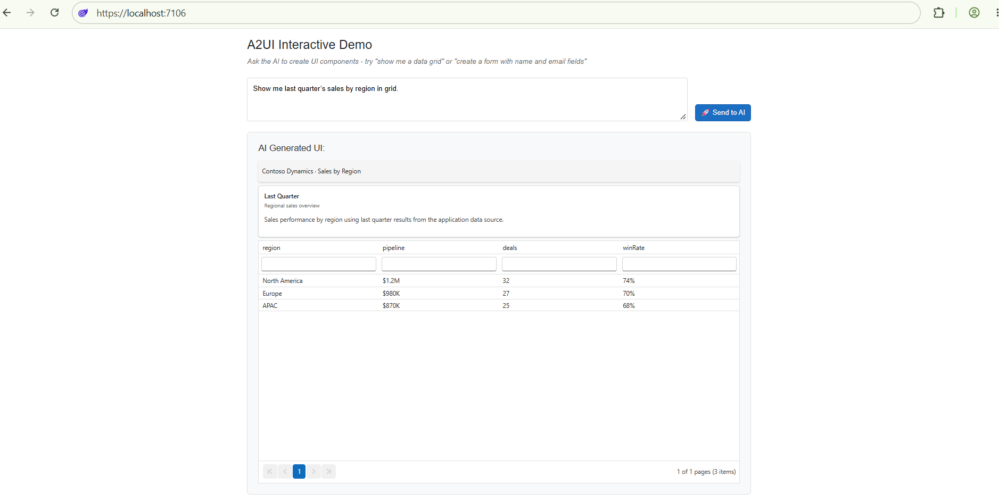

# AI Integration with Syncfusion A2UI

This page shows the production wiring between a Syncfusion A2UI Blazor host and a remote [A2UI v0.9](https://a2ui.org/specification/v0.9-a2ui/) agent that speaks [JSON-RPC 2.0](https://www.jsonrpc.org/specification) over HTTP. The [Getting Started](./getting-started) page showed how to render a Syncfusion surface from a static A2UI v0.9 message list. This page covers the next step: connecting your Blazor app to a remote, A2UI-compatible agent so the agent's responses drive the surface in real time, and the user's interactions inside the surface are forwarded back to the agent.

<!-- Both packages are at 0.1.0-beta.0 during preview. Update the versions once they ship stable. -->
N> Syncfusion A2UI for Blazor is currently in **preview (beta)** and will be published on NuGet. **Syncfusion.A2UI.Core** and **Syncfusion.Blazor.A2UI** are both at `0.1.0-beta.0`. The A2UI v0.9 wire format is stable, but the package API, catalog id, and validation schemas may evolve before the first stable release. See the [Overview](./overview) for the full preview terms.

## Prerequisites

The following tools and runtime are required to build and run an A2UI-integrated Syncfusion Blazor application.

| Tool | Version |
|------|---------|
| .NET SDK | .NET 8, .NET 9, or .NET 10 |
| Visual Studio / VS Code | Latest stable |

### Supported .NET versions

Both `Syncfusion.A2UI.Core` and `Syncfusion.Blazor.A2UI` multi-target the same three TFMs, so the host application can stay on whatever LTS / current track it already targets:

| .NET version | `Syncfusion.A2UI.Core` | `Syncfusion.Blazor.A2UI` |
|--------------|-----------------------|--------------------------|
| .NET 8 (`net8.0`) | ✅ Supported | ✅ Supported |
| .NET 9 (`net9.0`) | ✅ Supported | ✅ Supported |
| .NET 10 (`net10.0`) | ✅ Supported | ✅ Supported |

You also need:

- An existing Blazor Web App that already uses the Syncfusion A2UI for Blazor package, has `AddA2UIWithSyncfusionComponents()` registered in **Program.cs**, and renders a static surface as described in the [Getting Started](./getting-started) page.
- A running A2UI v0.9-compatible agent exposed over HTTP that accepts [JSON-RPC 2.0](https://www.jsonrpc.org/specification) `message/send` requests. The reference implementation is the `syncfusion-a2ui-agent` ADK, which ships ready-to-run example agents you can launch locally. The example below targets the bundled Contoso Dynamics demo at `http://localhost:10004`; replace it with the URL of your own agent.
- A registered Syncfusion license key. See [Generate a Blazor License Key](../getting-started/license-key/how-to-generate) and [Register License Key in a Blazor Application](../getting-started/license-key/how-to-register-in-an-application).

## What "AI integration" means here

The Syncfusion A2UI for Blazor package is the rendering half of an A2UI flow. The agent half (the LLM, the tool-calling loop, the JSON-RPC server) is a separate concern. To wire the two together, your host app needs to:

1. **Send the user's prompt** to the agent as a JSON-RPC `message/send` request whose `params.message.parts[0]` is `{ text: query }`.
2. **Receive the agent's response** as a JSON-RPC envelope whose `result.artifacts[0].parts[0].data.a2uiEnvelope` is an array of A2UI v0.9 messages (`createSurface`, `updateComponents`, `updateDataModel`, …).
3. **Pass that array** to `processor.ProcessMessages(messages)`. The processor validates each message against the bundled schemas, mutates the `SurfaceGroupModel`, and raises `OnSurfaceCreated` / `OnSurfaceUpdated` events. Subscribe to those events from your page and assign the latest `SurfaceModel` to `<SyncfusionA2UIProvider Surface="surface"/>`.
4. **Forward component interactions** to the agent. The `MessageProcessor` takes an `actionHandler` as the second constructor argument; whenever the user clicks a button, sorts a grid, picks a date, or selects a row, the matching Syncfusion adapter wraps the interaction in the v0.9 envelope `{ "event": { "name": "...", "context": { ... } } }` (via `Syncfusion.Blazor.A2UI.Adapter.EventDispatchHelper`) and forwards an `A2uiClientAction` to your handler. Forward that payload to the agent as a new `message/send` request whose `params.message.parts[0]` is `{ data: action }`, and the cycle repeats.

## How it works

The diagram from the [Overview](./overview) applies here too, with one extra back arrow: every component action flows back to the agent as a `message/send` request whose `params.message.parts[0]` is `{ data: action }`. The agent decides what to do next — update the same surface (`updateComponents` / `updateDataModel`) or replace it (`createSurface` on a different `surfaceId`) — and returns a new `a2uiEnvelope`. The cycle repeats for as long as the surface is active.

## Connect to a remote A2UI agent

Replace the contents of **Pages/Home.razor** with the snippet below. It builds on the Getting Started example and adds a small chat input, a JSON-RPC `message/send` request, and the round-trip back to the agent on every user interaction inside the surface.

````razor
@page "/"

@using System.Net.Http.Json
@using System.Text.Json
@using Microsoft.AspNetCore.Components
@using Microsoft.AspNetCore.Components.Web
@using Syncfusion.A2UI.Core.Common
@using Syncfusion.A2UI.Core.Processing
@using Syncfusion.A2UI.Core.Schema
@using Syncfusion.A2UI.Core.Serialization
@using Syncfusion.A2UI.Core.State
@using Syncfusion.Blazor.A2UI.NodeView
@implements IDisposable

<PageTitle>A2UI Demo</PageTitle>

<div class="a2ui-demo">
    <h3>A2UI Interactive Demo</h3>
    <p class="demo-hint">Ask the AI to create UI components - try "show me a data grid" or "create a form with name and email fields"</p>
    
    <div class="a2ui-input-section">
        <textarea @bind="_query" 
                  @bind:event="oninput" 
                  placeholder="Type your request here..."
                  rows="3"></textarea>
        <button class="btn btn-primary" @onclick="SendQuery" disabled="@_isLoading">
            @(_isLoading ? "⏳ Processing..." : "🚀 Send to AI")
        </button>
    </div>

    @if (!string.IsNullOrEmpty(_error))
    {
        <div class="alert alert-danger mt-3" role="alert">
            <strong>Error:</strong> @_error
        </div>
    }

    @if (_surface is not null)
    {
        <div class="a2ui-surface-container mt-4">
            <h5>AI Generated UI:</h5>
            <SyncfusionA2UIProvider Surface="_surface" />
        </div>
    }
</div>

<style>
    .a2ui-demo {
        max-width: 1200px;
        margin: 2rem auto;
        padding: 2rem;
    }

    .demo-hint {
        color: #666;
        font-style: italic;
        margin-bottom: 1.5rem;
    }

    .a2ui-input-section {
        display: flex;
        gap: 1rem;
        margin-bottom: 1rem;
    }

    .a2ui-input-section textarea {
        flex: 1;
        padding: 0.75rem;
        border: 1px solid #ddd;
        border-radius: 4px;
        font-family: inherit;
        font-size: 1rem;
        resize: vertical;
    }

    .a2ui-input-section textarea:focus {
        outline: none;
        border-color: #0d6efd;
        box-shadow: 0 0 0 0.2rem rgba(13, 110, 253, 0.25);
    }

    .a2ui-input-section button {
        height: fit-content;
        align-self: flex-end;
        white-space: nowrap;
    }

    .a2ui-surface-container {
        padding: 1.5rem;
        border: 2px solid #e0e0e0;
        border-radius: 8px;
        background: #f8f9fa;
    }

    .a2ui-surface-container h5 {
        margin-top: 0;
        margin-bottom: 1rem;
        color: #333;
    }
</style>

@code {
    [Inject] private MessageProcessor Processor { get; set; } = default!;
    [Inject] private HttpClient Http { get; set; } = default!;

    private string _query = string.Empty;
    private string? _error;
    private bool _isLoading;
    private SurfaceModel? _surface;
    private ISubscription? _actionSubscription;

    // TODO: Update this URL to point to your A2UI agent endpoint
    private const string AgentUrl = "http://localhost:10006";

    protected override void OnInitialized()
    {
        // Subscribe to client actions from all surfaces and forward to agent
        _actionSubscription = Processor.Model.OnAction.Subscribe(action =>
        {
            _ = SendActionToAgent(action);
            return ValueTask.CompletedTask;
        });
    }

    private async Task SendQuery()
    {
        if (string.IsNullOrWhiteSpace(_query))
        {
            _error = "Please enter a request first.";
            return;
        }

        _error = null;
        _isLoading = true;
        
        try
        {
            // Format request with proper JSON-RPC structure
            var requestBody = new
            {
                jsonrpc = "2.0",
                id = $"req-{DateTimeOffset.UtcNow.ToUnixTimeMilliseconds()}",
                method = "message/send",
                @params = new
                {
                    message = new
                    {
                        kind = "message",
                        messageId = $"msg-{DateTimeOffset.UtcNow.ToUnixTimeMilliseconds()}",
                        role = "user",
                        parts = new[] { new { text = _query } }
                    }
                }
            };

            var response = await Http.PostAsJsonAsync(AgentUrl, requestBody);
            
            if (response.IsSuccessStatusCode)
            {
                var jsonString = await response.Content.ReadAsStringAsync();
                using var doc = JsonDocument.Parse(jsonString);
                var envelope = doc.RootElement;
                
                try
                {
                    // Extract A2UI envelope from response
                    var a2uiEnvelope = envelope
                        .GetProperty("result")
                        .GetProperty("artifacts")[0]
                        .GetProperty("parts")[0]
                        .GetProperty("data")
                        .GetProperty("a2uiEnvelope");

                    // Use A2uiJson.ParseMessages for proper deserialization
                    var parsedMessages = A2uiJson.ParseMessages(a2uiEnvelope);
                    Processor.ProcessMessages(parsedMessages);

                    // Get the surface that was created by this request
                    var createdId = parsedMessages
                        .Where(m => m.CreateSurface is not null)
                        .Select(m => m.CreateSurface!.SurfaceId)
                        .FirstOrDefault();

                    _surface = createdId is not null
                        ? Processor.Model.GetSurface(createdId)
                        : null;
                    
                    if (_surface == null)
                    {
                        _error = "No component was generated. Try a different request.";
                    }
                    
                    await InvokeAsync(StateHasChanged);
                }
                catch (Exception ex)
                {
                    _error = $"Error processing component: {HtmlEncode(ex.Message)}";
                }
            }
            else
            {
                _error = $"Unable to reach AI service (HTTP {response.StatusCode})";
            }
        }
        catch (HttpRequestException ex)
        {
            _error = $"Could not connect to AI agent at {AgentUrl}. Make sure the agent is running. ({ex.Message})";
        }
        catch (Exception ex)
        {
            _error = $"Error: {HtmlEncode(ex.Message)}";
        }
        finally
        {
            _isLoading = false;
        }
    }

    private async Task SendActionToAgent(A2uiClientAction action)
    {
        try
        {
            // Format action as v0.9 action stream and send to agent
            var requestBody = new
            {
                jsonrpc = "2.0",
                id = $"req-{DateTimeOffset.UtcNow.ToUnixTimeMilliseconds()}",
                method = "message/send",
                @params = new
                {
                    message = new
                    {
                        kind = "message",
                        messageId = $"msg-{DateTimeOffset.UtcNow.ToUnixTimeMilliseconds()}",
                        role = "user",
                        parts = new[]
                        {
                            new
                            {
                                data = new
                                {
                                    actionStream = new
                                    {
                                        version = "v0.9",
                                        action = new
                                        {
                                            name = action.Name,
                                            sourceComponentId = action.SourceComponentId,
                                            timestamp = action.Timestamp,
                                            context = action.Context
                                        }
                                    }
                                }
                            }
                        }
                    }
                }
            };

            var response = await Http.PostAsJsonAsync(AgentUrl, requestBody);
            
            if (response.IsSuccessStatusCode)
            {
                var jsonString = await response.Content.ReadAsStringAsync();
                using var doc = JsonDocument.Parse(jsonString);
                var envelope = doc.RootElement;
                
                try
                {
                    // Check if agent returned A2UI updates
                    if (envelope.TryGetProperty("result", out var result) &&
                        result.TryGetProperty("artifacts", out var artifacts) &&
                        artifacts.GetArrayLength() > 0 &&
                        artifacts[0].TryGetProperty("parts", out var parts) &&
                        parts.GetArrayLength() > 0 &&
                        parts[0].TryGetProperty("data", out var data) &&
                        data.TryGetProperty("a2uiEnvelope", out var a2uiEnvelope))
                    {
                        // Process the updated component state from agent
                        var parsedMessages = A2uiJson.ParseMessages(a2uiEnvelope);
                        Processor.ProcessMessages(parsedMessages);
                        await InvokeAsync(StateHasChanged);
                    }
                }
                catch (Exception ex)
                {
                    Console.WriteLine($"Error processing action response: {ex.Message}");
                }
            }
        }
        catch (Exception ex)
        {
            Console.WriteLine($"Error sending action to agent: {ex.Message}");
        }
    }

    private static string HtmlEncode(string text)
    {
        return System.Net.WebUtility.HtmlEncode(text);
    }

    void IDisposable.Dispose()
    {
        _actionSubscription?.Dispose();
    }
}

````


### Import the component styles

The stylesheets imported on the [Getting Started](./getting-started) page cover the components used in the static example. For an agent-driven app, ensure the stylesheet for every Syncfusion component family the agent might generate is loaded; A2UI surfaces are dynamic, so missing stylesheets turn into poor widgets at runtime.

For example, if your chat often surfaces text inputs and buttons, make sure the inputs / textbox / buttons resources from the `Syncfusion.Blazor.Themes` static web assets are loaded alongside the base theme (for example, **fluent2**) registered in **App.razor**.

If you are using a different theme (`material3`, `bootstrap5`, `tailwind3`, `fluent`), switch the link in **App.razor** to the matching theme asset (for example, `_content/Syncfusion.Blazor.Themes/material3.css`).

## How the round-trip works

1. **Initial prompt.** The user types a query ("Show me last quarter's sales by region") and clicks **Send**. `SendQuery()` POSTs a JSON-RPC `message/send` request whose `params.message.parts[0]` is `{ text: query }` to `AgentUrl`.
2. **Agent response.** The agent runs the LLM, decides which A2UI components to render, and returns a JSON-RPC envelope whose `result.artifacts[0].parts[0].data.a2uiEnvelope` is an array of A2UI v0.9 messages (typically `createSurface` → `updateComponents` → `updateDataModel`).
3. **Process the messages.** `Processor.ProcessMessages(messages)` validates each message against the bundled schemas (`Syncfusion.A2UI.Core.Errors.A2uiError` on malformed input), mutates the `SurfaceGroupModel`, and raises `OnSurfaceCreated`. The page assigns the latest `SurfaceModel` to `<SyncfusionA2UIProvider/>`, which renders the surface.
4. **User interacts.** When the user clicks a button, sorts the grid, picks a date, or selects a row, the matching Syncfusion adapter wraps the interaction in the v0.9 event envelope and dispatches an `A2uiClientAction` to `Processor.OnAction`.
5. **Forward to agent.** The text-input hook (`OnClientAction`) POSTs the action back to the agent as a new `message/send` request whose `params.message.parts[0]` is `{ data: <payload> }`. The agent decides what to do next — update the same surface (`updateComponents` / `updateDataModel`), or replace it with a new one (`createSurface` on a different `surfaceId`) — and returns a new `a2uiEnvelope`. The cycle repeats.

## Things to customize

- **Agent URL.** The example uses the default `http://localhost:10004` (the Contoso Dynamics demo's default port). Replace it with the URL of your own agent, or read it from configuration / an environment variable such as `ASPNETCORE_AGENT_URL` or `AgentUrl`.
- **DI scope.** `AddA2UIWithSyncfusionComponents()` registers the `MessageProcessor` as a **singleton**. For Blazor Server / Auto, every circuit reaches the same `SurfaceGroupModel` so surfaces persist across reconnects. For Blazor WebAssembly, prefer the default singleton — circuit isolation happens at the WASM boundary. Switch to a per-scope processor by passing a `configure` callback that calls `services.AddScoped(...)` instead and adjusting `OnInitialized` accordingly.
- **Authentication.** Most production agents require a bearer token, an API key, or a session cookie. Add an **Authorization** header (or whatever your agent expects) to both HTTP requests before deploying. With `HttpClient`, prefer a `DelegatingHandler` over inline `HttpClient.DefaultRequestHeaders` mutation.
- **Error handling.** The snippet catches every exception and renders it via the `.a2ui-error` class. For richer UX, render a Syncfusion `<SyncfusionMessage Severity="Error" />` inline; the package already wires up `SyncfusionMessage` as a `<SyncfusionMessage>` adapter.
- **Action forwarding scope.** Subscribing to `Processor.OnAction += ...` is fine for app-wide forwarding. For page-scoped forwarding, take a `MessageProcessor` from DI through `IServiceScopeFactory.CreateScope()` so handlers live and die with the page.
- **Pre-locked designs.** If you want the agent to always echo the same surface structure, paste the Composer's A2UI v0.9 JSON into `examples/designs/` and bind it with `agent.set_design(...)`.
- **Styling.** The example uses a small `.a2ui-chat` class in the stylesheet for the input and button. Move any production styling into your own design system or theme.
- **Multiple surfaces.** A single `SurfaceGroupModel` can hold many surfaces at once (one per `surfaceId`). Track them in a `Dictionary<string, SurfaceModel>` keyed by `surfaceId`, populated from `OnSurfaceCreated` / `OnSurfaceDeleted`, and feed the matching entry to each `<SyncfusionA2UIProvider/>` instance.

## Run the agent

The example agent referenced above is the Contoso Dynamics demo that ships in the `syncfusion-a2ui-agent` repository. To run it locally:

```bash
# 1. Clone the agent repo
git clone https://github.com/syncfusion/syncfusion-a2ui-agent.git
cd syncfusion-a2ui-agent

# 2. Install the ADK and the example package
#    Use `python -m pip` instead of `pip` so the command works on every
#    platform (Windows, macOS, Linux), even if `pip` is not on PATH.
#    On Windows, use `py -m pip …` if `python` is not on PATH.
python -m pip install -e ".[dev]"
python -m pip install -e examples

# 3. Configure your AI provider credentials
cp examples/.env.example examples/.env
# Open examples/.env and fill in AZURE_API_KEY, AZURE_API_BASE, MODEL_NAME, etc.

# 4. Start the agent as an A2A server on http://localhost:10004
python examples/generic_demo_agent.py --serve
```

**Which example should I run?** Two ship with the repository:

| Example | Port | Use it for |
| --- | --- | --- |
| `python examples/generic_demo_agent.py --serve` | `10004` | Contoso Dynamics enterprise dashboards, grounded on `demo_examples.json` (employees, sales, inventory, calendar events). The default choice for the snippet above. |
| `python examples/flight_booking_agent.py --serve` | `10006` | SkyWave Airlines three-stage flight booking workflow (search → results → booking & confirmation). |

The snippet above targets port `10004` (Contoso). If you switch to the SkyWave example, change `AgentUrl` to `http://localhost:10006`.

The agent boots an HTTP server that speaks [JSON-RPC 2.0](https://www.jsonrpc.org/specification) `message/send` over `/`. Leave the terminal running and start the Blazor app in a second terminal.

## Run the application

In the project where the Syncfusion A2UI for Blazor package is installed, start the Blazor app:

```bash
dotnet run
```

Open the generated local URL (typically, `https://localhost:5001` or `http://localhost:5000`) in the browser.

N> With Visual Studio, press **F5** to start debugging. With Visual Studio Code, press **F5** or run `dotnet run` from the integrated terminal.

Type a query such as "Show me last quarter's sales by region" and press **Send**. The agent's response renders as a working Syncfusion surface inside the page; any interaction you perform in that surface (clicks, sorts, row selections) is sent back to the agent in real time.

## Verify the integration

Confirm the Blazor app, the agent, and the JSON-RPC round-trip are wired up end-to-end:

1. The agent terminal prints the listening URL (default `http://localhost:10004`). The browser console shows no errors when the Blazor app loads.
2. Type a query such as "Show me last quarter's sales by region" and click **Send**. The Network tab shows a `POST` to `AgentUrl` with a JSON-RPC body whose `params.message.parts[0]` is `{ text: query }`, and a `200 OK` response whose `result.artifacts[0].parts[0].data.a2uiEnvelope` is an array.
3. The matching Syncfusion widget (chart, grid, KPI tile, etc.) renders in the page within a few seconds. No `A2uiError` in the console.
4. Click a button or sort a column inside the surface. The **Network** tab shows a second `POST` to `AgentUrl`, this time with `params.message.parts[0]` shaped as `{ data: { ... } }`, and the surface updates (or is replaced with a new one) based on the agent's reply.
5. Stop the agent process (**Ctrl+C**). Repeat the same query; the fetch should reject with a network error and the surface should not silently freeze — the `try/catch` handler should surface the error to the user.

If any step fails, check both terminals for stack traces. Common causes at this point: wrong `AgentUrl`, agent process not running, missing stylesheet for the generated component, `AddA2UIWithSyncfusionComponents()` not called (the processor would then be a default `new MessageProcessor(...)` with no catalog), or the action handler not subscribed to `Processor.OnAction`.

## See also

- [Overview](./overview)
- [Getting Started](./getting-started)
- [Supported Components](./supported-components)
- [A2UI v0.9 protocol](https://a2ui.org/specification/v0.9-a2ui/)