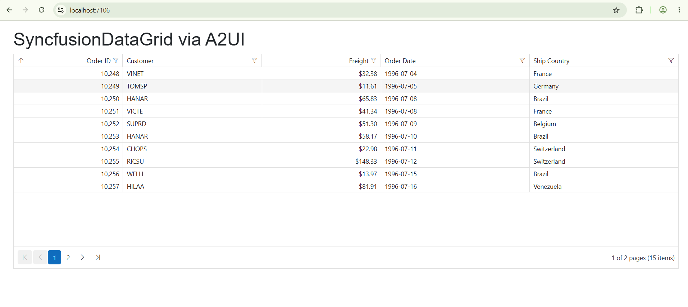

# Getting Started with Syncfusion A2UI for Blazor

This section explains how to include the [Syncfusion A2UI for Blazor](https://a2ui.org/specification/v0.9-a2ui/) component in a Blazor App using [Visual Studio](https://visualstudio.microsoft.com/vs/), [Visual Studio Code](https://code.visualstudio.com/), and the [.NET CLI](https://learn.microsoft.com/en-us/dotnet/core/tools/). The Syncfusion A2UI for Blazor package converts streamed [A2UI v0.9](https://a2ui.org/specification/v0.9-a2ui/) messages into a `SurfaceModel` that is rendered as native Syncfusion EJ2 Blazor components — **DataGrid**, **Chart**, **Scheduler**, **Calendar**, **RichTextEditor**, **Diagram**, **Kanban**, **DocumentEditorContainer**, and more.

The runtime is composed of two NuGet packages:

- `Syncfusion.A2UI.Core` — the framework-agnostic A2UI v0.9 engine.
- `Syncfusion.Blazor.A2UI` — the Blazor renderer that adds Syncfusion EJ2 Blazor adapters on top of the engine and **transitively brings in every Syncfusion EJ2 Blazor component package it depends on** (`Syncfusion.Blazor.Grid`, `Syncfusion.Blazor.Charts`, `Syncfusion.Blazor.Schedule`, `Syncfusion.Blazor.Themes`, and more).

<!-- Both packages are at 0.1.0-beta.0 during preview. Update the version once they ship stable. -->
N> Syncfusion A2UI for Blazor is currently in **preview (beta)** and will be published on NuGet under placeholder package ids (`Syncfusion.A2UI.Core` and `Syncfusion.Blazor.A2UI`, both at `0.1.0-beta.0`). Update the versions in the commands below once the official NuGet packages are released.

## Prerequisites

| Tool | Version |
|------|---------|
| .NET SDK | .NET 8, .NET 9, or .NET 10 |
| Visual Studio / VS Code | Latest stable |

## Create a new Blazor App

Create a **Blazor Web App** using Visual Studio via [Microsoft Templates](https://learn.microsoft.com/en-us/aspnet/core/blazor/tooling) or via the .NET CLI.

```bash
dotnet new blazor -o BlazorA2UIApp --interactivity Auto
cd BlazorA2UIApp
```

For step-by-step instructions on creating a new Blazor App, see [Getting Started with Blazor Web App](../getting-started/blazor-web-app).

## Install the Syncfusion A2UI Blazor package

Install the [Syncfusion.Blazor.A2UI](https://www.nuget.org/packages/Syncfusion.Blazor.A2UI/) NuGet package. All Syncfusion Blazor packages are available on [nuget.org](https://www.nuget.org/packages?q=syncfusion.blazor). See the [NuGet packages](../nuget-packages) topic for details.





1. Go to *Tools → NuGet Package Manager → Manage NuGet Packages for Solution*.
2. Search `Syncfusion.Blazor.A2UI` and install it.

Alternatively, install using the Package Manager Console:

```powershell
Install-Package Syncfusion.Blazor.A2UI
```





Open the terminal and run:

```bash
dotnet add package Syncfusion.Blazor.A2UI
```





Open the command prompt and run:

```bash
dotnet add package Syncfusion.Blazor.A2UI
```





N> The Syncfusion EJ2 Blazor component packages the renderer depends on (`Syncfusion.Blazor.Grid`, `Syncfusion.Blazor.Charts`, `Syncfusion.Blazor.Schedule`, `Syncfusion.Blazor.Themes`, etc.) come in transitively from `Syncfusion.Blazor.A2UI`. No separate `dotnet add package` is needed. See [Supported Components](./supported-components) for the full list of component families the agent can render.

## Add import namespaces

After the package is installed, open **~/_Imports.razor** and import the Syncfusion A2UI namespaces.




@using Syncfusion.Blazor




## Register the Blazor service

Open **Program.cs** and register the Syncfusion Blazor services plus the A2UI engine. `AddA2UIWithSyncfusionComponents()` registers both the A2UI Core engine and the Syncfusion widget-backed catalog in one call. Add `using Syncfusion.Blazor;` at the top of the file.



using Syncfusion.Blazor;
using Syncfusion.Blazor.A2UI.SyncfusionComponents;

...

builder.Services.AddSyncfusionBlazor();
builder.Services.AddA2UIWithSyncfusionComponents();




## Add stylesheet and script resources

The theme stylesheet and script can be accessed from NuGet through [Static Web Assets](../appearance/themes#static-web-assets). Include the [stylesheet](https://blazor.syncfusion.com/documentation/appearance/themes) at the end of the `<head>` section in **App.razor** (or **wwwroot/index.html** for Blazor WebAssembly).




<link href="_content/Syncfusion.Blazor.Themes/fluent2.css" rel="stylesheet" />




Include the required [script references](../common/adding-script-references) at the end of the `<body>` section.




<script src="_content/Syncfusion.Blazor.Core/scripts/syncfusion-blazor.min.js" type="text/javascript"></script>




## Render your first Blazor A2UI surface

Open **Pages/Home.razor** and add the markup below. The page declares an A2UI v0.9 JSON envelope with three messages (`createSurface`, `updateDataModel` with the orders binding, and `updateComponents` that mounts the `SyncfusionDataGrid`), parses it through `A2uiJson.ParseMessages(...)`, feeds it to the `MessageProcessor`, and renders the resulting `SurfaceModel` through `<SyncfusionA2UIProvider>`.




@page "/"
@using System.Text.Json
@using Syncfusion.A2UI.Core.Processing
@using Syncfusion.A2UI.Core.Serialization
@using Syncfusion.A2UI.Core.State
@using Syncfusion.Blazor.A2UI.NodeView
@inject MessageProcessor Processor

<PageTitle>SyncfusionDataGrid sample</PageTitle>

<h1>SyncfusionDataGrid via A2UI</h1>

<SyncfusionA2UIProvider Surface="@surface" />

@code {
    private SurfaceModel? surface;

    protected override void OnInitialized()
    {
        try { Processor.Model.DeleteSurface("orders"); } catch { /* Surface didn't exist */ }
        
        var messages = A2uiJson.ParseMessages(JsonDocument.Parse(Json).RootElement);
        Processor.ProcessMessages(messages);
        surface = Processor.Model.GetSurface("orders");
    }

    private const string Json = """
    {
      "version": "v0.9",
      "messages": [
        { "createSurface": { "surfaceId": "orders", "catalogId": "syncfusion-a2ui-catalog", "sendDataModel": true } },

        { "updateDataModel": {
            "surfaceId": "orders",
            "path": "/orders",
            "value": [
              { "OrderID": 10248, "CustomerID": "VINET",  "Freight":  32.38, "OrderDate": "1996-07-04", "ShipCountry": "France"     },
              { "OrderID": 10249, "CustomerID": "TOMSP",  "Freight":  11.61, "OrderDate": "1996-07-05", "ShipCountry": "Germany"    },
              { "OrderID": 10250, "CustomerID": "HANAR",  "Freight":  65.83, "OrderDate": "1996-07-08", "ShipCountry": "Brazil"     },
              { "OrderID": 10251, "CustomerID": "VICTE",  "Freight":  41.34, "OrderDate": "1996-07-08", "ShipCountry": "France"     },
              { "OrderID": 10252, "CustomerID": "SUPRD",  "Freight":  51.30, "OrderDate": "1996-07-09", "ShipCountry": "Belgium"    },
              { "OrderID": 10253, "CustomerID": "HANAR",  "Freight":  58.17, "OrderDate": "1996-07-10", "ShipCountry": "Brazil"     },
              { "OrderID": 10254, "CustomerID": "CHOPS",  "Freight":  22.98, "OrderDate": "1996-07-11", "ShipCountry": "Switzerland"},
              { "OrderID": 10255, "CustomerID": "RICSU",  "Freight": 148.33, "OrderDate": "1996-07-12", "ShipCountry": "Switzerland"},
              { "OrderID": 10256, "CustomerID": "WELLI",  "Freight":  13.97, "OrderDate": "1996-07-15", "ShipCountry": "Brazil"     },
              { "OrderID": 10257, "CustomerID": "HILAA",  "Freight":  81.91, "OrderDate": "1996-07-16", "ShipCountry": "Venezuela"  },
              { "OrderID": 10258, "CustomerID": "ERNSH",  "Freight": 140.51, "OrderDate": "1996-07-17", "ShipCountry": "Austria"    },
              { "OrderID": 10259, "CustomerID": "CENTC",  "Freight":   3.25, "OrderDate": "1996-07-18", "ShipCountry": "Mexico"     },
              { "OrderID": 10260, "CustomerID": "OTTIK",  "Freight":  55.09, "OrderDate": "1996-07-19", "ShipCountry": "Germany"    },
              { "OrderID": 10261, "CustomerID": "QUEDE",  "Freight":   3.05, "OrderDate": "1996-07-19", "ShipCountry": "Brazil"     },
              { "OrderID": 10262, "CustomerID": "RATTC",  "Freight":  48.29, "OrderDate": "1996-07-22", "ShipCountry": "USA"        }
            ]
        }},

        { "updateDataModel": {
            "surfaceId": "orders",
            "path": "/notifications",
            "value": []
        }},

        { "updateComponents": {
            "surfaceId": "orders",
            "components": [
              {
                "id": "root",
                "component": "Column",
                "children": ["grid", "selected-json"]
              },
              {
                "id": "grid",
                "component": "SyncfusionDataGrid",
                "dataSource": { "path": "/orders" },
                "allowPaging":    true,
                "allowSorting":   true,
                "allowFiltering": true,
                "allowGrouping":  false,
                "allowReordering": true,
                "allowResizing":  true,
                "enableAltRow":   true,
                "enableHover":    true,
                "gridLines":      "Both",
                "clipMode":       "EllipsisWithTooltip",

                "pageSettings": { "pageSize": 10, "pageCount": 5, "currentPage": 1 },
                "filterSettings": { "type": "Excel", "mode": "Immediate" },
                "sortSettings": {
                  "columns": [
                    { "field": "OrderID", "direction": "Ascending" }
                  ]
                },
                "selectionSettings": {
                  "mode": "Row",
                  "type": "Single",
                  "persistSelection": false
                },

                "onRowClick":      "rowClicked",
                "onRowDoubleClick":"rowDoubleClicked",
                "onCellClick":     "cellClicked",
                "onActionBegin":   "actionStarted",
                "onActionComplete":"actionCompleted",
                "onActionFailure": "actionFailed",
                "onDataBound":     "dataBound",
                "onCommandClick":  "commandClicked",

                "columns": [
                  { "field": "OrderID",    "headerText": "Order ID",    "isPrimaryKey": true,
                    "type": "number",   "width": "110", "textAlign": "Right", "format": "N0" },
                  { "field": "CustomerID", "headerText": "Customer",    "width": "140" },
                  { "field": "Freight",    "headerText": "Freight",
                    "width": "120", "textAlign": "Right", "format": "C2" },
                  { "field": "OrderDate",  "headerText": "Order Date",
                    "width": "150", "type": "date", "format": "d" },
                  { "field": "ShipCountry","headerText": "Ship Country","width": "150" }
                ]
              },
              {
                "id": "selected-json",
                "component": "Text",
                "text": { "path": "/selectedRowJson" },
                "variant": "caption"
              }
            ]
        }}
      ]
    }
    """;
}






What the snippet does, in order:

1. Injects the singleton `MessageProcessor` registered by `AddA2UIWithSyncfusionComponents()`.
2. Embeds an A2UI v0.9 JSON envelope covering three messages (`createSurface` → `updateComponents` → `updateDataModel`) that mounts a `Column` containing a `Text` title, a fully-featured `SyncfusionDataGrid`, and a `Text` caption wired to `${selectedRowJson}`.
3. In the Blazor lifecycle (`OnInitialized`), parses the JSON via `A2uiJson.ParseMessages(...)`, calls `Processor.ProcessMessages(...)`, and reads the assembled `SurfaceModel` from `Processor.Model.GetSurface("orders")` so `<SyncfusionA2UIProvider>` can render it.
4. The grid renders 15 `Orders` rows with paging (`pageSize: 10`, `pageCount: 5`), Excel-style immediate filtering, ascending sort by `OrderID`, single-row selection, alt rows, hover, gridlines, ellipsis-with-tooltip clipping, and a full column schema (format, width, alignment, primary key).
5. Row/cell action handlers (`rowClicked`, `cellClicked`, `dataBound`, `actionStarted`, `actionCompleted`, …) and the inherited `SyncfusionDataGrid` schema let the agent later respond to grid interactions. The provider is generic — swap `SyncfusionDataGrid` for `SyncfusionChart`, `SyncfusionScheduler`, `SyncfusionCalendar`, `SyncfusionTextBox`, `SyncfusionDocumentEditorContainer`, `SyncfusionKanban`, … and the same pipeline renders it.

N> In production, replace the embedded JSON with messages streamed from an [A2UI v0.9-compatible agent](https://a2ui.org/specification/v0.9-a2ui/). See [AI Integration](./ai-integration) for the JSON-RPC round-trip pattern.

## Run the application





Press <kbd>Ctrl</kbd>+<kbd>F5</kbd> (Windows) or <kbd>⌘</kbd>+<kbd>F5</kbd> (macOS) to launch the application. The Syncfusion EJ2 `DataGrid` will render in your default web browser.





Open the terminal and run:

```bash
dotnet run
```





Open the command prompt and run:

```bash
dotnet run
```





The page renders a Syncfusion EJ2 `SfDataGrid` populated with 15 sample `Orders` rows (Order ID, Customer, Freight, Order Date, Ship Country). The grid enables paging, sorting, filtering, reordering, resizing, alt rows, hover, and a single-row selection mode, all driven from a static A2UI v0.9 JSON message list — no agent or backend is involved.

## Register the Syncfusion license key

Syncfusion<sup style="font-size:70%">&reg;</sup> Blazor components require a valid license key to be registered before they render without a trial-license watermark. The A2UI adapters call into the same components under the hood, so a registered key is required even when the UI is generated by an agent.

For instructions on generating and registering a license key, see:

* [Generate a Blazor License Key](../getting-started/license-key/how-to-generate)
* [Register License Key in a Blazor Application](../getting-started/license-key/how-to-register-in-an-application)

## See also

* [Overview](./overview)
* [AI Integration](./ai-integration)
* [Supported Components](./supported-components)
* [A2UI v0.9 protocol](https://a2ui.org/specification/v0.9-a2ui/)