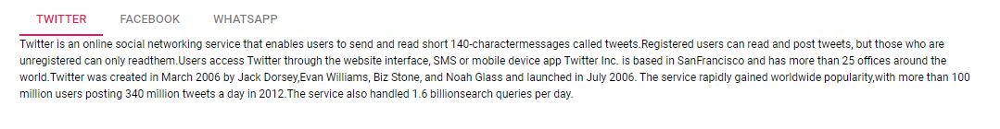
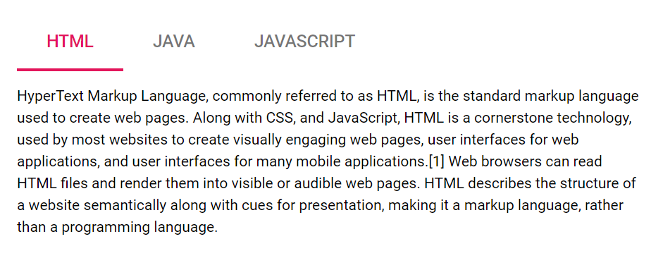

# Getting Started with Blazor Tabs Component

This section briefly explains about how to include a `Tabs` in your Blazor server-side application. You can refer [Getting Started with Syncfusion Blazor for Server-Side in Visual Studio 2019](../getting-started/blazor-server-side-visual-studio-2019/) page for the introduction and configuring the common specifications.

To get start quickly with Blazor Tabs, you can check on this video:



## Importing Syncfusion Blazor component in the application

You can use any one of the below standards to install the Syncfusion Blazor library in your application.

### Using Syncfusion Blazor individual NuGet Packages [New standard]

> Starting with Volume 4, 2020 (v18.4.0.30) release, Syncfusion provides [individual NuGet packages](https://blazor.syncfusion.com/documentation/nuget-packages/) for our Syncfusion Blazor components. We highly recommend this new standard for your Blazor production applications. Refer to [this section](https://blazor.syncfusion.com/documentation/nuget-packages/#benefits-of-using-individual-nuget-packages) to know the benefits of the individual NuGet packages.

1. Install **Syncfusion.Blazor.Navigations** NuGet package to the application using the `NuGet Package Manager`.

2. You can add the client-side style resources from [NuGet](https://blazor.syncfusion.com/documentation/appearance/themes#static-web-assets) package in the `<head>` element of the **~/Pages/_Host.cshtml** page.

    ```html
    <head>
        ....
        ....
        <link href="_content/Syncfusion.Blazor.Themes/bootstrap4.css" rel="stylesheet" />
    </head>
    ```

    W> `Syncfusion.Blazor` package should not be installed along with [individual NuGet packages](https://blazor.syncfusion.com/documentation/nuget-packages/). Hence, you have to add the above `Syncfusion.Blazor.Themes` static web assets (styles) in the application.

### Using Syncfusion.Blazor NuGet Package [Old standard]

W> If you prefer the above new standard (individual NuGet packages), then skip this section. Using both old and new standards in the same application will throw ambiguous compilation errors.

1. Install **Syncfusion.Blazor** NuGet package to the newly created application by using the `NuGet Package Manager`.

2. You can add the client-side style resources through CDN or from NuGet package in the `<head>` element of the **~/Pages/_Host.cshtml** page.

    ```html
    <head>
        ....
        ....
        <link href="_content/Syncfusion.Blazor/styles/bootstrap4.css" rel="stylesheet" />
         @*<link href="https://cdn.syncfusion.com/blazor/{{ site.blazorversion }}/styles/bootstrap4.css" rel="stylesheet" />*@
    </head>
    ```

    > For Internet Explorer 11 kindly refer the polyfills. Refer the [documentation](../common/how-to/render-blazor-server-app-in-ie/) for more information.

    ```html
        <head>
            ...
                <link href="https://cdn.syncfusion.com/blazor/{{ site.blazorversion }}/styles/bootstrap4.css" rel="stylesheet" />
                <script src="https://github.com/Daddoon/Blazor.Polyfill/releases/download/3.0.1/blazor.polyfill.min.js"></script>
            ...
        </head>
    ```

## Adding component package to the application

Open `~/_Imports.razor` file and import the `Syncfusion.Blazor.Navigations` package.

```cshtml
@using Syncfusion.Blazor.Navigations
```

## Add SyncfusionBlazor service in Startup file

Open the **Startup.cs** file and add services required by Syncfusion components using  **services.AddSyncfusionBlazor()** method. Add this method in the **ConfigureServices** function as follows.

```csharp
using Syncfusion.Blazor;

namespace BlazorApplication
{
    public class Startup
    {
        ....
        ....
        public void ConfigureServices(IServiceCollection services)
        {
            ....
            ....
            services.AddSyncfusionBlazor();
        }
    }
}
```

## Adding Tabs component to the application

Now, add the Syncfusion Blazor Tabs component in any web page (razor) in the `Pages` folder. For example, the Tabs component is added in the `~/Pages/Index.razor` page.

```cshtml
@using Syncfusion.Blazor.Navigations

<SfTab>
    <TabItems>
        <TabItem Content="Twitter is an online social networking service that enables users to send and read short 140-charactermessages called tweets.Registered users can read and post tweets, but those who are unregistered can only readthem.Users access Twitter through the website interface, SMS or mobile device app Twitter Inc. is based in SanFrancisco and has more than 25 offices around the world.Twitter was created in March 2006 by Jack Dorsey,Evan Williams, Biz Stone, and Noah Glass and launched in July 2006. The service rapidly gained worldwide popularity,with more than 100 million users posting 340 million tweets a day in 2012.The service also handled 1.6 billionsearch queries per day.">
            <ChildContent>
                <TabHeader Text="Twitter"></TabHeader>
            </ChildContent>
        </TabItem>
        <TabItem Content="Facebook is an online social networking service headquartered in Menlo Park, California. Its website waslaunched on February 4, 2004, by Mark Zuckerberg with his Harvard College roommates and fellow students EduardoSaverin, Andrew McCollum, Dustin Moskovitz and Chris Hughes.">
            <ChildContent>
                <TabHeader Text="Facebook"></TabHeader>
            </ChildContent>
        </TabItem>
        <TabItem Content="WhatsApp Messenger is a proprietary cross-platform instant messaging client for smartphones that operatesunder a subscription business model.It uses the Internet to send text messages, images, video, user location andaudio media messages to other users using standard cellular mobile numbers. As of February 2016, WhatsApp had a userbase of up to one billion,[10] making it the most globally popular messaging application.WhatsApp Inc., based inMountain View, California, was acquired by Facebook Inc.on February 19, 2014, for approximately US$19.3 billion.">
            <ChildContent>
                <TabHeader Text="Whatsapp"></TabHeader>
            </ChildContent>
        </TabItem>
    </TabItems>
</SfTab>
```

## Run the application

After successful compilation of your application, simply press `F5` to run the application.



## Initialize Tab Content using Template

Tab provides support to render content using `ContentTemplate` property. You can give preferred content inside the `ContentTemplate` element.

> `ContentTemplate` property supports `RenderFragment` type to render content.

The following code explains how to initialize tab content using `ContentTemplate`.

```cshtml
@using Syncfusion.Blazor.Navigations

<SfTab>
    <TabItems>
        <TabItem>
            <ChildContent>
                <TabHeader Text="HTML"></TabHeader>
            </ChildContent>
            <ContentTemplate>
                <div>HyperText Markup Language, commonly referred to as HTML, is the standard markup language used to create web pages. Along with CSS, and JavaScript, HTML is a cornerstone technology, used by most websites to create visually engaging web pages, user interfaces for web applications, and user interfaces for many mobile applications.[1] Web browsers can read HTML files and render them into visible or audible web pages. HTML describes the structure of a website semantically along with cues for presentation, making it a markup language, rather than a programming language.</div>
            </ContentTemplate>
        </TabItem>
        <TabItem>
            <ChildContent>
                <TabHeader Text="Java"></TabHeader>
            </ChildContent>
            <ContentTemplate>
                <div>Java is a set of computer software and specifications developed by Sun Microsystems, later acquired by Oracle Corporation, that provides a system for developing application software and deploying it in a cross-platform computing environment. Java is used in a wide variety of computing platforms from embedded devices and mobile phones to enterprise servers and supercomputers. While less common, Java applets run in secure, sandboxed environments to provide many features of native applications and can be embedded in HTML pages.</div>
            </ContentTemplate>
        </TabItem>
        <TabItem>
            <ChildContent>
                <TabHeader Text="JavaScript"></TabHeader>
            </ChildContent>
            <ContentTemplate>@DynamicContent</ContentTemplate>
        </TabItem>
    </TabItems>
</SfTab>

@code{
    public RenderFragment DynamicContent = builder =>
    {
        builder.AddContent(1, "JavaScript (JS) is an interpreted computer programming language. It was originally implemented as part of web browsers so that client-side scripts could interact with the user, control the browser, communicate asynchronously, and alter the document content that was displayed.[5] More recently, however, it has become common in both game development and the creation of desktop applications.");
    };
}
```

Output be like the below.



## Two way binding of SelectedItem

The property [SelectedItem](https://help.syncfusion.com/cr/blazor/Syncfusion.Blazor.Navigations.SfTab.html#Syncfusion_Blazor_Navigations_SfTab_SelectedItem) supports two way property binding, in the following code example if either the value is changed in numeric text box or selected tab item is changed, it will reflect in both the value of numeric text box and selected tab item.

```cshtml
@using Syncfusion.Blazor.Inputs
@using Syncfusion.Blazor.Navigations

Selected Tab
<SfNumericTextBox TValue="int" @bind-Value="@SelectedTab" Min="0" Max="4" Width="200px"></SfNumericTextBox>

<SfTab @bind-SelectedItem="SelectedTab">
    <TabItems>
        <TabItem Content="HyperText Markup Language, commonly referred to as HTML, is the standard markup language used to create web pages. Along with CSS, and JavaScript, HTML is a cornerstone technology, used by most websites to create visually engaging web pages, user interfaces for web applications, and user interfaces for many mobile applications.[1] Web browsers can read HTML files and render them into visible or audible web pages. HTML describes the structure of a website semantically along with cues for presentation, making it a markup language, rather than a programming language.">
            <ChildContent>
                <TabHeader Text="HTML"></TabHeader>
            </ChildContent>
        </TabItem>
        <TabItem Content="C# is intended to be a simple, modern, general-purpose, object-oriented programming language. Its development team is led by Anders Hejlsberg. The most recent version is C# 5.0, which was released on August 15, 2012.">
            <ChildContent>
                <TabHeader Text="C Sharp(C#)"></TabHeader>
            </ChildContent>
        </TabItem>
        <TabItem Content="Java is a set of computer software and specifications developed by Sun Microsystems, later acquired by Oracle Corporation, that provides a system for developing application software and deploying it in a cross-platform computing environment. Java is used in a wide variety of computing platforms from embedded devices and mobile phones to enterprise servers and supercomputers. While less common, Java applets run in secure, sandboxed environments to provide many features of native applications and can be embedded in HTML pages.">
            <ChildContent>
                <TabHeader Text="Java"></TabHeader>
            </ChildContent>
        </TabItem>
        <TabItem Content="The command-line compiler, VBC.EXE, is installed as part of the freeware .NET Framework SDK. Mono also includes a command-line VB.NET compiler. The most recent version is VB 2012, which was released on August 15, 2012.">
            <ChildContent>
                <TabHeader Text="VB.Net"></TabHeader>
            </ChildContent>
        </TabItem>
        <TabItem Content="Xamarin is a San Francisco, California based software company created in May 2011[3] by the engineers that created Mono,[4] Mono for Android and MonoTouch that are cross-platform implementations of the Common Language Infrastructure (CLI) and Common Language Specifications (often called Microsoft .NET). With a C#-shared codebase, developers can use Xamarin tools to write native Android, iOS, and Windows apps with native user interfaces and share code across multiple platforms.[5] Xamarin has over 1 million developers in more than 120 countries around the World as of May 2015.">
            <ChildContent>
                <TabHeader Text="Xamarin"></TabHeader>
            </ChildContent>
        </TabItem>
    </TabItems>
</SfTab>

@code {
    private int SelectedTab = 0;
}
```

Output be like the below.


## See Also

1. [Getting Started with Syncfusion Blazor for client-side in .NET Core CLI](../getting-started/blazor-webassembly-dotnet-cli/)
2. [Getting Started with Syncfusion Blazor for client-side in Visual Studio 2019](../getting-started/blazor-webassembly-visual-studio-2019/)
3. [Getting Started with Syncfusion Blazor for server-side in .NET Core CLI](../getting-started/blazor-server-side-dotnet-cli/)