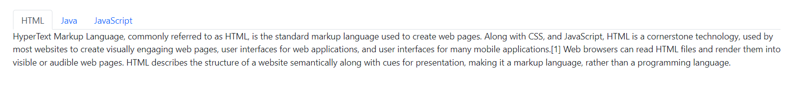
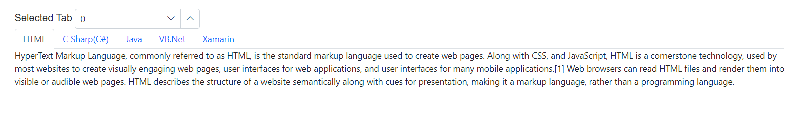

# Getting Started with Blazor Tabs Component

This section briefly explains about how to include [Blazor Tabs](https://www.syncfusion.com/blazor-components/blazor-tabs) component in your Blazor Server App and Blazor WebAssembly App using Visual Studio.

To get start quickly with Blazor Tabs, you can check on this video:



## Prerequisites

* [System requirements for Blazor components](https://blazor.syncfusion.com/documentation/system-requirements)

## Create a new Blazor App in Visual Studio

You can create **Blazor Server App** or **Blazor WebAssembly App** using Visual Studio in one of the following ways,

* [Create a Project using Microsoft Templates](https://docs.microsoft.com/en-us/aspnet/core/blazor/tooling?pivots=windows)

* [Create a Project using Syncfusion Blazor Extension](https://blazor.syncfusion.com/documentation/visual-studio-integration/vs2019-extensions/create-project)

## Install Syncfusion Blazor Navigations NuGet in the App

Syncfusion Blazor components are available in [nuget.org](https://www.nuget.org/packages?q=syncfusion.blazor). To use Syncfusion Blazor components in the application, add reference to the corresponding NuGet. Refer to [NuGet packages topic](https://blazor.syncfusion.com/documentation/nuget-packages) for available NuGet packages list with component details.

To add Blazor Tabs component in the app, open the NuGet package manager in Visual Studio (*Tools → NuGet Package Manager → Manage NuGet Packages for Solution*), search for [Syncfusion.Blazor.Navigations](https://www.nuget.org/packages/Syncfusion.Blazor.Navigations/) and then install it.

## Register Syncfusion Blazor Service

Open **~/_Imports.razor** file and import the Syncfusion.Blazor namespace.




@using Syncfusion.Blazor




Now, register the Syncfusion Blazor Service in the Blazor Server App or Blazor WebAssembly App. Here, Syncfusion Blazor Service is registered by setting [IgnoreScriptIsolation](https://help.syncfusion.com/cr/blazor/Syncfusion.Blazor.GlobalOptions.html#Syncfusion_Blazor_GlobalOptions_IgnoreScriptIsolation) property as true to load the scripts externally in the [next steps](#add-script-reference).

### Blazor Server App

* For **.NET 6** app, open the **~/Program.cs** file and register the Syncfusion Blazor Service.

* For **.NET 5 and .NET 3.X** app, open the **~/Startup.cs** file and register the Syncfusion Blazor Service.




using Microsoft.AspNetCore.Components;
using Microsoft.AspNetCore.Components.Web;
using Syncfusion.Blazor;

var builder = WebApplication.CreateBuilder(args);

// Add services to the container.
builder.Services.AddRazorPages();
builder.Services.AddServerSideBlazor();
builder.Services.AddSyncfusionBlazor(options => { options.IgnoreScriptIsolation = true; });

var app = builder.Build();
....





using Syncfusion.Blazor;

namespace BlazorApplication
{
    public class Startup
    {
        ...
        public void ConfigureServices(IServiceCollection services)
        {
            services.AddRazorPages();
            services.AddServerSideBlazor();
            services.AddSyncfusionBlazor(options => { options.IgnoreScriptIsolation = true; });
        }
        ...
    }
}




### Blazor WebAssembly App

Open **~/Program.cs** file and register the Syncfusion Blazor Service in the client web app.




using Microsoft.AspNetCore.Components.Web;
using Microsoft.AspNetCore.Components.WebAssembly.Hosting;
using Syncfusion.Blazor;

var builder = WebAssemblyHostBuilder.CreateDefault(args);
builder.RootComponents.Add<App>("#app");
builder.RootComponents.Add<HeadOutlet>("head::after");

builder.Services.AddScoped(sp => new HttpClient { BaseAddress = new Uri(builder.HostEnvironment.BaseAddress) });

builder.Services.AddSyncfusionBlazor(options => { options.IgnoreScriptIsolation = true; });
await builder.Build().RunAsync();
....





using Syncfusion.Blazor;

namespace WebApplication1
{
    public class Program
    {
        public static async Task Main(string[] args)
        {
            ....
            builder.Services.AddSyncfusionBlazor(options => { options.IgnoreScriptIsolation = true; });
            await builder.Build().RunAsync();
        }
    }
}




## Add Style Sheet

Checkout the [Blazor Themes topic](https://blazor.syncfusion.com/documentation/appearance/themes) to learn different ways ([Static Web Assets](https://blazor.syncfusion.com/documentation/appearance/themes#static-web-assets), [CDN](https://blazor.syncfusion.com/documentation/appearance/themes#cdn-reference) and [CRG](https://blazor.syncfusion.com/documentation/common/custom-resource-generator)) to refer themes in Blazor application, and to have the expected appearance for Syncfusion Blazor components. Here, the theme is referred using [Static Web Assets](https://blazor.syncfusion.com/documentation/appearance/themes#static-web-assets).

To add theme to the app, open the NuGet package manager in Visual Studio (*Tools → NuGet Package Manager → Manage NuGet Packages for Solution*), search for [Syncfusion.Blazor.Themes](https://www.nuget.org/packages/Syncfusion.Blazor.Themes/) and then install it. Then, the theme style sheet from NuGet can be referred as follows,

### Blazor Server App

* For .NET 6 app, add the Syncfusion bootstrap5 theme in the `<head>` of the **~/Pages/_Layout.cshtml** file.

* For .NET 5 and .NET 3.X app, add the Syncfusion bootstrap5 theme in the `<head>` of the **~/Pages/_Host.cshtml** file.




<head>
    <link href="_content/Syncfusion.Blazor.Themes/bootstrap5.css" rel="stylesheet" />
</head>





<head>
    <link href="_content/Syncfusion.Blazor.Themes/bootstrap5.css" rel="stylesheet" />
</head>




### Blazor WebAssembly App

For Blazor WebAssembly App, Refer the theme style sheet from NuGet in the `<head>` of **wwwroot/index.html** file in the client web app.




<head>
    <link href="_content/Syncfusion.Blazor.Themes/bootstrap5.css" rel="stylesheet" />
</head>




## Add Script Reference

Checkout [Adding Script Reference topic](https://blazor.syncfusion.com/documentation/common/adding-script-references) to learn different ways to add script reference in Blazor Application. In this getting started walk-through, the required scripts are referred using [Static Web Assets](https://blazor.syncfusion.com/documentation/common/adding-script-references#static-web-assets) externally inside the `<head>` as follows,

### Blazor Server App

* For **.NET 6** app, Refer script in the `<head>` of the **~/Pages/_Layout.cshtml** file.

* For **.NET 5 and .NET 3.X** app, Refer script in the `<head>` of the **~/Pages/_Host.cshtml** file.




<head>
    ....
    <link href="_content/Syncfusion.Blazor.Themes/bootstrap5.css" rel="stylesheet" />
    
</head>





<head>
    ....
    <link href="_content/Syncfusion.Blazor.Themes/bootstrap5.css" rel="stylesheet" />
    
</head>




### Blazor WebAssembly App

For Blazor WebAssembly App, Refer script in the `<head>` of the **~/index.html** file.




<head>
    ....
    <link href="_content/Syncfusion.Blazor.Themes/bootstrap5.css" rel="stylesheet" />
    
</head>




> Syncfusion recommends to reference scripts using [Static Web Assets](https://blazor.syncfusion.com/documentation/common/adding-script-references#static-web-assets), [CDN](https://blazor.syncfusion.com/documentation/common/adding-script-references#cdn-reference) and [CRG](https://blazor.syncfusion.com/documentation/common/custom-resource-generator) by [disabling JavaScript isolation](https://blazor.syncfusion.com/documentation/common/adding-script-references#disable-javascript-isolation) for better loading performance of the Blazor application.

## Add Blazor Tabs component

* Open **~/_Imports.razor** file or any other page under the `~/Pages` folder where the component is to be added and import the **Syncfusion.Blazor.Navigations** namespace.




@using Syncfusion.Blazor
@using Syncfusion.Blazor.Navigations




* Now, add the Syncfusion Tabs component in razor file. Here, the Tabs component is added in the **~/Pages/Index.razor** file under the **~/Pages** folder.




<SfTab>
    <TabItems>
        <TabItem Content="Twitter is an online social networking service that enables users to send and read short 140-charactermessages called tweets.Registered users can read and post tweets, but those who are unregistered can only readthem.Users access Twitter through the website interface, SMS or mobile device app Twitter Inc. is based in SanFrancisco and has more than 25 offices around the world.Twitter was created in March 2006 by Jack Dorsey,Evan Williams, Biz Stone, and Noah Glass and launched in July 2006. The service rapidly gained worldwide popularity,with more than 100 million users posting 340 million tweets a day in 2012.The service also handled 1.6 billionsearch queries per day.">
            <ChildContent>
                <TabHeader Text="Twitter"></TabHeader>
            </ChildContent>
        </TabItem>
        <TabItem Content="Facebook is an online social networking service headquartered in Menlo Park, California. Its website waslaunched on February 4, 2004, by Mark Zuckerberg with his Harvard College roommates and fellow students EduardoSaverin, Andrew McCollum, Dustin Moskovitz and Chris Hughes.">
            <ChildContent>
                <TabHeader Text="Facebook"></TabHeader>
            </ChildContent>
        </TabItem>
        <TabItem Content="WhatsApp Messenger is a proprietary cross-platform instant messaging client for smartphones that operatesunder a subscription business model.It uses the Internet to send text messages, images, video, user location andaudio media messages to other users using standard cellular mobile numbers. As of February 2016, WhatsApp had a userbase of up to one billion,[10] making it the most globally popular messaging application.WhatsApp Inc., based inMountain View, California, was acquired by Facebook Inc.on February 19, 2014, for approximately US$19.3 billion.">
            <ChildContent>
                <TabHeader Text="Whatsapp"></TabHeader>
            </ChildContent>
        </TabItem>
    </TabItems>
</SfTab>




* Press <kbd>Ctrl</kbd>+<kbd>F5</kbd> (Windows) or <kbd>⌘</kbd>+<kbd>F5</kbd> (macOS) to run the application. Then, the Syncfusion `Blazor Tabs` component will be rendered in the default web browser.

## Initialize Tab Content using Template

Tab provides support to render content using `ContentTemplate` property. You can give preferred content inside the `ContentTemplate` element.

> `ContentTemplate` property supports `RenderFragment` type to render content.

The following code explains how to initialize tab content using `ContentTemplate`.




<SfTab>
    <TabItems>
        <TabItem>
            <ChildContent>
                <TabHeader Text="HTML"></TabHeader>
            </ChildContent>
            <ContentTemplate>
                
HyperText Markup Language, commonly referred to as HTML, is the standard markup language used to create web pages. Along with CSS, and JavaScript, HTML is a cornerstone technology, used by most websites to create visually engaging web pages, user interfaces for web applications, and user interfaces for many mobile applications.[1] Web browsers can read HTML files and render them into visible or audible web pages. HTML describes the structure of a website semantically along with cues for presentation, making it a markup language, rather than a programming language.

            </ContentTemplate>
        </TabItem>
        <TabItem>
            <ChildContent>
                <TabHeader Text="Java"></TabHeader>
            </ChildContent>
            <ContentTemplate>
                
Java is a set of computer software and specifications developed by Sun Microsystems, later acquired by Oracle Corporation, that provides a system for developing application software and deploying it in a cross-platform computing environment. Java is used in a wide variety of computing platforms from embedded devices and mobile phones to enterprise servers and supercomputers. While less common, Java applets run in secure, sandboxed environments to provide many features of native applications and can be embedded in HTML pages.

            </ContentTemplate>
        </TabItem>
        <TabItem>
            <ChildContent>
                <TabHeader Text="JavaScript"></TabHeader>
            </ChildContent>
            <ContentTemplate>@DynamicContent</ContentTemplate>
        </TabItem>
    </TabItems>
</SfTab>

@code{
    public RenderFragment DynamicContent = builder =>
    {
        builder.AddContent(1, "JavaScript (JS) is an interpreted computer programming language. It was originally implemented as part of web browsers so that client-side scripts could interact with the user, control the browser, communicate asynchronously, and alter the document content that was displayed.[5] More recently, however, it has become common in both game development and the creation of desktop applications.");
    };
}




## Two way binding of SelectedItem

The property [SelectedItem](https://help.syncfusion.com/cr/blazor/Syncfusion.Blazor.Navigations.SfTab.html#Syncfusion_Blazor_Navigations_SfTab_SelectedItem) supports two way property binding, in the following code example if either the value is changed in numeric text box or selected tab item is changed, it will reflect in both the value of numeric text box and selected tab item.




@using Syncfusion.Blazor.Inputs
@using Syncfusion.Blazor.Navigations

Selected Tab
<SfNumericTextBox TValue="int" @bind-Value="@SelectedTab" Min="0" Max="4" Width="200px"></SfNumericTextBox>

<SfTab @bind-SelectedItem="SelectedTab">
    <TabItems>
        <TabItem Content="HyperText Markup Language, commonly referred to as HTML, is the standard markup language used to create web pages. Along with CSS, and JavaScript, HTML is a cornerstone technology, used by most websites to create visually engaging web pages, user interfaces for web applications, and user interfaces for many mobile applications.[1] Web browsers can read HTML files and render them into visible or audible web pages. HTML describes the structure of a website semantically along with cues for presentation, making it a markup language, rather than a programming language.">
            <ChildContent>
                <TabHeader Text="HTML"></TabHeader>
            </ChildContent>
        </TabItem>
        <TabItem Content="C# is intended to be a simple, modern, general-purpose, object-oriented programming language. Its development team is led by Anders Hejlsberg. The most recent version is C# 5.0, which was released on August 15, 2012.">
            <ChildContent>
                <TabHeader Text="C Sharp(C#)"></TabHeader>
            </ChildContent>
        </TabItem>
        <TabItem Content="Java is a set of computer software and specifications developed by Sun Microsystems, later acquired by Oracle Corporation, that provides a system for developing application software and deploying it in a cross-platform computing environment. Java is used in a wide variety of computing platforms from embedded devices and mobile phones to enterprise servers and supercomputers. While less common, Java applets run in secure, sandboxed environments to provide many features of native applications and can be embedded in HTML pages.">
            <ChildContent>
                <TabHeader Text="Java"></TabHeader>
            </ChildContent>
        </TabItem>
        <TabItem Content="The command-line compiler, VBC.EXE, is installed as part of the freeware .NET Framework SDK. Mono also includes a command-line VB.NET compiler. The most recent version is VB 2012, which was released on August 15, 2012.">
            <ChildContent>
                <TabHeader Text="VB.Net"></TabHeader>
            </ChildContent>
        </TabItem>
        <TabItem Content="Xamarin is a San Francisco, California based software company created in May 2011[3] by the engineers that created Mono,[4] Mono for Android and MonoTouch that are cross-platform implementations of the Common Language Infrastructure (CLI) and Common Language Specifications (often called Microsoft .NET). With a C#-shared codebase, developers can use Xamarin tools to write native Android, iOS, and Windows apps with native user interfaces and share code across multiple platforms.[5] Xamarin has over 1 million developers in more than 120 countries around the World as of May 2015.">
            <ChildContent>
                <TabHeader Text="Xamarin"></TabHeader>
            </ChildContent>
        </TabItem>
    </TabItems>
</SfTab>

@code {
    private int SelectedTab = 0;
}




## See Also

1. [Getting Started with Syncfusion Blazor for client-side in .NET Core CLI](https://blazor.syncfusion.com/documentation/getting-started/blazor-webassembly-dotnet-cli/)
2. [Getting Started with Syncfusion Blazor for client-side in Visual Studio](https://blazor.syncfusion.com/documentation/getting-started/blazor-webassembly-visual-studio)
3. [Getting Started with Syncfusion Blazor for server-side in .NET Core CLI](https://blazor.syncfusion.com/documentation/getting-started/blazor-server-side-dotnet-cli/)