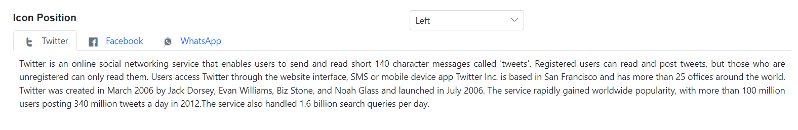

# Header in Blazor Tabs Component

This section explains how to modify the style of the Blazor Tab header.

## Styles

The header styles can be customized by adding predefined classes in the Tab root element. The pre-defined CSS class names are as follows:

* **e-fill**: The Selected Tab header background is set as solid fill.
* **e-background**: Tab header has a solid fill background, and the selected header has a highlighted border.
* **e-background e-accent**: Tab header has a solid fill background, and the selected header has a highlighted border with accent color.

N> If the above custom style classes are not included in the root element, the default style is applied to the Tab items.

```cshtml
@using Syncfusion.Blazor.Navigations
@using Syncfusion.Blazor.DropDowns

<div id="TabHeader">
    <div class="row">
        <div class="col-xs-6 col-sm-6 col-lg-6 col-md-6">
            <label>Header Style</label>
        </div>
        <div class="col-xs-6 col-sm-6 col-lg-6 col-md-6">
            <SfDropDownList TValue="string" DataSource="@HeaderStylesData" Width="30%" TItem="DropdownFields" @bind-Index="index">
                <DropDownListEvents TValue="string" ValueChange="OnHeaderStyleChange" TItem="DropdownFields"></DropDownListEvents>
                <DropDownListFieldSettings Value="Value" Text="Text"></DropDownListFieldSettings>
            </SfDropDownList>
        </div>
    </div>
</div>
<SfTab CssClass="@HeaderStyles">
    <TabItems>
        <TabItem Content="@Content0">
            <ChildContent>
                <TabHeader Text="Twitter"></TabHeader>
            </ChildContent>
        </TabItem>
        <TabItem Content="@Content1">
            <ChildContent>
                <TabHeader Text="Facebook"></TabHeader>
            </ChildContent>
        </TabItem>
        <TabItem Content="@Content2">
            <ChildContent>
                <TabHeader Text="WhatsApp"></TabHeader>
            </ChildContent>
        </TabItem>
    </TabItems>
</SfTab>

@code{
    private int? index { get; set; } = 0;
    public string HeaderStyles { get; set; } = "";
    public class DropdownFields
    {
        public string Value { get; set; }
        public string Text { get; set; }
    }
    List<DropdownFields> HeaderStylesData = new List<DropdownFields>()
    {
        new DropdownFields() { Value= "", Text= "Default" },
        new DropdownFields() { Value= "e-background e-accent", Text= "Accent" },
        new DropdownFields() { Value= "e-fill", Text= "Fill" }
    };
    public string Content0 = "Twitter is an online social networking service that enables users to send and read short 140-character " +
            "messages called 'tweets'. Registered users can read and post tweets, but those who are unregistered can only read " +
            "them. Users access Twitter through the website interface, SMS or mobile device app Twitter Inc. is based in San " +
            "Francisco and has more than 25 offices around the world. Twitter was created in March 2006 by Jack Dorsey, " +
            "Evan Williams, Biz Stone, and Noah Glass and launched in July 2006. The service rapidly gained worldwide popularity, " +
            "with more than 100 million users posting 340 million tweets a day in 2012.The service also handled 1.6 billion " +
            "search queries per day.";
    public string Content1 = "Facebook is an online social networking service headquartered in Menlo Park, California. Its website was " +
            "launched on February 4, 2004, by Mark Zuckerberg with his Harvard College roommates and fellow students Eduardo " +
            "Saverin, Andrew McCollum, Dustin Moskovitz and Chris Hughes.The founders had initially limited the website  " +
            "membership to Harvard students, but later expanded it to colleges in the Boston area, the Ivy League, and Stanford " +
            "University. It gradually added support for students at various other universities and later to high-school students.";
    public string Content2 = "WhatsApp Messenger is a proprietary cross-platform instant messaging client for smartphones that operates " +
            "under a subscription business model. It uses the Internet to send text messages, images, video, user location and " +
            "audio media messages to other users using standard cellular mobile numbers. As of February 2016, WhatsApp had a user  " +
            "base of up to one billion,[10] making it the most globally popular messaging application. WhatsApp Inc., based in " +
            "Mountain View, California, was acquired by Facebook Inc. on February 19, 2014, for approximately US$19.3 billion.";

    public void OnHeaderStyleChange(Syncfusion.Blazor.DropDowns.ChangeEventArgs<string, DropdownFields> args)
    {
        HeaderStyles = args.Value;
    }
}

<style>
    .e-content .e-item {
        font-size: 12px;
        padding: 10px;
        text-align: justify;
    }
</style>
```




## Icon positions

The position of the Tab header icons can be customized using the [IconPosition](https://help.syncfusion.com/cr/blazor/Syncfusion.Blazor.Navigations.TabHeader.html#Syncfusion_Blazor_Navigations_TabHeader_IconPosition) property. This property depends on the header items [IconCSS](https://help.syncfusion.com/cr/blazor/Syncfusion.Blazor.Navigations.TabHeader.html#Syncfusion_Blazor_Navigations_TabHeader_IconCss) property. By default, the Tab header icon is positioned on the left. The available position values are as follows:

* **Left**: Icon is placed on the left of the Tab header item.
* **Right**: Icon is placed on the right of the Tab header item.
* **Top**: Icon is placed on the top of the Tab header item.
* **Bottom**: Icon is placed on the bottom of the Tab header item.

```cshtml
@using Syncfusion.Blazor.Navigations
@using Syncfusion.Blazor.DropDowns

<div id="headerIconsTab">
    <div class="row">
        <div class="col-xs-6 col-sm-6 col-lg-6 col-md-6">
            <label>Icon Position</label>
        </div>
        <div class="col-xs-6 col-sm-6 col-lg-6 col-md-6">
            <SfDropDownList TValue="string" DataSource="@HeaderIconsData" Width="30%" TItem="HeaderIcons" @bind-Index="index">
                <DropDownListEvents ValueChange="ChangeHeaderIcon" TValue="string" TItem="HeaderIcons"></DropDownListEvents>
                <DropDownListFieldSettings Value="Value" Text="Text"></DropDownListFieldSettings>
            </SfDropDownList>
        </div>
    </div>
</div>
<SfTab>
    <TabItems>
        <TabItem Content="@Content0">
            <ChildContent>
                <TabHeader Text="Twitter" IconCss="e-twitter" IconPosition="@PositionValue"></TabHeader>
            </ChildContent>
        </TabItem>
        <TabItem Content="@Content1">
            <ChildContent>
                <TabHeader Text="Facebook" IconCss="e-facebook" IconPosition="@PositionValue"></TabHeader>
            </ChildContent>
        </TabItem>
        <TabItem Content="@Content2">
            <ChildContent>
                <TabHeader Text="WhatsApp" IconCss="e-whatsapp" IconPosition="@PositionValue"></TabHeader>
            </ChildContent>
        </TabItem>
    </TabItems>
</SfTab>

<style>
    .e-content .e-item {
        font-size: 12px;
        padding: 10px;
        text-align: justify;
    }

    @@font-face {
        font-family: 'Socialicons';
        src: url(data:application/x-font-ttf;charset=utf-8;base64,AAEAAAAKAIAAAwAgT1MvMv1tCfsAAAEoAAAAVmNtYXCnKKeOAAABrAAAAEhnbHlml19XagAAAgwAABhQaGVhZA8dCeEAAADQAAAANmhoZWEIUQQMAAAArAAAACRobXR4LAAAAAAAAYAAAAAsbG9jYR3AIwwAAAH0AAAAGG1heHABIAIAAAABCAAAACBuYW1l0X1q/wAAGlwAAAJVcG9zdGX5D00AABy0AAAAkwABAAAEAAAAAFwEAAAAAAAD9AABAAAAAAAAAAAAAAAAAAAACwABAAAAAQAA+iTiP18PPPUACwQAAAAAANYFYngAAAAA1gVieAAAAAAD9AP0AAAACAACAAAAAAAAAAEAAAALAfQACwAAAAAAAgAAAAoACgAAAP8AAAAAAAAAAQQAAZAABQAAAokCzAAAAI8CiQLMAAAB6wAyAQgAAAIABQMAAAAAAAAAAAAAAAAAAAAAAAAAAAAAUGZFZABApwCnCQQAAAAAXAQAAAAAAAABAAAAAAAABAAAAAQAAAAEAAAABAAAAAQAAAAEAAAABAAAAAQAAAAEAAAABAAAAAQAAAAAAAACAAAAAwAAABQAAwABAAAAFAAEADQAAAAEAAQAAQAApwn//wAApwD//wAAAAEABAAAAAEAAgADAAQABQAGAAcACAAJAAoAAAAAAiQCzgOMBU4F/gZYB9QIcAo+DCgABAAAAAAD0gPzAFUA4gF3AfMAAAEzHwYHFQ8EFR8IPwUfBRUPCCMvFj0BPwoXNw8fHQEfDhUPAT8CHwkzPyA9Ai8iDwIFHwcPIysBLwYjDwI/AS8PNT8oHx4BDxAdAR8PHQEHPwE7AR8EMz8dNS8kIw8FAYkFEgQDAyQDAQECAyIBAQMSEgkUCw4vBQQFChsGBQdqAgIBAwMDCAoMDA0NBgYPEA8PFxYVFBQTEhITEREPDgwKCQQEBQICBAQFChMJBQUFBTURDxAPDw8ODg4NDQwMDAsLCgkJCQgHBwcFBQUEAwICAQEDAgQEBgYHBwkJCgsOAgEmiwMEBAQUFRQVFRQVFRQVFRUVFBUVDw4ODg0NDAwLCwoKCQkICAcGBgUEBAQCAgICAgMEBAYGBgcICQkJCgsLCwwNDQ0ODg4PDw8QEBAQEBEREREQEQHcBgUEBAICAQEBAQEDAwQFBQYHCAgICgoLCwwNDQ4ODxAREhISEhMTExMUExQUFRQVGxsaGgcIBwfXNgEBAQ8KCgoIBwcGBQUDAwIBAQECAwMDBQUFBgcHCAgICgkKCwsMDAwNDg0ODw8PEBAQEhISEhISEhIREREREREQERAQDw8PDw8ODQ0NDQwLDAoKCgkJCAcH/aAQEB0cGhgWFBIRDgwLCAcEAwICAwMFBQYHBwgJCgoLAgE9+AYFBSMeHx4fIB8fFhQUFBQSExIRERAQEA8ODhAQDQ0LCQgHBgQCAgICBAQEBgYGCAgJCQoLCwwMDQ4ODg8PEBAREBESEhISExITGBcZGRgZGBgXAu4CAgMEXAkFBAQFBCQCAwMGGhcKFQkMIwIBAwoYAwIBKQECBSgFBgULCgkHBgMBAQEDAwcICgwMDg8PEhITFBUWGBgSEyYJCAgIBwcHDBEGAgEBAagEBAQGBgYHCAgJCgkLCwsMDAwNDQ4ODg8PDw8QEBAQERITEhESEREREBEPEA8QDhMEBASFNgEBAQEJCAcGBQMCAQEDAwUGCAgHCAgJCQoKCwsMDA0NDQ4ODg8ODxAPEA8QEBAREBAQEBIQERAQDw8ODg0NDQwMCwoKCQkICAcGBgUFAwMDAQEBAQEC6RISExISExISEhMSEhESERERERAQEA8QDg8NDg0MDAwLCwoJCQcHBgUEAwICAgIEBggJAwECVNcFBAQVEBEREhESEhITExMTFBMUEhEREBEQEBAPDw8PDg4ODQ0MDAwLCwoKCgkICAcHBwUGBQQDAgIBAQEBAgIDBAQFBQcGCAgICQoKCgsMDA0NDQ4PDw8QEBEBBwgIEhMUFhcYGRscHR8fIiIjFBMTEhMSEhIREhEREBEQEAMEAwT1YQINCAYEAgIEBAUGBggICQoKDAwNDg8PERUVFhcWGBcYGBkZGRkaGxoTEhISEhEREBAQDw8ODg4MDQwLCgoKCQgHBwYFBQMDAwEBAgMFBQgIAAAAAAEAAAAAAzoD9ACWAAATDwYVERUfHTsBPw49AS8OIy8PNSEzPw4vDyE9AS8ODwblCAYFBAQCAgECAwMEBQUGBwgICQoKCwwMDA0NDQ0ODg4PDw8QEBDQCgsKCQkJCAgHBwUEBAICAgIEBAUHBwgICQkJCgsK0QoKCgoJCAgIBwcFBAMDAQEBKQoJCggJCAgHBwUFBAQCAQEBAQIEBAUFBwgHCAkJCQkK/tcCAgMFBQYHCAkICQoJCwoLCwoJCQkIA9AJCgsKDAwMDf4LExMTEhESEREQEBAPDw4PDQ4MDAoKCQgIBgYEBAMCAgEBAwQFBwcJCQoKCwsMDA0NDAsMCwoKCQkHBwUEAwEBAQEDBAUGCAgJCgoLCwwMDVgCAwMFBgcICQkJCgsLCwwLDAsKCgoJCAgHBgUEAgIBtQ0MDAsLCgoJCQcHBQQDAQEBAQMEBQYIAAABAAAAAAP0A90AqAAAAT8DMx8MHQEPDSsBLxoPCBc/Ah8LEx8PMz8dLw8jDw4CSAoTEhIRCAcGBwUFBQQDAwICAgEDBQoPExYWFAsLCgQFBAUFBAUFBQUJCQkJCyQEBQUGBwcICAkKCgsLDQwODQ8RERQfI5IvNRMGBwYGBwYGBgYGDAsMWAcICAgICQkJCQkKCgoLCgsJExITFBQVFRYWFiMkJTEWFRQREQ8NDAsJBwYFAwEBAQEDBAUHBwkJCwwNDhAQEgsYGBYWFBQSEhAQDg4MCwsC2wQGBQIBAgICAwQEBQUHBgcICBMSDxEdIiUoIxsOCgcCAQIEBAYICBUbHyU37xQTERAPDQwKCQgGBQMCAQEDBggLDhofkUInCwIBAgQEBwcJCwscISf+pBYUExIQDg4LCwkIBgUDAgEDBAcJDA0REhQXJysxRiEhIB4eHRwbGhkZFxcVFRoXFhQTERAODQwKCAcGBAMBAQMFBwkMDQ8RExUXGhsdAAUAAAAAA/ED9ABCAKoA6wESAYQAAAEdAQ8NKwEvDjU/EB8OJR0BHw8hPw8TLwMhHwUVDxEvEzU/CSchDwMFFR8PPw8vDw8OAR8HFQ8JIy8GPQI/BjMlHQEPBC8DNS8DDwMVDwIjLwM9Ai8BIw8EFQ8DIy8CNw8KFxUfASUzPwgzHwkhPwI1LxAlDwICkAMDBQcHCQkKDAwMDQ4ODwwMCwsLCgoJDwsJCAYFAgECAwQGBgcICQkKCwsMDA0LCw8ODg4MDAsKCQkHBgQEAv1/AQMFBgkJDAwODwgRERITEwJpExMSEhEQDw4MDAUJBwYEAgEBAgEF/uYOCwkGBAICBAYHCQsMDg8QERETExQTFRQVFBQUFBMTEhAPDg0LCQgGBAMCAgEBAwMEBQYHCAkC/uoFAgEBASwBAwUGCQoLDQ0PERESEhQUFBQTEhEQEA4MDAkJBgUDAQEDBQcICgsNDg8QERISFBQUFBMSERAQDgwMCggHBAMCPAYGBgQEAwEBAQEBAwMEBAQFBmgHBgYEBAMCAwMEBQUFBjX90AECBAUUBQEBAQEBAgIRAgIBAQIFEAkDAwECBAQEBQQDAwICAwUWAwIBAQQQDwwLCQgFAwEBAQEEATEEBBYUFRYWFxcYFxcXFxYVFBgFBQYBJwYCAgICBAYHCQoLDA4ODxAIERIR/d8FAQIB9wcHDg0NDAwLCgkIBwYFBAICAgQEBQYGDQwODg8REBINDQwMCwsKCgkIBwcGBAQCAQEBAgQFBggICgoLDQ0NDg9929sUExISERAPDgwMBQkHBgQCAQMFBgkJDAwODwgQERITEwHBBgMBARYXFxcXFxcWFhUUFBMREQ8ODAsJCAYEAwIBAgQFBwkKDA0PDxERExQPEA8PDw8PDw8ODw4ODg4OAQEBAQKPCgoUEhIREBANDQsKCAcFAwEBAwUHCAoLDQ4PEBESExQUFBMTEhEQDw4NCwoIBwUDAQEDBQcICgsNDg8QEhITEwGSAQICBAUFBgdsBQQFBAQDAgIBAQECAgQFBQYHawcHBgUDAgEBR2h1CAMCAQEBAgIF5wMCAQEBAQED6gUCAQEDAwbbBQICAQIDAwMG0ggEAQICAgTKAQ0OEBASEhQVEiRdAgIBAQITDg0JCAYDAQQFBwoMDhQCAQEBAQNuJBIRERAPDg4NCwoJCAMFBAEBAQIEAAAAAAMAAAAAA/QD3QADAFcAlwAANzMRIwUVIzc1IxEzET8OHw8RMxEvGw8MAR8PPw41Lw8PDhnW1gIjAQHW1gIDBQgKCwcHBwgJCQoKCw4NDAsKCAgHBwUEBAICAQHWAQICAgQDBQUFBgYHBwcJCAkJCgoKCwsLDBgZGhQUEREPDg0MCwoJCQ79xAEBAwMFBgYHCAkKCwsMDA4PDQwLCwoJCQcGBgUDAwIBAQMEBAYGCAgJCgoLDQwODQ0MDAoKCQkHBwYEBAMBIgKFWwICW/17AXcUDA0ODgwGBQUEBAMCAQEBAgMFBQcICgoLDA0NDw8Q/qcBhBIREBAPDw4NDQwMCwoKCQkICAcGBgUFBAMGAwEBAgMEBgYHCAgICQkSARIMCwsKCgkICAgGBQUEAwEBAQEDBAUFBggICAkKCgsLDAsLCwsJCggIBwYGBAQDAQEBAQMEBAYGBwgICgkLCwsAAAABAAAAAAPuA/QARgAAExEVHwYhESM1MzU/DzMVIw8GFTMVIxEhPwYRLwYhDwYSAgQFBwgKCgHPb24BAwMGBggJCgsMDQ0ODwgPlUcLCwkIBgQDe3sBBQoKCAcFBAICBAUHCAoK/IUKCgkHBwQDA7v8igYLCgkIBgQDAZuFUBAQDw4ODQwLCgkIBwUEAgGFAwQHCAkKDDOF/mUDBAYICQoLA4ILCgkIBgQDAQQFBwgKCwAAAAAGAAAAAAP0A/QAOABEAIABBQEqAUwAAAEPCR0BHw07AT8NPQEvCCMPASUVMxUjFSM1IzUzNSUPBRUfDTsBPww1Lw4jDwU3ByMfCA8PHw4dAQ8OLw8/DS8FPwIHIy8NPQE/DwEVHw8hPw8RITchLw8hDw4BCgMTCwsFBAQEAgICAwQGBgcICgoLDAwODg8NDQwLCgkICAYGBQQDAwEBAQIDBAgMDiYRNw0B9nR0TXNz/kAFAwMDAQIBAgMDBAQGBgcICQkKDAsIBwcHBwYFBQYFAwMBAQECAwMEBQYGBwgJCQoLDAcIBwcHBwX+MTAQDggIAwICAQEBAQEDAwMICgsMDAsGAgEBAQECAwYiGQoFCQcDAgIBAwQFCAgLDA0PERITFRYYFRISEA8NDAsKCAcGBAMCAQEBAwUHCQsOERMUFB0xCAcDAwEBAQIFGQ4ODQ0LCgoICAcFBQQCAgMDBgcICgwICBESEhESEBD+pwEDBQYJCgsNDg8IEBISExQCahQTExIREA8ODQsGCQcGBAL8GAED5gIDBgcICgsNDg4QCBIRExP9lhMTExEREA4ODQsKCAcGAwFKAQkHCAYGBggICQkKCgkICAgHBgYFBQMDAgIBAgMDBAUFBgYHBwcICQgHBwYGBgYLCwwcBQPYck9yck5zZwYGBwcHDxELCgwLCwsKCgkJBwUFAwECAwMDBAUHBwcIBw0QCwwLDAsMCgoKCAcGBAMBAgIDAwQFLRkQDwwPCAgJCgoLCQkICAgNDAsKCQwJBQYGBQYEBAcbFQsGDA4HCAgJCQ4NDQwNCwwKCggIBgYDAwEBAgMDBQYGBwgJCAoJCgsKCwUMDAwMDAsKCQYFBQUKDAYHCAgJBw0BAgQEBQcHCAkJCgoKCwsLDQ4NDQ0MDAsGBgkIBQQCAQH+EAoKExMSERAQDQ0LBgkHBgQCAQMFBgkKCw0NEAgQEhITFAJHKxQSEhIQDw8NDAsJBQcFBAIBAwQHCAkLDA0PDxASEhIAAAAAAgAAAAAD7gP0AEAAhAAAARUzFSMRHws/BxUPAy8OESM1Pw8lER8OMyEzPw4RLw4jISMPDQIbysoDBgUICgYHCAgJCgsLDQ4PEBESE0QtICIiEREQDw8ODQwKCgcHBANuGBkVDw4ODgYFBgUEBAMCAv5fAQECAwQEBQUGBwcHCAgJCAM0CAkICAcHBwYFBQQEAwIBAQEBAgMEBAUFBgcHBwgICQj8zAgJCAgHBwcGBQUEBAMCAQON0H/+9BIMCAkHBAMDAgEBAQEBAgMDBQYHeA4GAwEBAgIDBAUFBwgJCwsNDxABVGwKDxANDxEUCwwMDQ0ODxAQEvzCCQgICAcHBwYGBAUDAwICAgIDAwUEBgYHBwcICAgJAz4JCAgIBwcHBgYEBQMDAgICAgMDBQQGBgcHBwgICAAAAgAAAAAD7APzAPgBqAAAAR8LFQ8MIy8QKwEPDh8bHQEPFi8WPQE/DTMfEjM/Di8ePQE/Fh8CBR8HDwMfHjsBPwIfBzM/HTUvBz8CPQEvHiMPAi8HIw8dAnALFhMSDw4LCQgFBAIBAgIDAwgFBgUGBgcGCAwLCQgHChQLCwsHBwkJCgsNDQwMCwsJCggIBwYFBAMDAQEBAgMEBQcHCRMTdxojFhQTEA8OCwUFAwQCAwEBAgIEBQUHCAgKCgwMDg4PEBEREhMTFBUZGBYWFRMSEgsLCwoJCQgIBwYFBQMCAgECAgMDBAUFBQYGBgYHCAsLCgkIBwcMBwcHBwoKDAcPERMZDQ0MDAsKCQgHBgUEAwEBAQICAgMEBAsMDQ8bTSIfGxkMCwsKCQgIBwYFBQMCAgICBAQGBggICQoLDA0NDw8PERERExIUHxwb/bsBAgMEBQcHCQUDAQEBAQMFBQYICAkLCwwNDg8QEBESEhMUFBUWFRcWGBcYGBYWFRUPDxAQEBEREQ4ODg0NDQ0MDAwMCwoLCgkJCQgHBwcGBgQFAwMDAgEBAQIDBAUGBgQEAgIDBAUHBwkJCgwMDQ4PDxERERMTFBQVFRYWFxcYGBgUFRQTEBESEhITFBMODg4NDQ0NDA0LDAsKCwoJCQkIBwcHBgYEBQMDAwIBAzcECAoLDAwNDQ4NDg0NBgYGBQYKBQQDAwICAQECBAUHDSEODQoEBAMCAgIBAQICAwMEBQUFBQYGBgYGCAcHBgYFBQUIBx0GDAgJCgsNDg8JCAkKCgsLCwwPDg0ODQwMDAsLCgoICAgHBgUEBAMCAQEBAgIEBQYICAYIBwkJCQoKCwsLCgsLCgoHBgYGBQUFBQQEAwMCAQEBAgUGCAkLGg0LCgkICAYDBAMCAQIDBAQFBgYGBwcIBwkIDQcFBgUEBQgIBgYHEgkJCgoHBgcICAkJCgoLDAwMDg0NDQ0MDAsLCgoKCQgIBwYGBQQEAwMBAQEBAwRbEhMSEREREBAXFxgYGBgYFxcWFhUVFBQTExEREQ8PDg0MDAoKCAcHBQQDAgICAwcGBgUDAwEBAQIDAwMFBAYGBwcHCAkJCQoLCgsMDAwMDQ0NDQ4ODhAQEA8PDw4OGBoZGhgYFxgWFxUWFRQUExISERAQDw4NDAsLCQkHBgUFAwEBAgIDCggHBgUDAgEBAgMDAwUEBgYGCAcICQkJCgoLCwwLDQwNDQ0NDg4AAAAACwAAAAAD8wOYABEAMwBbAKYAywDTARcBOQFjAZgBoQAAAQ8DMzcvBisBDwEnDwIdAh8FOwE/BjUvBisBDwEnFwcfBDM/Bic1MxUnNw8GIy8HNyclHwsVIxUfBjsBPwY1MxcVDw0vCzU/CycVPwMfCR0CDwgjLwQPAREjFSMVIzUjNTcPCxUfDyE/DzUvDiMhIw8BJR8DFQ8GKwEvBjU/Bx8DFR8KPwUHMzUjFQ8GKwEvBjUjDwcdAR8LOwE/CTUvDg8DFTM1NyMHJyMDIgQDAgJCAgECAwQFBQYGCgUG2QQDAgIDBAUFBQYGBQYEBQICAQECAgUEBgUGBgUF6wEBAwUCAwMEBwgEAgEBAQFFOQEDBAYMDhAQDwgGBgYFAgIEAQECHQoLCgkJCAcFBAMCAXcBAQMDBQQFBhAGBQQEAgIBMwMBAQMCBAQMBwcICAgIDxAPDg8HBgYEAwMBAQECAgQGBggJCQkJC+UQDg4NDQUGBwcFBAQCAgIDAwUGBgcICQoLBQwNFAQ50VJFRyAPDQ0LCwkJBwMFAwIBAgQGBwkJCwsNDQ8PDxARAqAQEQ8PDw0NCwsKCAcDBQMCAQIEBgcICgsLDQ0PDxAQEP1gERAPAYoEAgIBAQICBAUGBQYGBgUFBAICAQECAwQFBQUGBgUGdgEEAgQEBQQGBwgIBwcGBgoKAUw7AQEDAwQEBQUFBQQEAwIBAUC+CggGBgMCAgICBAMECgYHCQsLCwwMCwoSBwcHCAUEAgEBAgIEAwQHBwgJCgsMDg8NDMpKVlAuLVEBbAMEBB8bBQMEAwICAQECCAMDAwOAAwMDAgICAQECAgIDAwOAAwMDAwICAQECF4kgBQUCAQECBAQEAQIDCJrYARsEBAMHBQQCAQICAwQEBRoPmw0BAQIDAwQFBgYMDBgvMgYEAwIDAQEBAQMCAwQEGREGBgUFBQQECQQEAwICAQEBAwYHBQYGBwgJCgpDDwwLCggHBgYDAwMBQFQHBQQBAQICAwUFBQYHBwhwCgkJCAgGBQQDAQEBBAULEgEBIib+/yVJBQUGBwcICQkFCgsK9gsLCgoJCQgHBwYFBQMDAQEBAQMDBQUGBwcICQkFCgoL9woLCgoJCQgHBwYFBQMDAgID9wQEBAV3BAUDBAMCAQECAwQEBAR3BQQEBAMCAQEBAQJ3GAwRBAUEAwMDAQEBAQEBAwcKEuCvAwMDAgMBAQEBAwIDAwOvAgUHCAoKDA0OQxgOBwcGCgQEAgMCAQICBQQFBwsKDxZTCgkHBgYGBQYFBQMDAgEBAQIEPayslG9vAAAAABIA3gABAAAAAAAAAAEAAAABAAAAAAABAAsAAQABAAAAAAACAAcADAABAAAAAAADAAsAEwABAAAAAAAEAAsAHgABAAAAAAAFAAsAKQABAAAAAAAGAAsANAABAAAAAAAKACwAPwABAAAAAAALABIAawADAAEECQAAAAIAfQADAAEECQABABYAfwADAAEECQACAA4AlQADAAEECQADABYAowADAAEECQAEABYAuQADAAEECQAFABYAzwADAAEECQAGABYA5QADAAEECQAKAFgA+wADAAEECQALACQBUyBTb2NpYWxpY29uc1JlZ3VsYXJTb2NpYWxpY29uc1NvY2lhbGljb25zVmVyc2lvbiAxLjBTb2NpYWxpY29uc0ZvbnQgZ2VuZXJhdGVkIHVzaW5nIFN5bmNmdXNpb24gTWV0cm8gU3R1ZGlvd3d3LnN5bmNmdXNpb24uY29tACAAUwBvAGMAaQBhAGwAaQBjAG8AbgBzAFIAZQBnAHUAbABhAHIAUwBvAGMAaQBhAGwAaQBjAG8AbgBzAFMAbwBjAGkAYQBsAGkAYwBvAG4AcwBWAGUAcgBzAGkAbwBuACAAMQAuADAAUwBvAGMAaQBhAGwAaQBjAG8AbgBzAEYAbwBuAHQAIABnAGUAbgBlAHIAYQB0AGUAZAAgAHUAcwBpAG4AZwAgAFMAeQBuAGMAZgB1AHMAaQBvAG4AIABNAGUAdAByAG8AIABTAHQAdQBkAGkAbwB3AHcAdwAuAHMAeQBuAGMAZgB1AHMAaQBvAG4ALgBjAG8AbQAAAAACAAAAAAAAAAoAAAAAAAAAAAAAAAAAAAAAAAAAAAAAAAsBAgEDAQQBBQEGAQcBCAEJAQoBCwEMAAh3aGF0c2FwcAd0d2l0dGVyBXZpbWVvCWluc3RhZ3JhbQhsaW5rZWRpbghmYWNlYm9vawtnb29nbGUtcGx1cwZ0dW1ibHIIc2t5cGUtMDEIeW91dHViZTEAAAA=) format('truetype');
        font-weight: normal;
        font-style: normal;
    }

    .e-tab .e-tab-icon {
        font-family: 'Socialicons' !important;
    }

    .e-tab .e-icons.e-tab-icon {
        position: relative;
        top: 1px;
    }

    .e-twitter:before {
        content: '\a701';
    }

    .e-facebook:before {
        content: '\a705';
    }

    .e-whatsapp:before {
        content: '\a700';
    }

    .header {
        width: 50%;
        float: left;
        min-height: 1px;
        padding-right: 15px;
        padding-left: 15px;
    }

    label {
        display: inline-block;
        max-width: 100%;
        margin-bottom: 5px;
        font-weight: 700;
    }
</style>

@code{
    private int? index { get; set; } = 0;
    public string PositionValue { get; set; } = "left";
    List<HeaderIcons> HeaderIconsData = new List<HeaderIcons>
    {
        new HeaderIcons() { Text= "Left", Value="left" },
        new HeaderIcons() { Text= "Right" , Value="right"},
        new HeaderIcons() { Text= "Top" , Value="top"},
        new HeaderIcons() { Text= "Bottom", Value="bottom" }
    };
    public string Content0 = "Twitter is an online social networking service that enables users to send and read short 140-character " +
            "messages called 'tweets'. Registered users can read and post tweets, but those who are unregistered can only read " +
            "them. Users access Twitter through the website interface, SMS or mobile device app Twitter Inc. is based in San " +
            "Francisco and has more than 25 offices around the world. Twitter was created in March 2006 by Jack Dorsey, " +
            "Evan Williams, Biz Stone, and Noah Glass and launched in July 2006. The service rapidly gained worldwide popularity, " +
            "with more than 100 million users posting 340 million tweets a day in 2012.The service also handled 1.6 billion " +
            "search queries per day.";
    public string Content1 = "Facebook is an online social networking service headquartered in Menlo Park, California. Its website was " +
            "launched on February 4, 2004, by Mark Zuckerberg with his Harvard College roommates and fellow students Eduardo " +
            "Saverin, Andrew McCollum, Dustin Moskovitz and Chris Hughes.The founders had initially limited the website  " +
            "membership to Harvard students, but later expanded it to colleges in the Boston area, the Ivy League, and Stanford " +
            "University. It gradually added support for students at various other universities and later to high-school students.";
    public string Content2 = "WhatsApp Messenger is a proprietary cross-platform instant messaging client for smartphones that operates " +
            "under a subscription business model. It uses the Internet to send text messages, images, video, user location and " +
            "audio media messages to other users using standard cellular mobile numbers. As of February 2016, WhatsApp had a user  " +
            "base of up to one billion,[10] making it the most globally popular messaging application. WhatsApp Inc., based in " +
            "Mountain View, California, was acquired by Facebook Inc. on February 19, 2014, for approximately US$19.3 billion.";

    public void ChangeHeaderIcon(Syncfusion.Blazor.DropDowns.ChangeEventArgs<string, HeaderIcons> args)
    {
        PositionValue = args.Value as String;
    }
    public class HeaderIcons
    {
        public string Text { get; set; }
        public string Value { get; set; }
    }
}
```





## Dynamically Add Tabs with a Floating Button

You can add dynamic tab items by integrating a button into the [HeaderTemplate](https://help.syncfusion.com/cr/blazor/Syncfusion.Blazor.Navigations.TabItem.html#Syncfusion_Blazor_Navigations_TabItem_HeaderTemplate) of last TabItem.

Here, New tab items added when user clicks on the `Button` inside `HeaderTemplate`.

```cshtml

@using Syncfusion.Blazor.Navigations
@using Syncfusion.Blazor.Buttons

<SfTab @ref="Tab">
    <TabItems>
       <TabItem>
         <ChildContent>
             <TabHeader Text="Project Time"></TabHeader>
         </ChildContent>
            <ContentTemplate>
                <ul>
                    <li>Click on the "+" header to add dynamic tab items. </li>
                </ul>
           </ContentTemplate>
     </TabItem>
         <TabItem>
             <HeaderTemplate>
                  <SfButton  Content="+"  @onclick="onClick"></SfButton>
             </HeaderTemplate>
        </TabItem>
    </TabItems>
</SfTab>

@code {
    SfTab Tab;

    public void onClick(Microsoft.AspNetCore.Components.Web.MouseEventArgs args)
    {
        List<TabItem> source = new List<TabItem>()
        {
            new TabItem() { Header = new TabHeader() { Text = "new tab"} }
        };
        this.Tab.AddTab(source, this.Tab.Items.Count() - 1);
    }
}
```




N> [View Sample in GitHub](https://github.com/SyncfusionExamples/How-to-add-floating-button-to-the-right-of-tabs-in-Blazor-Tab)

## See Also

* [How to customize selected tab styles](./how-to/customize-selected-tab-styles)
