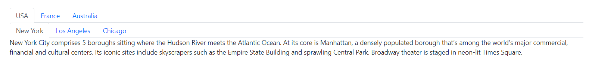

# Add Nested Tabs in Blazor Tabs Component

The Tabs component supports rendering nested tabs by defining inner `SfTab` elements within the `ContentTemplate` of the parent `TabItem`.

```cshtml
@using Syncfusion.Blazor.Navigations

<SfTab>
    <TabItems>
        <TabItem>
            <ContentTemplate>
                <SfTab>
                    <TabItems>
                        <TabItem Content="New York City comprises 5 boroughs sitting where the Hudson River meets the Atlantic Ocean. At its core is Manhattan, a densely populated borough that’s among the world’s major commercial, financial and cultural centers. Its iconic sites include skyscrapers such as the Empire State Building and sprawling Central Park. Broadway theater is staged in neon-lit Times Square.">
                            <ChildContent>
                                <TabHeader Text="New York"></TabHeader>
                            </ChildContent>
                        </TabItem>
                        <TabItem Content="Los Angeles is a sprawling Southern California city and the center of the nation’s film and television industry. Near its iconic Hollywood sign, studios such as Paramount Pictures, Universal and Warner Brothers offer behind-the-scenes tours. On Hollywood Boulevard, TCL Chinese Theatre displays celebrities’ hand- and footprints, the Walk of Fame honors thousands of luminaries and vendors sell maps to stars’ homes.">
                            <ChildContent>
                                <TabHeader Text="Los Angeles"></TabHeader>
                            </ChildContent>
                        </TabItem>
                        <TabItem Content="Chicago, on Lake Michigan in Illinois, is among the largest cities in the U.S. Famed for its bold architecture, it has a skyline punctuated by skyscrapers such as the iconic John Hancock Center, 1,451-ft. Willis Tower (formerly the Sears Tower) and the neo-Gothic Tribune Tower. The city is also renowned for its museums, including the Art Institute of Chicago with its noted Impressionist and Post-Impressionist works.">
                            <ChildContent>
                                <TabHeader Text="Chicago"></TabHeader>
                            </ChildContent>
                        </TabItem>
                    </TabItems>
                </SfTab>
            </ContentTemplate>
            <ChildContent>
                <TabHeader Text="USA"></TabHeader>
            </ChildContent>
        </TabItem>
        <TabItem>
            <ContentTemplate>
                <SfTab>
                    <TabItems>
                        <TabItem Content="Paris, France capital, is a major European city and a global center for art, fashion, gastronomy and culture. Its 19th-century cityscape is crisscrossed by wide boulevards and the River Seine. Beyond such landmarks as the Eiffel Tower and the 12th-century, Gothic Notre-Dame cathedral, the city is known for its cafe culture and designer boutiques along the Rue du Faubourg Saint-Honoré.">
                            <ChildContent>
                                <TabHeader Text="Paris"></TabHeader>
                            </ChildContent>
                        </TabItem>
                        <TabItem Content="Marseille, a port city in southern France, has been a crossroads of immigration and trade since its founding by the Greeks circa 600 B.C. At its heart is the Vieux-Port (Old Port), where fishmongers sell their catch along the boat-lined quay. Basilique Notre-Dame-de-la-Garde is a Romanesque-Byzantine church. Modern landmarks include Le Corbusier’s influential Cité Radieuse complex and Zaha Hadid’s CMA CGM Tower.">
                            <ChildContent>
                                <TabHeader Text="Marseille"></TabHeader>
                            </ChildContent>
                        </TabItem>
                        <TabItem Content="Lyon, the capital city in France’s Auvergne-Rhône-Alpes region, sits at the junction of the Rhône and Saône rivers. Its center reflects 2,000 years of history from the Roman Amphithéâtre des Trois Gaules, medieval and Renaissance architecture in Vieux (Old) Lyon, to the modern Confluence district on Presquîle peninsula. Traboules, covered passageways between buildings, connect Vieux Lyon and La Croix-Rousse hill.">
                            <ChildContent>
                                <TabHeader Text="Lyon"></TabHeader>
                            </ChildContent>
                        </TabItem>
                    </TabItems>
                </SfTab>
            </ContentTemplate>
            <ChildContent>
                <TabHeader Text="France"></TabHeader>
            </ChildContent>
        </TabItem>
        <TabItem>
            <ContentTemplate>
                <SfTab>
                    <TabItems>
                        <TabItem Content="Sydney, capital of New South Wales and one of Australia largest cities, is best known for its harbourfront Sydney Opera House, with a distinctive sail-like design. Massive Darling Harbour and the smaller Circular Quay port are hubs of waterside life, with the arched Harbour Bridge and esteemed Royal Botanic Garden nearby. Sydney Tower’s outdoor platform, the Skywalk, offers 360-degree views of the city and suburbs.">
                            <ChildContent>
                                <TabHeader Text="Sydney"></TabHeader>
                            </ChildContent>
                        </TabItem>
                        <TabItem Content="Melbourne is the coastal capital of the southeastern Australian state of Victoria. At the city centre is the modern Federation Square development, with plazas, bars, and restaurants by the Yarra River. In the Southbank area, the Melbourne Arts Precinct is the site of Arts Centre Melbourne – a performing arts complex – and the National Gallery of Victoria, with Australian and indigenous art">
                            <ChildContent>
                                <TabHeader Text="Melbourne"></TabHeader>
                            </ChildContent>
                        </TabItem>
                        <TabItem Content="Brisbane, capital of Queensland, is a large city on the Brisbane River. Clustered in its South Bank cultural precinct are the Queensland Museum and Sciencentre, with noted interactive exhibitions. Another South Bank cultural institution is Queensland Gallery of Modern Art, among Australia major contemporary art museums. Looming over the city is Mt. Coot-tha, site of Brisbane Botanic Gardens.">
                            <ChildContent>
                                <TabHeader Text="Brisbane"></TabHeader>
                            </ChildContent>
                        </TabItem>
                    </TabItems>
                </SfTab>
            </ContentTemplate>
            <ChildContent>
                <TabHeader Text="Australia"></TabHeader>
            </ChildContent>
        </TabItem>
    </TabItems>
</SfTab>
```



