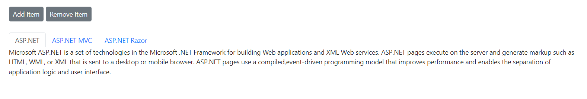
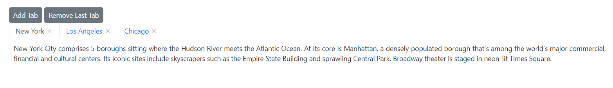

# Add/Remove Tab Items in Blazor Tabs Component

The Tabs component supports adding or removing specified tab items dynamically using the following methods:

* Using conditional rendering.
* Using public methods.

## Using Conditional Rendering

Tab items can be added or removed dynamically by conditionally rendering them within a `foreach` loop.

In the following demo, initially, three tabs are present based on the `TabItems` collection. When the `Add Item` button is clicked, a new item is added to `TabItems`, resulting in a new (fourth) tab being displayed. Clicking the `Remove Item` button removes the first item from `TabItems`, which, in turn, removes the first tab from the Tabs component.

```cshtml
@using Syncfusion.Blazor.Navigations
@using Syncfusion.Blazor.Buttons

<SfButton @onclick="AddItemClick" Content="Add Item"></SfButton>
<SfButton @onclick="RemoveItemClick" Content="Remove Item"></SfButton>
<br />
<br />

<SfTab>
    <TabItems>
        @foreach (TabData Item in TabItems)
        {
            <TabItem>
                <HeaderTemplate>
                    <div>@(Item.Header)</div>
                </HeaderTemplate>
                <ContentTemplate>
                    <div>@(Item.Content)</div>
                </ContentTemplate>
            </TabItem>
        }
    </TabItems>
</SfTab>


@code {
    List<TabData> TabItems = new List<TabData>()
    {
        new TabData
        {
        Header = "ASP.NET",
        Content = "Microsoft ASP.NET is a set of technologies in the Microsoft .NET Framework for building Web applications and XML Web services. ASP.NET pages execute on the server and generate markup such as HTML, WML, or XML that is sent to a desktop or mobile browser. ASP.NET pages use a compiled,event-driven programming model that improves performance and enables the separation of application logic and user interface."
        },
        new TabData
        {
        Header = "ASP.NET MVC",
        Content = "The Model-View-Controller (MVC) architectural pattern separates an application into three main components: the model, the view, and the controller. The ASP.NET MVC framework provides an alternative to the ASP.NET Web Forms pattern for creating Web applications. The ASP.NET MVC framework is a lightweight, highly testable presentation framework that (as with Web Forms-based applications) is integrated with existing ASP.NET features, such as master pages and membership-based authentication."
        },
        new TabData
        {
        Header = "ASP.NET Razor",
        Content = "Razor is an ASP.NET programming syntax used to create dynamic web pages with the C# or Visual Basic .NET programming languages. Razor was in development in June 2010 and was released for Microsoft Visual Studio 2010 in January 2011. Razor is a simple-syntax view engine and was released as part of MVC 3 and the WebMatrix tool set. Side Code content"
        }
    };
    public class TabData
    {
        public string Header { get; set; }
        public string Content { get; set; }
    }
    void AddItemClick()
    {
        TabItems.Add(new TabData
        {
            Header = "JavaScript",
            Content = "JavaScript (JS) is an interpreted computer programming language.It was originally implemented as part of web browsers so that client-side scripts could interact with the user, control the browser, communicate asynchronously, and alter the document content that was displayed."
        });
    }
    void RemoveItemClick()
    {
        if (TabItems.Count > 0)
        {
            TabItems.RemoveAt(0);
        }
    }
}
```





## Using Public Methods

Tabs can be added dynamically by passing a list of `TabItem` objects and an index value to the `AddTab` method. Tab items can be removed by passing the item's index to the `RemoveTab` method. Tab items can also be removed by clicking the close icon, which appears on the tab header when the `ShowCloseButton` property is set to `true`.

In the following demo, a tab item can be added as first tab and removed as the last tab item by clicking the **Add Tab** and **Remove Last Tab** buttons respectively.

```cshtml
@using Syncfusion.Blazor.Navigations
@using Syncfusion.Blazor.Buttons

<SfButton OnClick="AddItemClick" Content="Add Tab"></SfButton>
<SfButton OnClick="RemoveItemClick" Content="Remove Last Tab"></SfButton>
<br/>
<SfTab @ref="Tab" ShowCloseButton="true">
    <TabItems>
        <TabItem Content="New York City comprises 5 boroughs sitting where the Hudson River meets the Atlantic Ocean. At its core is Manhattan, a densely populated borough that’s among the world’s major commercial, financial and cultural centers. Its iconic sites include skyscrapers such as the Empire State Building and sprawling Central Park. Broadway theater is staged in neon-lit Times Square.">
            <ChildContent>
                <TabHeader Text="New York"></TabHeader>
            </ChildContent>
        </TabItem>
        <TabItem Content="Los Angeles is a sprawling Southern California city and the center of the nation’s film and television industry. Near its iconic Hollywood sign, studios such as Paramount Pictures, Universal and Warner Brothers offer behind-the-scenes tours. On Hollywood Boulevard, TCL Chinese Theatre displays celebrities’ hand- and footprints, the Walk of Fame honors thousands of luminaries and vendors sell maps to stars’ homes.">
            <ChildContent>
                <TabHeader Text="Los Angeles"></TabHeader>
            </ChildContent>
        </TabItem>
        <TabItem Content="Chicago, on Lake Michigan in Illinois, is among the largest cities in the U.S. Famed for its bold architecture, it has a skyline punctuated by skyscrapers such as the iconic John Hancock Center, 1,451-ft. Willis Tower (formerly the Sears Tower) and the neo-Gothic Tribune Tower. The city is also renowned for its museums, including the Art Institute of Chicago with its noted Impressionist and Post-Impressionist works.">
            <ChildContent>
                <TabHeader Text="Chicago"></TabHeader>
            </ChildContent>
        </TabItem>
    </TabItems>
</SfTab>

@code{
    SfTab Tab;
    List<TabItem> TabData;
    public void AddItemClick()
    {
        TabData = new List<TabItem>()
        {
            new TabItem() { Header = new TabHeader() { Text = "Sydney" }, Content = "Sydney, capital of New South Wales and one of Australia largest cities, is best known for its harbourfront Sydney Opera House, with a distinctive sail-like design. Massive Darling Harbour and the smaller Circular Quay port are hubs of waterside life, with the arched Harbour Bridge and esteemed Royal Botanic Garden nearby. Sydney Tower’s outdoor platform, the Skywalk, offers 360-degree views of the city and suburbs." }
        };
        Tab.AddTab(TabData, 0);
    }
    public void RemoveItemClick()
    {
        Tab.RemoveTab(Tab.Items.Count - 1);
    }
}

<style>
    .e-content .e-item {
        font-size: 12px;
        margin: 10px;
        text-align: justify;
    }
</style>
```


