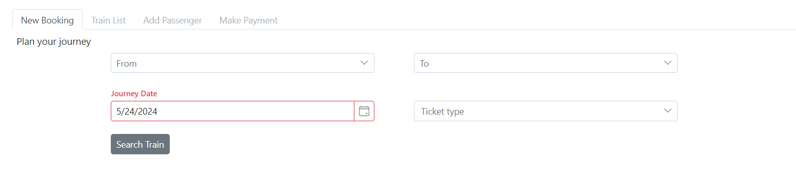

# Create Wizard in Blazor Tabs Component

Tab items can be disabled during initial control rendering by passing the tab index and a boolean value to the [EnableTab](https://help.syncfusion.com/cr/blazor/Syncfusion.Blazor.Navigations.SfTab.html#Syncfusion_Blazor_Navigations_SfTab_EnableTab_System_Int32_System_Boolean_) public method.

In the below Wizard sample, each tab is integrated with required components to complete the reservation. Each field is provided with validation for all mandatory option to proceed to next tabs. Using tab item's template property the components are added into content.

Create the following contents for each tab in the wizard.
1. **Search tab:**
   Created with `DropDownList` to select the source, destination and type of ticket. A `DatePicker` for choosing the date of journey.
2. **Train tab:**
   Based on the selected start and end point, populate the Grid with random list of available seats and train list. Initially define the columns and row selected event for validating, after the source and destination chosen update the `DataSource` for the Grid.
3. **Passenger tab:**
   A table with Textbox, Numeric, DropDownList for adding passenger name, age, gender and preferred berth/seat. Add validation on entering passenger details to proceed.
4. **Payment tab:**
   Calculate the ticket cost and generate data for Grid with passenger details, train number and ticket cost summary.

Users can navigate back to previous tabs using dedicated buttons within each content section. Navigation via tab headers is initially disabled to enforce linear progression.

```cshtml
@using Syncfusion.Blazor.Navigations
@using Syncfusion.Blazor.DropDowns
@using Syncfusion.Blazor.Calendars
@using Syncfusion.Blazor.Grids
@using Syncfusion.Blazor.Inputs
@using Syncfusion.Blazor.Popups
@using Syncfusion.Blazor.Buttons

<div class="control-section e-tab-section">
    <SfTab @ref="Tab" ID="BlazorTab" Height="390">
        <TabEvents Created="TabCreate"></TabEvents>
        <TabItems>
            <TabItem>
                <ChildContent>
                    <TabHeader Text="New Booking"></TabHeader>
                </ChildContent>
                <ContentTemplate>
                    <div id="booking">
                        <div class="wizard-title">Plan your journey</div>
                        <div class="responsive-align">
                            <div class="row">
                                <div class="col-xs-6 col-sm-6 col-lg-6 col-md-6 search-item">
                                    <SfDropDownList TValue="string" TItem="CitiesFields" @ref="StartPoint" Width="100%" DataSource="@CitiesData" Placeholder="From">
                                        <DropDownListFieldSettings Text="Name" Value="Name"></DropDownListFieldSettings>
                                    </SfDropDownList>
                                </div>
                                <div class="col-xs-6 col-sm-6 col-lg-6 col-md-6 search-item">
                                    <SfDropDownList @ref="EndPoint" TValue="string" TItem="CitiesFields" Width="100%" DataSource="@CitiesData" Placeholder="To">
                                        <DropDownListFieldSettings Text="Name" Value="Name"></DropDownListFieldSettings>
                                    </SfDropDownList>
                                </div>
                            </div>
                            <div class="row">
                                <div class="col-xs-6 col-sm-6 col-lg-6 col-md-6 search-item">
                                    <SfDatePicker @ref="Date" Width="100%" Placeholder="Journey Date" FloatLabelType="FloatLabelType.Auto" TValue="DateTime?" Value="@(DateTime.Now)" Min="@(DateTime.Now)" Max="@(DateTime.Now.AddMonths(3))"></SfDatePicker>
                                </div>
                                <div class="col-xs-6 col-sm-6 col-lg-6 col-md-6 search-item">
                                    <SfDropDownList @ref="Quota" TValue="string" TItem="DropdownFields" FloatLabelType="FloatLabelType.Auto" DataSource="@QuotaList" Placeholder="Ticket type">
                                        <DropDownListFieldSettings Text="Text" Value="Text"></DropDownListFieldSettings>
                                    </SfDropDownList>
                                </div>
                            </div>
                            <div class="btn-container">
                                <SfButton @onclick="SearchButtonClick">Search Train</SfButton>
                            </div>
                            @if (EmptyField)
                            {
                                <span class="error">* Please fill all the details before proceeding</span>
                            }
                            @if (SameField)
                            {
                                <span class="error">* Arrival point can't be same as Departure</span>
                            }
                        </div>
                    </div>
                </ContentTemplate>
            </TabItem>
            <TabItem>
                <ChildContent>
                    <TabHeader Text="Train List"></TabHeader>
                </ChildContent>
                <ContentTemplate>
                    <div id="selectTrain">
                        <div class="wizard-title">Select the train from the list </div>
                        <SfGrid @ref="AvailableTrain" Width="100%" TValue="GridFields" DataSource="@GridData">
                            <GridEvents RowSelected="SelectedTrainDetails" TValue="GridFields"></GridEvents>
                            <GridColumns>
                                <GridColumn Field=@nameof(GridFields.TrainNo) HeaderText="Train No" Width="120" Type="ColumnType.Integer"></GridColumn>
                                <GridColumn Field=@nameof(GridFields.Name) Width="140"></GridColumn>
                                <GridColumn Field=@nameof(GridFields.Departure) HeaderText="Departure" Width="120"></GridColumn>
                                <GridColumn Field=@nameof(GridFields.Arrival) HeaderText="Arrival" Width="140"></GridColumn>
                                <GridColumn Field=@nameof(GridFields.Availability) HeaderText="Availability" Width="140" Type="ColumnType.Integer"></GridColumn>
                            </GridColumns>
                        </SfGrid>
                        <br />
                        <div class="btn-container">
                            <SfButton @onclick="@SelectTrainBack">Back</SfButton>
                            <SfButton @onclick="@SelectTrainContinue">Continue</SfButton>
                        </div>
                        @if (EmptyField)
                        {
                            <span class="error">* Select your convenient train</span>
                        }
                    </div>
                </ContentTemplate>
            </TabItem>
            <TabItem>
                <ChildContent>
                    <TabHeader Text="Add Passenger"></TabHeader>
                </ChildContent>
                <ContentTemplate>
                    <div id="details">
                        <div class="details-page wizard-title">Enter the passenger details</div>
                        <div id="PassengersList">
                            <table id="passenger-table">
                                <colgroup>
                                    <col />
                                    <col />
                                    <col />
                                    <col />
                                    <col />
                                    <col />
                                </colgroup>
                                <thead>
                                    <tr>
                                        <th class="name-header">Name</th>
                                        <th class="age-header">Age</th>
                                        <th class="gender-header">Gender</th>
                                        <th class="type-header">Berth Preference</th>
                                    </tr>
                                </thead>
                                <tbody>
                                    <tr>
                                        <td>
                                            <SfTextBox @ref="@FirstPassengerName" Placeholder="Passenger Name"></SfTextBox>
                                        </td>
                                        <td>
                                            <SfNumericTextBox @ref="FirstPassengerAge" Min="1" Max="100" Value="18" Format=n0 ShowSpinButton="false"></SfNumericTextBox>
                                        </td>
                                        <td>
                                            <SfDropDownList @ref="FirstPassengerGender" TValue="string" TItem="DropdownFields" Text="Male" DataSource="@Gender">
                                                <DropDownListFieldSettings Text="Text" Value="Text"></DropDownListFieldSettings>
                                            </SfDropDownList>
                                        </td>
                                        <td>
                                            <SfDropDownList @ref="FirstPassengerBerth" TValue="string" TItem="DropdownFields" Placeholder="Optional" DataSource="@Berth">
                                                <DropDownListFieldSettings Text="Text" Value="Text"></DropDownListFieldSettings>
                                            </SfDropDownList>
                                        </td>
                                    </tr>
                                    <tr>
                                        <td>
                                            <SfTextBox @ref="@SecondPassengerName" Placeholder="Passenger Name"></SfTextBox>
                                        </td>
                                        <td>
                                            <SfNumericTextBox @ref="SecondPassengerAge" Min="1" Max="100" Value="18" Format=n0 ShowSpinButton="false"></SfNumericTextBox>
                                        </td>
                                        <td>
                                            <SfDropDownList @ref="SecondPassengerGender" TValue="string" TItem="DropdownFields" Text="Male" DataSource="@Gender">
                                                <DropDownListFieldSettings Text="Text" Value="Text"></DropDownListFieldSettings>
                                            </SfDropDownList>
                                        </td>
                                        <td>
                                            <SfDropDownList @ref="SecondPassengerBerth" TValue="string" TItem="DropdownFields" Placeholder="Optional" DataSource="@Berth">
                                                <DropDownListFieldSettings Text="Text" Value="Text"></DropDownListFieldSettings>
                                            </SfDropDownList>
                                        </td>
                                    </tr>
                                    <tr>
                                        <td>
                                            <SfTextBox @ref="@ThirdPassengerName" Placeholder="Passenger Name"></SfTextBox>
                                        </td>
                                        <td>
                                            <SfNumericTextBox @ref="ThirdPassengerAge" Min="1" Max="100" Value="18" Format=n0 ShowSpinButton="false"></SfNumericTextBox>
                                        </td>
                                        <td>
                                            <SfDropDownList @ref="ThirdPassengerGender" TValue="string" TItem="DropdownFields" Text="Male" DataSource="@Gender">
                                                <DropDownListFieldSettings Text="Text" Value="Text"></DropDownListFieldSettings>
                                            </SfDropDownList>
                                        </td>
                                        <td>
                                            <SfDropDownList @ref="ThirdPassengerBerth" TValue="string" TItem="DropdownFields" Placeholder="Optional" DataSource="@Berth">
                                                <DropDownListFieldSettings Text="Text" Value="Text"></DropDownListFieldSettings>
                                            </SfDropDownList>
                                        </td>
                                    </tr>
                                </tbody>
                            </table>
                        </div>
                        <br />
                        <div class="btn-container">
                            <SfButton @onclick="@PassengerListBack">Back</SfButton>
                            <SfButton @onclick="@PassengerListContinue">Continue</SfButton>
                        </div>
                        @if (EmptyField)
                        {
                            <span class="error">* Please enter passenger details</span>
                        }
                    </div>
                </ContentTemplate>
            </TabItem>
            <TabItem>
                <ChildContent>
                    <TabHeader Text="Make Payment"></TabHeader>
                </ChildContent>
                <ContentTemplate>
                    <div id="confirm">
                        <div class="tab-title1 wizard-title">Confirm the details and proceed</div>
                        <SfGrid @ref="TicketDetailGrid" Width="100%" TValue="PassengerFields" DataSource="@PassengerData">
                            <GridColumns>
                                <GridColumn Field=@nameof(PassengerFields.TrainNo) HeaderText="Train No" Width="120" Type="ColumnType.Integer"></GridColumn>
                                <GridColumn Field=@nameof(PassengerFields.Name) HeaderText="Name" Width="140"></GridColumn>
                                <GridColumn Field=@nameof(PassengerFields.Gender) HeaderText="Gender" Width="120"></GridColumn>
                                <GridColumn Field=@nameof(PassengerFields.Berth) Width="140" Type="ColumnType.Integer"></GridColumn>
                            </GridColumns>
                        </SfGrid>
                        <br />
                        <div id="amount">Total payable amount: $1700</div>
                        <br />
                        <div class="btn-container">
                            <SfButton @onclick="@ConfirmBack">Back</SfButton>
                            <SfButton @onclick="@ConfirmPayment">Pay</SfButton>
                        </div>
                    </div>
                </ContentTemplate>
            </TabItem>
        </TabItems>
    </SfTab>
    <div>
        <SfDialog @ref="AlertDialog" Width=250 Target="#BlazorTab" IsModal=true Visible=false ShowCloseIcon="true">
            <DialogEvents Created="DialogCreate"></DialogEvents>
            <DialogTemplates>
                <Header><div>Success</div></Header>
                <Content><div>Your payment successfully processed</div></Content>
            </DialogTemplates>
            <DialogButtons>
                <DialogButton OnClick="@OnSubmit" Content="OK" IsPrimary="true">
                </DialogButton>
            </DialogButtons>
        </SfDialog>
    </div>
</div>

@code{
    SfTab Tab;
    public SfDropDownList<string, CitiesFields> StartPoint;
    public SfDropDownList<string, CitiesFields> EndPoint;
    public SfDropDownList<string, DropdownFields> Quota;
    public SfGrid<GridFields> AvailableTrain;
    public SfGrid<PassengerFields> TicketDetailGrid;
    public int SelectedTrain { get; set; }
    public string SelectedTrainName { get; set; }
    public Boolean IsSelectedTrain { get; set; } = false;
    SfDialog AlertDialog;
    SfDatePicker<DateTime?> Date;
    SfTextBox FirstPassengerName;
    SfTextBox SecondPassengerName;
    SfTextBox ThirdPassengerName;
    public SfNumericTextBox<int> FirstPassengerAge;
    public SfNumericTextBox<int> SecondPassengerAge;
    public SfNumericTextBox<int> ThirdPassengerAge;
    public SfDropDownList<string, DropdownFields> FirstPassengerGender;
    public SfDropDownList<string, DropdownFields> SecondPassengerGender;
    public SfDropDownList<string, DropdownFields> ThirdPassengerGender;
    public SfDropDownList<string, DropdownFields> FirstPassengerBerth;
    public SfDropDownList<string, DropdownFields> SecondPassengerBerth;
    public SfDropDownList<string, DropdownFields> ThirdPassengerBerth;
    public bool EmptyField { get; set; } = false;
    public bool SameField { get; set; } = false;

    public List<PassengerFields> PassengerData;
    public class CitiesFields
    {
        public string Name { get; set; }
        public int Fare { get; set; }
    }
    public List<CitiesFields> CitiesData = new List<CitiesFields>()
    {
        new CitiesFields() { Name = "Chicago", Fare = 300 },
        new CitiesFields() { Name = "San Francisco", Fare = 125 },
        new CitiesFields() { Name = "Los Angeles", Fare = 175 },
        new CitiesFields() { Name = "Seattle", Fare = 250 },
        new CitiesFields() { Name = "Florida", Fare = 150 }
    };
    public class DropdownFields
    {
        public string ID { get; set; }
        public string Text { get; set; }
    }
    public List<DropdownFields> QuotaList = new List<DropdownFields>()
    {
        new DropdownFields { ID = "1", Text = "Business Class" },
        new DropdownFields { ID = "2", Text = "Economy Class" },
        new DropdownFields { ID = "3", Text = "Common Class" }
    };
    public async Task SearchButtonClick()
    {
        if ((StartPoint.Value == null) || (EndPoint.Value == null) || (Quota.Value == null))
        {
            EmptyField = true;
        }
        else if (StartPoint.Value == EndPoint.Value)
        {
            SameField = true;
        }
        else
        {
            EmptyField = false;
            SameField = false;
            GridData = new List<GridFields>() {
                new GridFields
                {
                    TrainNo = 1000,
                    Name = "Train" + "1",
                    Departure = StartPoint.Value,
                    Arrival = EndPoint.Value,
                    Availability = 30
                },
                new GridFields
                {
                    TrainNo = 1002,
                    Name = "Train" + "2",
                    Departure = StartPoint.Value,
                    Arrival = EndPoint.Value,
                    Availability = 28
                }
            };
            await Tab.EnableTabAsync(1, true);
            await Tab.SelectAsync(1);
        }
    }
    public void SelectedTrainDetails(RowSelectEventArgs<GridFields> args)
    {
        IsSelectedTrain = true;
        if (IsSelectedTrain)
        {
            EmptyField = false;
            SelectedTrain = args.Data.TrainNo;
        }
        else
        {
            EmptyField = true;
        }
    }
    public class GridFields
    {
        public int TrainNo { get; set; }
        public string Name { get; set; }
        public string Departure { get; set; }
        public string Arrival { get; set; }
        public int Availability { get; set; }
    }
    public class PassengerFields
    {
        public int TrainNo { get; set; }
        public string Name { get; set; }
        public string Gender { get; set; }
        public string Berth { get; set; }
    }
    public List<GridFields> GridData;
    public List<DropdownFields> Gender = new List<DropdownFields>() {
        new DropdownFields { ID = "1", Text = "Male" },
        new DropdownFields { ID = "2", Text = "Female" }
    };
    public List<DropdownFields> Berth = new List<DropdownFields>()
    {
        new DropdownFields { ID = "1", Text = "Upper" },
        new DropdownFields { ID = "2", Text = "Lower" },
        new DropdownFields { ID = "2", Text = "Middle" },
        new DropdownFields { ID = "2", Text = "Window" },
        new DropdownFields { ID = "2", Text = "Aisle" }
    };
    public async Task TabCreate()
    {
        await Tab.EnableTabAsync(1, false);
        await Tab.EnableTabAsync(2, false);
        await Tab.EnableTabAsync(3, false);
    }
    public async Task SelectTrainBack()
    {
        await Tab.SelectAsync(0);
    }
    public async Task SelectTrainContinue()
    {
        if (IsSelectedTrain)
        {
            EmptyField = false;
            await Tab.EnableTabAsync(2, true);
            await Tab.SelectAsync(2);
        }
        else
        {
            await Tab.EnableTabAsync(2, false);
            EmptyField = true;
        }
    }
    public async Task PassengerListBack()
    {
        await Tab.SelectAsync(1);
    }
    public async Task PassengerListContinue()
    {
        if (FirstPassengerName.Value == null)
        {
            EmptyField = true;
        }
        else
        {
            EmptyField = false;
            await Tab.EnableTabAsync(3, true);
            await Tab.SelectAsync(3);
            PassengerData = new List<PassengerFields>();
            if (FirstPassengerName.Value != null)
            {
                PassengerData.Add(new PassengerFields
                {
                    TrainNo = SelectedTrain,
                    Name = FirstPassengerName.Value,
                    Gender = FirstPassengerGender.Value,
                    Berth = FirstPassengerBerth.Value
                });
            }
            if (SecondPassengerName.Value != null)
            {
                PassengerData.Add(new PassengerFields
                {
                    TrainNo = SelectedTrain,
                    Name = SecondPassengerName.Value,
                    Gender = SecondPassengerGender.Value,
                    Berth = SecondPassengerBerth.Value
                });
            }
            if (ThirdPassengerName.Value != null)
            {
                PassengerData.Add(new PassengerFields
                {
                    TrainNo = SelectedTrain,
                    Name = ThirdPassengerName.Value,
                    Gender = ThirdPassengerGender.Value,
                    Berth = ThirdPassengerBerth.Value
                });
            }
        }
    }
    public async Task ConfirmBack()
    {
        await Tab.SelectAsync(2);
    }
    public async Task ConfirmPayment()
    {
        await AlertDialog.ShowAsync();
    }
    public async Task DialogCreate()
    {
        await AlertDialog.HideAsync();
    }
    public async Task OnSubmit(Object args)
    {
        await AlertDialog.HideAsync();
        await Tab.EnableTabAsync(0, true);
        await Tab.EnableTabAsync(1, false);
        await Tab.EnableTabAsync(2, false);
        await Tab.EnableTabAsync(3, false);
        await Tab.SelectAsync(0);
    }
}

<style>
    .wizard-title {
        font-size: 15px;
        padding: 7px;
    }

    .responsive-align {
        width: 75%;
        margin: 0 auto;
    }

    .error {
        color: red;
    }

    .search-item {
        padding-right: 50px;
        padding-bottom: 20px;
    }

    #amount {
        text-align: right;
        font-size: 15px;
        padding: 15px 0px;
    }

    #passenger-table th {
        text-align: center;
        font-size: 14px;
        font-weight: 400;
        border: 1px solid gainsboro;
    }

    #passenger-table td, th {
        padding: 10px;
    }

    #passenger-table td {
        border: 1px solid gainsboro;
    }
</style>
```


