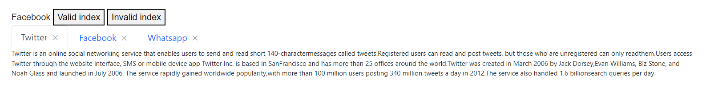
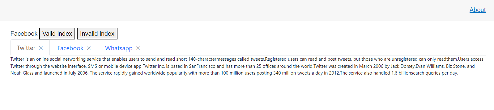

#  Get tab item through Id/Index in Blazor Tabs Component
 
Tabs provides support to get tab items using following ways.
* Using unique Id.
* Using index value.

## Getting tab items using unique Id

The [ID](https://help.syncfusion.com/cr/blazor/Syncfusion.Blazor.Navigations.SfTab.html#Syncfusion_Blazor_Navigations_SfTab_ID) property of the Tab item is used to get tab item by id. In the following demo, specified tab item is called dynamically by its unique id when the **Valid index** button is clicked.

```cshtml

@using Syncfusion.Blazor.Navigations

@Logs

<button @onclick='()=>TabItemById("1")'>Valid Id</button>
<button @onclick='()=>TabItemById("11111")'>Invalid ID</button>

<SfTab ShowCloseButton=true @ref="tab">
    <TabItems>
        <TabItem ID="1" Content="Twitter is an online social networking service that enables users to send and read short 140-charactermessages called tweets.Registered users can read and post tweets, but those who are unregistered can only readthem.Users access Twitter through the website interface, SMS or mobile device app Twitter Inc. is based in SanFrancisco and has more than 25 offices around the world.Twitter was created in March 2006 by Jack Dorsey,Evan Williams, Biz Stone, and Noah Glass and launched in July 2006. The service rapidly gained worldwide popularity,with more than 100 million users posting 340 million tweets a day in 2012.The service also handled 1.6 billionsearch queries per day.">
            <ChildContent>
                <TabHeader Text="Twitter"></TabHeader>
            </ChildContent>
        </TabItem>
        <TabItem ID="2" Content="Facebook is an online social networking service headquartered in Menlo Park, California. Its website waslaunched on February 4, 2004, by Mark Zuckerberg with his Harvard College roommates and fellow students EduardoSaverin, Andrew McCollum, Dustin Moskovitz and Chris Hughes.">
            <ChildContent>
                <TabHeader Text="Facebook"></TabHeader>
            </ChildContent>
        </TabItem>
        <TabItem ID="3" Content="WhatsApp Messenger is a proprietary cross-platform instant messaging client for smartphones that operatesunder a subscription business model.It uses the Internet to send text messages, images, video, user location andaudio media messages to other users using standard cellular mobile numbers. As of February 2016, WhatsApp had a userbase of up to one billion,[10] making it the most globally popular messaging application.WhatsApp Inc., based inMountain View, California, was acquired by Facebook Inc.on February 19, 2014, for approximately US$19.3 billion.">
            <ChildContent>
                <TabHeader Text="Whatsapp"></TabHeader>
            </ChildContent>
        </TabItem>
    </TabItems>
 </SfTab>


@code{
    public string Logs { get; set; }
    private SfTab tab;
    public void TabItemById(string id)
    {
        var items = tab.GetTabItemById(id); 
        if(items != null)
        {
            Logs = items.Header.Text;
        }
        else
        {
            Logs = "Invalid Id";
        }

    }
 }

 ```

 

 ## Getting tab items using index value.

 Tab items can be called using its unique index which is created automatically.In the following demo, specified tab item is called dynamically by its unique index when the **Valid index** button is clicked.

 ```cshtml

 @using Syncfusion.Blazor.Navigations

@Logs

<button @onclick='()=>TabItembyIndex(1)'>Valid index</button>
<button @onclick='()=>TabItembyIndex(-1)'>Invalid index</button>

<SfTab ShowCloseButton=true @ref="tab">
    <TabItems>
        <TabItem ID="1" Content="Twitter is an online social networking service that enables users to send and read short 140-charactermessages called tweets.Registered users can read and post tweets, but those who are unregistered can only readthem.Users access Twitter through the website interface, SMS or mobile device app Twitter Inc. is based in SanFrancisco and has more than 25 offices around the world.Twitter was created in March 2006 by Jack Dorsey,Evan Williams, Biz Stone, and Noah Glass and launched in July 2006. The service rapidly gained worldwide popularity,with more than 100 million users posting 340 million tweets a day in 2012.The service also handled 1.6 billionsearch queries per day.">
            <ChildContent>
                <TabHeader Text="Twitter"></TabHeader>
            </ChildContent>
        </TabItem>
        <TabItem ID="2" Content="Facebook is an online social networking service headquartered in Menlo Park, California. Its website waslaunched on February 4, 2004, by Mark Zuckerberg with his Harvard College roommates and fellow students EduardoSaverin, Andrew McCollum, Dustin Moskovitz and Chris Hughes.">
            <ChildContent>
                <TabHeader Text="Facebook"></TabHeader>
            </ChildContent>
        </TabItem>
        <TabItem ID="3" Content="WhatsApp Messenger is a proprietary cross-platform instant messaging client for smartphones that operatesunder a subscription business model.It uses the Internet to send text messages, images, video, user location andaudio media messages to other users using standard cellular mobile numbers. As of February 2016, WhatsApp had a userbase of up to one billion,[10] making it the most globally popular messaging application.WhatsApp Inc., based inMountain View, California, was acquired by Facebook Inc.on February 19, 2014, for approximately US$19.3 billion.">
            <ChildContent>
                <TabHeader Text="Whatsapp"></TabHeader>
            </ChildContent>
        </TabItem>
    </TabItems>
 </SfTab>


@code{
    public string Logs { get; set; }
    private SfTab tab;
    public void TabItembyIndex(int index)
    {
        var items = tab.GetTabItemByIndex(index);
        if(items != null)
        {
            Logs = items.Header.Text;
        }
        else
        {
            Logs = "Invalid Index";
        }
    }
 }

 ```

 