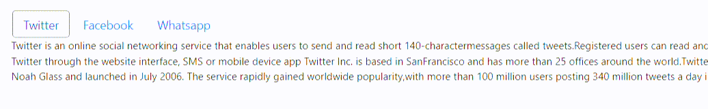

# Enabling Tab Key Navigation for Tab Items in Blazor Tabs Component

The [TabIndex](https://help.syncfusion.com/cr/blazor/Syncfusion.Blazor.Navigations.TabItem.html#Syncfusion_Blazor_Navigations_TabItem_TabIndex ) property of a `TabItem` enables tab key navigation for that specific item. When a positive value is assigned to the `TabIndex` property, users can switch focus to the next or previous tab item using the <kbd>Tab</kbd> or <kbd>Shift</kbd>+<kbd>Tab</kbd> keys, enabling a custom navigation order. By default, users can only switch between tab items using the arrow keys.

If the [TabIndex](https://help.syncfusion.com/cr/blazor/Syncfusion.Blazor.Navigations.TabItem.html#Syncfusion_Blazor_Navigations_TabItem_TabIndex ) value is set to `0` for all tab items, navigation follows the natural tab order of elements on the page. This means that if tab items are listed in a specific order on the page, users will navigate through them using the <kbd>Tab</kbd> key in that same order.

To use the [TabIndex](https://help.syncfusion.com/cr/blazor/Syncfusion.Blazor.Navigations.TabItem.html#Syncfusion_Blazor_Navigations_TabItem_TabIndex ) property, assign a non-negative integer to the property of each tab item that should be included in the tab key navigation order.

```cshtml

@using Syncfusion.Blazor.Navigations
@using Syncfusion.Blazor.Buttons

<SfTab>
    <TabItems>
        <TabItem TabIndex=0 Content="Twitter is an online social networking service that enables users to send and read short 140-charactermessages called tweets.Registered users can read and post tweets, but those who are unregistered can only readthem.Users access Twitter through the website interface, SMS or mobile device app Twitter Inc. is based in SanFrancisco and has more than 25 offices around the world.Twitter was created in March 2006 by Jack Dorsey,Evan Williams, Biz Stone, and Noah Glass and launched in July 2006. The service rapidly gained worldwide popularity,with more than 100 million users posting 340 million tweets a day in 2012.The service also handled 1.6 billionsearch queries per day.">
            <ChildContent>
                <TabHeader Text="Twitter"></TabHeader>
            </ChildContent>
        </TabItem>
        <TabItem TabIndex=0 Content="Facebook is an online social networking service headquartered in Menlo Park, California. Its website waslaunched on February 4, 2004, by Mark Zuckerberg with his Harvard College roommates and fellow students EduardoSaverin, Andrew McCollum, Dustin Moskovitz and Chris Hughes.">
            <ChildContent>
                <TabHeader Text="Facebook"></TabHeader>
            </ChildContent>
        </TabItem>
        <TabItem TabIndex=0 Content="WhatsApp Messenger is a proprietary cross-platform instant messaging client for smartphones that operatesunder a subscription business model.It uses the Internet to send text messages, images, video, user location andaudio media messages to other users using standard cellular mobile numbers. As of February 2016, WhatsApp had a userbase of up to one billion,[10] making it the most globally popular messaging application.WhatsApp Inc., based inMountain View, California, was acquired by Facebook Inc.on February 19, 2014, for approximately US$19.3 billion.">
            <ChildContent>
                <TabHeader Text="Whatsapp"></TabHeader>
            </ChildContent>
        </TabItem>
    </TabItems>
</SfTab>

```



