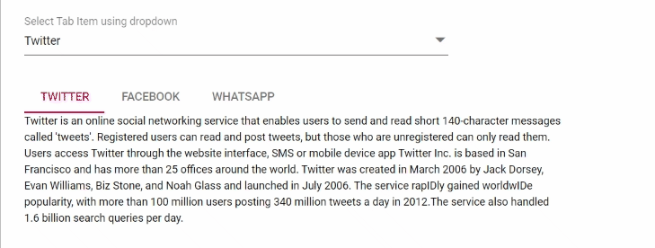

# Find whether the tab is selected programmatically or user interaction in Blazor Tabs Component

We can able to find the tab selection whether it is selected by user interaction or programmatically way in the [Selecting](https://help.syncfusion.com/cr/blazor/Syncfusion.Blazor.Navigations.TabEvents.html#Syncfusion_Blazor_Navigations_TabEvents_Selecting) and [Selected](https://help.syncfusion.com/cr/blazor/Syncfusion.Blazor.Navigations.TabEvents.html#Syncfusion_Blazor_Navigations_TabEvents_Selected) event argument with the field of `IsInteracted`. When the user changes the tab through click actions it will return true otherwise, it will return false. The following code example depicts to find the tab selecting the state in selecting and selected events.

```cshtml

@using Syncfusion.Blazor.Navigations
@using Syncfusion.Blazor.DropDowns

<div class="row">
    <div class="col-xs-6 col-sm-6 col-lg-6 col-md-6">
        <SfDropDownList TValue="int" TItem="DropdownData" FloatLabelType="Syncfusion.Blazor.Inputs.FloatLabelType.Always" @bind-Index="@workIndex" Placeholder="Select Tab Item using dropdown" DataSource="@DropdownDatasource">
            <DropDownListFieldSettings Text="Text" Value="ID"></DropDownListFieldSettings>
            <DropDownListEvents TValue="int" TItem="DropdownData" ValueChange="OnChange"></DropDownListEvents>
        </SfDropDownList>
    </div>
</div>
<br />

<div class="eventlog" style="word-break: normal;">
    <span><b>@EventLog</b></span>
</div>
<SfTab @ref="Tab" Width="600px">
    <TabEvents Selecting="Selecting" Selected="Selected">
    </TabEvents>
    <TabItems>
        <TabItem Content="@Content1">
            <ChildContent>
                <TabHeader Text="Twitter"></TabHeader>
            </ChildContent>
        </TabItem>
        <TabItem Content="@Content2">
            <ChildContent>
                <TabHeader Text="Facebook"></TabHeader>
            </ChildContent>
        </TabItem>
        <TabItem Content="@Content3">
            <ChildContent>
                <TabHeader Text="WhatsApp"></TabHeader>
            </ChildContent>
        </TabItem>
    </TabItems>
</SfTab>

@code{

    SfTab Tab;

    private int? workIndex { get; set; } = 0;
    String EventLog = null;

    public string Content1 = "Twitter is an online social networking service that enables users to send and read short 140-character " +
        "messages called 'tweets'. Registered users can read and post tweets, but those who are unregistered can only read " +
        "them. Users access Twitter through the website interface, SMS or mobile device app Twitter Inc. is based in San " +
        "Francisco and has more than 25 offices around the world. Twitter was created in March 2006 by Jack Dorsey, " +
        "Evan Williams, Biz Stone, and Noah Glass and launched in July 2006. The service rapIDly gained worldwIDe popularity, " +
        "with more than 100 million users posting 340 million tweets a day in 2012.The service also handled 1.6 billion " +
        "search queries per day.";
    public string Content2 = "Facebook is an online social networking service headquartered in Menlo Park, California. Its website was " +
            "launched on February 4, 2004, by Mark Zuckerberg with his Harvard College roommates and fellow students Eduardo " +
            "Saverin, Andrew McCollum, Dustin Moskovitz and Chris Hughes.The founders had initially limited the website  " +
            "membership to Harvard students, but later expanded it to colleges in the Boston area, the Ivy League, and Stanford " +
            "University. It gradually added support for students at various other universities and later to high-school students.";
    public string Content3 = "WhatsApp Messenger is a proprietary cross-platform instant messaging client for smartphones that operates " +
            "under a subscription business model. It uses the Internet to send Text messages, images, vIDeo, user location and " +
            "audio media messages to other users using standard cellular mobile numbers. As of February 2016, WhatsApp had a user  " +
            "base of up to one billion,[10] making it the most globally popular messaging application. WhatsApp Inc., based in " +
            "Mountain View, California, was acquired by Facebook Inc. on February 19, 2014, for approximately US$19.3 billion.";

    public void OnChange(ChangeEventArgs<int, DropdownData> args)
    {
        //var numbers = (args.Value).Split(',').Select(Int32.Parse).ToArray();
        //this.WorkingDays = numbers;
        Tab.Select(args.Value);
    }

    public void Selected(Syncfusion.Blazor.Navigations.SelectEventArgs args)
    {
        this.GetInteractionDetail(args.IsInteracted);
    }
    public void Selecting(SelectingEventArgs args)
    {
        this.GetInteractionDetail(args.IsInteracted);
    }
    public void GetInteractionDetail(Boolean Interact)
    {
        this.EventLog = Interact ? "Tab Item selected by user interaction"
      : "Tab Item selected by programmatically";

    }
    List<DropdownData> DropdownDatasource = new List<DropdownData> {
        new DropdownData() { ID= 0, Text= "Twitter" },
        new DropdownData() { ID= 1, Text= "Facebook" },
        new DropdownData() { ID= 2, Text= "WhatsApp" },
    };

    public class DropdownData
    {
        public int ID { get; set; }
        public string Text { get; set; }
    }

}
<style>
    .eventlog b {
        color: #388e3c;
    }
</style>

```

