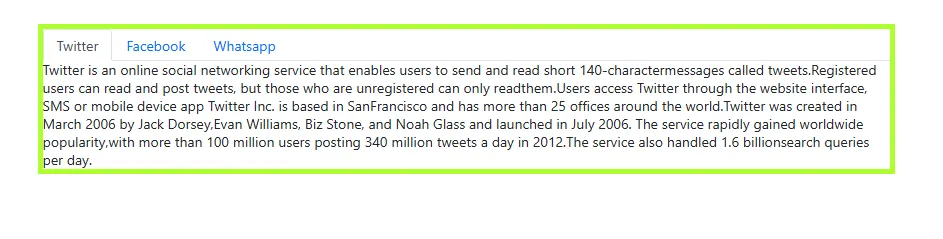
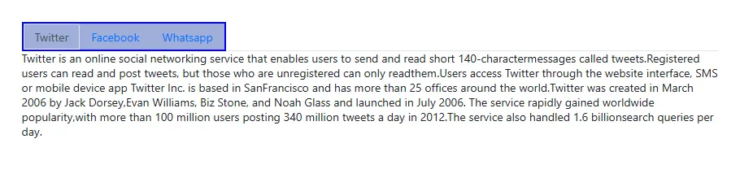
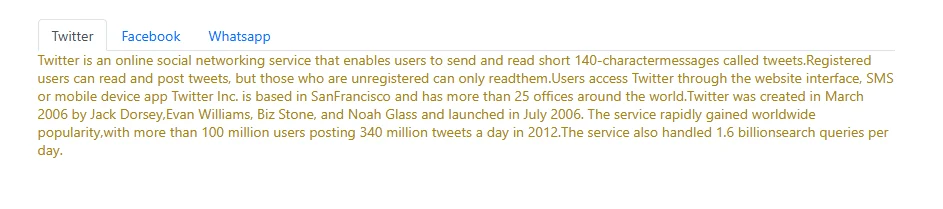
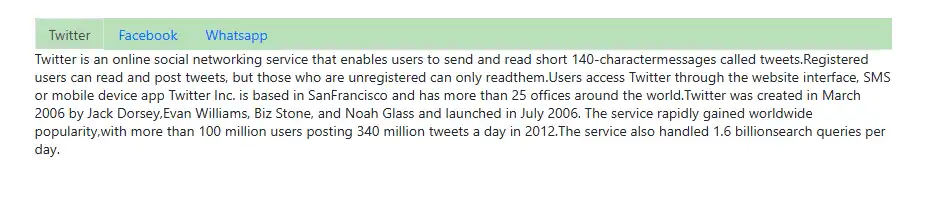
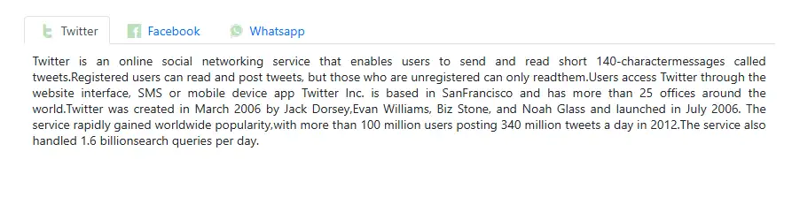
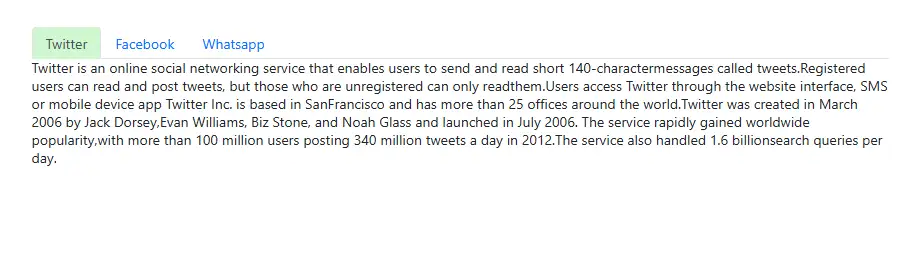
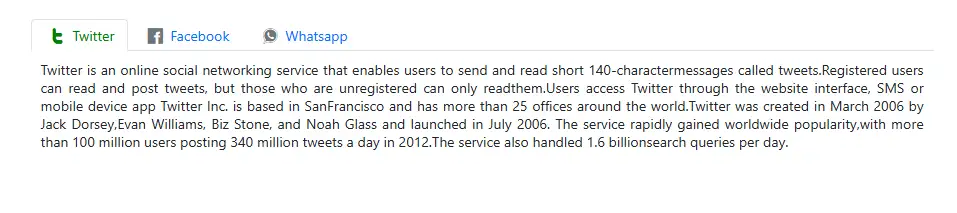

# Style and Appearance in Blazor Tabs

The following CSS classes can be used to customize the appearance of the Tab control.

## Customizing the Tab

Use the following CSS to customize the Tab.

```CSS

.e-tab {
    border: 5px solid rgb(173, 255, 47);
}

```



## Customizing the Tab header items

Use the following CSS to customize the header items of the Tab.

```CSS

.e-tab .e-tab-header .e-toolbar-items {
    background: #9faed8;
    border: 2px solid blue;
}

```



Use the following CSS to customize the content items of the Tab.

```CSS

.e-tab .e-content .e-item {
    color: #a78515;
    font-size: 14px;
}

```



## Customizing the Tab header

Use the following CSS to customize the header of the Tab control.

```CSS

.e-tab .e-tab-header {
    background: #badfba !important;
}

```



## Customizing the Tab header icon

Use the following CSS to customize the header item icon of the Tab control.

```CSS

.e-tab .e-tab-header .e-toolbar-item .e-tab-icon {
    color: #badfba !important;
}

```



## Customizing the Tab content

Use the following CSS to customize the content of the Tab control.

```CSS

.e-tab .e-content {
    background: #d1f6d1 !important;
}

```


## Customizing the hover state of the Tab

### Hover state of Tab items

Use the following CSS to customize a tab item when hovering.

```CSS

.e-tab .e-tab-header .e-toolbar-item .e-tab-wrap:hover {
    background: #d1f6d1 !important;
}

```



### Hover state of the popup icon

Use the following CSS to customize the popup icon when hovering.

```CSS

.e-tab .e-tab-header .e-hor-nav .e-popup-up-icon:hover,
.e-tab .e-tab-header .e-hor-nav .e-popup-down-icon:hover {
    background: #d1f6d1 !important;
}

```

## Customizing the selected item of the Tab

Use the following CSS to customize the selected tab item.

```CSS

.e-tab .e-tab-header .e-toolbar-item.e-active {
    background: #d1f4d1;
}

```


Use the following CSS to customize the selected tab item text and icon.

```CSS

.e-tab .e-tab-header .e-toolbar-item.e-active .e-tab-text,
.e-tab .e-tab-header .e-toolbar-item.e-active .e-tab-icon {
    color: green !important;
}

```

