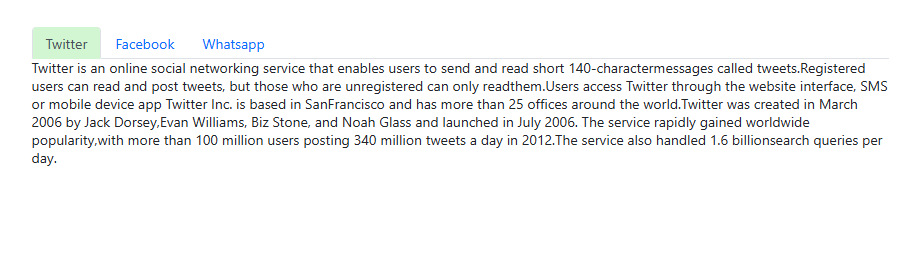

# Style and Appearance in Blazor Tabs Component

The following content provides the exact CSS structure that can be used to modify the control’s appearance based on user preference.

## Customizing the Tab Component

Use the following CSS to customize the Tab.

```CSS

.e-tab {
    border: 5px solid rgb(173, 255, 47);
}

```


## Customizing the Tab items

Use the following CSS to customize the header items of Tab.

```CSS

.e-tab .e-tab-header .e-toolbar-items {
    background: #9faed8;
    border: 2px solid blue;
}

```


Use the following CSS to customize the content items of Tab.

```CSS

.e-tab .e-content .e-item {
    color: #a78515;
    font-size: 14px;
}

```


## Customizing Tab's Header

Use the following CSS to customize the header of Tab control.

```CSS

.e-tab .e-tab-header {
    background: #badfba !important;
}

```


## Customizing Tab's Header Icon

Use the following CSS to customize the header item icon of Tab control.

```CSS

.e-tab .e-tab-header .e-toolbar-item .e-tab-icon {
    color: #badfba !important;
}

```


## Customizing Tab's Content

Use the following CSS to customize the content of Tab control.

```CSS

.e-tab .e-content {
    background: #d1f6d1 !important;
}

```


## Customizing the Hover State of Tab Control

Use the following CSS to customize the tab item when hovering.

```CSS

.e-tab .e-tab-header .e-toolbar-item .e-tab-wrap:hover {
    background: #d1f6d1 !important;
}

```



Use the following CSS to customize the tab item popup icon when hovering.

```CSS

.e-tab .e-tab-header .e-hor-nav .e-popup-up-icon:hover,
.e-tab .e-tab-header .e-hor-nav .e-popup-down-icon:hover {
    background: #d1f6d1 !important;
}

```

## Customizing Selected Item of Tab Control

Use the following CSS to customize the selected tab item.

```CSS

.e-tab .e-tab-header .e-toolbar-item.e-active {
    background: #d1f4d1;
}

```


Use the following CSS to customize the selected tab item text and icon.

```CSS

.e-tab .e-tab-header .e-toolbar-item.e-active .e-tab-text,
.e-tab .e-tab-header .e-toolbar-item.e-active .e-tab-icon {
    color: green !important;
}

```

