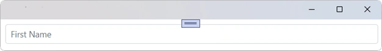
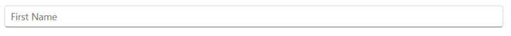
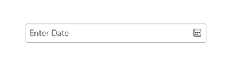
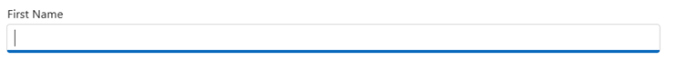

# Getting Started with Blazor TextBox component in MAUI App

This section provides a step-by-step guide to integrating the [Syncfusion<sup style="font-size:70%">&reg;</sup> Blazor TextBox](https://www.syncfusion.com/blazor-components/blazor-textbox) component in a Blazor MAUI App using both [Visual Studio](https://visualstudio.microsoft.com/vs/) and [Visual Studio Code](https://code.visualstudio.com/).





## Prerequisites

To use the MAUI project templates, install the Mobile development with the .NET extension for Visual Studio. For more details, refer to [here](https://learn.microsoft.com/en-us/dotnet/MAUI/get-started/installation?tabs=vswin) or the [Syncfusion® Blazor Extension](https://blazor.syncfusion.com/documentation/visual-studio-integration/template-studio).

## Create a new Blazor MAUI App in Visual Studio

Create a Blazor MAUI App using Visual Studio via [Microsoft Templates](https://learn.microsoft.com/en-us/dotnet/maui/get-started/first-app?pivots=devices-windows&view=net-maui-9.0&tabs=vswin). For detailed instructions, refer to the [Blazor MAUI App Getting Started](https://blazor.syncfusion.com/documentation/getting-started/maui-blazor-app) documentation.





## Prerequisites

To use the MAUI project templates, install the Mobile development with the .NET extension for Visual Studio Code. For more details, refer to [here](https://learn.microsoft.com/en-us/dotnet/maui/get-started/installation?view=net-maui-9.0&tabs=visual-studio-code) or the [Syncfusion® Blazor Extension](https://blazor.syncfusion.com/documentation/visual-studio-code-integration/create-project).

## Create a new Blazor MAUI App in Visual Studio Code

Create a Blazor MAUI App using Visual Studio Code via [Microsoft Templates](https://learn.microsoft.com/en-us/dotnet/maui/get-started/first-app?pivots=devices-windows&view=net-maui-9.0&tabs=visual-studio-code) or the [Syncfusion® Blazor Extension](https://blazor.syncfusion.com/documentation/visual-studio-code-integration/create-project). For detailed instructions, refer to the [Blazor MAUI App Getting Started](https://blazor.syncfusion.com/documentation/getting-started/maui-blazor-app) documentation.

Alternatively, create a MAUI application by using the following command in the integrated terminal (<kbd>Ctrl</kbd>+<kbd>`</kbd>).




dotnet new maui-blazor -o MauiBlazorApp
cd MauiBlazorApp








## Install Syncfusion<sup style="font-size:70%">&reg;</sup> Blazor packages

Install [Syncfusion.Blazor.Inputs](https://www.nuget.org/packages/Syncfusion.Blazor.Inputs/) and [Syncfusion.Blazor.Themes](https://www.nuget.org/packages/Syncfusion.Blazor.Themes/) NuGet packages in your project using the NuGet Package Manager in Visual Studio (*Tools → NuGet Package Manager → Manage NuGet Packages for Solution*), or the integrated terminal in Visual Studio Code (`dotnet add package`), or the .NET CLI.

Alternatively, run the following commands in the Package Manager Console to achieve the same.




Install-Package Syncfusion.Blazor.Inputs -Version {{ site.releaseversion }}
Install-Package Syncfusion.Blazor.Themes -Version {{ site.releaseversion }}




N> All Syncfusion Blazor packages are available on [nuget.org](https://www.nuget.org/packages?q=syncfusion.blazor). See the [NuGet packages](https://blazor.syncfusion.com/documentation/nuget-packages) topic for details.

## Add import namespaces

After the packages are installed, open the **~/_Imports.razor** file and import the `Syncfusion.Blazor` and `Syncfusion.Blazor.Inputs` namespaces.




@using Syncfusion.Blazor 
@using Syncfusion.Blazor.Inputs




## Register Syncfusion<sup style="font-size:70%">&reg;</sup> Blazor service

Register the Syncfusion<sup style="font-size:70%">&reg;</sup> Blazor service in the **~/MauiProgram.cs** file.




....
using Syncfusion.Blazor;

....

public static class MauiProgram
{
    public static MauiApp CreateMauiApp()
    {
        ....
        builder.Services.AddSyncfusionBlazor();
        ....
    }
}




## Add stylesheet and script resources

The theme stylesheet and script can be accessed from NuGet through [Static Web Assets](https://blazor.syncfusion.com/documentation/appearance/themes#static-web-assets). Include the stylesheet and script references in the **~/index.html** file.

```html

<link href="_content/Syncfusion.Blazor.Themes/fluent2.css" rel="stylesheet" />
<script src="_content/Syncfusion.Blazor.Core/scripts/syncfusion-blazor.min.js" type="text/javascript"></script>

```

N> Check out the [Blazor Themes](https://blazor.syncfusion.com/documentation/appearance/themes) topic to discover various methods ([Static Web Assets](https://blazor.syncfusion.com/documentation/appearance/themes#static-web-assets), [CDN](https://blazor.syncfusion.com/documentation/appearance/themes#cdn-reference), and [CRG](https://blazor.syncfusion.com/documentation/common/custom-resource-generator)) for referencing themes in your Blazor application. Also, check out the [Adding Script Reference](https://blazor.syncfusion.com/documentation/common/adding-script-references) topic to learn different approaches for adding script references in your Blazor application.

## Add Syncfusion<sup style="font-size:70%">&reg;</sup> Blazor TextBox component

Add the Syncfusion<sup style="font-size:70%">&reg;</sup> Blazor TextBox component in the **~/Pages/Home.razor** file.




@using Syncfusion.Blazor.Inputs

<SfTextBox Placeholder='First Name'></SfTextBox>




### How to run the sample on Windows

Run the sample in Windows Machine mode, and it will run Blazor MAUI in Windows.



### How to run the sample on Android

To run the Blazor TextBox in an Android .NET MAUI Blazor app using the Android emulator, follow the Microsoft guidance to set up and launch an Android virtual device.

Refer [here](https://learn.microsoft.com/en-us/dotnet/maui/android/emulator/device-manager#android-device-manager-on-windows) to install and launch Android emulator.

N> If any errors occur while using the Android Emulator, see Troubleshooting Android Emulator for common resolutions: [Troubleshooting Android Emulator](https://learn.microsoft.com/en-us/dotnet/maui/android/emulator/troubleshooting).



## Adding icons to the Blazor TextBox

Add an icon to the TextBox component using the [AddIconAsync](https://help.syncfusion.com/cr/blazor/Syncfusion.Blazor.Inputs.SfTextBox.html#Syncfusion_Blazor_Inputs_SfTextBox_AddIconAsync_System_String_System_String_System_Collections_Generic_Dictionary_System_String_System_Object__) method. Below is an example of how to implement this in your Blazor application:




@using Syncfusion.Blazor.Inputs

<div id="sample" style="margin:130px auto;width:300px">
    <SfTextBox @ref=@TextBoxDropDownObj
               Created="@AddDateIcon"
               Placeholder="Enter Date"
               FloatLabelType="@FloatLabelType.Auto">
    </SfTextBox>
</div>


@code {
    SfTextBox TextBoxDropDownObj { get; set; }

    private async void AddDateIcon()
    {
        if (TextBoxDropDownObj != null)
        {
            //Add icon to the TextBox
            await TextBoxDropDownObj.AddIconAsync("append", "e-icons e-date-icon");
}
    }
}






## Floating label

The floating label TextBox floats the label above the TextBox after focusing, or filled with value in the TextBox. The floating label TextBox can be created by using the [FloatLabelType](https://help.syncfusion.com/cr/blazor/Syncfusion.Blazor.Inputs.SfTextBox.html#Syncfusion_Blazor_Inputs_SfTextBox_FloatLabelType) API.




@using Syncfusion.Blazor.Inputs

<SfTextBox Placeholder='First Name' FloatLabelType='@FloatLabelType.Auto'></SfTextBox>






## See also

* [Getting started with Syncfusion<sup style="font-size:70%">&reg;</sup> Blazor WebAssembly app in Visual Studio or .NET CLI](https://blazor.syncfusion.com/documentation/getting-started/blazor-webassembly-app)
* [Getting started with Syncfusion<sup style="font-size:70%">&reg;</sup> Blazor Web App in Visual Studio or .NET CLI](https://blazor.syncfusion.com/documentation/getting-started/blazor-web-app)