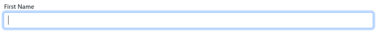

# Getting Started with Blazor TextBox component

This guide walks through integrating the Syncfusion® Blazor TextBox component into a .NET MAUI Blazor app using both Visual Studio and Visual Studio Code.





## Prerequisites

To use the .NET MAUI project templates, install the Mobile development with .NET workload in Visual Studio. For details, see the Microsoft installation guide and the Syncfusion® Blazor Extension resources:
- Microsoft: Get started with .NET MAUI on Visual Studio
- Syncfusion: Visual Studio integration and Template Studio

For more details, refer to [here](https://learn.microsoft.com/en-us/dotnet/MAUI/get-started/installation?tabs=vswin) or the [Syncfusion® Blazor Extension](https://blazor.syncfusion.com/documentation/visual-studio-integration/template-studio).

## Create a new Blazor MAUI App in Visual Studio

Create a Blazor MAUI App using Visual Studio via [Microsoft Templates](https://learn.microsoft.com/en-us/dotnet/maui/get-started/first-app?pivots=devices-windows&view=net-maui-9.0&tabs=vswin). For detailed instructions, refer to [this Blazor MAUI App Getting Started](https://blazor.syncfusion.com/documentation/getting-started/maui-blazor-app) documentation.

## Install Syncfusion<sup style="font-size:70%">&reg;</sup> Blazor Inputs and Themes NuGet in the app

To add the Blazor TextBox component to the app, open the NuGet Package Manager in Visual Studio (Tools → NuGet Package Manager → Manage NuGet Packages for Solution), then search for and install Syncfusion.Blazor.Inputs and Syncfusion.Blazor.Themes.




Install-Package Syncfusion.Blazor.Inputs -Version {{ site.releaseversion }}
Install-Package Syncfusion.Blazor.Themes -Version {{ site.releaseversion }}




N> Syncfusion<sup style="font-size:70%">&reg;</sup> Blazor components are available on NuGet. Refer to the NuGet packages topic for the list of available packages and component details: [nuget.org](https://www.nuget.org/packages?q=syncfusion.blazor) and [NuGet packages](https://blazor.syncfusion.com/documentation/nuget-packages).





## Prerequisites

To use the MAUI project templates, install the Mobile development with the .NET extension for Visual Studio Code. For more details, refer to [here](https://learn.microsoft.com/en-us/dotnet/maui/get-started/installation?view=net-maui-9.0&tabs=visual-studio-code) or the [Syncfusion® Blazor Extension](https://blazor.syncfusion.com/documentation/visual-studio-code-integration/create-project).

## Create a new Blazor MAUI App in Visual Studio Code

You can create a Blazor MAUI App using Visual Studio Code via [Microsoft Templates](https://learn.microsoft.com/en-us/dotnet/maui/get-started/first-app?pivots=devices-windows&view=net-maui-9.0&tabs=visual-studio-code) or the [Syncfusion® Blazor Extension](https://blazor.syncfusion.com/documentation/visual-studio-code-integration/create-project). For detailed instructions, refer to [this Blazor MAUI App Getting Started](https://blazor.syncfusion.com/documentation/getting-started/maui-blazor-app) documentation.

## Install Blazor Inputs and Themes NuGet in the App

To add **Blazor TextBox**  component in the app, open the NuGet package manager in Visual Studio (Tools → NuGet Package Manager → Manage NuGet Packages for Solution), search and install [Syncfusion.Blazor.Inputs](https://www.nuget.org/packages/Syncfusion.Blazor.Inputs) and [Syncfusion.Blazor.Themes](https://www.nuget.org/packages/Syncfusion.Blazor.Themes/).





dotnet add package Syncfusion.Blazor.Inputs -v {{ site.releaseversion }}
dotnet add package Syncfusion.Blazor.Themes -v {{ site.releaseversion }}
dotnet restore





N> Syncfusion<sup style="font-size:70%">&reg;</sup> Blazor components are available on NuGet. Refer to the NuGet packages topic for the list of available packages and component details: [nuget.org](https://www.nuget.org/packages?q=syncfusion.blazor) and [NuGet packages](https://blazor.syncfusion.com/documentation/nuget-packages).





## Add Import Namespaces

Open the **~/_Imports.razor** file and import the `Syncfusion.Blazor` and `Syncfusion.Blazor.Inputs` namespaces.




@using Syncfusion.Blazor 
@using Syncfusion.Blazor.Inputs




## Register Syncfusion<sup style="font-size:70%">&reg;</sup> Blazor service

Register the Syncfusion<sup style="font-size:70%">&reg;</sup> Blazor service in the ~/MauiProgram.cs file. Ensure that Syncfusion licensing is registered in the app startup before using any Syncfusion components. For licensing details, see the Syncfusion Blazor licensing documentation.




using Microsoft.Extensions.Logging;
using Syncfusion.Blazor;

namespace MauiBlazorWindow;

    public static class MauiProgram
    {
        public static MauiApp CreateMauiApp()
        {
            var builder = MauiApp.CreateBuilder();
            builder
                .UseMauiApp<App>()
                .ConfigureFonts(fonts =>
                {
                    fonts.AddFont("OpenSans-Regular.ttf", "OpenSansRegular");
                });

            builder.Services.AddMauiBlazorWebView();
            builder.Services.AddSyncfusionBlazor();
#if DEBUG
            builder.Services.AddBlazorWebViewDeveloperTools();
            builder.Logging.AddDebug();
#endif

            return builder.Build();
        }
    }




## Add stylesheet and script resources

The theme stylesheet and script can be accessed from NuGet through [Static Web Assets](https://blazor.syncfusion.com/documentation/appearance/themes#static-web-assets). Include the stylesheet and script references in the `<head>` section of the **~/index.html** file.

```html
<head>
    ....
    <link href="_content/Syncfusion.Blazor.Themes/bootstrap5.css" rel="stylesheet" />
    <script src="_content/Syncfusion.Blazor.Core/scripts/syncfusion-blazor.min.js" type="text/javascript"></script>

    //Blazor TextBox Component script reference.
    <!-- <script src="_content/Syncfusion.Blazor.Inputs/scripts/sf-textbox.min.js" type="text/javascript"></script> -->
</head>
```
N> Check out the [Blazor Themes](https://blazor.syncfusion.com/documentation/appearance/themes) topic to discover various methods ([Static Web Assets](https://blazor.syncfusion.com/documentation/appearance/themes#static-web-assets), [CDN](https://blazor.syncfusion.com/documentation/appearance/themes#cdn-reference), and [CRG](https://blazor.syncfusion.com/documentation/common/custom-resource-generator)) for referencing themes in your Blazor application. Also, check out the [Adding Script Reference](https://blazor.syncfusion.com/documentation/common/adding-script-references) topic to learn different approaches for adding script references in your Blazor application.

## Add Blazor TextBox component

Add the Syncfusion<sup style="font-size:70%">&reg;</sup> Blazor TextBox component in the **~/Pages/Index.razor** file.




<SfTextBox Placeholder='First Name'></SfTextBox>




### How to Run the Sample on Windows

Run the sample in Windows Machine mode, and it will run Blazor MAUI in Windows.


### How to Run the Sample on Android

To run the Blazor TextBox in an Android .NET MAUI Blazor app using the Android emulator, follow the Microsoft guidance to set up and launch an Android virtual device.

Refer [here](https://learn.microsoft.com/en-us/dotnet/maui/android/emulator/device-manager#android-device-manager-on-windows) to install and launch Android emulator.

N> If any errors occur while using the Android Emulator, see Troubleshooting Android Emulator for common resolutions: [Troubleshooting Android Emulator](https://learn.microsoft.com/en-us/dotnet/maui/android/emulator/troubleshooting).


## Adding icons to the Blazor TextBox

Add an icon to the TextBox component using the [AddIconAsync](https://help.syncfusion.com/cr/blazor/Syncfusion.Blazor.Inputs.SfTextBox.html#Syncfusion_Blazor_Inputs_SfTextBox_AddIconAsync_System_String_System_String_System_Collections_Generic_Dictionary_System_String_System_Object__) method. Below is an example of how to implement this in your Blazor application:

```cshtml
@using Syncfusion.Blazor.Inputs

<div id="sample" style="margin:130px auto;width:300px">
    <SfTextBox @ref=@TextBoxDropDownObj
               Created="@AddDateIcon"
               Placeholder="Enter Date"
               FloatLabelType="@FloatLabelType.Auto">
    </SfTextBox>
</div>


@code {
    SfTextBox TextBoxDropDownObj { get; set; }

    private async void AddDateIcon()
    {
        if (TextBoxDropDownObj != null)
        {
            //Add icon to the TextBox
            await TextBoxDropDownObj.AddIconAsync("append", "e-icons e-date-icon");
}
    }
}
```


## Floating label

The floating label TextBox floats the label above the TextBox after focusing, or filled with value in the TextBox. The floating label TextBox can be created by using the [FloatLabelType](https://help.syncfusion.com/cr/blazor/Syncfusion.Blazor.Inputs.SfTextBox.html#Syncfusion_Blazor_Inputs_SfTextBox_FloatLabelType) API.




<SfTextBox Placeholder='First Name' FloatLabelType='@FloatLabelType.Auto'></SfTextBox>






## See Also

* Getting started with Syncfusion<sup style="font-size:70%">&reg;</sup> Blazor WebAssembly app in Visual Studio or .NET CLI: [../getting-started/blazor-webassembly-app](../getting-started/blazor-webassembly-app)
* Getting started with Syncfusion<sup style="font-size:70%">&reg;</sup> Blazor Web App in Visual Studio or .NET CLI: [../getting-started/blazor-web-app](../getting-started/blazor-web-app)