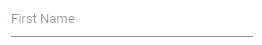
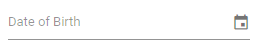

# Getting Started with Blazor TextBox Component

This section briefly explains about how to include a [Blazor TextBox](https://www.syncfusion.com/blazor-components/blazor-textbox) Component in the Blazor Server-Side and Client-Side application. Refer to Getting Started with [Blazor Server-Side TextBox](../getting-started/blazor-server-side-visual-studio-2019/) and [Blazor WebAssembly TextBox](../getting-started/blazor-webassembly-visual-studio-2019/) documentation pages for configuration specifications.

To get start quickly with Blazor TextBox component, check on this video.



## Importing Syncfusion Blazor component in the application

* Install `Syncfusion.Blazor.Inputs` NuGet package to the application by using the `NuGet Package Manager`.

  > Please ensure to check the `Include prerelease` option for the Beta release.

* The client-side resources can be added through [CDN](https://blazor.syncfusion.com/documentation/appearance/themes#cdn-reference) or from [NuGet](https://blazor.syncfusion.com/documentation/appearance/themes#static-web-assets) package in the  **HEAD** element of the **~/wwwroot/index.html** page.

  ```html
    <head>
            <link href="_content/Syncfusion.Blazor.Themes/bootstrap4.css" rel="stylesheet" />
            <!-- <link href="https://cdn.syncfusion.com/blazor/{{version}}/styles/{{theme}}.css" rel="stylesheet" /> -->
    </head>
  ```

  > For Internet Explorer 11 kindly refer the polyfills. Refer the [documentation](https://ej2.syncfusion.com/blazor/documentation/common/how-to/render-blazor-server-app-in-ie/) for more information.

  ```html
    <head>
        <link href="_content/Syncfusion.Blazor.Themes/bootstrap4.css" rel="stylesheet" />
        <script src="https://github.com/Daddoon/Blazor.Polyfill/releases/download/3.0.1/blazor.polyfill.min.js"></script>
    </head>
  ```

## Adding component package to the application

Open `~/_Imports.razor` file and import the `Syncfusion.Blazor.Inputs` packages.

```cshtml
@using Syncfusion.Blazor.Inputs
```

## Add SyncfusionBlazor service in Program.cs

Open the **Program.cs** file and add services required by Syncfusion components using  **builder.Services.AddSyncfusionBlazor()** method.

```csharp
using Syncfusion.Blazor;

namespace BlazorApplication
{
public class Program
{
    public static async Task Main(string[] args)
    {
        ....
        ....
        builder.Services.AddSyncfusionBlazor();
        await builder.Build().RunAsync();
    }
}
}
```

> To enable custom client side resource loading from CRG or CDN. You need to disable resource loading by `AddSyncfusionBlazor(true)` and load the scripts in the **HEAD** element of the **~/wwwroot/index.html** page.

 ```html
<head>
    <script src="https://cdn.syncfusion.com/blazor/{{ site.blazorversion }}/syncfusion-blazor.min.js"></script>
</head>
```

## Adding TextBox component to the application

To initialize the TextBox component add the below code to the `Index.razor` view page which is present under `~/Pages` folder.

```cshtml
<SfTextBox Placeholder='First Name'></SfTextBox>
```

## Run the application

After successful compilation of the application, press `F5` to run the application.



## Adding icons to the TextBox

A TextBox can be created with icon as a group by creating the parent `div` element with the class `e-input-group` and add the icon element as span with the class `e-input-group-icon`.

```cshtml
<div class='e-input-group'>
    <input class='e-input' Placeholder='Date of Birth' type='text'>
    <span class='e-input-group-icon e-input-calendar'></span>
</div>

<style>
.e-input-group-icon:before {
  font-family: e-icons;
}

.e-input-group .e-input-group-icon.e-input-calendar {
  font-size: 16px;
}

.e-input-group-icon.e-input-calendar:before {
  content: "";
}
</style>
```



## Floating label

The floating label TextBox floats the label above the TextBox after focusing, or filled with value in the TextBox. The floating label TextBox can be created by using the `FloatLabelType` API.

```cshtml
<SfTextBox Placeholder='First Name' FloatLabelType='@FloatLabelType.Auto'></SfTextBox>
```


## See Also

* [Getting Started with Syncfusion Blazor for Client-Side in .NET Core CLI](../getting-started/blazor-webassembly-dotnet-cli/)
* [Getting Started with Syncfusion Blazor for Server-side in Visual Studio 2019](../getting-started/blazor-server-side-visual-studio-2019/)
* [Getting Started with Syncfusion Blazor for Server-Side in .NET Core CLI](../getting-started/blazor-server-side-dotnet-cli/)