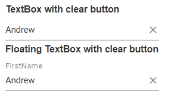

# Groups in Blazor TextBox Component

The following section explains the steps required to create TextBox with `icon` and `floating label`.

**TextBox:**

Create a TextBox component.

```cshtml
@using Syncfusion.Blazor.Inputs

<SfTextBox Placeholder="Enter your name"></SfTextBox>
```

**Floating label:**

Create a Floating label TextBox using [FloatLabelType](https://help.syncfusion.com/cr/blazor/Syncfusion.Blazor.Inputs.SfTextBox.html#Syncfusion_Blazor_Inputs_SfTextBox_FloatLabelType) API.

```cshtml
@using Syncfusion.Blazor.Inputs

<SfTextBox Placeholder="Enter your name" FloatLabelType="@FloatLabelType.Auto"></SfTextBox>
```

Refer to the following sections to add the icons to the TextBox.

## With icon and floating label

Create a TextBox with icon and the users can place the icon in either side of the TextBox by using `AddIcon` method append the icon before or after the input. Based on the argument prepend or append, it will act as prefix or suffix icon.

```cshtml
@using Syncfusion.Blazor.Inputs

<div id="wrapper">
    <label>TextBox with icon</label>
    <SfTextBox @ref="TextBoxDateObj" Placeholder="Enter date" Created="@OnCreateDate"></SfTextBox>
    <SfTextBox @ref="TextBoxSearchObj" Placeholder="Search here" Created="@OnCreateSearch"></SfTextBox>

    <label>Floating TextBox with icon</label>
    <SfTextBox @ref="FloatTextBoxDateObj" Placeholder="Enter date" FloatLabelType="@FloatLabelType.Auto" Created="@OnFloatCreateDate"></SfTextBox>
    <SfTextBox @ref="FloatTextBoxSearchObj" Placeholder="Search here" FloatLabelType="@FloatLabelType.Auto" Created="@OnFloatCreateSearch"></SfTextBox>
</div>

@code{
    SfTextBox TextBoxDateObj;
    SfTextBox TextBoxSearchObj;
    SfTextBox FloatTextBoxDateObj;
    SfTextBox FloatTextBoxSearchObj;
    public void OnCreateDate()
    {
        this.TextBoxDateObj.AddIconAsync("append", "e-date-icon");
    }
    public void OnCreateSearch()
    {
        this.TextBoxSearchObj.AddIconAsync("prepand", "e-search");
    }
    public void OnFloatCreateDate()
    {
        this.FloatTextBoxDateObj.AddIconAsync("append", "e-date-icon");
    }
    public void OnFloatCreateSearch()
    {
        this.FloatTextBoxSearchObj.AddIconAsync("prepand", "e-search");
    }
}
<style>
    .e-search::before {
        content: '\e993';
        font-family: e-icons;
    }
    #wrapper {
        width: 30%;
    }
</style>
```


### Binding events to icons

You can bind the event to the icons by passing events as a parameter to the `AddIcon` method. You can bind the single or multiple events to the icons.

The following sample demonstrates binding events to the icons.

```cshtml
@using Syncfusion.Blazor.Inputs

<label>Single Event</label>
<SfTextBox @ref="@TextBoxSearchObj" Created="@OnCreateSearch"></SfTextBox>

<label>Multiple Events</label>
<SfTextBox @ref="@TextBoxDateObj" Created="@OnCreateDate"></SfTextBox>

@code {

	SfTextBox TextBoxSearchObj;
	SfTextBox TextBoxDateObj;

	public async Task OnCreateSearch()
	{
		// Event creation with event handler
		var Click = EventCallback.Factory.Create<MouseEventArgs>(this, SearchClick);
		await TextBoxSearchObj.AddIcon("append", "e-search-icon", new Dictionary<string, object>() { { "onclick", Click } });
	}

	public void SearchClick()
	{
		// Icon Click event triggered
	}

	public async Task OnCreateDate()
	{
		// Event creation with event handler
		var MouseDown = EventCallback.Factory.Create<MouseEventArgs>(this, DateMouseDown);
		var MouseUp = EventCallback.Factory.Create<MouseEventArgs>(this, DateMouseUp);
		await TextBoxDateObj.AddIcon("prepend", "e-date-icon", new Dictionary<string, object>() { { "onmouseup", MouseUp }, { "onmousedown", MouseDown } });
	}

	public void DateMouseDown()
	{
		// Icon mouse down event triggered
	}
	public void DateMouseUp()
	{
		// Icon mouse up event triggered
	}

}

<style>
	.e-search-icon::before {
		content: '\e724';
		font-family: e-icons;
	}

    .e-date-icon::before {
		content: '\e901';
		font-family: e-icons;
	}
</style>
```

## With clear button and floating label

The clear button is added to the input for clearing the value given in the TextBox. It is shown only when the input field has a value, otherwise not shown.

The clear button can be added to the TextBox by enabling the [ShowClearButton](https://help.syncfusion.com/cr/blazor/Syncfusion.Blazor.Inputs.SfTextBox.html#Syncfusion_Blazor_Inputs_SfTextBox_ShowClearButton) API.

```cshtml
@using Syncfusion.Blazor.Inputs

<label> TextBox with clear button </label>
<SfTextBox Placeholder="FirstName" ShowClearButton=true></SfTextBox>
<label> Floating TextBox with clear button </label>
<SfTextBox Placeholder="FirstName" ShowClearButton=true FloatLabelType="@FloatLabelType.Auto"></SfTextBox>
```



## Multi-line input with floating label

The following example demonstrates how to set [Multiline](https://help.syncfusion.com/cr/blazor/Syncfusion.Blazor.Inputs.SfTextBox.html#Syncfusion_Blazor_Inputs_SfTextBox_Multiline) in the `TextBox` component with the float label structure.

```cshtml
@using Syncfusion.Blazor.Inputs

<SfTextBox Placeholder="Enter text" Multiline=true FloatLabelType="@FloatLabelType.Auto"></SfTextBox>
```

