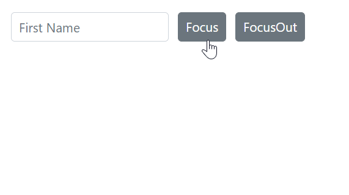

# Programmatically focus in and focus out the component

You can programmatically manage the focus of a component in Blazor by utilizing the [FocusAsync](https://help.syncfusion.com/cr/blazor/Syncfusion.Blazor.Inputs.SfTextBox.html#Syncfusion_Blazor_Inputs_SfTextBox_FocusAsync) method to set focus and the [FocusOutAsync](https://help.syncfusion.com/cr/blazor/Syncfusion.Blazor.Inputs.SfTextBox.html#Syncfusion_Blazor_Inputs_SfTextBox_FocusOutAsync) method to remove focus. The following example demonstrates how to achieve this functionality through button click events.


```cshtml

@using Syncfusion.Blazor.Inputs;

@using Syncfusion.Blazor.Buttons;

<div style="display: flex; gap: 10px;">

    <SfTextBox @ref="TextBoxObj" Placeholder='First Name'></SfTextBox>

    <SfButton OnClick="Focus">Focus</SfButton>

    <SfButton OnClick="FocusOut">FocusOut</SfButton>

</div>

@code {

    SfTextBox TextBoxObj;

    public async void Focus()
    {
        await TextBoxObj.FocusAsync();
    }

    public async void FocusOut()
    {
        await TextBoxObj.FocusOutAsync();

    }

}

```

