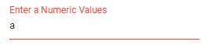

# Change the Color of the Text Based on its Value in Blazor TextBox

Change the TextBox’s visual state by validating its value on every `Input` event and toggling the component’s `CssClass`. The example below uses a regular expression to check for numeric input: when the value contains only digits, the `e-success` class is applied; otherwise, the `e-error` class is applied. These utility classes are theme-dependent and typically style the input’s border/outline; add custom CSS if you also want to change text color.

```cshtml
@using Syncfusion.Blazor.Inputs

<SfTextBox Placeholder="Enter a Numeric Values" FloatLabelType="@FloatLabelType.Auto" Input="OnInput" CssClass="@CssClass"></SfTextBox>

@code {

    public string CssClass { get; set; }

    public void OnInput(InputEventArgs args)
    {
        if (!System.Text.RegularExpressions.Regex.IsMatch(args.Value, "^[0-9]*$")){
            CssClass = "e-error";
        }
        else {
            CssClass = "e-success";
        }
        this.StateHasChanged();
    }
}
```

