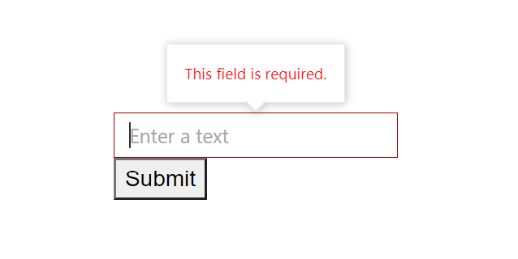

# Create a Custom Component with Tooltip Validation Using Blazor TextBox

Custom component allows to reuse the defined components in a razor page anywhere in the application by using the file name of the razor page as HTML tag. For more information refer [here](https://www.syncfusion.com/faq/blazor/components/how-do-i-create-a-custom-component)

## Defining Blazor TextBox component

The TextBox is defined in a Razor component along with the required parameters and event bindings. The following code is placed in a Razor file named CustomTextBox.







T> In the above component, parameters and events can be implemented in the same file using the `@code` block or in a partial class. 

N> For full EditForm integration, a custom input component must expose `Value`, `ValueChanged` (EventCallback<T>), and `ValueExpression` parameters. This allows the form to track value changes and perform validation. To surface the validation message inside the component, include a `ValidationMessage` element targeting the same field expression used for `ValueExpression`.

## Adding the custom TextBox component in the EditForm

An `EditForm` with a bound model is declared in the main Razor page. Inside the form, add `DataAnnotationsValidator` to enable attribute-based validation and use the `CustomTextBox` wrapped with an `SfTooltip` to show error text in a tooltip. The `CustomTextBox` binds to the model’s `Text` property, which contains data annotation attributes. For details on the tooltip component, see the getting started guide for Syncfusion Blazor Tooltip.







The `SfTooltip` wraps the `CustomTextBox`, and the [`Target`](https://help.syncfusion.com/cr/blazor/Syncfusion.Blazor.Popups.SfTooltip.html#Syncfusion_Blazor_Popups_SfTooltip_Target) is set to the `id` of an element within the custom component so that the tooltip anchors to that input. Place `ValidationMessage` inside the [`TooltipTemplates`](https://help.syncfusion.com/cr/blazor/Syncfusion.Blazor.Popups.TooltipTemplates.html) to display validation errors within the tooltip for the same bound property.

T> To avoid empty tooltips, conditionally show the tooltip only when there is validation content (for example, by checking text content in the `OnOpen` event). Also ensure errors are conveyed to all users: do not rely on color or tooltip alone; consider setting `aria-invalid="true"` on the input and keeping a `ValidationMessage` visible for screen readers.