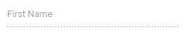

# Set the disabled state

To disable the TextBox, use its
[Enabled](https://help.syncfusion.com/cr/blazor/Syncfusion.Blazor.Inputs.SfTextBox.html#Syncfusion_Blazor_Inputs_SfTextBox_Enabled)
property.

The following example demonstrates the TextBox in
a disabled state.

```csharp
@using Syncfusion.Blazor.Inputs

<SfTextBox Placeholder='First Name' Enabled=false></SfTextBox>
```

The output will be as follows.

