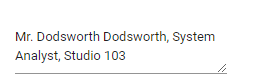

# Multiline TextBox

This feature allows the textbox to accept one or more lines of text like address, description, comments, and more.

## Create multiline textbox

You can convert the default textbox into the multiline textbox by setting the [Multiline](https://help.syncfusion.com/cr/blazor/Syncfusion.Blazor.Inputs.SfTextBox.html#Syncfusion_Blazor_Inputs_SfTextBox_Multiline) API value as true or pass HTML5 textarea as element to the textbox.

> The multiline text box allows you to resize it in vertical direction alone.

```cshtml
@using Syncfusion.Blazor.Inputs

<div class="multiline">
    <SfTextBox Multiline=true Placeholder="Enter your address" Value="Mr. Dodsworth Dodsworth, System Analyst, Studio 103"></SfTextBox>
</div>
<style>
     .multiline{
        margin-top: 60px;
        width: 20%;
    }
</style>
```

The output will be as follows.



## Implementing floating label

You can achieve the floating label behavior in the multiline text box by setting [FloatLabelType](https://help.syncfusion.com/cr/blazor/Syncfusion.Blazor.Inputs.SfTextBox.html#Syncfusion_Blazor_Inputs_SfTextBox_FloatLabelType) to 'Auto'. The Placeholder text act as floating label to the multiline textbox. You can provide the Placeholder text to the multiline textbox either by using the [Placeholder](https://help.syncfusion.com/cr/blazor/Syncfusion.Blazor.Inputs.SfTextBox.html#Syncfusion_Blazor_Inputs_SfTextBox_Placeholder) property or Placeholder attribute.

```cshtml
@using Syncfusion.Blazor.Inputs

<label>Float label type as Auto</label>
<div class="multiline">
    <SfTextBox Multiline=true FloatLabelType="@FloatLabelType.Auto" Placeholder="Enter your address"></SfTextBox>
</div>

<label>Float label type as Always</label>
<div class="multiline">
    <SfTextBox Multiline=true FloatLabelType="@FloatLabelType.Always" Placeholder="Enter your address"></SfTextBox>
</div>

<label>Float label type as Never</label>
<div class="multiline">
    <SfTextBox Multiline=true FloatLabelType="@FloatLabelType.Never" Placeholder="Enter your address"></SfTextBox>
</div>

<style>
    .multiline{
        margin-top: 60px;
        width: 20%;
    }
</style>
```

The output will be as follows.


## Disable resizing

By default, the multiline text box is rendered with resizable. You can disable the resize of the multiline text box by applying the following CSS styles.

```CSS
    textarea.e-input,
    .e-float-input textarea,
    .e-float-input.e-control-wrapper textarea,
    .e-input-group textarea,
    .e-input-group.e-control-wrapper textarea {
        resize: none;
    }

```

```cshtml
@using Syncfusion.Blazor.Inputs

<SfTextBox Multiline=true FloatLabelType="@FloatLabelType.Auto" Placeholder="Enter your address"></SfTextBox>
```

The output will be as follows.


