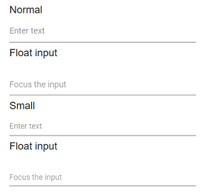

# Sizing in Blazor TextBox Component

The TextBox supports two visual sizes for different layout needs. Use the default size for standard forms and the small size to fit dense layouts while maintaining readability and accessibility.

Property   | Description
------------ | -------------
Normal | The default rendering of the TextBox with standard height and padding.
Small | Apply the e-small CSS class to the component using the CssClass property or to the input container (including the floating label wrapper) to reduce height and padding.

```cshtml
@using Syncfusion.Blazor.Inputs

<label>Normal</label>
<SfTextBox Placeholder="Enter text"></SfTextBox>

<label>Float input</label>
<SfTextBox Placeholder="Focus the input" FloatLabelType="@FloatLabelType.Auto"></SfTextBox>

<label>Small</label>
<SfTextBox Placeholder="Enter text" CssClass="e-small"></SfTextBox>

<label>Float input</label>
<SfTextBox Placeholder="Focus the input" CssClass="e-small" FloatLabelType="@FloatLabelType.Auto"></SfTextBox>
```

