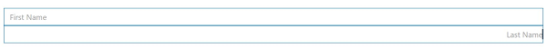

# Style and appearance in Blazor TextBox Component

The following guidance outlines CSS selectors and examples that can be used to modify the control’s appearance according to user preferences and design requirements.

## Customizing the appearance of TextBox container element

Use the following CSS to customize the appearance of the TextBox container element, including input height and font size. These selectors target the input/textarea elements within the floating label and input group wrappers, which may be required to override theme defaults.

```css
/* To specify height and font size */
.e-input:not(:valid), .e-input:valid, .e-float-input.e-control-wrapper input:not(:valid), .e-float-input.e-control-wrapper input:valid, .e-float-input input:not(:valid), .e-float-input input:valid, .e-input-group input:not(:valid), .e-input-group input:valid, .e-input-group.e-control-wrapper input:not(:valid), .e-input-group.e-control-wrapper input:valid, .e-float-input.e-control-wrapper textarea:not(:valid), .e-float-input.e-control-wrapper textarea:valid, .e-float-input textarea:not(:valid), .e-float-input textarea:valid, .e-input-group.e-control-wrapper textarea:not(:valid), .e-input-group.e-control-wrapper textarea:valid, .e-input-group textarea:not(:valid), .e-input-group textarea:valid {
        font-size: 30px;
        height: 40px;
}
```

## Customizing the TextBox placeholder

Use the following CSS to customize the TextBox placeholder.

```css
/* To specify font size and color */
.e-float-input.e-control-wrapper:not(.e-error) input:valid ~ label.e-float-text, .e-float-input.e-control-wrapper:not(.e-error) input ~ label.e-label-top.e-float-text {
        color: #343a40;
        font-size: 15px;
}
```

## Align text in TextBox

Text alignment can be changed by applying the text-align CSS property to the input. Use a selector such as .e-textbox for global alignment, or apply a custom class for a specific instance.

```cshtml
@using Syncfusion.Blazor.Inputs

<SfTextBox Placeholder='First Name'></SfTextBox>
<SfTextBox Placeholder='Last Name'></SfTextBox>

<style>
.e-textbox{
text-align: right;
}
</style>
```


To align text in a specific TextBox only, set text-align via a custom class using the CssClass property.

```cshtml
@using Syncfusion.Blazor.Inputs

<SfTextBox Placeholder='First Name'></SfTextBox>
<SfTextBox CssClass="e-custom" Placeholder='Last Name'></SfTextBox>

<style>
.e-custom .e-textbox{
text-align: right;
</style>
```



## See also

* [Adding icons to the Textbox](https://blazor.syncfusion.com/documentation/textbox/getting-started#adding-icons-to-the-textbox)
* [Customize the Floating Label Color of the TextBox](https://blazor.syncfusion.com/documentation/textbox/how-to/change-the-floating-label-color-of-the-textbox)
* [Customize the Color of the Text Based on its Value](https://blazor.syncfusion.com/documentation/textbox/how-to/change-the-color-of-the-textbox-based-on-its-value)
* [Customize the Background and Text Color in TextBox](https://blazor.syncfusion.com/documentation/textbox/how-to/customize-the-textbox-background-color-and-text-color)
