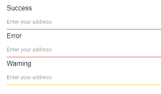

# Validation

The TextBox supports three types of validation styles namely `error`, `warning`, and `success`. These states are
enabled by adding corresponding classes `.e-error`, `.e-warning`, or `.e-success` to the input parent element.

```cshtml
@using Syncfusion.Blazor.Inputs

<label>Success</label>
<SfTextBox Placeholder="Enter your address" CssClass="e-success" ></SfTextBox>

<label>Error</label>
<SfTextBox Placeholder="Enter your address" CssClass="e-error"></SfTextBox>

<label>Warning</label>
<SfTextBox Placeholder="Enter your address" CssClass="e-warning"></SfTextBox>
```

The output will be as follows.


