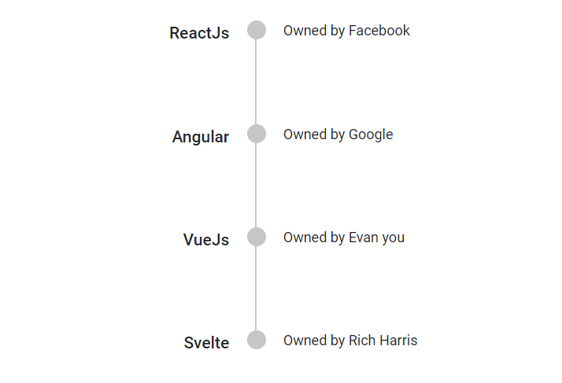
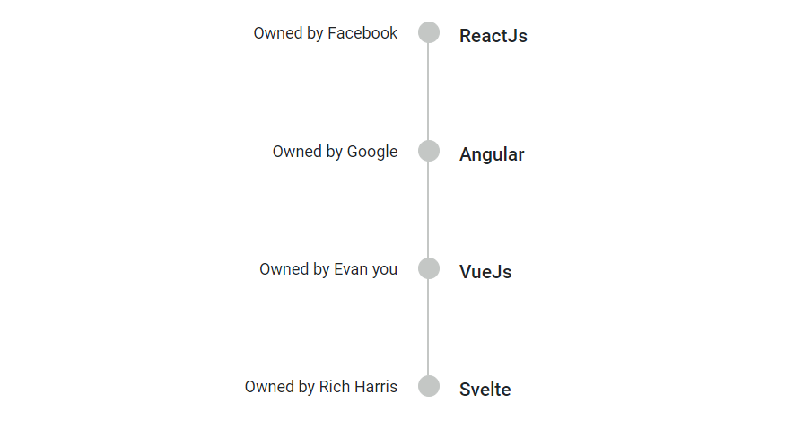
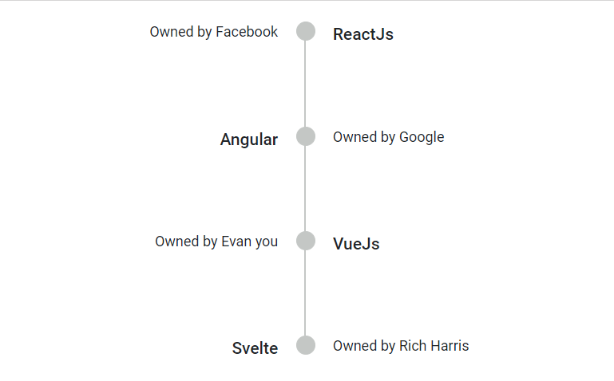
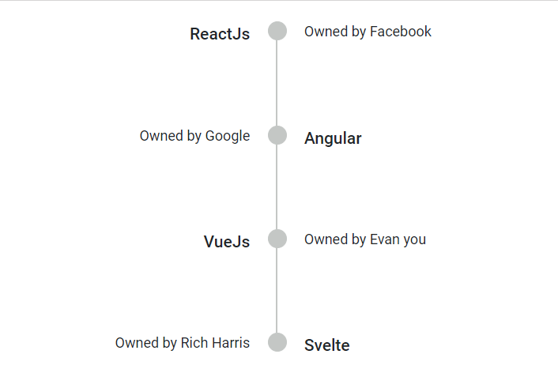

# Alignment in Blazor Timeline component

You can display the Timeline content `Before`, `After`, `Alternate` and `AlternateReverse` by using the [Align](https://help.syncfusion.com/cr/blazor/Syncfusion.Blazor.Layouts.SfTimeline.html#Syncfusion_Blazor_Layouts_SfTimeline_Alignment) property. The oppositeContent will be displayed parallel to the content when configured in the [TimelineItem](https://help.syncfusion.com/cr/blazor/Syncfusion.Blazor.Layouts.TimelineItem.html) directive.

## Before

In [Before](https://help.syncfusion.com/cr/blazor/Syncfusion.Blazor.Layouts.TimelineAlignment.html) alignment, for `horizontal` orientation the item content is placed at the top and oppositeContent at the bottom whereas in `vertical`, the content to the left and oppositeContent to the right.

```cshtml

@using Syncfusion.Blazor.Layouts

<div class="container" style="height: 350px">
    <SfTimeline Alignment="TimelineAlignment.Before">
        <TimelineItems>
            @foreach (var item in timelineItems)
            {
                <TimelineItem>
                    <Content> @item.Content </Content>
                    <OppositeContent> @item.OppositeContent </OppositeContent>
                </TimelineItem>
            }
        </TimelineItems>
    </SfTimeline>
</div>

@code {
    public class TimelineItemModel
    {
        public string Content { get; set; }
        public string OppositeContent { get; set; }
    }
    private List<TimelineItemModel> timelineItems = new List<TimelineItemModel>()
    {
        new TimelineItemModel() { Content = "ReactJs", OppositeContent = "Owned by Facebook" },
        new TimelineItemModel() { Content = "Angular", OppositeContent = "Owned by Google" },
        new TimelineItemModel() { Content = "VueJs", OppositeContent = "Owned by Evan you" },
        new TimelineItemModel() { Content = "Svelte", OppositeContent = "Owned by Rich Harris" }
    };
}

```



## After

In [After](https://help.syncfusion.com/cr/blazor/Syncfusion.Blazor.Layouts.TimelineAlignment.html) alignment, for `horizontal` orientation the item content is placed at the bottom and oppositeContent at the top whereas in `vertical`, the content to the right and oppositeContent to the left.

```cshtml

@using Syncfusion.Blazor.Layouts

<div class="container" style="height: 350px">
    <SfTimeline Alignment="TimelineAlignment.After">
        <TimelineItems>
            @foreach (var item in timelineItems)
            {
                <TimelineItem>
                    <Content> @item.Content </Content>
                    <OppositeContent> @item.OppositeContent </OppositeContent>
                </TimelineItem>
            }
        </TimelineItems>
    </SfTimeline>
</div>

@code {
    public class TimelineItemModel
    {
        public string Content { get; set; }
        public string OppositeContent { get; set; }
    }
    private List<TimelineItemModel> timelineItems = new List<TimelineItemModel>()
    {
        new TimelineItemModel() { Content = "ReactJs", OppositeContent = "Owned by Facebook" },
        new TimelineItemModel() { Content = "Angular", OppositeContent = "Owned by Google" },
        new TimelineItemModel() { Content = "VueJs", OppositeContent = "Owned by Evan you" },
        new TimelineItemModel() { Content = "Svelte", OppositeContent = "Owned by Rich Harris" }
    };
}

```



## Alternate

In [Alternate](https://help.syncfusion.com/cr/blazor/Syncfusion.Blazor.Layouts.TimelineAlignment.html) alignment, the item content are arranged alternatively regardless of the Timeline orientation.

```cshtml

@using Syncfusion.Blazor.Layouts

<div class="container" style="height: 350px">
    <SfTimeline Alignment="TimelineAlignment.Alternate">
        <TimelineItems>
            @foreach (var item in timelineItems)
            {
                <TimelineItem>
                    <Content> @item.Content </Content>
                    <OppositeContent> @item.OppositeContent </OppositeContent>
                </TimelineItem>
            }
        </TimelineItems>
    </SfTimeline>
</div>

@code {
    public class TimelineItemModel
    {
        public string Content { get; set; }
        public string OppositeContent { get; set; }
    }
    private List<TimelineItemModel> timelineItems = new List<TimelineItemModel>()
    {
        new TimelineItemModel() { Content = "ReactJs", OppositeContent = "Owned by Facebook" },
        new TimelineItemModel() { Content = "Angular", OppositeContent = "Owned by Google" },
        new TimelineItemModel() { Content = "VueJs", OppositeContent = "Owned by Evan you" },
        new TimelineItemModel() { Content = "Svelte", OppositeContent = "Owned by Rich Harris" }
    };
}

```



## Alternate reverse

In [AlternateReverse](https://help.syncfusion.com/cr/blazor/Syncfusion.Blazor.Layouts.TimelineAlignment.html) alignment, the item content are arranged in reverse alternate regardless of the Timeline orientation.

```cshtml

@using Syncfusion.Blazor.Layouts

<div class="container" style="height: 350px">
    <SfTimeline Alignment="TimelineAlignment.Before">
        <TimelineItems>
            @foreach (var item in timelineItems)
            {
                <TimelineItem>
                    <Content> @item.Content </Content>
                    <OppositeContent> @item.OppositeContent </OppositeContent>
                </TimelineItem>
            }
        </TimelineItems>
    </SfTimeline>
</div>

@code {
    public class TimelineItemModel
    {
        public string Content { get; set; }
        public string OppositeContent { get; set; }
    }
    private List<TimelineItemModel> timelineItems = new List<TimelineItemModel>()
    {
        new TimelineItemModel() { Content = "ReactJs", OppositeContent = "Owned by Facebook" },
        new TimelineItemModel() { Content = "Angular", OppositeContent = "Owned by Google" },
        new TimelineItemModel() { Content = "VueJs", OppositeContent = "Owned by Evan you" },
        new TimelineItemModel() { Content = "Svelte", OppositeContent = "Owned by Rich Harris" }
    };
}

```

