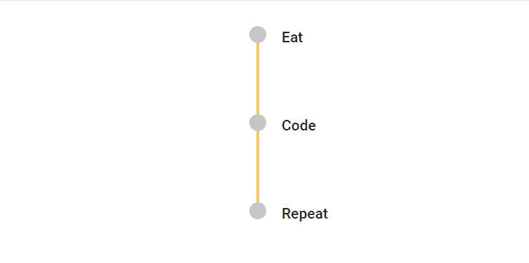
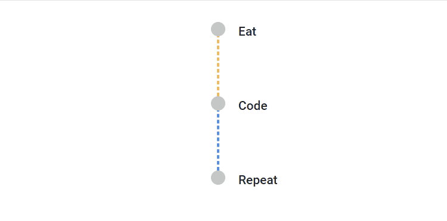
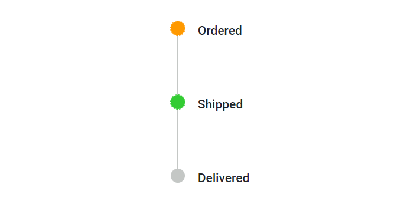
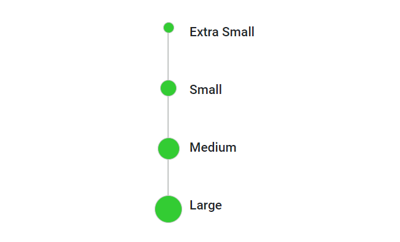
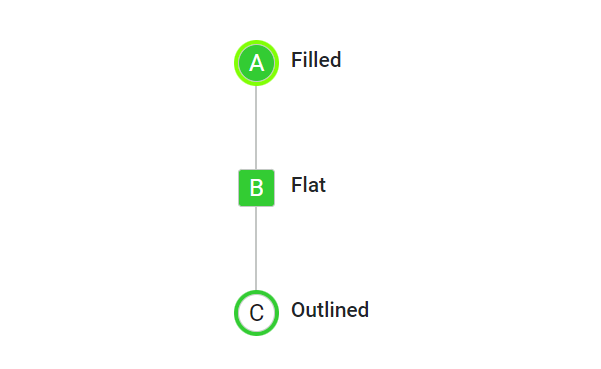
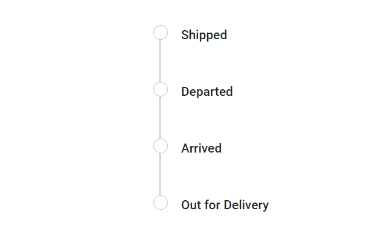

# Customization in Blazor Timeline component

You can customize the Timeline items dot size, connectors, dot borders, dot outer space and more to personalize its appearance. This section explains the different ways for styling the items.

## Connector styling

### Common styling

You can define the styles applicable to the all the Timeline item connectors.

```cshtml

@using Syncfusion.Blazor.Layouts

<div class="container" style="height: 250px">
    <SfTimeline CssClass="custom-connector">
        <TimelineItems>
            @foreach (var item in timelineItems)
            {
                <TimelineItem>
                    <Content>
                        @item.Content
                    </Content>
                </TimelineItem>
            }
        </TimelineItems>
    </SfTimeline>
</div>

<style>
    .custom-connector .e-timeline-item.e-connector::after {
        border-color: #f7c867;
        border-width: 1.4px;
        animation: progress 2s;
    }

    @@keyframes progress {
        from { height: 0%; }
        to { height: 100%; }
    }
</style>

@code {

    public class TimelineItemModel
    {
        public string Content { get; set; }
    }
    private List<TimelineItemModel> timelineItems = new List<TimelineItemModel>()
    {
       new TimelineItemModel() { Content = "Eat" },
        new TimelineItemModel() { Content = "Code" },
        new TimelineItemModel() { Content = "Repeat" },
    };
}

```



### Individual styling

You can also apply unique styles to individual connectors, to differentiate specific items within the timeline.

```cshtml

@using Syncfusion.Blazor.Layouts

<div class="container" style="height: 250px">
    <SfTimeline CssClass="custom-connector">
        <TimelineItems>
            @foreach (var item in timelineItems)
            {
                <TimelineItem CssClass=@item.CssClass>
                    <Content>
                        @item.Content
                    </Content>
                </TimelineItem>
            }
        </TimelineItems>
    </SfTimeline>
</div>

<style>
    .custom-connector .state-initial.e-connector::after {
        border: 1.5px #f8c050 dashed;
        animation: progress 1.5s ease-in-out;
    }

    .custom-connector .state-intermediate.e-connector::after {
        border: 1.5px #4d85f5 dashed;
        animation: progress 1.5s ease-in-out;
    }

    @@keyframes progress {
        from { height: 0%; }
        to { height: 100%; }
    }
</style>

@code {

    public class TimelineItemModel
    {
        public string Content { get; set; }
        public string CssClass { get; set; }
    }
    private List<TimelineItemModel> timelineItems = new List<TimelineItemModel>()
    {
       new TimelineItemModel() { Content = "Eat", CssClass = "state-initial" },
        new TimelineItemModel() { Content = "Code", CssClass = "state-intermediate" },
        new TimelineItemModel() { Content = "Repeat" },
    };
}

```



## Dot styling

### Dot color

You can modify the color of the dots to highlight the specific Timeline items.

```cshtml

@using Syncfusion.Blazor.Layouts

<div class="container" style="height: 250px">
    <SfTimeline>
        <TimelineItems>
            @foreach (var item in timelineItems)
            {
                <TimelineItem CssClass=@item.CssClass>
                    <Content>
                        @item.Content
                    </Content>
                </TimelineItem>
            }
        </TimelineItems>
    </SfTimeline>
</div>

<style>
    .e-timeline-item.state-completed .e-dot {
        background: #ff9900;
        outline: 1px dashed #ff9900;
        border-color: #ff9900;
    }

    .e-timeline-item.state-progress .e-dot {
        background: #33cc33;
        outline: 1px dashed #33cc33;
        border-color: #33cc33;
    }
</style>

@code {

    public class TimelineItemModel
    {
        public string Content { get; set; }
        public string CssClass { get; set; }
    }
    private List<TimelineItemModel> timelineItems = new List<TimelineItemModel>()
    {
       new TimelineItemModel() { Content = "Ordered", CssClass = "state-completed" },
        new TimelineItemModel() { Content = "Shipped", CssClass = "state-progress" },
        new TimelineItemModel() { Content = "Delivered" },
    };
}

```



### Dot size

You can adjust the size of the dot to make it larger or smaller by using the `--dot-size` variable.

```cshtml

@using Syncfusion.Blazor.Layouts

<div class="container" style="height: 250px">
    <SfTimeline>
        <TimelineItems>
            @foreach (var item in timelineItems)
            {
                <TimelineItem CssClass=@item.CssClass>
                    <Content>
                        @item.Content
                    </Content>
                </TimelineItem>
            }
        </TimelineItems>
    </SfTimeline>
</div>

<style>
    .e-timeline-item .e-dot {
        background: #33cc33;
    }
    .e-timeline-item.x-small .e-dot {
        --dot-size: 12px;
    }
    .e-timeline-item.small .e-dot {
        --dot-size: 18px;
    }
    .e-timeline-item.medium .e-dot {
        --dot-size: 24px;
    }
    .e-timeline-item.large .e-dot {
        --dot-size: 30px;
    }
</style>

@code {

    public class TimelineItemModel
    {
        public string Content { get; set; }
        public string CssClass { get; set; }
    }
    private List<TimelineItemModel> timelineItems = new List<TimelineItemModel>()
    {
       new TimelineItemModel() { Content = "Extra Small", CssClass = "x-small" },
        new TimelineItemModel() { Content = "Small", CssClass = "small" },
        new TimelineItemModel() { Content = "Medium", CssClass = "medium" },
        new TimelineItemModel() { Content = "Large", CssClass = "large" }
    };
}

```



### Dot shadow

You can add shadow effects to the Timeline dots to make it feel visually engaging by using the `--dot-outer-space` & `--dot-border` variables.

```cshtml

@using Syncfusion.Blazor.Layouts

<div class="container" style="height: 250px">
    <SfTimeline>
        <TimelineItems>
            @foreach (var item in timelineItems)
            {
                <TimelineItem>
                    <Content>
                        @item.Content
                    </Content>
                </TimelineItem>
            }
        </TimelineItems>
    </SfTimeline>
</div>

<style>
    .e-timeline-item .e-dot {
        --dot-outer-space: 3px;
        --dot-border: 3px;
        --dot-size: 20px;
        outline-color: #dee2e6;
        border-color: #fff;
        box-shadow: 3px 3px 10px rgba(0, 0, 0, 0.5), 2px -2px 4px rgba(255, 255, 255, 0.5) inset;
    }
</style>

@code {

    public class TimelineItemModel
    {
        public string Content { get; set; }
    }
    private List<TimelineItemModel> timelineItems = new List<TimelineItemModel>()
    {
       new TimelineItemModel() { Content = "Ordered" },
        new TimelineItemModel() { Content = "Shipped" },
        new TimelineItemModel() { Content = "Delivered" },
    };
}

```


### Dot variant

You can achieve the desired dot variant by customizing the border, outline and background colors of the Timeline dots.

```cshtml

@using Syncfusion.Blazor.Layouts

<div class="container" style="height: 250px">
    <SfTimeline>
        <TimelineItems>
            @foreach (var item in timelineItems)
            {
                <TimelineItem CssClass=@item.CssClass>
                    <Content>
                        @item.Content
                    </Content>
                </TimelineItem>
            }
        </TimelineItems>
    </SfTimeline>
</div>

<style>
    .e-timeline-item.dot-filled .e-dot::before {
        content: 'A';
        color: #fff;
    }
    .e-timeline-item.dot-flat .e-dot::before {
        content: 'B';
        color: #fff;
    }
    .e-timeline-item.dot-outlined .e-dot::before {
        content: 'C';
    }
    .e-timeline-item.dot-filled .e-dot {
        background: #33cc33;
        --dot-outer-space: 3px;
        outline-color: #81ff05;
        --dot-size: 25px;
    }
    .e-timeline-item.dot-flat .e-dot {
        background: #33cc33;
        --dot-size: 25px;
        --dot-radius: 10%;
    }
    .e-timeline-item.dot-outlined .e-dot {
        outline-color: #33cc33;
        --dot-outer-space: 3px;
        background-color: unset;
        --dot-size: 25px;
    }
</style>

@code {

    public class TimelineItemModel
    {
        public string Content { get; set; }
        public string CssClass { get; set; }
    }
    private List<TimelineItemModel> timelineItems = new List<TimelineItemModel>()
    {
        new TimelineItemModel() { Content = "Filled", CssClass = "dot-filled" },
        new TimelineItemModel() { Content = "Flat", CssClass = "dot-flat" },
        new TimelineItemModel() { Content = "Outlined", CssClass = "dot-outlined" },
    };
}

```



### Dot outline

By adding the `e-outline` class to the timeline cssClass property it enables the dots to have an outline state.

```cshtml

@using Syncfusion.Blazor.Layouts

<div class="container" style="height: 250px">
    <SfTimeline CssClass="e-outline">
        <TimelineItems>
            @foreach (var item in timelineItems)
            {
                <TimelineItem>
                    <Content>
                        @item.Content
                    </Content>
                </TimelineItem>
            }
        </TimelineItems>
    </SfTimeline>
</div>

@code {

    public class TimelineItemModel
    {
        public string Content { get; set; }
    }
    private List<TimelineItemModel> timelineItems = new List<TimelineItemModel>()
    {
        new TimelineItemModel() { Content = "Shipped" },
        new TimelineItemModel() { Content = "Departed" },
        new TimelineItemModel() { Content = "Arrived" },
        new TimelineItemModel() { Content = "Out for Delivery" }
    };
}

```


