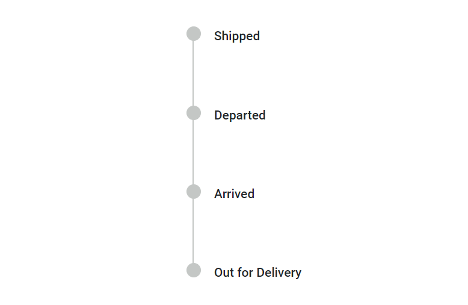
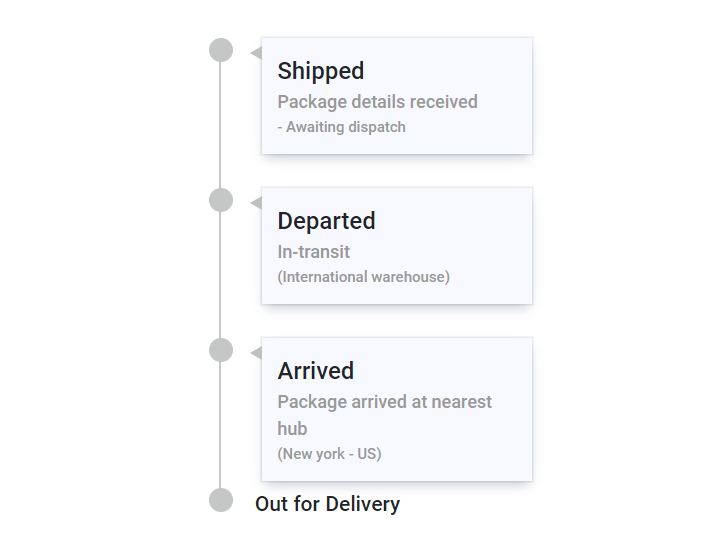
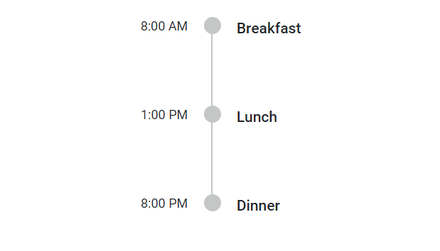
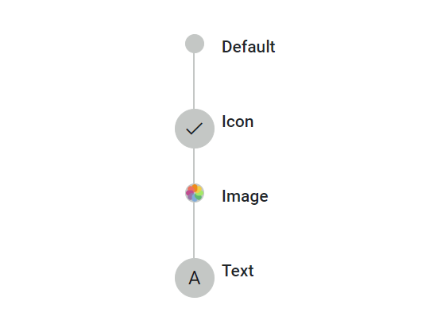
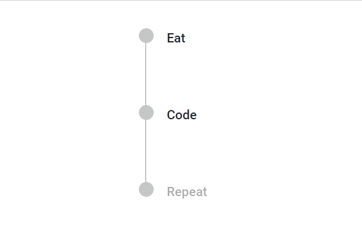

# Items in Blazor Timeline Component

Timeline items are added using the [TimelineItem](https://help.syncfusion.com/cr/blazor/Syncfusion.Blazor.Layouts.TimelineItem.html) tag directive. Each item can be configured with options such as [`Content`](https://help.syncfusion.com/cr/blazor/Syncfusion.Blazor.Layouts.TimelineItem.html#Syncfusion_Blazor_Layouts_TimelineItem_Content), [`OppositeContent`](https://help.syncfusion.com/cr/blazor/Syncfusion.Blazor.Layouts.TimelineItem.html#Syncfusion_Blazor_Layouts_TimelineItem_OppositeContent),[ `DotCss`](https://help.syncfusion.com/cr/blazor/Syncfusion.Blazor.Layouts.TimelineItem.html#Syncfusion_Blazor_Layouts_TimelineItem_DotCss), [`Disabled`](https://help.syncfusion.com/cr/blazor/Syncfusion.Blazor.Layouts.TimelineItem.html#Syncfusion_Blazor_Layouts_TimelineItem_Disabled) and [`CssClass`](https://help.syncfusion.com/cr/blazor/Syncfusion.Blazor.Layouts.TimelineItem.html#Syncfusion_Blazor_Layouts_TimelineItem_CssClass).

## Adding Content

Define the item's content using the [`Content`](https://help.syncfusion.com/cr/blazor/Syncfusion.Blazor.Layouts.TimelineItem.html#Syncfusion_Blazor_Layouts_TimelineItem_Content) tag directive as a child to the [`TimelineItem`](https://help.syncfusion.com/cr/blazor/Syncfusion.Blazor.Layouts.TimelineItem.html) directive.

### String Content

Define string content for the Timeline items.

```cshtml

@using Syncfusion.Blazor.Layouts

<div class="container" style="height: 350px">
    <SfTimeline>
        <TimelineItems>
            @foreach (var item in timelineItems)
            {
                <TimelineItem>
                    <Content> @item.Content </Content>
                </TimelineItem>
            }
        </TimelineItems>
    </SfTimeline>
</div>

@code {
    public class TimelineItemModel
    {
        public string Content { get; set; }
    }
    private List<TimelineItemModel> timelineItems = new List<TimelineItemModel>()
    {
        new TimelineItemModel() { Content = "Shipped" },
        new TimelineItemModel() { Content = "Departed" },
        new TimelineItemModel() { Content = "Arrived" },
        new TimelineItemModel() { Content = "Out for Delivery" }
    };
}

```





### Template Content

Specify template content for items within the [`Content`](https://help.syncfusion.com/cr/blazor/Syncfusion.Blazor.Layouts.TimelineItem.html#Syncfusion_Blazor_Layouts_TimelineItem_Content) tag directive.

```cshtml

@using Syncfusion.Blazor.Layouts

<div class="container" style="height: 400px">
    <SfTimeline>
        <ChildContent>
            <TimelineItems>
                @foreach (var item in timelineItems)
                {
                    <TimelineItem>
                        <Content>
                            <div class="content-container">
                                <div class="title">
                                    @item.Title
                                </div>
                                <div class="description">
                                    @item.Description
                                </div>
                                <div class="info">
                                    @item.Info
                                </div>
                            </div>
                        </Content>
                    </TimelineItem>
                }
                <TimelineItem>
                    <Content> Out for Delivery </Content>
                </TimelineItem>
            </TimelineItems>
        </ChildContent>
    </SfTimeline>
</div>

<style>
    .content-container {
        position: relative;
        width: 180px;
        padding: 10px;
        margin-left: 5px;
        box-shadow: rgba(9, 30, 66, 0.25) 0px 4px 8px -2px, rgba(9, 30, 66, 0.08) 0px 0px 0px 1px;
        background-color: ghostwhite;
    }

    .content-container::before {
        content: '';
        position: absolute;
        left: -8px;
        transform: translateY(-50%);
        width: 0;
        height: 0;
        border-top: 5px solid transparent;
        border-bottom: 5px solid transparent;
        border-right: 8px solid silver;
    }

    .content-container .title {
        font-size: 16px;
    }

    .content-container .description {
        color: #999999;
        font-size: 12px;
    }

    .content-container .info {
        color: #999999;
        font-size: 10px;
    }
</style>

@code {
    public class TimelineItemModel
    {
        public string Title { get; set; }
        public string Description{ get; set; }
        public string Info { get; set; }
    }
    private List<TimelineItemModel> timelineItems = new List<TimelineItemModel>()
    {
        new TimelineItemModel() { Title = "Shipped", Description = "Package details received", Info = "- Awaiting dispatch" },
        new TimelineItemModel() { Title = "Departed", Description = "In-transit", Info = "(International warehouse)" },
        new TimelineItemModel() { Title = "Arrived", Description = "Package arrived at nearest hub", Info = "(New york - US)" },
    };
}

```





## Adding Opposite Content

Additional information can be added to each Timeline item using the [`OppositeContent`](https://help.syncfusion.com/cr/blazor/Syncfusion.Blazor.Layouts.TimelineItem.html#Syncfusion_Blazor_Layouts_TimelineItem_OppositeContent) tag directive as a child to [`TimelineItem`](https://help.syncfusion.com/cr/blazor/Syncfusion.Blazor.Layouts.TimelineItem.html). This content is positioned opposite to the item's main `Content`. Similar to the [`Content`](https://help.syncfusion.com/cr/blazor/Syncfusion.Blazor.Layouts.TimelineItem.html#Syncfusion_Blazor_Layouts_TimelineItem_Content) property, string and template contents can be defined for `OppositeContent`.

```cshtml

@using Syncfusion.Blazor.Layouts

<div class="container" style="height: 250px">
    <SfTimeline>
        <TimelineItems>
            @foreach (var item in timelineItems)
            {
                <TimelineItem>
                    <Content>
                        @item.Content
                    </Content>
                    <OppositeContent>
                        @item.OppositeContent
                    </OppositeContent>
                </TimelineItem>
            }
        </TimelineItems>
    </SfTimeline>
</div>

@code {
    public class TimelineItemModel
    {
        public string Content { get; set; }
        public string OppositeContent { get; set; }
    }
    private List<TimelineItemModel> timelineItems = new List<TimelineItemModel>()
    {
        new TimelineItemModel() { Content = "Breakfast", OppositeContent = "8:00 AM" },
        new TimelineItemModel() { Content = "Lunch", OppositeContent = "1:00 PM" },
        new TimelineItemModel() { Content = "Dinner", OppositeContent = "8:00 PM" },
    };
}

```




## Dot Item

The [`DotCss`](https://help.syncfusion.com/cr/blazor/Syncfusion.Blazor.Layouts.TimelineItem.html#Syncfusion_Blazor_Layouts_TimelineItem_DotCss) property allows defining a CSS class to set icons, background colors, or images, personalizing the appearance of dots associated with each Timeline item.

### Adding Icons

Define a CSS class to display an icon for each item using the `DotCss` property.

### Adding Images

Include images for Timeline items using the `DotCss` property by setting the CSS `background-image` property.

### Adding Text

Display text for Timeline items using the `DotCss` property by adding text to the CSS `content` property.

```cshtml

@using Syncfusion.Blazor.Layouts

<div class="container" style="height: 250px">
    <SfTimeline>
        <TimelineItems>
            @foreach (var item in timelineItems)
            {
                <TimelineItem DotCss=@item.DotCss>
                    <Content>
                        @item.Content
                    </Content>
                </TimelineItem>
            }
        </TimelineItems>
    </SfTimeline>
</div>

<style>
    .e-dot.custom-image {
        background-image: url('./dot-image.png');
    }

    .e-dot.custom-text::before {
        content: 'A';
    }
</style>

@code {

    public class TimelineItemModel
    {
        public string Content { get; set; }
        public string DotCss { get; set; }
    }
    private List<TimelineItemModel> timelineItems = new List<TimelineItemModel>()
    {
        new TimelineItemModel() { Content = "Default" },
        new TimelineItemModel() { Content = "Icon", DotCss = "e-icons e-check" },
        new TimelineItemModel() { Content = "Image", DotCss = "custom-image" },
        new TimelineItemModel() { Content = "Text", DotCss = "custom-text" },
    };
}

```


## Disabling Items

Use the [`Disabled`](https://help.syncfusion.com/cr/blazor/Syncfusion.Blazor.Layouts.TimelineItem.html#Syncfusion_Blazor_Layouts_TimelineItem_Disabled) property to disable an item. When set to `true`, the item becomes disabled. By default, its value is `false`.

```cshtml

@using Syncfusion.Blazor.Layouts

<div class="container" style="height: 250px">
    <SfTimeline>
        <TimelineItems>
            @foreach (var item in timelineItems)
            {
                <TimelineItem Disabled=@item.Disabled>
                    <Content>
                        @item.Content
                    </Content>
                </TimelineItem>
            }
        </TimelineItems>
    </SfTimeline>
</div>

@code {

    public class TimelineItemModel
    {
        public string Content { get; set; }
        public bool Disabled { get; set; }
    }
    private List<TimelineItemModel> timelineItems = new List<TimelineItemModel>()
    {
        new TimelineItemModel() { Content = "Eat" },
        new TimelineItemModel() { Content = "Code" },
        new TimelineItemModel() { Content = "Repeat", Disabled = true },
    };
}

```





## CSS Class

Customize the appearance of a Timeline item by specifying a custom CSS class using the [`CssClass`](https://help.syncfusion.com/cr/blazor/Syncfusion.Blazor.Layouts.TimelineItem.html#Syncfusion_Blazor_Layouts_TimelineItem_CssClass) property.