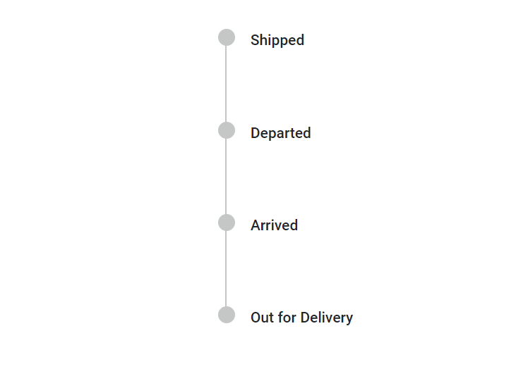
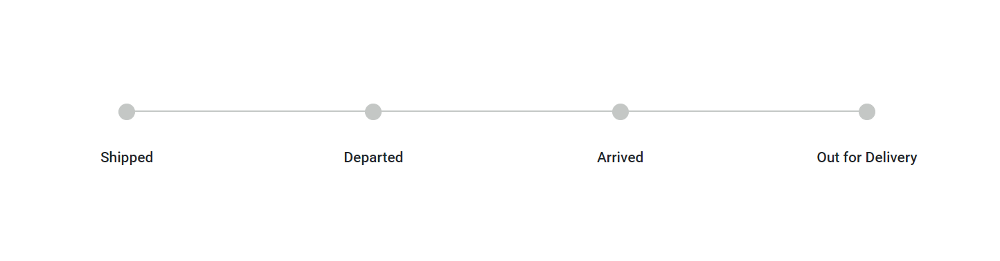

# Orientations in Blazor Timeline Component

The Timeline component supports displaying items in both horizontal and vertical directions using the [`Orientation`](https://help.syncfusion.com/cr/blazor/Syncfusion.Blazor.Layouts.SfTimeline.html#Syncfusion_Blazor_Layouts_SfTimeline_Orientation) property.

## Vertical

Display items vertically by setting the [`Orientation`](https://help.syncfusion.com/cr/blazor/Syncfusion.Blazor.Layouts.SfTimeline.html#Syncfusion_Blazor_Layouts_SfTimeline_Orientation) property to `Vertical`. By default, items are displayed in vertical orientation.

```cshtml

@using Syncfusion.Blazor.Layouts

<div class="container" style="height: 350px">
    <SfTimeline Orientation=TimelineOrientation.Vertical>
        <TimelineItems>
            @foreach (var item in timelineItems)
            {
                <TimelineItem>
                    <Content>
                        @item.Content
                    </Content>
                    <OppositeContent>
                        @item.OppositeContent
                    </OppositeContent>
                </TimelineItem>
            }
        </TimelineItems>
    </SfTimeline>
</div>

@code {

    public class TimelineItemModel
    {
        public string Content { get; set; }
        public string OppositeContent { get; set; }
    }
    private List<TimelineItemModel> timelineItems = new List<TimelineItemModel>()
    {
        new TimelineItemModel() { Content = "Day 1, 4:00 PM", OppositeContent = "Check-in and campsite visit" },
        new TimelineItemModel() { Content = "Day 1, 7:00 PM", OppositeContent = "Dinner with music" },
        new TimelineItemModel() { Content = "Day 2, 5:30 AM", OppositeContent = "Sunrise between mountains" },
        new TimelineItemModel() { Content = "Day 2, 8:00 AM", OppositeContent = "Breakfast and check-out" }
    };
}

```





## Horizontal

In horizontal orientation, items are displayed side-by-side by setting the [`Orientation`](https://help.syncfusion.com/cr/blazor/Syncfusion.Blazor.Layouts.SfTimeline.html#Syncfusion_Blazor_Layouts_SfTimeline_Orientation) property to `Horizontal`.

```cshtml

@using Syncfusion.Blazor.Layouts

<SfTimeline Orientation=TimelineOrientation.Horizontal>
    <TimelineItems>
        @foreach (var item in timelineItems)
        {
            <TimelineItem>
                <Content>
                    @item.Content
                </Content>
                <OppositeContent>
                    @item.OppositeContent
                </OppositeContent>
            </TimelineItem>
        }
    </TimelineItems>
</SfTimeline>

@code {

    public class TimelineItemModel
    {
        public string Content { get; set; }
        public string OppositeContent { get; set; }
    }
    private List<TimelineItemModel> timelineItems = new List<TimelineItemModel>()
    {
        new TimelineItemModel() { Content = "Day 1, 4:00 PM", OppositeContent = "Check-in and campsite visit" },
        new TimelineItemModel() { Content = "Day 1, 7:00 PM", OppositeContent = "Dinner with music" },
        new TimelineItemModel() { Content = "Day 2, 5:30 AM", OppositeContent = "Sunrise between mountains" },
        new TimelineItemModel() { Content = "Day 2, 8:00 AM", OppositeContent = "Breakfast and check-out" }
    };
}

```




