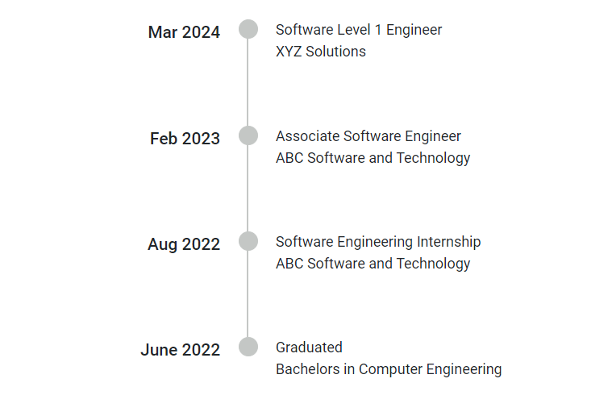

# Reverse in Blazor Timeline component

Display Timeline items in reverse order for various alignments using the [`Reverse`](https://help.syncfusion.com/cr/blazor/Syncfusion.Blazor.Layouts.SfTimeline.html#Syncfusion_Blazor_Layouts_SfTimeline_Reverse) property, which enhances adaptability and user interaction.

The `Reverse` property reverses the order of the Timeline items as defined in the `TimelineItems` collection.

```cshtml

@using Syncfusion.Blazor.Layouts

<div class="container" style="height: 350px">
    <SfTimeline Reverse=true Alignment=TimelineAlignment.Before>
        <TimelineItems>
            <TimelineItem>
                <Content> June 2022 </Content>
                <OppositeContent> Graduated <br/> Bachelors in Computer Engineering </OppositeContent>
            </TimelineItem>
            <TimelineItem>
                <Content> Aug 2022 </Content>
                <OppositeContent> Software Engineering Internship <br /> ABC Software and Technology </OppositeContent>
            </TimelineItem>
            <TimelineItem>
                <Content> Feb 2023 </Content>
                <OppositeContent> Associate Software Engineer <br/> ABC Software and Technology </OppositeContent>
            </TimelineItem>
            <TimelineItem>
                <Content> Mar 2024 </Content>
                <OppositeContent> Software Level 1 Engineer <br /> XYZ Solutions </OppositeContent>
            </TimelineItem>
        </TimelineItems>
    </SfTimeline>
</div>

```



