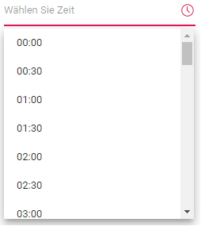

# Globalization in Blazor TimePicker Component

## Localization

[Blazor TimePicker](https://www.syncfusion.com/blazor-components/blazor-timepicker) component can be localized. Refer to [Blazor Localization](https://blazor.syncfusion.com/documentation/common/localization) topic to localize Syncfusion Blazor components.

## Customize the localized text

* The localized text of particular component can be changed by editing the `wwwroot/blazor-locale/src/{{locale name}}.json` file.

* In the following code, modified the localized text of `placeholder` in `de` culture.

[`wwwroot/blazor-locale/src/de.json`]

```csharp
{
  "de": {
    "timepicker": {
      "placeholder": "Wählen Sie Zeit"
    }
  }
}
```



## Right-To-Left

The TimePicker supports RTL (right-to-left) functionality for languages like Arabic and Hebrew to display the text in the right-to-left direction. Use the [EnableRtl](https://help.syncfusion.com/cr/blazor/Syncfusion.Blazor.Calendars.SfTimePicker-1.html#Syncfusion_Blazor_Calendars_SfTimePicker_1_EnableRtl) property to set the RTL direction.

The following code example initializes the TimePicker component in `Arabic` culture.

```cshtml
@using Syncfusion.Blazor.Calendars
@inject HttpClient Http;

<SfTimePicker TValue="DateTime?" Locale="ar" EnableRtl=true></SfTimePicker>

@code {
    [Inject]
    protected IJSRuntime JsRuntime { get; set; }
    protected override async Task OnInitializedAsync()
    {
        this.JsRuntime.Sf().LoadLocaleData(await Http.GetJsonAsync<object>("blazor-locale/src/ar.json")).SetCulture("ar");
    }
}
```


