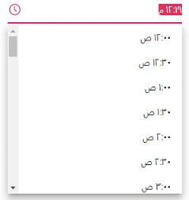

# Globalization in Blazor TimePicker

## Localization

The [Blazor TimePicker](https://www.syncfusion.com/blazor-components/blazor-timepicker) component can be localized by providing the appropriate locale data and culture. Refer to the [Blazor Localization](https://blazor.syncfusion.com/documentation/common/localization) topic to learn how to localize Blazor components.

## Right-To-Left

The Blazor TimePicker supports right-to-left (RTL) functionality for languages such as Arabic and Hebrew. Use the [EnableRtl](https://help.syncfusion.com/cr/blazor/Syncfusion.Blazor.Inputs.SfInputTextBase-1.html#Syncfusion_Blazor_Inputs_SfInputTextBase_1_EnableRtl) property to enable RTL direction.

The following code example initializes the Blazor TimePicker component in the `Arabic` culture.

```cshtml
@using Syncfusion.Blazor.Calendars
@inject HttpClient Http;

<SfTimePicker TValue="DateTime?" Locale="ar" EnableRtl="true"></SfTimePicker>

@code {
    [Inject]
    protected IJSRuntime JsRuntime { get; set; }
    protected override async Task OnInitializedAsync()
    {
        this.JsRuntime.Sf().LoadLocaleData(await Http.GetJsonAsync<object>("blazor-locale/src/ar.json")).SetCulture("ar");
    }
}
```




## See also

* [Accessibility in Blazor TimePicker](accessibility)
* [Time Format in Blazor TimePicker](time-format)
* [Events in Blazor TimePicker](events)