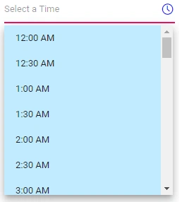

# CSS Customization in Blazor TimePicker Component

TimePicker allows you to customize the text box and popup list appearance to suit the application by using the [CssClass](https://help.syncfusion.com/cr/blazor/Syncfusion.Blazor.Inputs.SfInputTextBase-1.html#Syncfusion_Blazor_Inputs_SfInputTextBase_1_CssClass) property.

The following code demonstrates customization of text appearance in a text box, popup button, and popup list along with hover and active state by using the `e-custom-style` class. The following table lists the available classes for customizing the TimePicker component:

| **Class Name** | **Description** |
| --- | --- |
| e-time-wrapper | Applied to the TimePicker wrapper element. |
| e-timepicker |  Applied to the input element and the TimePicker popup element. |
| e-time-wrapper.e-timepicker | Applied to the input element only. |
| e-input-group-icon.e-time-icon | Applied to the popup button. |
| e-float-text | Applied to the floating label text element. |
| e-popup | Applied to the popup element. |
| e-timepicker.e-popup | Applied to the TimePicker popup element only. |
| e-list-parent | Applied to the popup `UL` element. |
| e-timepicker.e-list-parent | Applied to the TimePicker popup `UL` element only. |
| e-list-item | Applied to the `LI` elements. |
| e-hover | Applied to the list item when hovered. |
| e-active | Applied to the active list item. |

```cshtml
@using Syncfusion.Blazor.Calendars

<SfTimePicker TValue="DateTime?" CssClass="e-custom-style" Placeholder="Select a Time"></SfTimePicker>

<style>
     /*customize the input element text color*/
    .e-time-wrapper.e-custom-style .e-input.e-timepicker {
        display: block;
        color: blue;
    }

    /*customize the floating label and popup button text color*/
    .e-time-wrapper.e-custom-style .e-float-text.e-label-bottom,
    .e-time-wrapper.e-custom-style .e-input-group-icon.e-time-icon.e-icons {
        color: blue;
    }

    /*customize the input element text selection*/
    .e-time-wrapper.e-custom-style.e-input-group::before,
    .e-time-wrapper.e-custom-style.e-input-group::after,
    .e-time-wrapper.e-custom-style.e-input-group .e-timepicker::selection {
        background: blue;
    }


    .e-timepicker.e-popup.e-custom-style .e-list-parent.e-ul,
    .e-timepicker.e-popup.e-custom-style .e-list-parent.e-ul .e-list-item {
        background-color: #c0ebff;
    }

        /*customize the list item hover color*/
    .e-timepicker.e-popup.e-custom-style .e-list-parent.e-ul .e-list-item.e-hover,
    .e-timepicker.e-popup.e-custom-style .e-list-parent.e-ul .e-list-item.e-active.e-hover {
        background-color: blue;
        color: #fff;
    }

        /*customize the active element text color*/
    .e-timepicker.e-popup.e-custom-style .e-list-parent.e-ul .e-list-item.e-active {
        color: #333;
        background-color: #fff;
    }
</style>
```



## See also

* [Style and appearance in Blazor TimePicker](../style-appearance)
* [Time Format in Blazor TimePicker](../time-format)
* [Globalization in Blazor TimePicker](../globalization)