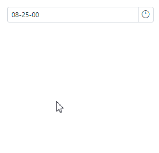
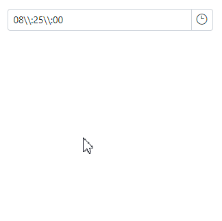

# Limitations of TimeSpan DataType in Blazor TimePicker Component

Based on [C# standard behavior](https://learn.microsoft.com/en-us/dotnet/standard/base-types/custom-timespan-format-strings), the custom TimeSpan format specifiers  do not include placeholder separator symbols, such as the symbols that separate hours from minutes, or seconds from fractional seconds. Instead, these symbols must be included in the custom format string as string literals.

This means that if you want to format a TimeSpan value with custom separators, you need to include the separators in the format string yourself. For example, to format a TimeSpan value with a hyphen (-) as a separator between hours, minutes, and seconds, you would use the following format string.

```csharp

@using Syncfusion.Blazor.Calendars

<SfTimePicker TValue="TimeSpan" @bind-Value="myTime" Format="@FormatType"></SfTimePicker>

@code {
    public string FormatType = "hh-mm-ss";
    TimeSpan myTime = new TimeSpan(08, 25, 00);
}

```


N> The TimeSpan will always show the time value in 24-hour format.

## Supported Format String with TimeSpan

| List of TimeSpan custom formats supported in Blazor |  |  | |
| --- | --- | --- | --- |
| Format specifier | Example | Output |
| h | h:mm:ss | 8:05:00 |
| hh | hh:mm:ss | 08:05:00 |
| m | hh:m:ss | 08:5:00 |
| mm | hh:mm:ss | 08:05:00 |
| s | hh:mm:s | 08:05:0 |
| ss | hh:mm:ss | 08:05:00 |
| f | hh:mm:ss:f | 08:05:00:0 |
| ff | hh:mm:ss:ff | 08:05:00:00 |
| fff | hh:mm:ss:fff | 08:05:00:000 |


N>The Blazor TimePicker component does not support the `d` or `dd` format specifier for days.

#### To display the backslashes (\\\\) in the format string, you need to escape them by doubling them. For example:

This means that if you want to display a two backslash in the format string, you need to type four backslashes.

#### Here is an example of how to use this in a Blazor TimePicker component:
```csharp

@using Syncfusion.Blazor.Calendars

<SfTimePicker TValue="TimeSpan" @bind-Value="myTime" Format="@FormatType"></SfTimePicker>

@code {
    public string FormatType = "hh\\\\:mm\\\\:ss";
    TimeSpan myTime = new TimeSpan(08, 25, 00);
}

```

This will render a TimePicker component that displays the time in the `hh\\mm\\ss` format.

