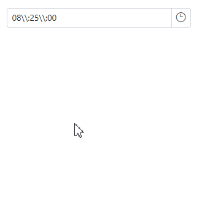

# How to handle TimeSpan limitations in Blazor TimePicker

Based on [C# standard behavior](https://learn.microsoft.com/en-us/dotnet/standard/base-types/custom-timespan-format-strings), the standard TimeSpan format specifiers do not include separator symbols, such as the symbols that separate hours from minutes, or seconds from fractional seconds. These symbols must be included in the custom format string as string literals.

This means that if you want to format a TimeSpan value with custom separators, you need to include the separators in the format string yourself. For example, to format a TimeSpan value with a hyphen (-) as a separator between hours, minutes, and seconds, you would use the following format string.

```cshtml

@using Syncfusion.Blazor.Calendars

<SfTimePicker TValue="TimeSpan" @bind-Value="myTime" Format="@FormatType"></SfTimePicker>

@code {
    public string FormatType = "hh-mm-ss";
    TimeSpan myTime = new TimeSpan(08, 25, 00);
}

```


N> The TimePicker always displays a TimeSpan value in 24-hour format, regardless of the configured `Format`.

## Supported Format String with TimeSpan

| Format specifier | Example Format String | Output |
| --- | --- | --- |
| h | h:mm:ss | 8:05:00 |
| hh | hh:mm:ss | 08:05:00 |
| m | hh:m:ss | 08:5:00 |
| mm | hh:mm:ss | 08:05:00 |
| s | hh:mm:s | 08:05:0 |
| ss | hh:mm:ss | 08:05:00 |
| f | hh:mm:ss:f | 08:05:00:0 |
| ff | hh:mm:ss:ff | 08:05:00:00 |
| fff | hh:mm:ss:fff | 08:05:00:000 |


N>The Blazor TimePicker component does not support the `d` or `dd` format specifier for days.

## Escaping Backslashes in the Format String

To display backslashes (`\\`) in the format string, escape them by doubling them. For example, to display two backslashes in the format string, type four backslashes in the Razor markup.

The following example shows how to use this in a Blazor TimePicker component:
```cshtml

@using Syncfusion.Blazor.Calendars

<SfTimePicker TValue="TimeSpan" @bind-Value="myTime" Format="@FormatType"></SfTimePicker>

@code {
    public string FormatType = "hh\\\\:mm\\\\:ss";
    TimeSpan myTime = new TimeSpan(08, 25, 00);
}

```

This will render a TimePicker component that displays the time in the `hh\\mm\\ss` format.



## See also

* [Time Format in Blazor TimePicker](../time-format)
* [Strict Mode in Blazor TimePicker](../strict-mode)
* [Data Binding in Blazor TimePicker](../data-binding)