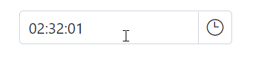
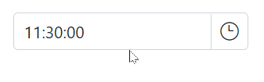

# Mask Support in Blazor TimePicker Component

The masking feature allows users to enter a time in the correct format, as specified by the [Format](https://help.syncfusion.com/cr/blazor/Syncfusion.Blazor.Calendars.SfTimePicker-1.html#Syncfusion_Blazor_Calendars_SfTimePicker_1_Format) property. This helps to ensure that the time is entered correctly and can also make it easier for users to understand how to enter the time. The [EnableMask](https://help.syncfusion.com/cr/blazor/Syncfusion.Blazor.Calendars.SfTimePicker-1.html#Syncfusion_Blazor_Calendars_SfTimePicker_1_EnableMask) property in the TimePicker component allows you to enable or disable the masking functionality. When enabled, the input field will be displayed as masked with a specific time format pattern for entering the time.







## MaskPlaceholder

The [TimePickerMaskPlaceholder](https://help.syncfusion.com/cr/blazor/Syncfusion.Blazor.Calendars.TimePickerMaskPlaceholder.html) directive allows you to set custom placeholder text for each segment of the time format in a `TimePicker` component. This can be used to provide additional context or instructions to the user about the expected format for the input. To use the directive, include it in the component's configuration along with the [EnableMask](https://help.syncfusion.com/cr/blazor/Syncfusion.Blazor.Calendars.SfTimePicker-1.html#Syncfusion_Blazor_Calendars_SfTimePicker_1_EnableMask) property.

The `TimePickerMaskPlaceholder` class has the following properties:

* [Hour](https://help.syncfusion.com/cr/blazor/Syncfusion.Blazor.Calendars.MaskPlaceholder.html#Syncfusion_Blazor_Calendars_MaskPlaceholder_Hour) : Specifies the placeholder character for the hour (`hh`) segment of the time value.

* [Minute](https://help.syncfusion.com/cr/blazor/Syncfusion.Blazor.Calendars.MaskPlaceholder.html#Syncfusion_Blazor_Calendars_MaskPlaceholder_Minute) : Specifies the placeholder character for the minute (`mm`) segment of the time value.

* [Second](https://help.syncfusion.com/cr/blazor/Syncfusion.Blazor.Calendars.MaskPlaceholder.html#Syncfusion_Blazor_Calendars_MaskPlaceholder_Second) : Specifies the placeholder character for the second (`ss`) segment of the time value.

The `TimePicker` component uses placeholder text from the current culture's resources file for each segment of the time format by default. If you want to use custom placeholder text instead, you can specify it using the `TimePickerMaskPlaceholder` directive and its properties.







> If you do not specify custom placeholder text for any segment of the time format, the component will use the default placeholder text from the current culture based resources file for not specified segments.