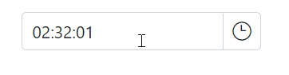
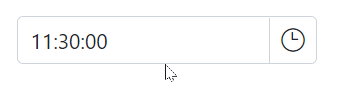

# Mask Support in Blazor TimePicker

The masking feature lets users enter a time in the format specified by the [Format](https://help.syncfusion.com/cr/blazor/Syncfusion.Blazor.Calendars.SfTimePicker-1.html#Syncfusion_Blazor_Calendars_SfTimePicker_1_Format) property, which helps ensure the value is entered correctly and makes the expected input format clear at a glance. Use the [EnableMask](https://help.syncfusion.com/cr/blazor/Syncfusion.Blazor.Calendars.SfTimePicker-1.html#Syncfusion_Blazor_Calendars_SfTimePicker_1_EnableMask) property on the TimePicker component to enable or disable the masking functionality. When enabled, the input field is rendered with a mask that matches the configured time format pattern.







## MaskPlaceholder

The [TimePickerMaskPlaceholder](https://help.syncfusion.com/cr/blazor/Syncfusion.Blazor.Calendars.TimePickerMaskPlaceholder.html) directive lets you set custom placeholder text for each segment of the time format in a `TimePicker` component, providing users with additional context about the expected input. To use the directive, add it to the component's configuration together with the [EnableMask](https://help.syncfusion.com/cr/blazor/Syncfusion.Blazor.Calendars.SfTimePicker-1.html#Syncfusion_Blazor_Calendars_SfTimePicker_1_EnableMask) property.

The `TimePickerMaskPlaceholder` class has the following properties:

* [Hour](https://help.syncfusion.com/cr/blazor/Syncfusion.Blazor.Calendars.MaskPlaceholder.html#Syncfusion_Blazor_Calendars_MaskPlaceholder_Hour) : Specifies the placeholder character for the hour (`hh`) segment of the time value.

* [Minute](https://help.syncfusion.com/cr/blazor/Syncfusion.Blazor.Calendars.MaskPlaceholder.html#Syncfusion_Blazor_Calendars_MaskPlaceholder_Minute) : Specifies the placeholder character for the minute (`mm`) segment of the time value.

* [Second](https://help.syncfusion.com/cr/blazor/Syncfusion.Blazor.Calendars.MaskPlaceholder.html#Syncfusion_Blazor_Calendars_MaskPlaceholder_Second) : Specifies the placeholder character for the second (`ss`) segment of the time value.

By default, the `TimePicker` component uses placeholder text from the current culture's resources file for each segment of the time format. To override this with custom placeholder text, use the `TimePickerMaskPlaceholder` directive and its properties.







> If you do not specify custom placeholder text for any segment of the time format, the component uses the default placeholder text from the current culture's resources file for the unspecified segments.

## See also

* [Time Format in Blazor TimePicker](time-format)
* [Strict Mode in Blazor TimePicker](strict-mode)
* [Globalization in Blazor TimePicker](globalization)