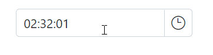

# Mask Support in Blazor TimePicker Component

TimePicker has `EnableMask` property that provides the option to enable the built-in time masking support. This means that the TimePicker will automatically apply a mask to the time input, so that users can only enter times in a specific format. 

 > For example, if the mask is set to "hh:mm", then users will only be able to enter times in the format of "hour:minute", with two digits for the hour and minute.

The following example demonstrates default format of TimePicker component with mask.







## TimePicker MaskPlaceholder

The TimePicker control has a property called "TimePickerMaskPlaceholder" that allows you to customize the placeholder value for the time mask. By default, this property is set to the full name of the time elements (e.g. "Hour", "Minute", "Second"), but you can change it to any value you like. 

> For example, you might want to use abbreviated names like "H", "m" and "s" or you might want to use symbols like ":" and "-" to separate the different parts of time.

The following example demonstrates the custom mask placeholder for TimePicker component.







