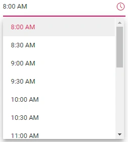
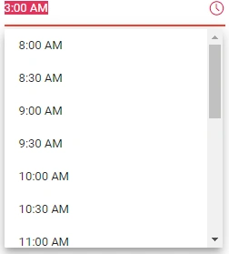

# Strict Mode in Blazor TimePicker

The [StrictMode](https://help.syncfusion.com/cr/blazor/Syncfusion.Blazor.Calendars.SfTimePicker-1.html#Syncfusion_Blazor_Calendars_SfTimePicker_1_StrictMode) property restricts the input to valid time values within the specified `Min`/`Max` range in the text box. If the entered value is invalid, the component's value is reset to the most recent valid value. If the entered value is out of range, the component sets the time to the `Min` or `Max` value accordingly.

The following example demonstrates the TimePicker in `StrictMode` with a `Min`/`Max` range of `10:00 AM` to `4:00 PM`. It accepts only valid time values within the specified range.

* If you enter an out-of-range value such as `8:00 PM`, the value is set to the Max time `4:00 PM` because `8:00 PM` is greater than the Max value `4:00 PM`.

* If you enter an invalid time value such as `9:00 99`, the value is set to the most recent valid value.

```cshtml
@using Syncfusion.Blazor.Calendars

<SfTimePicker TValue="DateTime?" Value='@TimeValue' StrictMode="true" Min='@MinVal' Max='@MaxVal'></SfTimePicker>

@code {
    public DateTime MinVal { get; set; } = new DateTime(DateTime.Now.Year, DateTime.Now.Month, 15, 08, 00, 00);
    public DateTime MaxVal { get; set; } = new DateTime(DateTime.Now.Year, DateTime.Now.Month, 15, 16, 00, 00);
    public DateTime? TimeValue { get; set; } = new DateTime(DateTime.Now.Year, DateTime.Now.Month, 15, 3, 00, 00);
}
```



By default, the TimePicker is in non-strict mode (`StrictMode = false`), which allows you to enter invalid or out-of-range time values in the text box.

If the time is out of range or invalid, the model value is set to the out-of-range time value or to `null` respectively, and the input is highlighted with the `error` CSS class to indicate that the time is out of range or invalid.

The following example demonstrates the `StrictMode` as `false`. Here, the TimePicker accepts valid or invalid values in the text box.

* If you enter an out-of-range or invalid time value, the model value is set to the out-of-range time value or to `null` respectively, and the input is highlighted with the `error` CSS class to indicate that the time is out of range or invalid.

```cshtml
@using Syncfusion.Blazor.Calendars

<SfTimePicker TValue="DateTime?" Value='@TimeValue' StrictMode="false" Min='@MinVal' Max='@MaxVal'></SfTimePicker>

@code {
    public DateTime MinVal { get; set; } = new DateTime(DateTime.Now.Year, DateTime.Now.Month, 15, 08, 00, 00);
    public DateTime MaxVal { get; set; } = new DateTime(DateTime.Now.Year, DateTime.Now.Month, 15, 16, 00, 00);
    public DateTime? TimeValue { get; set; } = new DateTime(DateTime.Now.Year, DateTime.Now.Month, 15, 3, 00, 00);
}
```



N> If the value of the `Min` or `Max` property is changed from code-behind, update the `Value` property so that it remains within the range.

## See also

* [Time Range in Blazor TimePicker](time-range)
* [Time Format in Blazor TimePicker](time-format)
* [Events in Blazor TimePicker](events)