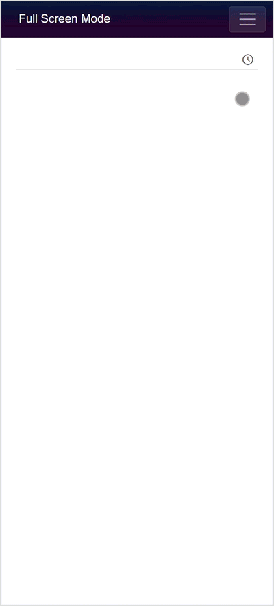

# Style and Appearance in Blazor TimePicker

The following content provides the exact CSS structure that can be used to modify the control's appearance based on the user preference.

## Customizing the appearance of TimePicker container element

Use the following CSS to customize the appearance of the TimePicker container element.

```css
/* To specify height and font size */
.e-input-group input.e-input, .e-input-group.e-control-wrapper input.e-input, .e-input-group textarea.e-input, .e-input-group.e-control-wrapper textarea.e-input {
        font-size: 20px;
        height: 40px;
}
```

## Customizing the TimePicker icon element

Use the following CSS to customize the TimePicker icon element.

```css
/* To specify background color and font size */
.e-time-wrapper .e-time-icon.e-icons, *.e-control-wrapper.e-time-wrapper .e-time-icon.e-icons {
        font-size: 20px;
        background-color: beige;
}
```

## Customizing the TimePicker popup

Use the following CSS to customize the TimePicker popup.

```css
/* To specify height */
.e-timepicker.e-popup {
        height: 100px;
}
```

## Customizing the TimePicker popup content

Use the following CSS to customize the TimePicker popup content.

```css
/* To specify height */
.e-timepicker.e-popup .e-list-parent.e-ul li.e-list-item {
        background-color: beige;
        font-size: 20px;
}
```

## Full screen mode support on mobile devices

The TimePicker's full-screen mode displays the popup element in full screen on mobile devices for better visibility and usability. This feature is available on mobile devices only and works in both landscape and portrait orientations. To enable it, set the [FullScreen](https://help.syncfusion.com/cr/blazor/Syncfusion.Blazor.Calendars.SfTimePicker-1.html#Syncfusion_Blazor_Calendars_SfTimePicker_1_FullScreen) property to `true`; the popup will then expand to occupy the entire screen on supported mobile devices.

```cshtml
@using Syncfusion.Blazor.Calendars

<SfTimePicker TValue="DateTime?" FullScreen="true"></SfTimePicker>

```



## See also

* [CSS Customization in Blazor TimePicker](how-to/css-customization)
* [Globalization in Blazor TimePicker](globalization)
* [Time Format in Blazor TimePicker](time-format)
