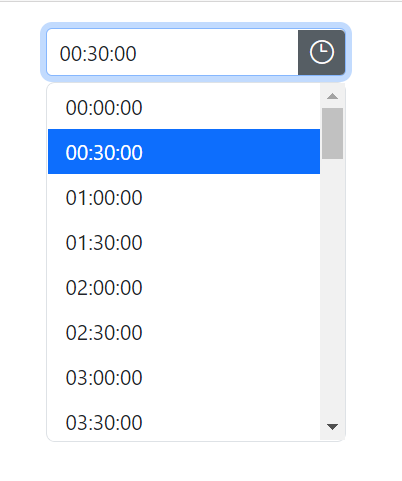

# Time Format in Blazor TimePicker Component

## Display Format

The display format can be used to specify how the time value is displayed or entered in a `TimePicker` control

By default, the TimePicker's format is based on the culture. You can also set the own [Custom Format](https://learn.microsoft.com/en-us/dotnet/standard/base-types/custom-date-and-time-format-strings) or [Standard Format](https://learn.microsoft.com/en-us/dotnet/standard/base-types/standard-date-and-time-format-strings) by using the [Format](https://help.syncfusion.com/cr/blazor/Syncfusion.Blazor.Calendars.SfDatePicker-1.html#Syncfusion_Blazor_Calendars_SfDatePicker_1_Format) property.

> Once the date format property has been defined, it will be applied consistently to all cultures, regardless of their conventions for representing the date value. In other words, the date format property serves as a standardized way of representing the date value, ensuring that it is displayed and entered consistently regardless of the culture or region in which the application is used.







## Input Formats

The input format can be used to specify how the time value is entered in a `TimePicker` control.

The string format of the time value specifies how the time should be represented as a string when entered by the user. When the user types the time in the input format, it will be automatically converted to the display format after pressing enter, tab key, or when the input loses focus. This enhances the user experience by allowing intuitive data entry through various custom input formats. You can also set your own [Custom Format](https://learn.microsoft.com/en-us/dotnet/standard/base-types/custom-date-and-time-format-strings) or [Standard Format](https://learn.microsoft.com/en-us/dotnet/standard/base-types/standard-date-and-time-format-strings) by using the [InputFormats](https://help.syncfusion.com/cr/blazor/Syncfusion.Blazor.Calendars.SfTimePicker-1.html#Syncfusion_Blazor_Calendars_SfTimePicker_1_InputFormats) property.





